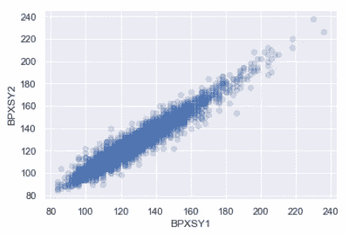

# 错误统计推断的原因

> 原文：<https://towardsdatascience.com/factors-that-can-contribute-to-the-faulty-statistical-inference-a7ebedd5a343?source=collection_archive---------74----------------------->

## 本文讨论了错误的类型和几个重要的因素，可能有助于错误的统计推断

假设检验是研究人员根据他们的发现或数据做出精确陈述的过程。然后，他们收集证据来伪造准确的声明或主张。这种精确的陈述或主张被称为零假设。如果有强有力的证据来证伪零假设，我们可以拒绝零假设，并采用替代假设。这是假设检验的基本思想。

## 统计检验中的错误类型

在正式的假设检验中，会出现两种不同类型的错误。它们是:

第一类:当零假设为真，但假设检验结果显示有证据拒绝它时，出现第一类错误。这被称为假阳性。

第二类:当零假设不为真，但在假设检验中没有被拒绝时，出现第二类错误。

大多数假设检验程序在理想条件下很好地控制了第一类误差(5%)。这可能会给出一个错误的想法，即只有 5%的概率报告的发现是错误的。但事情没那么简单。概率可以远远高于 5%。

## 数据的常态

数据的正态性是一个可以打破统计检验的问题。如果数据集很小，数据的正态性对于某些统计过程(如置信区间或 p-检验)非常重要。但如果数据足够大，正态性并不会产生显著影响。

## 相互关系

如果数据集中的变量相互关联，可能会导致较差的统计推断。看下面这张图:

在这个图表中，两个变量似乎有很强的相关性。或者，如果将一系列数据视为一个序列，这意味着值与其相邻值相关，并且数据中可能存在一些聚类或自相关。数据集中的这种行为会对统计测试产生负面影响。

## 相关性和因果关系

这在解释统计测试的结果时尤其重要。“相关性并不意味着因果关系”。这里有一个例子。假设，你有研究数据显示，更多没有受过大学教育的人认为在工作场所女性应该比男性获得更少的报酬。你可能已经进行了很好的假设检验并证明了这一点。但是必须注意从中得出什么结论。很可能，大学教育和“女性应该得到更少的报酬”这一信念之间存在关联。但是说没有大学学历是这种信念的原因是不公平的。这是一种相关性，但不是直接的因果关系。

从医学数据中可以提供一个更清楚的例子。研究表明蛀牙少的人不太可能患心脏病。你可能有足够的数据从统计学上证明这一点，但你实际上不能说蛀牙导致了心脏病。没有那样的医学理论。

## 多样性

这是一个广泛的问题。我用几句话来提一下。讨论这个问题本身就做了一篇大文章。对同一问题进行多重假设检验，或对相同或不同的亚组进行多重假设检验，可能会得出误导性的结论。例如，你想进行一项关于“更多每天睡眠少于 6 小时的人患糖尿病”的研究。你决定对不同的群体进行测试，比如男性和女性，吸烟者和不吸烟者，运动员和非运动员，饮酒者和不饮酒者。假设的影响在这些群体中可能比其他群体更强。如果您在不同的子群中对相同的数据集进行相同的假设检验，结果可能会产生误导。有很多方法可以解决这个问题。我将在以后的文章中讨论这个问题。

统计推断的过程很简单。有很多因素会影响统计测试的结果。在这里，我试图简单地提到其中的几个。