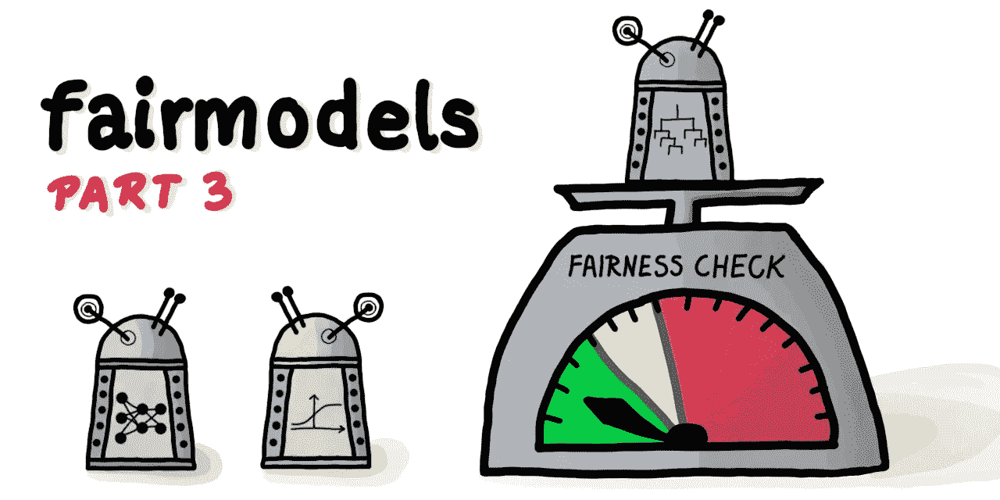
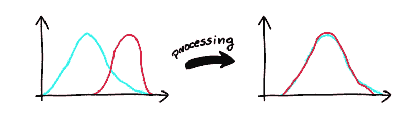
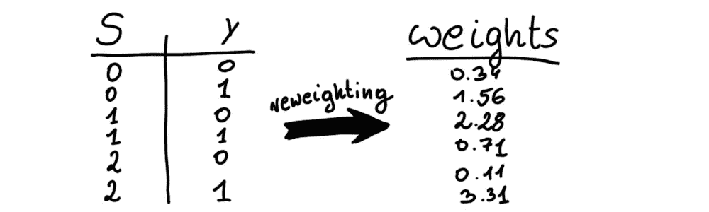
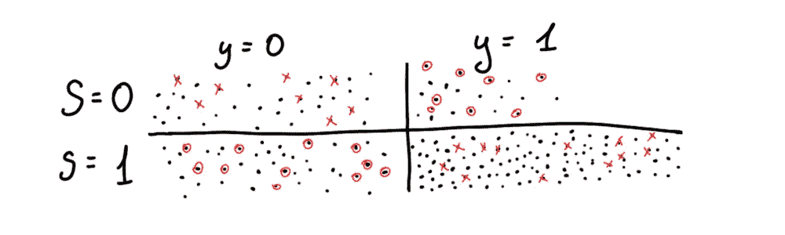
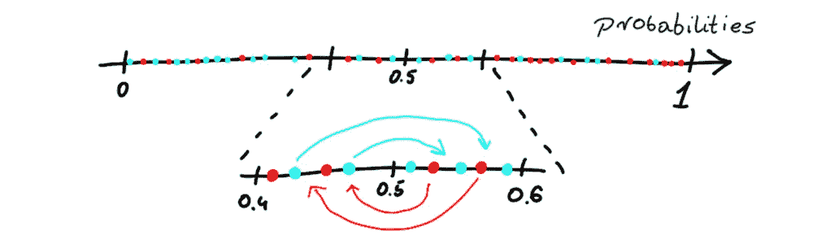
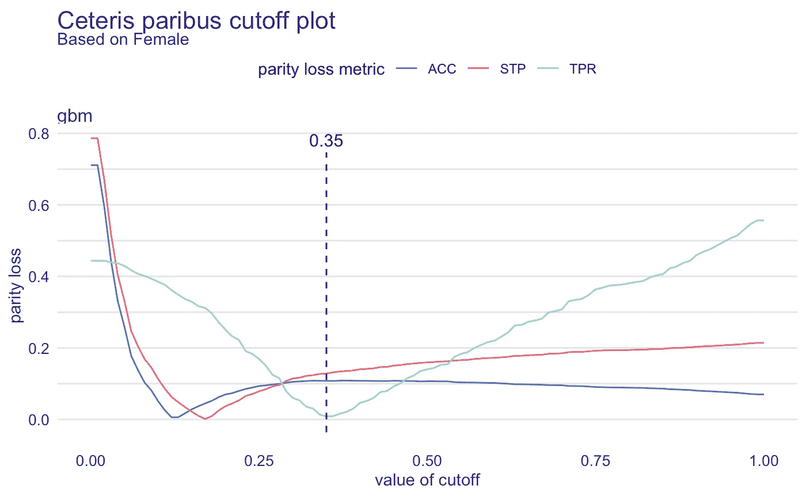
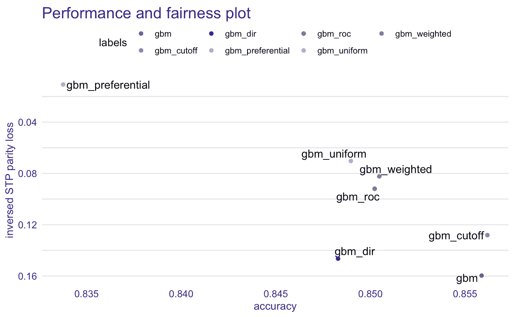

# fairmodels:让我们和有偏见的机器学习模型战斗吧

> 原文：<https://towardsdatascience.com/fairmodels-lets-fight-with-biased-machine-learning-models-f7d66a2287fc?source=collection_archive---------38----------------------->

## 第 3 部分:缓解



作者图片

## TL；速度三角形定位法(dead reckoning)

R 包[**fair models**](https://github.com/ModelOriented/FairModels)**通过模型可视化促进了**偏差检测。**它实施了一些可以减少偏差的缓解策略。它能够方便地检查公平性指标，并在不同的机器学习(ML)模型之间进行比较。**

## **长版本**

**偏见抑制是机器学习公平领域的一个重要课题。对于 python 用户来说，已经有一些算法被实现、很好地解释和描述(参见 [AIF360](http://aif360.mybluemix.net/check) )。 **fairmodels** 提供了一些流行的、有效的偏差缓解技术的实现，可以让你的模型更加公平。**

# **我有一个有偏差的模型，现在怎么办？**

**有一个有偏见的模型并不是世界末日。有很多方法可以处理它。 **fairmodels** 实现了各种算法来帮助你解决这个问题。首先，我必须描述一下预处理算法和后处理算法之间的区别。**

*   ****预处理**算法在模型训练前对数据进行处理。他们试图通过数据推断来减轻特权子群和非特权子群之间的偏差。**
*   ****后处理**算法改变用 [DALEX](https://github.com/ModelOriented/DALEX) 解释的模型的输出，使其输出不那么偏向特权子群。**

# **这些算法是如何工作的？**

**在本节中，我将简要描述这些偏差缓解技术的工作原理。这里使用的更详细的例子和一些可视化代码可以在[这篇短文](https://modeloriented.github.io/fairmodels/articles/Advanced_tutorial.html)中找到。**

# **预处理**

## **不同的冲击消除器[(费尔德曼等人，2015)](https://arxiv.org/abs/1412.3756)**

****

**(图片由作者提供)完全不同的影响消除。蓝色和红色分布被转换成“中间”分布。**

**该算法适用于数字、序数特征。它更改列值，使非特权(蓝色)和特权(红色)子组的分布彼此接近。一般来说，我们希望我们的算法不要根据特性的价值来判断，而是根据百分位数来判断(例如，从两个小组中雇用 20%的最佳申请人)。该算法的工作方式是，它找到这样的分布，即最小化[推土机的距离](https://en.wikipedia.org/wiki/Earth_mover%27s_distance)。简而言之，它找到“中间”分布，并为每个子组更改该特征的值。**

## **重新加权[(卡米兰等人，2012 年)](https://link.springer.com/content/pdf/10.1007/s10115-011-0463-8.pdf)**

****

**(图片由作者提供)在这个模型示例中，S=1 是一个特权子群。S 和 y 的每个唯一组合都有一个权重。**

**重新加权是一种简单而有效的工具，可以最大限度地减少偏差。该算法查看受保护的属性和真实标签。然后，假设受保护的属性和 y 是独立的，它计算分配有利标签(y=1)的概率。当然，如果有偏差，他们会有统计上的依赖性。然后，该算法将计算出的理论概率除以该事件的真实经验概率。重量就是这样产生的。利用这两个向量(受保护变量和 y ),我们可以为数据中的每个观察值创建权重向量。然后，我们将它传递给模型。就这么简单。但是一些模型没有权重参数，因此不能从该方法中受益。**

## **重采样[(卡米兰等人，2012 年)](https://link.springer.com/content/pdf/10.1007/s10115-011-0463-8.pdf)**

****

**(图片由作者提供)均匀采样。圆圈表示重复，x 表示省略观察。**

**重采样与先前的方法密切相关，因为它隐含地使用重新加权来计算在特定情况下必须省略/重复多少个观察值。假设有 2 组人，被剥夺的(S = 0)和被偏爱的(S = 1)。当标签为正时，该方法复制来自剥夺子群的观察值，并省略标签为负的观察值。然后对有利的组执行相反的操作。实现了两种重采样方法- *均匀*和*优先*。*均匀*随机选取观察值(如图所示)，而*优先*利用概率选取/忽略接近截止值的观察值(默认值为 0.5)。**

# **后处理**

**后处理发生在创建解释器之后。为了创建解释器，我们需要模型和 [DALEX](https://github.com/ModelOriented/DALEX) 解释器。 *Gbm* 模型将在 [*成人*](https://modeloriented.github.io/fairmodels/reference/adult.html) 数据集上训练，预测某个人年收入是否超过 5 万。**

```
[library](https://rdrr.io/r/base/library.html)([gbm](https://github.com/gbm-developers/gbm))
[library](https://rdrr.io/r/base/library.html)([DALEX](https://modeloriented.github.io/DALEX))
[library](https://rdrr.io/r/base/library.html)([fairmodels](https://modeloriented.github.io/fairmodels/index.html))data("adult")
adult$salary   <- [as.numeric](https://rdrr.io/r/base/numeric.html)(adult$salary) -1
protected      <- adult$sex
adult <- adult[[colnames](https://rdrr.io/r/base/colnames.html)(adult) != "sex"] # sex not specified

# making model
[set.seed](https://rdrr.io/r/base/Random.html)(1)
gbm_model <-[gbm](https://rdrr.io/pkg/gbm/man/gbm.html)(salary ~. , data = adult, distribution = "bernoulli")

# making explainer
gbm_explainer <- [explain](https://rdrr.io/pkg/DALEX/man/explain.html)(gbm_model,
                         data = adult[,-1],
                         y = adult$salary,
                         colorize = FALSE)
```

## ****拒绝基于选项的分类(pivot)** [(Kamiran 等人，2012)](https://ieeexplore.ieee.org/document/6413831)**

****

**(图片由作者提供)红色-特权，蓝色-无特权。如果该值接近(-theta + cutoff，theta + cutoff)和特殊情况，概率将位置(和值)更改到 od cutoff 的另一侧。**

**ROC pivot 基于基于拒绝选项的分类实施。如果一个观察值来自非特权组并且在截止值的左边，则算法切换标签。然后对特权群体执行相反的操作。但有一个假设，即观察值必须接近(就概率而言)临界值。因此，用户必须输入某个值*θ*，以便算法知道观察值必须多接近开关的截止值。但是有一个问题。如果只是改变了标签，DALEX 解释者将很难正确计算模型的性能。因此，在该算法的 **fairmodels** 实现中，被转换(旋转)的是概率，而不是标签。它们只是移动到另一侧，但与截止点的距离相等。**

## **切断操作**

****

**(图片由作者提供)plot(ceteris _ pari bus _ cut off(fo object，cumulated = TRUE))**

**截断操作对于最小化模型中的偏差可能是一个很好的主意。我们只需选择临界值将改变的指标和子组。该图显示了最小值在哪里，并且对于该截止值*来说，奇偶损失*将是最低的。如何为特定子群创建具有不同截止值的公平对象？这很容易！**

```
fobject <- [fairness_check](https://modeloriented.github.io/fairmodels/reference/fairness_check.html)(gbm_explainer,
                          protected  = protected, 
                          privileged = "Male",
                          label      = "gbm_cutoff",
                          cutoff     = [list](https://rdrr.io/r/base/list.html)(Female = 0.35))
```

**现在*公平对象(fo object)*是一个具有指定截止值的结构，它将影响公平度量和性能。**

# **公平性和准确性之间的权衡**

**如果我们想减少偏见，我们必须意识到这一行动可能带来的弊端。假设*静态平价*对我们来说是最重要的指标。降低该指标的*奇偶损失*将(可能)导致*假阳性*的增加，这将导致准确性下降。在这个例子中[(你可以在这里找到)](https://modeloriented.github.io/fairmodels/articles/Advanced_tutorial.html)一个 *gbm* 模型被训练，然后用不同的偏差缓解技术处理。**

****

**作者图片**

**我们越是试图减少偏差，我们得到的准确性就越低。这对于这个指标来说是很自然的事情，用户应该意识到这一点。**

# **摘要**

**在 **fairmodels** 中实现的去偏置方法当然值得一试。它们很灵活，大多数适合每种型号。最重要的是，它们很容易使用。**

# **接下来读什么？**

*   **[关于公平、问题和解决方案介绍的博客文章](https://medium.com/@ModelOriented/fairmodels-lets-fight-with-biased-machine-learning-models-part-1-6c2786e6c97c)**
*   **[关于公平可视化的博文](/fairmodels-lets-fight-with-biased-machine-learning-models-part-2-visualization-66558630a4d)**

# **了解更多信息**

*   **查看[包的 GitHub 网站](https://modeloriented.github.io/fairmodels/)了解更多详情**
*   **[教程](https://modeloriented.github.io/fairmodels/articles/Basic_tutorial.html)关于 **fairmodels** 套装的全部功能**
*   **[关于偏差缓解技术的教程](https://modeloriented.github.io/fairmodels/articles/Advanced_tutorial.html)**