# fairmodels:让我们和有偏见的机器学习模型战斗吧

> 原文：<https://towardsdatascience.com/fairmodels-lets-fight-with-biased-machine-learning-models-part-2-visualization-66558630a4d?source=collection_archive---------40----------------------->

## 第 2 部分:可视化

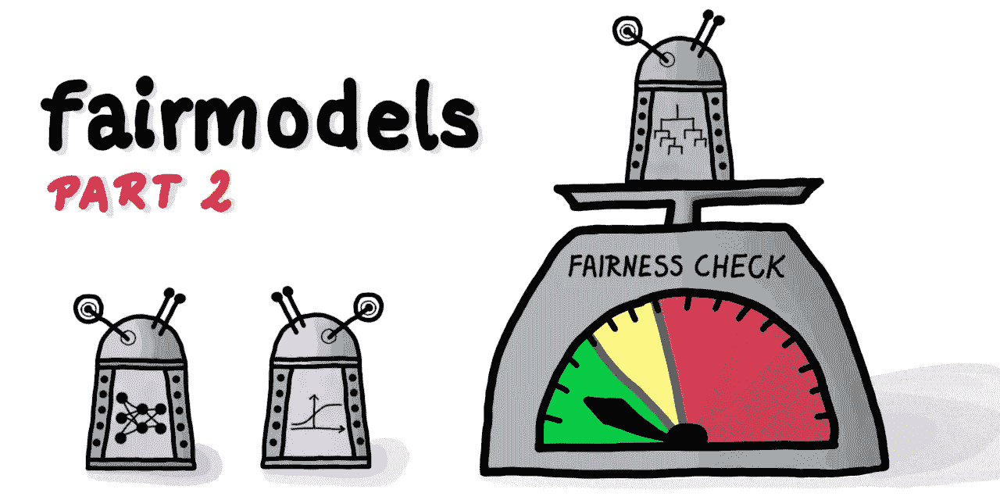

作者图片

# TL；速度三角形定位法(dead reckoning)

R 包[**fair models**](https://github.com/ModelOriented/FairModels)**通过模型可视化促进了**偏差检测。**它实施了一些可以减少偏差的缓解策略。它能够方便地检查公平性指标，并在不同的机器学习(ML)模型之间进行比较。**

# **长版本**

**就像我在[之前的博客文章](https://medium.com/@ModelOriented/fairmodels-lets-fight-with-biased-machine-learning-models-part-1-6c2786e6c97c)中写的那样，机器学习(ML)中的公平性是一个发展中的领域，没有很多可视化偏见的工具。当然，柱状图是最简单的方法，也是最容易解释的。然而，还有其他方法来解决这个问题，并对歧视有更深入的了解。在本章中，我将使用 **fairmodels** R 包对模型偏差进行更详细的可视化分析。**

# **使用的指标以及什么是奇偶校验丢失？**

**在我们开始可视化公平或偏见之前，我们需要一些警告。**

*   **首先，与 *fairness_check()* 函数不同，我们不会查看子组之间在公平性指标上的差异。我们将关注使用混淆矩阵创建的指标，例如*真实阳性率、F1 分数、阴性预测值等。*通过这种方式，大多数公平性指标将被涵盖。**
*   **我们需要某种方法来比较两个以上子群(受保护变量中的值)的不同指标，例如针对许多种族。这个问题的一个很好也很容易理解的解决方案是对特权子群和非特权子群的度量值之间的所有欧几里德距离求和。它将被称为 ***奇偶丢失。*** 可以对所有混淆矩阵度量进行计算。这里是 *TPR 的例子。***

**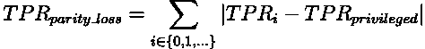**

**(图片由作者提供)TPR 的奇偶损失是特权子群和非特权子群之间的欧几里德距离之和**

**有了这样累积度量，我们将能够快速比较偏差有多显著，甚至在不同的度量之间。**

# **这有什么大惊小怪的？**

**由于这一点，可视化不同的指标比以往任何时候都更容易。像以前一样，我们将使用用 *fairness_check()* 创建的 *fairness_object* ，并应用不同的函数从不同的角度显示偏差。我们将使用 [COMPAS](https://modeloriented.github.io/fairmodels/reference/compas.html) 数据集，预测某个人在 2 年后是否不再是惯犯。这样，模型的输出将是这个人应该得到一个有利结果(不是累犯)的概率。我们的受保护(敏感)变量将是一个具有 6 个级别的因子，代表不同的种族。你可以在找到这个例子的[代码。下面是显示如何创建 *fairness_object 的代码。*](https://github.com/jakwisn/blog-code/blob/master/medium/visualizing_fairness.R)**

**准备数据**

```
**library**(fairmodels)
**library**(DALEX)
**library**(ranger)
**library**(gbm)

data("compas")

*# positive outcome - not being recidivist*
two_yr_recidivism <- factor(compas$Two_yr_Recidivism, levels = c(1,0))
y_numeric <- as.numeric(two_yr_recidivism) -1
compas$Two_yr_Recidivism <- two_yr_recidivism

df <- compas
df$Two_yr_Recidivism <- as.numeric(two_yr_recidivism) -1
```

**训练模型和解说**

```
gbm_model <- gbm(Two_yr_Recidivism ~., data = df)

lm_model <- glm(Two_yr_Recidivism~.,
                data=compas,
                family=binomial(link="logit"))

rf_model <- ranger(Two_yr_Recidivism ~.,
                   data = compas,
                   probability = TRUE)

explainer_lm  <- explain(lm_model, data = compas[,-1], y = y_numeric)
explainer_rf  <- explain(rf_model, data = compas[,-1], y = y_numeric)
explainer_gbm <- explain(gbm_model, data = compas[,-1], y = y_numeric) 
```

**准备公平对象**

```
fobject <- fairness_check(explainer_lm, explainer_rf, explainer_gbm,
                          protected = compas$Ethnicity,
                          privileged = "Caucasian")
```

**一旦我们有了*公平对象*，我们就可以开始视觉化。**

**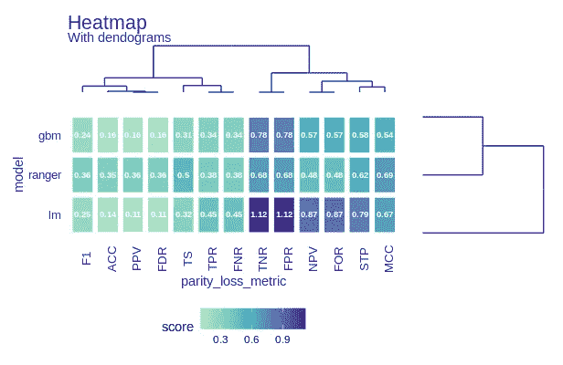**

**(图片由作者提供)plot(fairness_heatmap(fobject))**

****公平性热图**是一种可视化模型和指标之间相似性的好方法。它是可定制的，度量标准可以标准化，文本可以放大甚至关闭，梯度的中点可以改变，模型可以根据度量标准切换轴。由于这个情节由 3 个独立的情节组成，我们可以改变标题和副标题的情节。**

**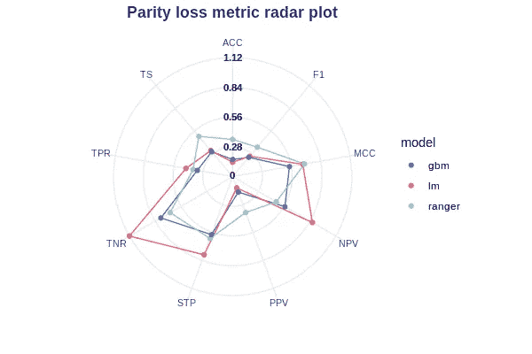**

**(图片由作者提供)plot(fairness_radar(fobject))**

**对于模型和指标的比较，最好使用**公平雷达** *。*很明显，如果模型覆盖的领域越少，偏差就越小。对于某个度量，假设 *TNR* 很容易说最*奇偶损失*在 *lm* 中，最少在 *ranger 中。如果我们添加更多的模型，它可能会开始变得不可读。***

**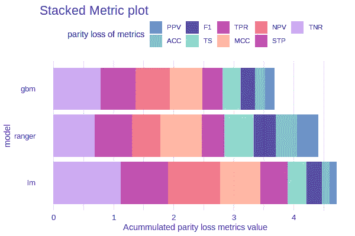**

**(作者提供的图片)plot(stack_metrics(fobject))**

****堆叠度量图**将条形图堆叠在一起。不同的颜色表示不同的混淆矩阵度量。
该图非常适合比较各型号的总体*奇偶损失*。当有大量和少量的解释者时，视觉上是令人愉快的。一般来说，累积的奇偶校验损失越低越好。然而，它在相互比较指标之间存在不足。**

**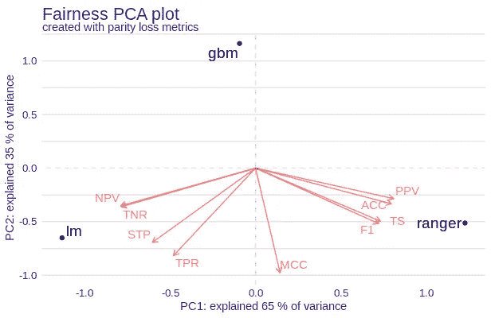**

**(图片由作者提供)plot(fairness _ PCA(fo object))**

****公平性 PCA** 有助于看出模型和度量之间的相似性。它就像标准的双标图一样。模特之间的距离越近，她们就越像。在底部和左侧的轴上，有关于通过每个组件可以解释多少差异的信息。**

**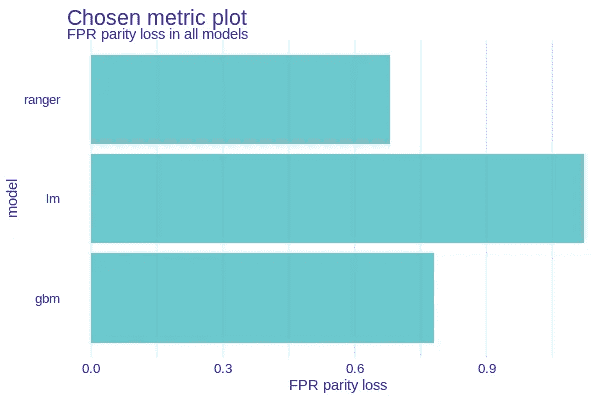**

**(图片由作者提供)plot(choose_metric(fobject))**

****选米** 剧情是所有剧情中最简单的。我们只需选择指标，它会显示所有型号的该指标的*奇偶损失*。当然，奇偶损失越少越好。**

**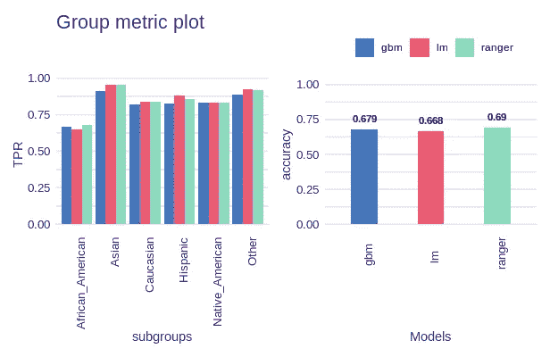**

**(图片由作者提供)绘图(group_metric(fobject))**

****组指标**图有所不同。首先，它显示了子组之间的度量，而不是它的*奇偶损失*。条形越靠近特权子群越好。右侧是模型的性能图，可以比较常见的指标，如 *AUC、精确度、F1 分数*。此外，为了便于子组之间的直观比较，添加了参数 *parity_loss* ，当该参数设置为 *TRUE 时，*计算并显示非特权子组和特权子组之间的欧几里德距离，而不是原始指标得分。**

**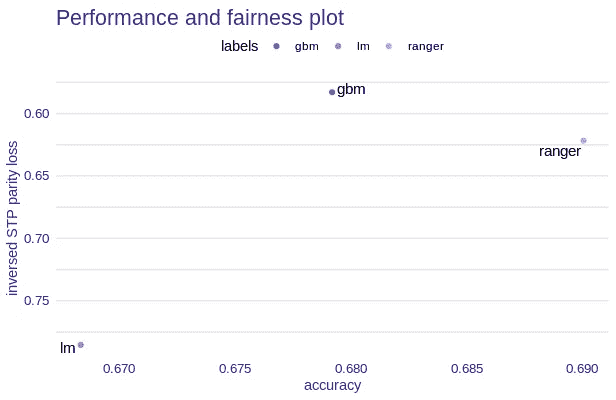**

**(图片由作者提供)plot(性能和公平性(fobject))**

****性能和公平性**图在左侧和底部轴分别显示了指标的奇偶校验损失和准确性。左轴是倒置的，所以右上角有最好的模型(在这些指标中)。对于许多模型来说，这是一个很好的工具来可视化性能如何影响公平指标。**

**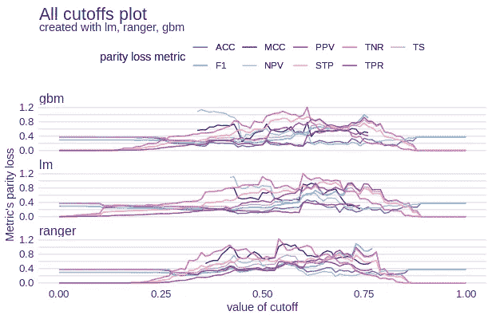**

**(图片由作者提供)plot(all_cutoffs(fobject))**

****所有临界值**图显示了随着临界值度量的变化，奇偶损耗将如何变化。所有亚组的临界值都是一致变化的。在该图中，我们可以看到存在哪个截止度量(不是 NA ),并且我们可以知道将某些截止设置为某个值将导致更少的奇偶校验丢失。**

**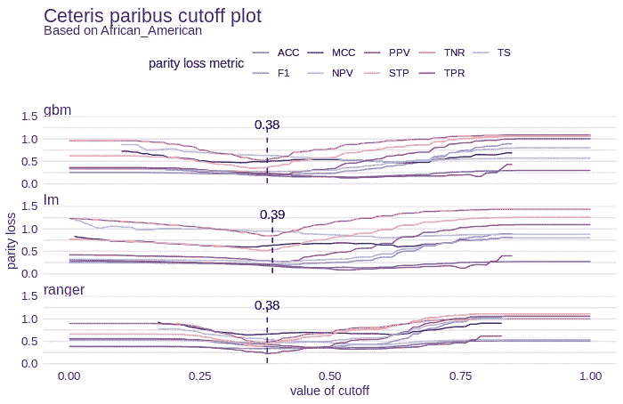**

**(图片由作者提供)plot(ceteris _ pari bus _ cut off(fobject，“African_American”))**

**其他条件不变的情况下，剧情比它的前作更有趣。此处的截止值仅针对选定的亚组(此处为非裔美国人)而变化，其他亚组的截止值不变。此外，还显示了累积奇偶性损失最小的截止值。这样，通过改变特定子组的截止值，我们可以将奇偶损失变得尽可能低。这当然会影响模型的性能。此外，还有参数*累积*，当设置为*真时，*将触发面的折叠，所有选择的度量将被累积。**

# **为什么我们需要 fairmodels 包？**

**呈现的图是灵活的(度量标准可以改变，参数可以设置等等),并从多个角度给出关于偏差的信息。考虑到这一点，可以更好地理解模型做出的区别性决策。当创建许多模型时，最好从偏差的不同方面相互比较。在这个过程的最后，应该清楚哪种模式在公平性和性能方面最有希望。**

# **接下来读什么？**

*   **[关于介绍公平、问题和解决方案的博客文章](https://medium.com/@ModelOriented/fairmodels-lets-fight-with-biased-machine-learning-models-part-1-detection-6c2786e6c97c)**
*   **[关于偏见缓解技术的博客文章](/fairmodels-lets-fight-with-biased-machine-learning-models-f7d66a2287fc)**

# **了解更多信息**

*   **查看[包的 GitHub 网站](https://modeloriented.github.io/fairmodels/)了解更多详情**
*   **[教程](https://modeloriented.github.io/fairmodels/articles/Basic_tutorial.html)介绍了 **fairmodels** 套装的全部功能**
*   **[关于偏差缓解技术的教程](https://modeloriented.github.io/fairmodels/articles/Advanced_tutorial.html)**