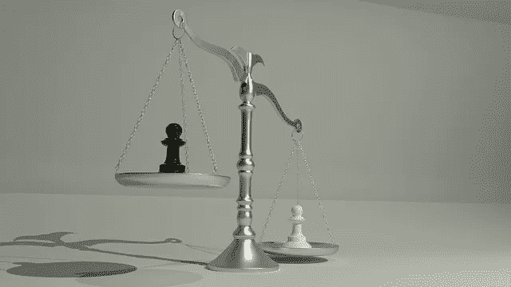
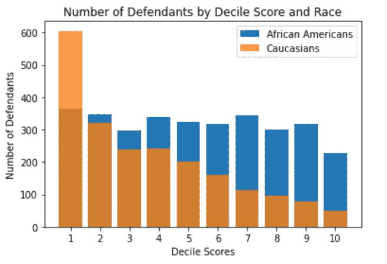
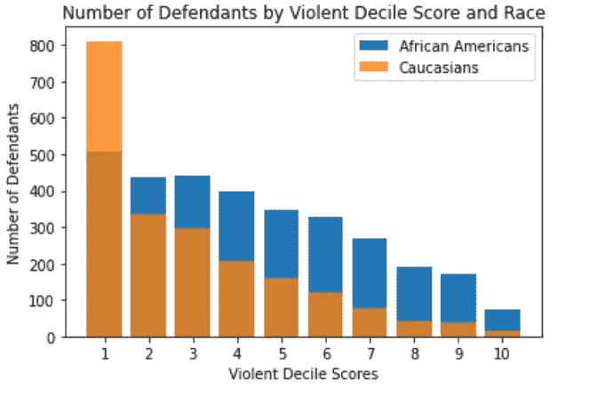
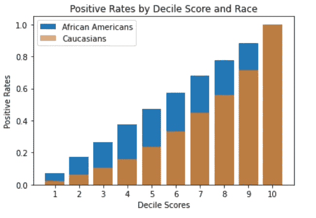
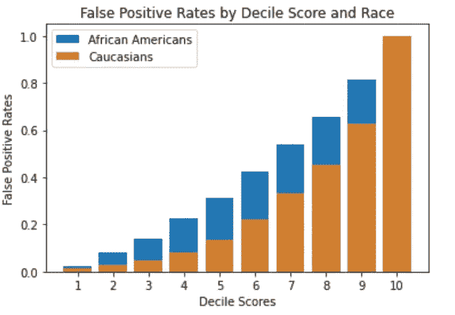
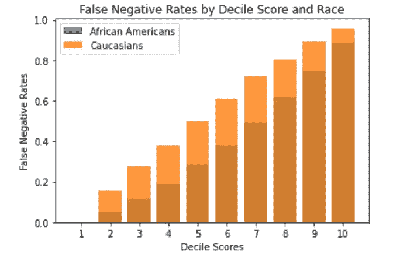
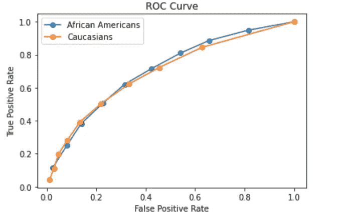
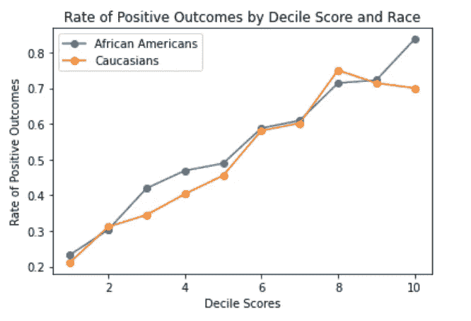

# 刑事司法决策的公正性

> 原文：<https://towardsdatascience.com/fairness-in-decision-making-for-criminal-justice-2eaaaf947142?source=collection_archive---------64----------------------->

## *机器学习算法是否确保了刑事司法系统的公平，还是让不平等永久化？*



图片来自 [pixabay](https://pixabay.com/)

风险评估是刑事司法系统不可或缺的一部分。他们帮助法官建立危险意识，并帮助确定谁可能处于危险之中。例如，用于告知法官量刑决定的风险评估应该能够预测被告在缓刑期间或之后是否会犯下新的罪行。关于其他被告的数据或信息是形成这种风险评估的一个非常重要的部分。

在刑事司法系统中，越来越多的人支持使用算法模型(机器学习)来进行风险评估，以帮助法官进行决策——这些模型从过去和现在的被告的信息中学习。倡导者认为，机器学习可能会导致更有效的决策，并减少人类判断中固有的偏见。批评者认为，这种模型延续了历史数据中的不平等，因此伤害了历史上被边缘化的人群。虽然公平不是一个纯粹的技术问题，但我们仍然可以利用基本的统计框架来评估公平，因此，令人信服的现象仍然出现。

在这项研究中，我们将探索一种称为 COMPAS 的风险评估算法，由 Northpointe(现为 [equivant](https://www.equivant.com/) )创建。COMPAS 调查被告的犯罪记录和其他个人信息，以评估他们在未来两年内再次犯罪的可能性。你可以阅读更多关于 ProPublica 对这个问题进行的调查，该调查引起了人们对在决策中利用机器学习的道德影响的关注。

我们将观察白种人和非裔美国人的风险得分。COMPAS 风险分值 1 表示“低风险”，而风险分值 10 表示“高风险”此外，我们将遵循 ProPublica 的分析，过滤筛选前天数超过或低于 30 天的数据。

首先，让我们想象一下每十分位数的被告人数:



样本中有 3，175 名非洲裔美国人被告和 2，103 名高加索人被告，我们可以看到，对于高加索人群体，分布似乎偏向较低的风险十分位数分数。

接下来，我们来看看每十分位数暴力得分的被告人数。等级 1 表示暴力的“低风险”,等级 10 表示暴力的“高风险”:



我们还看到，对于白种人群体，分布偏向于低风险暴力十分位数分数。对于这两种想象，我们不能把这种差异仅仅归因于种族。可能存在混杂因素，如性别、年龄和 COMPAS 评分检查的其他属性会影响这些风险评分。在本文的其余部分，我们将看看三个常用的统计标准，用于回答“这个算法公平吗？”

1.  **均衡阳性率**(假设被告是白种人，我们预测其再次犯罪的次数等于假设被告是非裔美国人，我们预测其再次犯罪的次数)。
2.  **均衡错误率**(对于白种人和非裔美国人来说，我们将实际上再次犯罪的被告错误分类的比例是相同的，对于两组来说，我们将实际上没有再次犯罪的被告错误分类的比例是相同的)。
3.  **校准**(在所有获得风险分数 r 的被告中，平均而言，他们中的 r 比例实际上应被归类为积极——也就是说，可能再次犯罪)

根据上述标准，下面分别列出了三种可能性:

```
P(δ(X) = 1 | A = Caucasian) = P(δ(X) = 1 | A = African American) where δ is our decision rule and X is our dataP(δ(X) = 1 | Y = 0, A = Caucasian) = P(δ(X) = 1 | Y = 0, A = African American),
P(δ(X) = 0 | Y = 1, A = Caucasian) = P(δ(X) = 0 | Y = 1, A = African American)P(Y = 1 | R = r, A = Caucasian) = P(Y = 1 | R = r, A = African American) = r
```

虽然我们没有被告在预测时是否再次犯罪的真实数据，但我们可以观察当我们使用 COMPAS 风险评分创建分类器来预测一个人是否会再次犯罪时会发生什么。

我们首先观察当决策阈值出现在每个十分位数分数时分类器的结果。忽略十分位数 10 和 1 的比率，因为实现这两个十分位数的平等是微不足道的(你能看出为什么吗？).

**对于正利率，我们发现:**



从这个可视化，我们可以清楚地看到，分类器不满足均衡所有阈值的阳性率。*就所有决策阈值而言，非裔美国人比白种人更有可能被归类为“高风险”。*

我们仍然可以获得相等的正利率。向下滚动到下一个标准，看看我们如何推断出一个类似的方法来均衡正比率。

在这种情况下，强制实施相等的正比率能解决所有的公平问题吗？我们可以提出不可否认不公平的决策规则，但仍然满足相等正比率的标准。在这种情况下，平均阳性率不足以解决公平性问题，因为在刑事司法系统中，重要的不仅仅是被告被贴上“高风险”标签的数量。例如，我们可以将每个人归类为“高风险”，但这无疑是不公平的。

**对于错误率，我们发现:**



从这些可视化，我们可以清楚地看到，分类器不满足均衡所有阈值的错误率。特别是，第一张图表显示*在接下来的两年中没有复发的非裔美国人更有可能被错误归类为“高风险”。*第二张图表显示*在接下来的两年内再次犯罪的白种人更有可能被错误地贴上“低风险”的标签。*

但是，我们仍然可以通过选择误差率相等的两个阈值来均衡误差率。实现这一点的常见方法是利用 [ROC 曲线](https://en.wikipedia.org/wiki/Receiver_operating_characteristic)。我们寻找下图所示的两条曲线的交点。



我们可以通过选择两个阈值来均衡错误率，每个组一个阈值，使得真阳性率和假阳性率相等。这是真的，因为假阴性率正好是(1 —真阳性率)。

虽然均衡错误率将确保两组具有相同的误分类比例，但复杂的问题仍然出现。首先，在判决时，法官不知道谁是真正的“高风险”或“低风险”被告。被告的种族差异常常给人以风险评估不公平的印象。其次，为了使非裔美国人和白种人的错误率相等，有必要使其中一个群体的预测更差。

与其恶化对其中一组的预测，不如批判性地思考为什么不同组之间的错误率不同，并尝试解决一些潜在的原因。

**对于校准，我们发现:**



为了实现校准，必须满足前面提到的约束条件，即“在获得相同 COMPAS 分数的被告中，与白人被告相比，黑人被告再次犯罪的比例相当。”

在给定 COMPAS 分数的情况下,“积极结果率”是被告实际重新认罪的比率。

我们可以通过上面的图表来形象化这个标准，这正是 Northpointe 认为 COMPAS 算法所要达到的目标。虽然上面的图表看起来不太准确，但我们在一些十分位数中看到的偏差可能是由于相应组和十分位数中的数据不足。例如，10 分位数有 227 名非裔美国人被告和 50 名白种人被告。

考虑到公平性，校准通常是很自然的，因为它是一种先验的保证。决策者在决策时看到分数 R(X) = r，并根据这个分数知道积极结果的平均频率是多少。

为什么这些都很重要？

原来，ProPublica 对 Northpointe 的风险评估算法 COMPAS 的分析发现，黑人被告远比白人被告更有可能被错误分类为再犯风险较高的人，而白人被告更有可能被错误分类为再犯风险较低的人。我们已经表明，这种说法是均衡错误率旨在解决，而 COMPAS 未能满足。有趣的是，Northpointe 声称 COMPAS 算法是公平的，因为它是经过校准的(虽然上面的图表看起来没有经过校准，而且因为我们只处理了一个数据样本，所以我们可以假设给定所有数据的情况下，评分算法实际上都是经过校准的)。

机器学习者和科学家在创建分类算法时努力满足的两个常见的非歧视标准是充分性和分离性。在这项研究中，分离说，分类器的决定是独立的种族条件是否累犯发生。这意味着对于累犯实际发生的例子，分类器输出肯定判定(可能累犯)的概率在种族之间不应该不同。这正是均衡错误率的定义，而 ProPublica 认为 COMPAS 算法不满足这一定义，因此是不公平的。充分性说，累犯是否发生是独立于种族的分类器决定的条件。这意味着，对于分类器输出肯定判定的所有例子，这些例子中实际发生累犯的概率在种族之间不应该不同。这正是我们案例中校准的定义，也是 Northpointe 在 COMPAS 算法中所满足的，他们认为这是公平的。

那么，为什么不同时满足这两个标准呢？被称为“[不相容结果](https://fairmlbook.org)的结果集合证明这三个公平标准不能独立出现。这意味着我们只能满足这些标准中的一个。如果我们校准 COMPAS 算法，那么我们也不能均衡错误率。

总之，统计公平标准本身不能作为“公平的证明”但是，它们可以为思考公平问题提供一个起点，并有助于揭示关于决策的重要规范性问题。在这项研究中，我们揭示了公平的不同潜在解释之间的权衡和紧张关系，试图找到一个有用的解决方案。这项研究揭示了将权力下放给机器学习和算法以指导有影响的决策的伦理含义，并表明公平的纯技术解决方案非常复杂，很多时候是不充分的。在量刑决策和预测性警务中，也许最好放弃使用学习模型，除非在非歧视性数据(不包括种族作为属性)上进行训练，并由所有相关领域的公平专家进行评估。