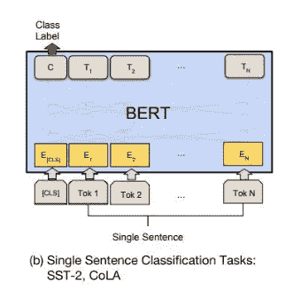
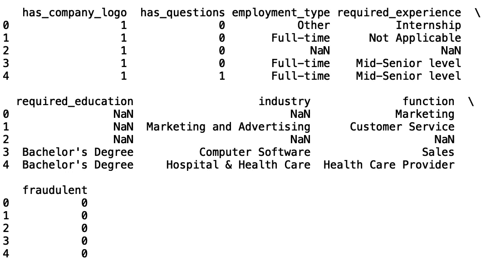
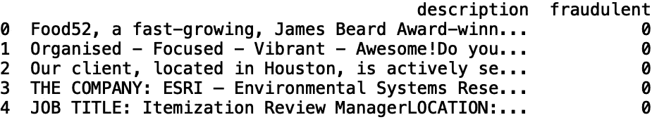
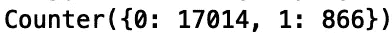
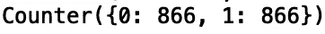
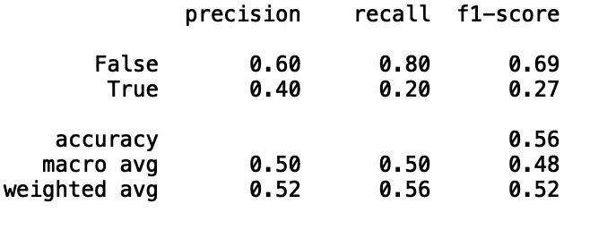

# 伯特的假工作分类

> 原文：<https://towardsdatascience.com/fake-job-classification-with-bert-6575c908a9aa?source=collection_archive---------29----------------------->

## Python 中的文本分类


[来源](https://www.pexels.com/photo/adult-blur-boss-business-288477/)

近日，爱琴海大学公布了 [*就业骗局爱琴海数据集*](https://www.kaggle.com/shivamb/real-or-fake-fake-jobposting-prediction) 。该数据包含大约 18K 个现实生活中的招聘广告。其目的是为研究界提供一个清晰的雇佣诈骗问题的图景。在本帖中，我们将使用 BERT 对 [*就业骗局爱琴海数据集*](https://www.kaggle.com/shivamb/real-or-fake-fake-jobposting-prediction) 中的虚假职位描述进行分类。

在我们开始之前，让我们简单回顾一下 BERT 方法。

BERT 代表来自变压器的双向编码器表示。描述 BERT 算法的论文由 Google 发布，可以在这里找到。BERT 的工作原理是随机屏蔽单词标记，并用基于上下文的向量来表示每个被屏蔽的单词。BERT 的两个应用是“预训练”和“微调”。

**预训练 BERT**

对于预训练 BERT 算法，研究人员训练了两个无监督学习任务。第一个任务被描述为屏蔽 LM。其工作原理是随机屏蔽 15%的文档，并预测这些被屏蔽的标记。第二个任务是下一句预测(NSP)。这是由问题回答和自然语言推理等任务激发的。这些任务需要模型来准确捕捉句子之间的关系。为了解决这个问题，他们对二进制预测任务进行了预训练，该任务可以从单一语言的任何语料库中轻松生成。他们在论文中给出的例子如下:如果你有句子 A 和 B，A 有 50%的时间被标注为“isNext”，另外 50%的时间是从语料库中随机选取的句子，被标注为“notNext”。针对这一任务的预训练被证明对于问题回答和自然语言推理任务是有益的。

**微调伯特**

微调 BERT 的工作原理是用自我关注对连接在一起的文本对进行编码。自我注意是学习当前单词和先前单词之间相关性的过程。这一点的一个早期应用是在长短期记忆()论文(Dong2016)中，研究人员利用自我注意进行机器阅读。BERT 的好处在于，通过对具有自我关注的串联文本进行编码，可以捕捉句子对之间的双向交叉关注。


[来源](https://arxiv.org/pdf/1810.04805.pdf)

在本文中，我们将应用 BERT 来预测一个职位发布是否是欺诈性的。这篇文章的灵感来自于 [*BERT to the Rescue*](/bert-to-the-rescue-17671379687f) ，它使用 BERT 对 IMDB 数据集进行情感分类。从 [*伯特到营救*](/bert-to-the-rescue-17671379687f) 的代码可以在[这里](https://github.com/shudima/notebooks/blob/master/BERT_to_the_rescue.ipynb)找到。

由于我们对单句分类感兴趣，相关的架构是:



[来源](https://arxiv.org/pdf/1810.04805.pdf)

在上图中，BERT 算法的输入是单词序列，输出是编码的单词表示(向量)。对于单句分类，我们使用每个单词的向量表示作为分类模型的输入。

现在让我们开始吧！

1.  **导入包**

```
import pandas as pd 
import numpy as np 
import torch.nn as nn
from pytorch_pretrained_bert import BertTokenizer, BertModel
import torch
from keras.preprocessing.sequence import pad_sequences
from sklearn.metrics import classification_report
```

2.**数据探索**

首先，让我们将数据读入数据框并打印前五行。我们还可以将最大显示列数设置为“无”:

```
pd.set_option('display.max_columns', None)
df = pd.read_csv("fake_job_postings.csv")
print(df.head())
```



为简单起见，让我们看看“描述”和“欺诈”栏:

```
df = df[['description', 'fraudulent']]
print(df.head())
```



我们的分类模型的目标在“欺诈”列中。为了了解“欺诈”值的分布和种类，我们可以使用集合模块中的“计数器”:

```
from collections import Counter
print(Counter(df['fraudulent'].values))
```



“0”值对应于正常的工作发布,“1”值对应于欺诈性发布。我们看到数据略有不平衡，这意味着正常的职位发布(17K)比欺诈性发布(866)多。

在继续之前，让我们删除“NaN”值:

```
df.dropna(inplace = True)
```

接下来，我们希望平衡我们的数据集，使“欺诈”和“非欺诈”类型的数量相等。我们还应该随机改变目标:

```
df_fraudulent= df[df['fraudulent'] == 1] 
df_normal = df[df['fraudulent'] == 0] 
df_normal = df_normal.sample(n=len(df_fraudulent))
df = df_normal.append(df_fraudulent)
df = df.sample(frac=1, random_state = 24).reset_index(drop=True)
```

再次验证我们得到了想要的结果:

```
print(Counter(df['fraudulent'].values))
```



接下来，我们想要格式化数据，以便它可以用作我们的 BERT 模型的输入。我们将数据分为训练集和测试集:

```
train_data = df.head(866)
test_data = df.tail(866)
```

我们生成一个包含“描述”和“欺诈”关键字的字典列表:

```
train_data = [{'description': description, 'fraudulent': fraudulent } for description in list(train_data['description']) for fraudulent in list(train_data['fraudulent'])]test_data = [{'description': description, 'fraudulent': fraudulent } for description in list(test_data['description']) for fraudulent in list(test_data['fraudulent'])]
```

从字典列表中生成元组列表:

```
train_texts, train_labels = list(zip(*map(lambda d: (d['description'], d['fraudulent']), train_data)))
test_texts, test_labels = list(zip(*map(lambda d: (d['description'], d['fraudulent']), test_data)))
```

生成令牌和令牌 id:

```
tokenizer = BertTokenizer.from_pretrained('bert-base-uncased', do_lower_case=True)
train_tokens = list(map(lambda t: ['[CLS]'] + tokenizer.tokenize(t)[:511], train_texts))
test_tokens = list(map(lambda t: ['[CLS]'] + tokenizer.tokenize(t)[:511], test_texts))train_tokens_ids = list(map(tokenizer.convert_tokens_to_ids, train_tokens))
test_tokens_ids = list(map(tokenizer.convert_tokens_to_ids, test_tokens))train_tokens_ids = pad_sequences(train_tokens_ids, maxlen=512, truncating="post", padding="post", dtype="int")
test_tokens_ids = pad_sequences(test_tokens_ids, maxlen=512, truncating="post", padding="post", dtype="int")
```

请注意，我们将输入字符串截断为 512 个字符，因为这是 BERT 可以处理的最大令牌数。

最后，为我们的测试和训练集生成一个基于“欺诈”值的布尔数组:

```
train_y = np.array(train_labels) == 1
test_y = np.array(test_labels) == 1
```

4.**模型构建**

我们创建了我们的 BERT 分类器，它包含一个“初始化”方法和一个返回令牌概率的“转发”方法:

```
class BertBinaryClassifier(nn.Module):
    def __init__(self, dropout=0.1):
        super(BertBinaryClassifier, self).__init__()
        self.bert = BertModel.from_pretrained('bert-base-uncased')
        self.dropout = nn.Dropout(dropout)
        self.linear = nn.Linear(768, 1)
        self.sigmoid = nn.Sigmoid()

    def forward(self, tokens, masks=None):
        _, pooled_output = self.bert(tokens, attention_mask=masks, output_all_encoded_layers=False)
        dropout_output = self.dropout(pooled_output)
        linear_output = self.linear(dropout_output)
        proba = self.sigmoid(linear_output)
        return proba
```

接下来，我们生成训练和测试掩码:

```
train_masks = [[float(i > 0) for i in ii] for ii in train_tokens_ids]
test_masks = [[float(i > 0) for i in ii] for ii in test_tokens_ids]
train_masks_tensor = torch.tensor(train_masks)
test_masks_tensor = torch.tensor(test_masks)
```

生成用于训练和测试的令牌张量:

```
train_tokens_tensor = torch.tensor(train_tokens_ids)
train_y_tensor = torch.tensor(train_y.reshape(-1, 1)).float()
test_tokens_tensor = torch.tensor(test_tokens_ids)
test_y_tensor = torch.tensor(test_y.reshape(-1, 1)).float()
```

最后，准备我们的数据加载器:

```
BATCH_SIZE = 1
train_dataset =  torch.utils.data.TensorDataset(train_tokens_tensor, train_masks_tensor, train_y_tensor)
train_sampler =  torch.utils.data.RandomSampler(train_dataset)
train_dataloader =  torch.utils.data.DataLoader(train_dataset, sampler=train_sampler, batch_size=BATCH_SIZE)test_dataset =  torch.utils.data.TensorDataset(test_tokens_tensor, test_masks_tensor, test_y_tensor)
test_sampler =  torch.utils.data.SequentialSampler(test_dataset)
test_dataloader =  torch.utils.data.DataLoader(test_dataset, sampler=test_sampler, batch_size=BATCH_SIZE)
```

5.**微调**

我们使用 Adam 优化器来最小化二进制交叉熵损失，并且我们使用 1 个时期的批量大小 1 来训练:

```
BATCH_SIZE = 1
EPOCHS = 1bert_clf = BertBinaryClassifier()
optimizer = torch.optim.Adam(bert_clf.parameters(), lr=3e-6)for epoch_num in range(EPOCHS):
    bert_clf.train()
    train_loss = 0
    for step_num, batch_data in enumerate(train_dataloader):
        token_ids, masks, labels = tuple(t for t in batch_data)
        probas = bert_clf(token_ids, masks)
        loss_func = nn.BCELoss()
        batch_loss = loss_func(probas, labels)
        train_loss += batch_loss.item()
        bert_clf.zero_grad()
        batch_loss.backward()
        optimizer.step()
        print('Epoch: ', epoch_num + 1)
        print("\r" + "{0}/{1} loss: {2} ".format(step_num, len(train_data) / BATCH_SIZE, train_loss / (step_num + 1)))
```

我们评估我们的模型:

```
bert_clf.eval()
bert_predicted = []
all_logits = []
with torch.no_grad():
    for step_num, batch_data in enumerate(test_dataloader):token_ids, masks, labels = tuple(t for t in batch_data)logits = bert_clf(token_ids, masks)
        loss_func = nn.BCELoss()
        loss = loss_func(logits, labels)
        numpy_logits = logits.cpu().detach().numpy()

        bert_predicted += list(numpy_logits[:, 0] > 0.5)
        all_logits += list(numpy_logits[:, 0])

print(classification_report(test_y, bert_predicted))
```



这个模型在预测真实帖子方面做得不错。预测欺诈性帖子的性能没有那么好，但可以通过增加历元数和进一步的特征工程来提高。我鼓励您尝试超参数调整和训练数据，看看是否可以提高分类性能。

总而言之，我们建立了一个 BERT 分类器来预测招聘信息是真实的还是虚假的。如果对 BERT 的其他应用感兴趣，可以阅读 [*假新闻分类搭配 BERT*](/fake-news-classification-with-bert-afbeee601f41) 和 [*俄罗斯巨魔推文:分类搭配 BERT*](/russian-troll-tweets-classification-using-bert-abec09e43558) 。如果你对伯特方法有兴趣，我鼓励你阅读 [*伯特拯救*](/bert-to-the-rescue-17671379687f) *。*这篇文章的代码可以在 [GitHub](https://github.com/spierre91/medium_code/tree/master/BERT_fake_job_classification) 上找到。感谢您的阅读！