# 基于递归卷积神经网络的假新闻分类

> 原文：<https://towardsdatascience.com/fake-news-classification-with-recurrent-convolutional-neural-networks-4a081ff69f1a?source=collection_archive---------13----------------------->


马库斯·温克勒在 [Unsplash](https://unsplash.com/s/photos/news?utm_source=unsplash&utm_medium=referral&utm_content=creditCopyText) 上的照片

# 介绍

假新闻是一个在过去几年里引起广泛关注的话题，这是有充分理由的。随着社交媒体变得普及，通过传播错误信息来影响数百万人变得更加容易。作为人类，我们经常无法识别我们读到的新闻是真是假。[密执安大学的一项研究发现，人类参与者只能在 70%的时候发现假新闻。但是神经网络能做得更好吗？请继续阅读，寻找答案。](https://arxiv.org/abs/1708.07104)

本文的目标是回答以下问题:

*   **什么样的话题或关键词在真实新闻和假新闻中频繁出现？**
*   **如何利用深度神经网络识别假新闻故事？**

# 导入基本库

而我下面导入的大多数库都是常用的(NumPy，Pandas，Matplotlib 等。)，我还利用了以下有用的库:

*   [**Pandarallel**](https://github.com/nalepae/pandarallel)**是一个很有帮助的库，可以并行运行对 Pandas 数据帧的操作，并实时监控每个 worker 的进度。**
*   **[**Spacy**](https://spacy.io/)**是一个用于高级自然语言处理的库。它附带了英语、西班牙语和德语等语言的语言模型。在这个项目中，我安装并导入了英语语言模型 *en_core_web_md.*****

```
**import numpy as np
import pandas as pd
from pandarallel import pandarallel
pandarallel.initialize(progress_bar=True, use_memory_fs=False, )
import spacy
import en_core_web_md
import matplotlib.pyplot as plt
import seaborn as sns

%matplotlib inline**
```

# ****数据集****

****我在这个项目中使用的数据集包含从下面列出的多个 Kaggle 新闻数据集中选择和聚合的数据:****

*   ****[面对假新闻](https://www.kaggle.com/mrisdal/fake-news)****
*   ****[真假新闻数据集](https://www.kaggle.com/clmentbisaillon/fake-and-real-news-dataset)****
*   ****[基于来源的假新闻分类](https://www.kaggle.com/ruchi798/source-based-news-classification)****
*   ****[所有新闻:来自 15 家美国出版物的 143，000 篇文章](https://www.kaggle.com/snapcrack/all-the-news)****

****如下面 Pandas 代码的输出所示，数据集大约有 74，000 行，有三列:新闻文章的**标题**，新闻文章的**文本**，以及一个**二进制** **标签**，指示新闻是真是假。****

```
**data = pd.read_csv('./data/combined_news_data.csv')
data.dropna(inplace=True)
data.info()<class 'pandas.core.frame.DataFrame'>
Int64Index: 74012 entries, 0 to 74783
Data columns (total 3 columns):
 #   Column  Non-Null Count  Dtype 
---  ------  --------------  ----- 
 0   title   74012 non-null  object
 1   text    74012 non-null  object
 2   label   74012 non-null  int64 
dtypes: int64(1), object(2)
memory usage: 2.3+ MB**
```

# ****探索性数据分析****

## ****伪造和真实新闻文章的分发****

****如下面使用 Seaborn 生成的图所示，数据集的虚假和真实新闻文章分布大致均匀，这对于二进制分类任务来说是最佳的。****

```
**sns.set(rc={'figure.figsize':(11.7,8.27)})
sns.countplot(data['label'])**
```

****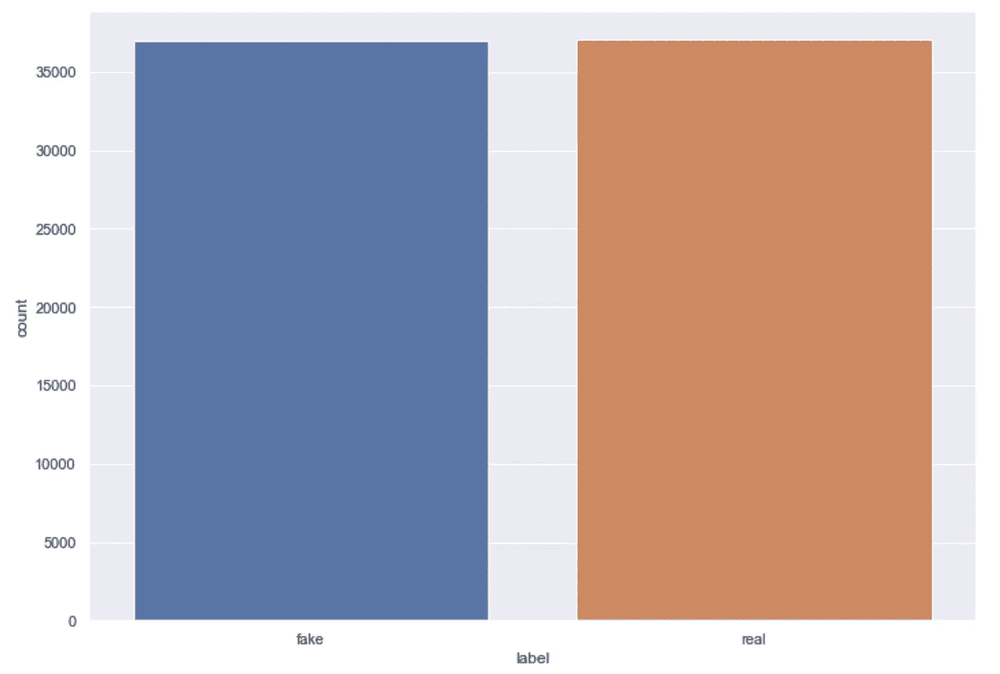****

****真假新闻文章的分发。****

## ****文章长度分布(字数)****

****我们还可以使用下面的代码检查新闻文章的文章长度分布，该代码创建了一个列，计算每篇文章的字数，并使用 Seaborn 的 [distplot](https://seaborn.pydata.org/generated/seaborn.displot.html#seaborn.displot) 函数显示文章长度的分布。****

```
**data['length'] = data['text'].apply(lambda x: len(x.split(' ')))
sns.distplot(data['length'])**
```

****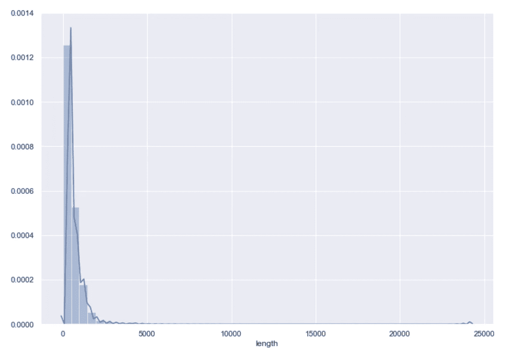****

****字数分布。****

****使用 Pandas 的 [describe](https://pandas.pydata.org/pandas-docs/stable/reference/api/pandas.DataFrame.describe.html) 函数仔细查看这个分布，会产生以下输出。****

```
**data['length'].describe()count    74012.000000
mean       549.869251
std        629.223073
min          1.000000
25%        235.000000
50%        404.000000
75%        672.000000
max      24234.000000
Name: length, dtype: float64**
```

****平均文章长度约为 550 字，平均文章长度为 404 字。这种分布是右偏的，75%的文章字数在 672 字以下，而最长的文章显然是超过 24000 字的异常值。为了建立一个模型，我们可以通过仅使用每篇文章中的前 500 个左右的单词来确定它是否是假新闻，从而获得令人满意的结果。****

# ****数据准备****

## ****预处理文本数据****

****为大多数自然语言处理任务准备数据的第一步是预处理文本数据。对于这个任务，我在下面定义的**预处理器**函数中执行了以下预处理步骤:****

*   ******使用正则表达式删除不需要的字符**，如标点符号、HTML 标签和表情符号。****
*   ******删除停用词**(在英语中非常常见的词，通常不需要用于文本分类)。****
*   ******词条化**，这是将一个单词简化为其词条或词典形式的过程。比如*跑*这个词就是*跑*、*跑*和*跑这几个词的引理。*****

****我使用 Python 的 regex 库从文本数据中移除不需要的字符，并使用 Spacy 的中型英语语言模型(en_core_web_md)来执行停用词移除和词汇化。为了加速这个昂贵的文本处理函数的计算过程，我使用了 Pandarallel 的 **parallel_apply** 函数，它在四个内核上并行执行过程。****

```
**import re 
from spacy.lang.en.stop_words import STOP_WORDS

nlp = en_core_web_md.load()

def preprocessor(text):
    text = re.sub('<[^>]*>', '', text)
    emoticons = re.findall('(?::|;|=)(?:-)?(?:\)|\(|D|P)', text)
    text = re.sub('[\W]+', ' ', text.lower()) + ''.join(emoticons).replace('-', '')
    doc = nlp(text)
    text = ' '.join([token.lemma_ for token in doc if token.text not in STOP_WORDS])
    return textX = data['text'].parallel_apply(preprocessor)
y = data['label']

data_processed = pd.DataFrame({'title': data['title'], 'text': X, 'label': y})**
```

****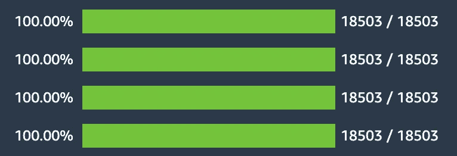****

****parallel_apply 函数显示的进度条输出。****

# ****基于潜在狄利克雷分配的主题建模****

****在对文本数据进行预处理后，我能够使用潜在狄利克雷分配(LDA)来比较真实和虚假新闻文章中的主题和最重要的术语。LDA 是一种基于以下假设的无监督主题建模技术:****

*   ****每个文档(在本例中是每篇新闻文章)都是一个由单词组成的*包*，这意味着在提取主题时不考虑文档中单词的顺序。****
*   ****每个文档都有一个主题分布，每个主题都由词的分布来定义。****
*   ****所有文档中都有 *k* 主题。参数 *k* 是为算法预先指定的。****
*   ****包含属于特定主题的单词的文档的概率可以建模为[狄利克雷分布](https://en.wikipedia.org/wiki/Dirichlet_distribution)。****

****在其最简单的形式中，LDA 算法对文档集合中的每个文档 *D* 遵循以下步骤:****

1.  ****通过根据狄利克雷分布给每个单词分配一个主题，在文档 *D* 中分配每个 *k* 主题。****
2.  ****对于 *D* 中的每个单词，假设它的主题是错误的，但是每隔一个单词被分配正确的主题。****
3.  ****根据以下因素为该单词分配属于每个主题的概率:
    -文档中的主题 *D
    -* 该单词在所有文档中被分配给每个主题的次数。****
4.  ****对所有文档重复步骤 1-4。****

****关于 LDA 更详细但更容易理解的概述，请查看埃德温·陈的博客中的页面。****

****我使用 Scikit-learn 的 LDA 模块来执行主题建模，并使用一个名为 [pyLDAvis](https://github.com/bmabey/pyLDAvis) 的有用的 Python 库来创建真实和虚假新闻的主题模型的交互式可视化。下面给出了这项任务所需的导入。****

```
**from sklearn.decomposition import LatentDirichletAllocation
from sklearn.feature_extraction.text import CountVectorizer
from sklearn.manifold import TSNE
from sklearn.pipeline import Pipeline
import pyLDAvis.sklearn**
```

## ****真正的新闻****

****下面给出的代码使用 pyLDAvis 对经过预处理的具有十个不同主题的真实新闻文章执行主题建模，然后创建一个交互式可视化，在二维空间中显示每个主题。****

```
**real_news = data_processed[data_processed['label'] == 1]

num_topics = 10
num_features=5000

vectorizer = CountVectorizer(max_df=0.95, min_df=2, max_features=num_features, stop_words='english')
lda = LatentDirichletAllocation(n_components=num_topics,
                                max_iter=5, 
                                learning_method='online', 
                                learning_offset=50.,
                                random_state=0)

lda_pipeline = Pipeline([('vectorizer', vectorizer), ('lda', lda)])
lda_pipeline.fit(real_news['text'])pyLDAvis.enable_notebook()
data_vectorized = vectorizer.fit_transform(data_processed['text'])
dash = pyLDAvis.sklearn.prepare(lda_pipeline.steps[1][1], data_vectorized, vectorizer, mds='tsne')pyLDAvis.save_html(dash, 'real_news_lda.html')**
```

****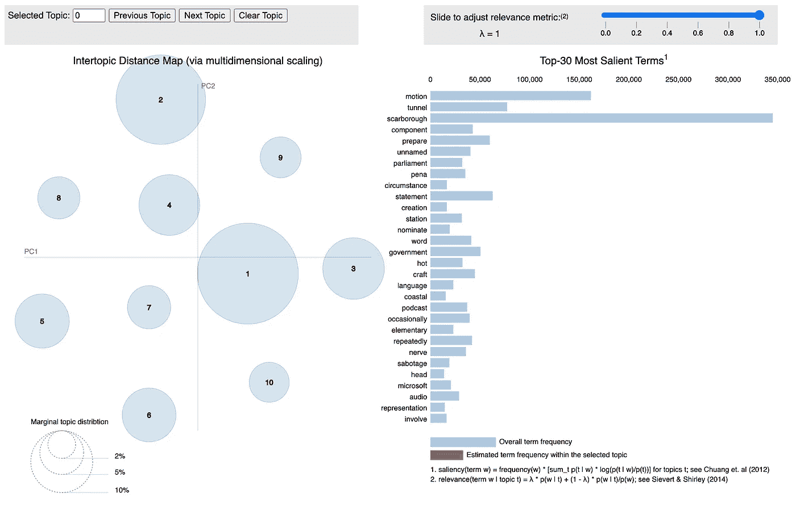****

****真实新闻数据的 LDA 可视化。****

****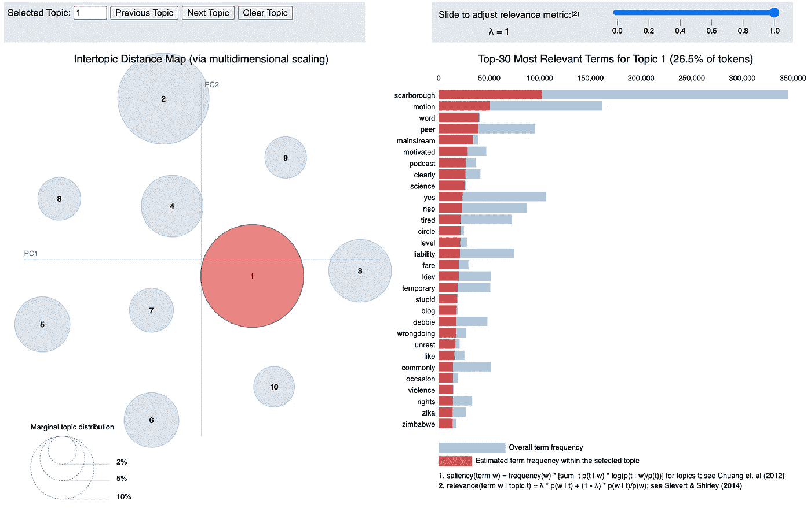****

****真实新闻数据中最大话题的热门术语。****

****上面的可视化允许用户查看十个提取主题中每个主题的相对大小，同时显示每个主题的最相关术语。你可以点击查看完整的交互式可视化[。](https://www.amolmavuduru.me/real_news_lda)****

## ******假新闻******

****下面给出的代码复制了前面假新闻文章的步骤，以产生类似的交互式可视化效果。****

```
**fake_news = data_processed[data_processed['label'] == 0]

num_topics = 10
num_features=5000

vectorizer = CountVectorizer(max_df=0.95, min_df=2, max_features=num_features, stop_words='english')
lda = LatentDirichletAllocation(n_components=num_topics,
                                max_iter=5, 
                                learning_method='online', 
                                learning_offset=50.,
                                random_state=0)

lda_pipeline = Pipeline([('vectorizer', vectorizer), ('lda', lda)])
lda_pipeline.fit(fake_news['text'])

pyLDAvis.enable_notebook()
data_vectorized = vectorizer.fit_transform(data_processed['text'])
dash = pyLDAvis.sklearn.prepare(lda_pipeline.steps[1][1], data_vectorized, vectorizer, mds='tsne')pyLDAvis.save_html(dash, 'fake_news_lda.html')**
```

****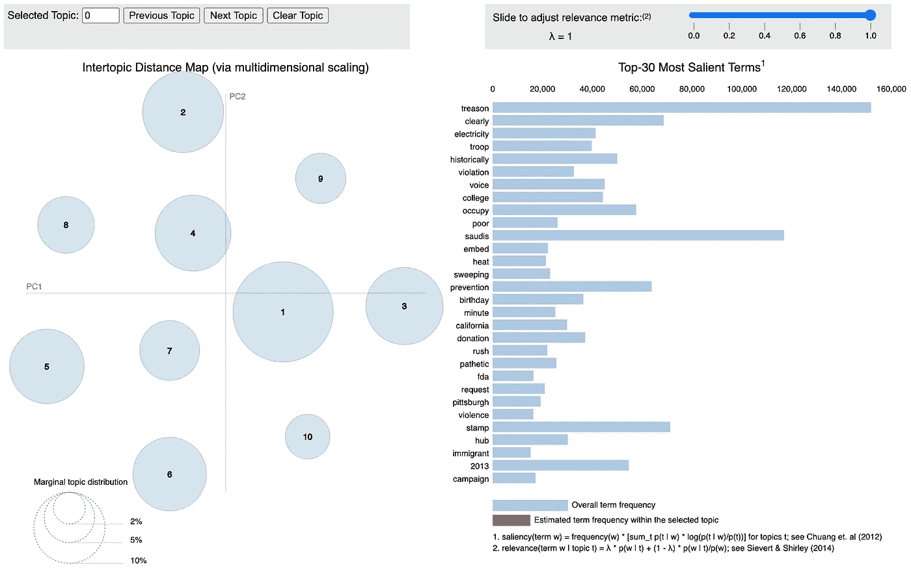****

****假新闻数据的 LDA 可视化。****

****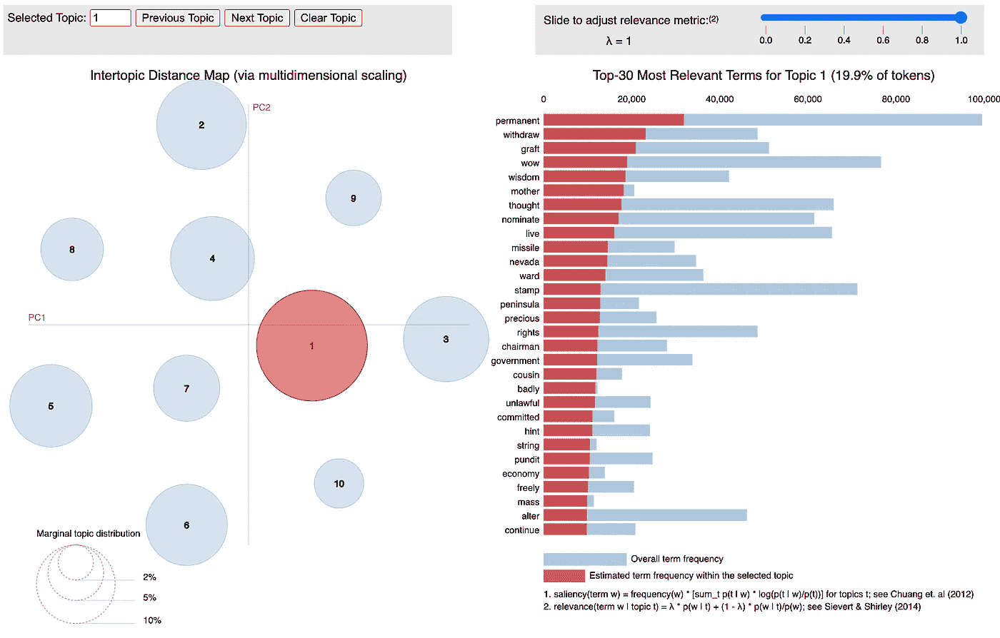****

****假新闻数据中最大话题的热门词汇。****

****你可以在这里查看完整的互动可视化。基于真实和虚假新闻的主题模型可视化，很明显，与真实新闻相比，虚假新闻通常涉及不同的主题。基于可视化和一些话题关键词，如*叛国*、*违规*、*可悲*、*狂奔*、和*暴力*，假新闻似乎一般涵盖更具争议性的话题，如所谓的政治丑闻和阴谋论。****

# ****定义和训练模型****

****我为这个任务设计的深度学习模型是一个递归卷积神经网络模型，由几种不同类型的顺序操作和层组成:****

1.  ****标记器用于将每篇文章转换成索引单词(标记)的向量。****
2.  ****单词嵌入层，其为每个唯一单词学习具有 *m* 维的嵌入向量，并将该嵌入应用于每个新闻文章中的前 *n* 个单词，生成 *m* x *n* 矩阵。****
3.  ****1D 卷积和最大池层。****
4.  ****LSTM 层，然后是辍学层。****
5.  ****最终完全连接的层。****

****这些组件将在下面更详细地解释。****

## ******分词器******

****标记器用于将每篇新闻文章分割成一个连续单词的向量，随后通过为每个单词分配一个唯一的整数索引，将该向量转换成整数向量。下图用一个简单的句子演示了这个过程。****

****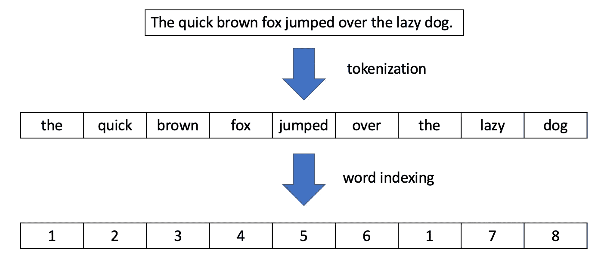****

****由记号赋予器执行的步骤。(图片由作者提供)****

## ******字嵌入图层******

****单词嵌入是单词的可学习矢量表示，表示单词相对于其他单词的意思。深度学习方法可以从文本集合中学习单词嵌入，使得具有相似嵌入向量的单词倾向于具有相似的含义或表示相似的概念。****

****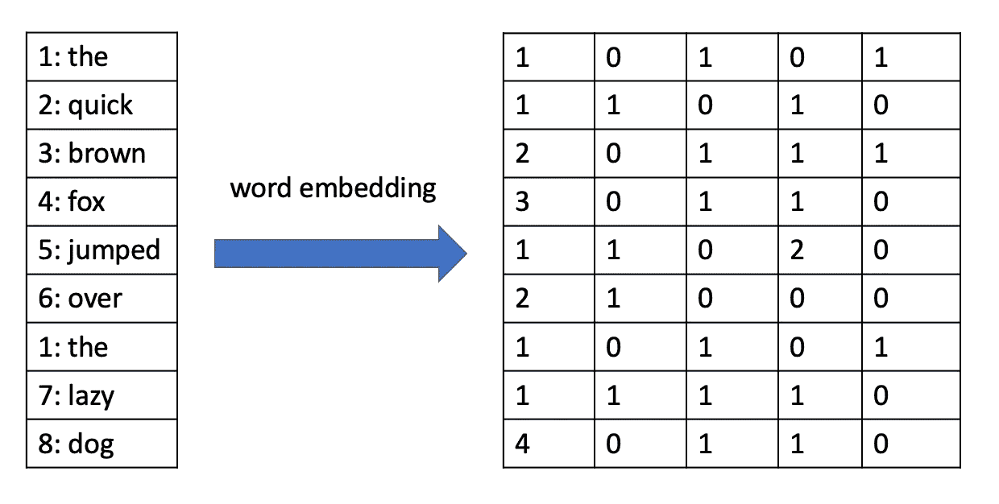****

****一个句子的单词嵌入，每个单词有 5 维向量。(图片由作者提供)****

## ******1D 卷积和最大池层******

****这些组件是递归卷积神经网络的*卷积*部分。如果你学过计算机视觉，你可能熟悉 2D 卷积和池层的图像数据操作。然而，对于文本数据，我们需要使用 1D 卷积和池层。1D 卷积层具有一系列内核，这些内核是低维向量，在计算点积以产生输出向量时，这些内核会在输入向量上递增滑动。在下面的例子中，具有大小为 2 的核的 1D 卷积运算被应用于具有 5 个元素的输入向量。****

****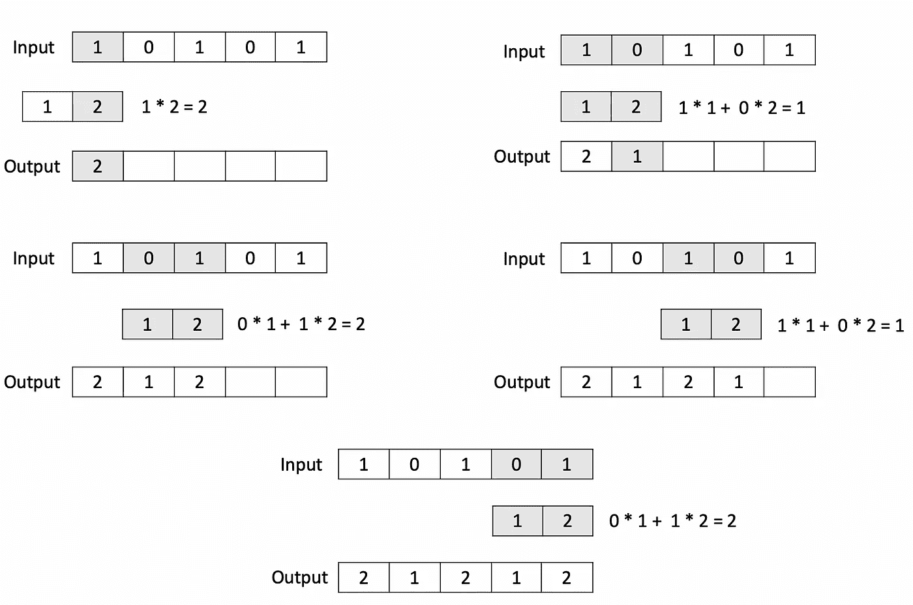****

****1D 卷积运算的例子。(图片由作者提供)****

****与 1D 卷积层一样，1D 最大池层也对向量进行操作，但通过从输入的局部区域中选择最大值来减小输入的大小。在下面的示例中，池大小为 2 的 max-pooling 操作应用于具有 6 个元素的 vector。****

****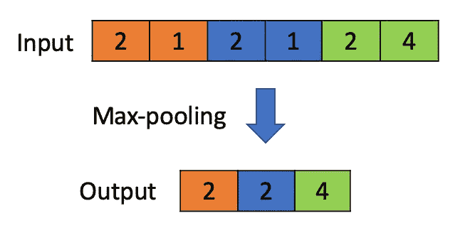****

****池大小为 2 的 1D 最大池操作示例。(图片由作者提供)****

## ******LSTMs******

****LSTM(长短期记忆)单元形成递归卷积神经网络的*递归*部分。LSTMs 通常用于涉及序列数据的任务，例如时间序列预测和文本分类。我不会深入探究 LSTMs 背后的数学背景，因为该主题超出了本文的范围，但本质上，LSTM 是神经网络中的一个单元，能够长时间记住重要信息，并在不再相关时忘记信息(因此得名，长短期记忆)。一个 LSTM 单元由三个门组成:****

*   ****接收输入值的**输入门**。****
*   ****一个**遗忘门**，它决定在培训期间获得的过去信息中有多少应该被记住。****
*   ****产生输出值的**输出门**。****

****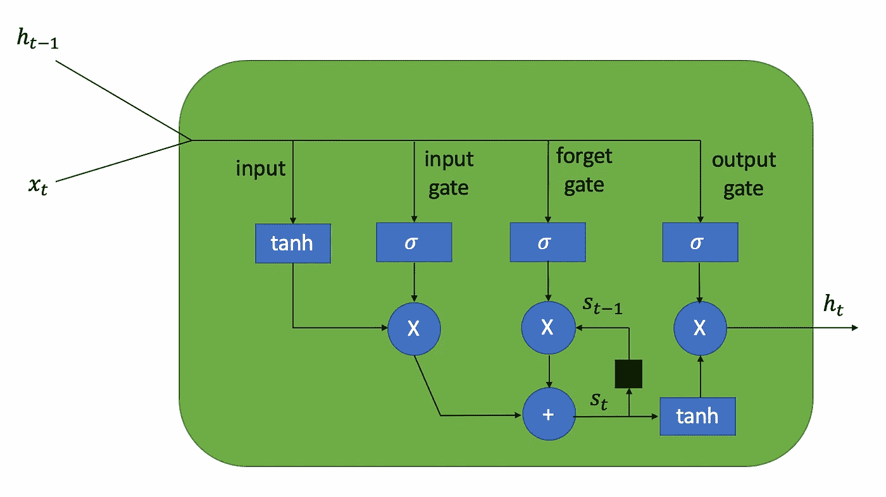****

****LSTM 单位图。(图片由作者提供)****

****LSTMs 选择性记忆信息的能力在诸如假新闻分类的文本分类问题中是有用的，因为新闻文章开头的信息可能仍然与文章中间或接近结尾的内容相关。****

## ******全连通层******

****这个模型的最后一部分只是一个完全连接的层，你可以在一个“香草”神经网络中找到。该层接收来自最后一个 LSTM 层的输出，并计算向量值的加权和，对该和应用 sigmoid 激活以产生最终输出-0 和 1 之间的值，对应于文章是真实新闻的概率。****

## ******综合考虑******

****我在下面创建的类是为定制和封装一个包含上述所有组件的模型而设计的。此类表示一个管道，它可以直接适合预处理的文本数据，而不必事先执行标记化和单词索引等步骤。LSTM _ 文本 _ 分类器类扩展了 Scikit-learn 中的 [BaseEstimator](https://scikit-learn.org/stable/modules/generated/sklearn.base.BaseEstimator.html#sklearn.base.BaseEstimator) 和 [ClassifierMixin](https://scikit-learn.org/stable/modules/generated/sklearn.base.ClassifierMixin.html) 类，使其行为类似于 Scikit-learn 估计器。****

****使用这个类，我在下面的代码中创建了一个包含以下组件的模型:****

*   ****一个**单词嵌入层**，它为每个单词学习一个 **64 维嵌入向量**，并从新闻文章的**前 512 个单词**中聚合这些向量，为每个输入文章生成一个**512×64 嵌入矩阵**。****
*   ******三个卷积层**，具有 **128 个卷积滤波器**和**内核大小为 5** ，每个卷积层之后是**最大池层**。****
*   ******具有 **128 个神经元**的两个 LSTM 层**，每个层之后是**退出层**，退出率为**10%**。****
*   **网络末端的**全连接层**，带有 **sigmoid 激活**，输出从 0 到 1 的单个值，指示文章成为真实新闻的**概率。****

```
lstm_classifier = LSTM_Text_Classifier(embedding_vector_length=64, max_seq_length=512, dropout=0.1, lstm_layers=[128, 128], batch_size=256, num_epochs=5, use_hash=False,
conv_params={'filters': 128, 
             'kernel_size': 5, 
             'pool_size': 2,
             'n_layers': 3})
```

**下面的可视化让我们很好地了解了这个递归卷积网络的模型架构。**

**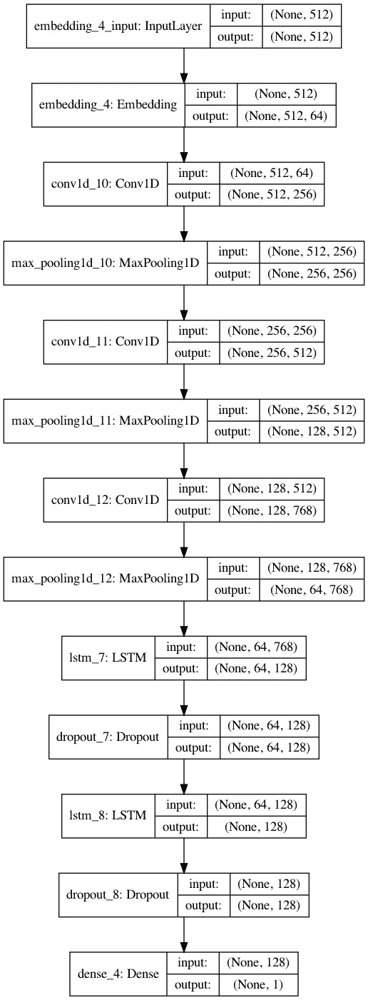**

**具有单词嵌入层的递归卷积神经网络结构。(图片由作者提供)**

## **培训、验证和测试分离**

**为了有效地评估此模型的性能，有必要将数据分成单独的训练集、验证集和测试集。根据下面的代码，**30%的数据用于测试**，剩下的 70%**14%(70 的 20%)用于验证**，剩下的**56%用于训练**。**

```
from sklearn.model_selection import train_test_split
X_train, X_test, y_train, y_test = train_test_split(X, y, test_size=0.3, random_state=42)
X_train, X_valid, y_train, y_valid = train_test_split(X_train, y_train, test_size=0.2, random_state=42)
```

## **模特培训**

**在定义了这个复杂的模型之后，我能够在训练集上训练它，同时在验证集上监控它的性能。该模型经过三个时期的训练，并在第二个训练时期结束时根据下面的代码和输出达到其峰值验证性能。**

```
 lstm_classifier.fit(X_train, y_train, validation_data=(X_valid, y_valid))Fitting Tokenizer...
Model: "sequential_4"
_________________________________________________________________
Layer (type)                 Output Shape              Param #   
=================================================================
embedding_4 (Embedding)      (None, 512, 64)           13169920  
_________________________________________________________________
conv1d_10 (Conv1D)           (None, 512, 256)          82176     
_________________________________________________________________
max_pooling1d_10 (MaxPooling (None, 256, 256)          0         
_________________________________________________________________
conv1d_11 (Conv1D)           (None, 256, 512)          655872    
_________________________________________________________________
max_pooling1d_11 (MaxPooling (None, 128, 512)          0         
_________________________________________________________________
conv1d_12 (Conv1D)           (None, 128, 768)          1966848   
_________________________________________________________________
max_pooling1d_12 (MaxPooling (None, 64, 768)           0         
_________________________________________________________________
lstm_7 (LSTM)                (None, 64, 128)           459264    
_________________________________________________________________
dropout_7 (Dropout)          (None, 64, 128)           0         
_________________________________________________________________
lstm_8 (LSTM)                (None, 128)               131584    
_________________________________________________________________
dropout_8 (Dropout)          (None, 128)               0         
_________________________________________________________________
dense_4 (Dense)              (None, 1)                 129       
=================================================================
Total params: 16,465,793
Trainable params: 16,465,793
Non-trainable params: 0
_________________________________________________________________
None
Fitting model...

Train on 41446 samples, validate on 10362 samples
Epoch 1/5
41446/41446 [==============================] - 43s 1ms/step - loss: 0.2858 - accuracy: 0.8648 - val_loss: 0.1433 - val_accuracy: 0.9505
Epoch 2/5
41446/41446 [==============================] - 42s 1ms/step - loss: 0.0806 - accuracy: 0.9715 - val_loss: 0.1192 - val_accuracy: 0.9543
Epoch 3/5
41446/41446 [==============================] - 43s 1ms/step - loss: 0.0381 - accuracy: 0.9881 - val_loss: 0.1470 - val_accuracy: 0.9527
Epoch 00003: early stopping
```

## **验证结果**

**虽然准确度是分类的有用度量，但它不能告诉我们该模型在检测每个类别方面表现如何。下面提供的代码为验证数据集上的模型预测计算了**混淆矩阵**和**分类报告**，以更好地描述模型的性能。混淆矩阵以下列格式提供分类统计数据:**

**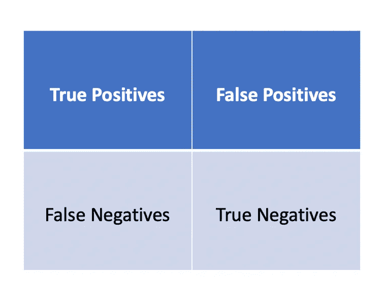**

**如何解读一个混淆矩阵？(图片由作者提供)**

**每个类别的分类报告提供了以下附加指标:**

1.  **精度-类被正确预测的次数除以模型预测该类的总次数。**
2.  **召回—正确预测类别的次数除以测试数据中带有该类别标签的样本总数。**
3.  **F1 分数——精确度和召回率的调和平均值。**

```
lstm_classifier.load_model('best_model')from sklearn.metrics import confusion_matrix, classification_report

y_pred = lstm_classifier.predict_classes(X_valid)
print(confusion_matrix(y_valid, y_pred))
print(classification_report(y_valid, y_pred, digits=4))[[4910  204]
 [ 271 4977]]
              precision    recall  f1-score   support

           0     0.9477    0.9601    0.9539      5114
           1     0.9606    0.9484    0.9545      5248

    accuracy                         0.9542     10362
   macro avg     0.9542    0.9542    0.9542     10362
weighted avg     0.9542    0.9542    0.9542     10362
```

**基于上述结果，我们可以清楚地看到，该模型在正确检测假新闻方面几乎与正确检测真实新闻一样好，并在验证数据上实现了 95.42%的**总体准确率**，这是非常令人印象深刻的。根据混淆矩阵，**只有 271 篇文章被误归类为假新闻**和**只有 204 篇文章被误归类为真新闻**。**

## **测试结果**

**虽然验证结果可以为我们提供模型在看不见的数据上的性能的一些指示，但是在模型训练过程中根本没有触及的测试集提供了模型性能的最佳客观和统计上正确的度量。下面的代码为测试集生成一个分类报告。**

```
from sklearn.metrics import accuracy_score

y_pred_test = lstm_classifier.predict_classes(X_test)
print(classification_report(y_test, y_pred_test)) precision    recall  f1-score   support

           0       0.94      0.95      0.95     11143
           1       0.95      0.94      0.95     11061

    accuracy                           0.95     22204
   macro avg       0.95      0.95      0.95     22204
weighted avg       0.95      0.95      0.95     22204
```

**基于上面的输出，该模型在测试集上实现了与其在验证集上的性能相似的性能水平。该模型以 95%的准确率对测试集中的新闻文章进行分类。与人类只能在 70%的时间里发现假新闻的研究相比，这些结果是有希望的，并证明了一个经过训练的神经网络可能比人类读者在过滤假新闻方面做得更好。**

# **结论**

*   **基于 LDA 可视化，我们可以看到真实和虚假新闻的主题和相关关键词有不同的分布。**
*   **这个项目中使用的递归卷积神经网络能够在测试数据上以 95%的准确率区分真实和虚假的新闻文章，这表明神经网络可能比人类读者更好地检测假新闻。**

**您可以在 GitHub 上查看 Jupyter 笔记本和本文的代码。**

# **来源**

1.  **动词 （verb 的缩写）佩雷斯-罗萨斯，b .克莱因伯格，a .勒费夫尔，r .米哈尔恰，[假新闻自动检测](https://arxiv.org/abs/1708.07104) **，** (2018)，arXiv.org**
2.  **A.Bharadwaj，B. Ashar，P. Barbhaya，R. Bhatia，Z. Shaikh，[利用机器学习进行基于来源的假新闻分类](http://www.ijirset.com/upload/2020/june/115_4_Source.PDF)，(2020)，《国际科学、工程和技术创新研究杂志》**