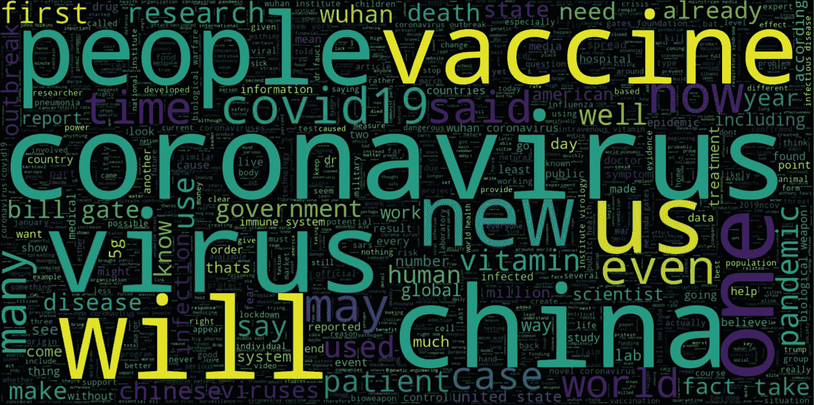
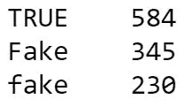
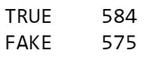
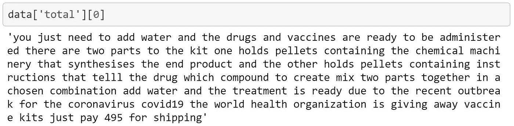
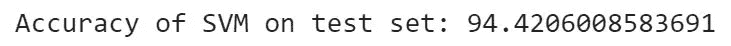

# 假新闻分类器，以解决新冠肺炎造谣-我

> 原文：<https://towardsdatascience.com/fake-news-classifier-to-tackle-covid-19-disinformation-7a31e4296b83?source=collection_archive---------44----------------------->

## 努力解决当今世界面临的最紧迫的问题之一，假新闻

(图片由作者提供)

# **简介**

冠状病毒(新冠肺炎)是一种导致持续疫情的传染病。中国武汉首次发现该病，2019 年 12 月发现首例。截至 2020 年 8 月 21 日，180 个国家和地区报告了超过 2200 万例病例。这个疫情的庞大规模给当代人带来了无数的问题。我遇到的一个严重问题是虚假新闻文章的传播，在当今世界，虚假新闻文章会引起恐慌和大规模歇斯底里。我意识到这个问题的严重性，并决定将我的下一个机器学习项目建立在解决这个问题的基础上。

# 问题陈述

*开发一个假新闻分类器，将一篇关于新冠肺炎的新闻文章恰当地分类为真新闻或假新闻。*

# **工作流程**

在开始这个项目之前，我必须搜索包含与新冠肺炎相关的新闻文章列表的数据集。这是一个挑战，因为没有很多记录新冠肺炎新闻文章的数据集。在网上搜索了几天后，我终于找到了一个数据集，里面有与新冠肺炎相关的新闻文章。现在需要的唯一任务是清理数据，在其上拟合合适的机器学习模型，并评估模型的性能。

## 数据探索和数据工程

步骤 1:检查缺失值。

我通过研究数据和寻找其中缺失的值来开始这个项目。数据集中的每一列都有一些缺失值，但最重要的是,“标签”列有 5 个缺失值。幸运的是，我下载数据集的来源有丢失标签的值，这帮助我从“标签”列中消除了丢失的值。至于其他列，即“标题”、“源”和“文本”，缺少的值被替换为空字符串。

步骤 2:在“标签”栏中寻找不一致的地方。

在处理完丢失的数据后，我想到检查目标标签来寻找可能存在的任何不一致之处。在探索了“标签”一栏后，我发现了两个不同的*假*标签，同样的可以在下图中看到。发现这个异常后，我决定给假新闻换个标签。最终的标签可以在下面给出的第二张图片中看到。

标签在前面(左)和后面(右)。(图片由作者提供)

步骤 3:合并标题和文本列。

一旦最终确定了目标标签，我就将注意力转向了我将用于分类项目的数据。我决定使用“标题”和“文本”列，因为它们拥有与新冠肺炎最相关的信息。因此，我将这两列合并为一列，并将其命名为“Total”。

第 4 步:删除数据中的标点符号，并将其转换为小写。

*“从第 4 步开始，我执行的所有操作都将出现在* ***总计*** *列中。”*

将我们收集的原始数据直接发送给机器学习算法是不可取的。在此之前，我们需要实施一些预处理步骤，以使数据对于机器学习算法来说是可解释的。因此，我首先使用 Regex 删除数据中的标点符号，然后将数据转换成小写。在对数据进行预处理后，可以在下图中看到“总计”列的第一行。

(图片由作者提供)

步骤 5:将数据分为训练数据和测试数据。

当我清理完数据后，我决定将数据分成一个训练集和一个测试集。我决定将“标签”列分配给一个新变量 *y* ，并从我的数据框中删除标签列。接下来，我使用 train_test_split 函数来拆分数据。我将 80%的数据分配给训练集，20%分配给测试集。

第六步:在 X_train 和 X_test 上实现 Tf-Idf。

我们目前在 X_train 和 X_test 中拥有的数据仍然需要转换成机器学习算法可以解释的格式，因为这些算法不能很好地处理文本数据。因此，我们需要将它转换成一种形式，使算法能够从数据中辨别模式和有意义的见解。为了实现这一点，我实现了 Tf-Idf。

Tf-Idf，又称词频-逆文档频率。它为我们提供了一种将文档中的每个单词与一个数字相关联的方法，该数字表示每个单词在该文档中的相关程度。使用 Tf-Idf，不是通过术语的原始频率(出现次数)或相对频率(术语计数除以文档长度)来表示文档中的术语，而是通过将术语频率除以包含该单词的语料库中的文档数量来对每个术语进行加权。这种加权方案的总体效果是避免了进行文本分析时的一个常见问题:文档中最频繁使用的单词通常是所有文档中最频繁使用的单词。相反，具有最高 Tf-Idf 分数的术语是当该文档与其他文档相比较时，在该文档中明显频繁出现的术语。

我使用 sklearn 库中的 TfidfVectorizer 将我的文本转换成一个稀疏矩阵。这个矩阵表示我的训练和测试数据中出现的所有单词的 Tf-Idf 值。现在，训练和测试数据由变量 tfidf_train 和 tfidf_test 表示。

因为我现在已经准备好了实现机器学习算法的数据，所以我移动到下一步，这包括在训练数据上拟合我的机器学习算法。

## 对训练数据拟合机器学习模型并评估模型性能。

步骤 1:选择分类算法，并根据训练数据拟合模型。

我选择支持向量机(SVM)作为我项目的分类算法。此外，我使用线性核来训练我的模型。我选择线性核的 SVM 的原因是，当有很多特性时，线性核工作得很好。此外，大多数文本分类任务是线性可分的。此外，将数据映射到高维空间并不一定会提高模型性能。最后，用线性核训练 SVM 比用其他核要快。因此，我决定与 SVM 合作我的项目。

我从 sklearn 库中导入了 SVM 分类器，并在我的训练数据(即 tfidf_train)上拟合模型。训练部分一完成，我就进入下一步，即评估模型性能。

步骤 2:使用测试数据评估模型性能。

训练部分完成后，我使用测试数据(即 tfidf_test)来预测测试集中出现的新闻文章的标签。我计算出模型的准确率为 94.4%。

(图片由作者提供)

# **结论**

以下关于新冠肺炎的机器学习项目对我来说是一次激动人心的经历。我了解了自然语言处理领域，并且能够理解在我们可以对文本数据实施机器学习算法之前需要的各种数据预处理步骤。我学到了两个新的主要概念，术语频率-逆文档频率和支持向量机。

下一步是将这个项目转换成一个完全响应的 web 应用程序。我的目标是开发前端使用 HTML 和 CSS，而训练有素的 SVM 分类器将作为后端。最后，为了确保前端和后端之间的无缝交互，我将使用 Flask 框架。在 Heroku 云平台上部署 SVM 分类器所需的所有步骤的详细介绍可以在本博客的[第二部分](https://shaunakvarudandi.medium.com/fake-news-classifier-to-tackle-covid-19-disinformation-ii-116ed2eb44e4)中找到。一定要看看那个。

我为这个项目遵循的工作流程可以在我的[***Github***](https://github.com/shaunak09vb/Fake-News-Detection-for-Covid19/blob/master/Covid_19_FakeNewsClassifier.ipynb)*页面找到。我希望你喜欢看我的博客。*