# 基于深度学习方法的假新闻检测器(上)

> 原文：<https://towardsdatascience.com/fake-news-detector-with-deep-learning-approach-part-i-eda-757f5c052?source=collection_archive---------30----------------------->

## 文本数据的探索性数据分析

在这一系列文章中，我将展示我们如何使用深度学习算法来检测假新闻，并比较一些神经网络架构。

这是这个系列的第一部分，在这里我想对文本进行探索性的数据分析。

unsplash.com

假新闻的话题和新闻业本身一样古老——错误信息、恶作剧、宣传和讽刺早就存在了。所以假新闻是无法核实、没有来源、可能不真实的信息。

维基还说:“假新闻的撰写和发布通常是为了误导，以损害某个机构、实体或个人，和/或在经济上或政治上获利，通常使用[耸人听闻的](https://en.wikipedia.org/wiki/Sensationalist)，不诚实的，或完全捏造的[标题](https://en.wikipedia.org/wiki/Headline)来增加读者群。同样， [clickbait](https://en.wikipedia.org/wiki/Clickbait) 故事和头条也从这项活动中获得广告收入。”

假新闻破坏了严肃的媒体报道，使记者更难报道重大新闻。BuzzFeed 的一项分析发现，关于 2016 年美国总统大选的 20 大假新闻报道在脸书的关注度超过了 19 家主要媒体的 20 大选举报道。缺乏知名出版商的匿名托管假新闻网站也受到了批评，因为它们很难以诽谤罪起诉假新闻来源。

在 21 世纪，假新闻的影响变得广泛！随着时间的推移，互联网已经发展到难以想象的高度，大量的信息不断涌入，这使得互联网成为大量不需要的、不真实的和误导性的信息的宿主，这些信息可以由任何人制作。假新闻已经从通过电子邮件发送发展到攻击社交媒体。除了指旨在欺骗读者点击链接、最大化流量和利润的编造故事外，该术语还指讽刺新闻，其目的不是误导，而是告知观众并分享关于真实新闻和主流媒体的幽默评论。所以问题很大。让我们尝试用深度学习的方法来检测假新闻。

对于我的训练数据集，我想采用 [Kaggle](https://www.kaggle.com/c/fake-news/overview) 竞赛开放数据集。我们来为它做一个简单的探索性数据分析。

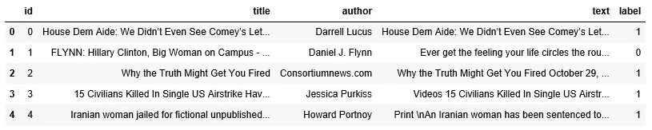

列车数据的报头

我们有以下几列:

*   id:新闻文章的唯一 id
*   标题:新闻文章的标题
*   作者:新闻文章的作者
*   正文:文章的正文；可能不完整
*   标签:将文章标记为潜在不可靠的标签
    1:不可靠
    0:可靠

在我的 EDA 中，我想分析**标题**、**文本**和**标签**列**。**

第一步，我想知道我的班级分布。

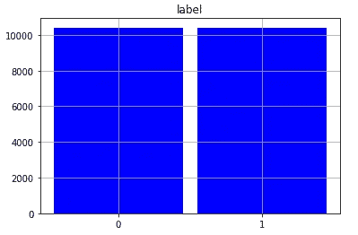

阶级平衡

正如我们看到的，数据集中的类是平衡的。

接下来就是分析**标题**和**正文**栏目中的一组假新闻和非假新闻。文本统计可视化是简单但非常有洞察力的技术。

首先，我将通过标签查看每个标题和 new 文本中的字符数。这可以让我们大致了解新闻标题的长度。

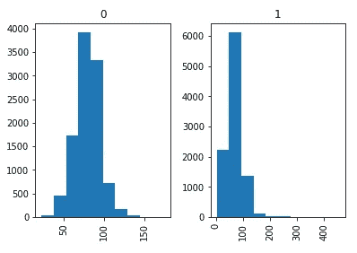

每个标题中出现的字符数

我对新的文本做了同样的分析。

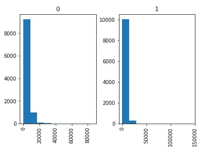

每个新文本中出现的字符数

主要见解是，新闻标题和未经预处理的文本在假新闻中比在非假新闻中更短。

现在，我将转到单词级别的数据探索。让我们根据标签来画出每篇新闻标题和正文中出现的字数。

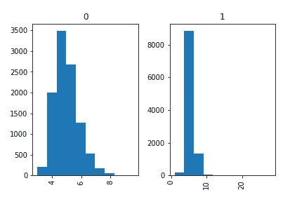

每篇新闻标题中出现的字数

我对新的文本做了同样的分析。

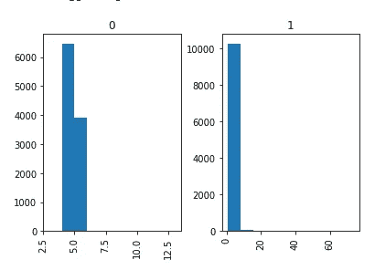

出现在每个新闻文本中的字数

主要见解是，新闻标题和未经预处理的文本在假新闻中比在非假新闻中更短。

# 无停用词的词频

下一步是没有停用词的分析。停用词是任何语言中最常用的词，如“the”、“a”、“an”等。由于这些单词的长度可能很小，这些单词可能会导致上图向左倾斜。要获得包含停用词的语料库，可以使用 nltk 库。Nltk 包含许多语言的停用词。因为我们只处理英语新闻，所以我将从语料库中过滤掉英语停用词。

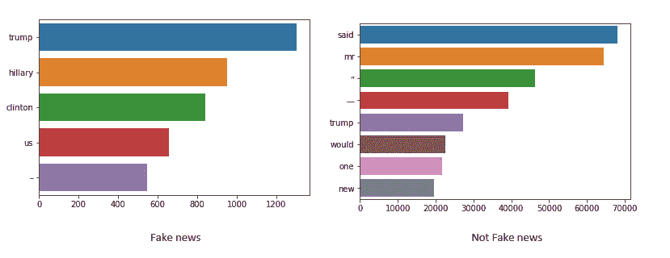

标题语料库分析

我对新的文本做了同样的分析。

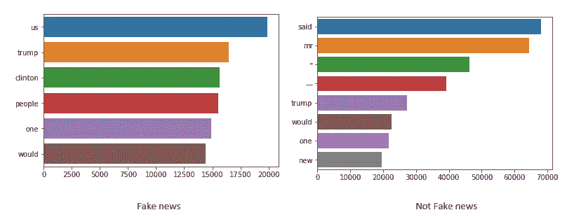

新闻文本语料库分析

假新闻和非假新闻的标题和正文语料不同，词序也不同。

# Ngram 分析

下一步是 Ngram 分析。n 元语法就是 n 个单词的连续序列。例如《河岸》、《三个火枪手》等。如果字数为二，则称之为 bigram。对于 3 个单词，它被称为三元模型等等。

查看最常见的 n 元语法可以让你更好地理解这个单词的上下文。为了构建我们的词汇表，我们将使用 Countvectorizer。Countvectorizer 是一种简单的方法，用于以适当的形式标记、矢量化和表示语料库。

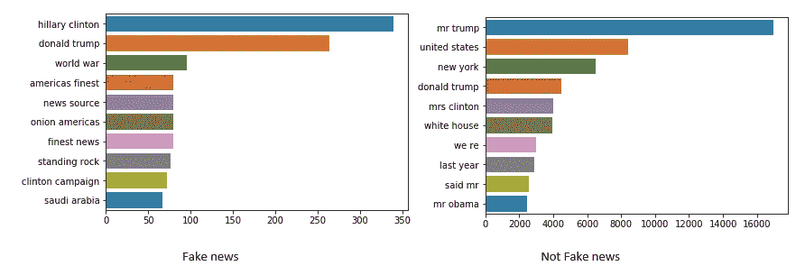

新闻标题 Ngram 分析

我对新的文本做了同样的分析。

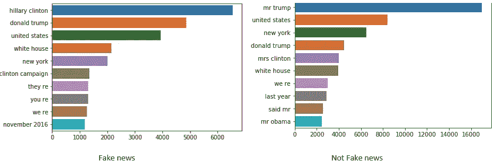

New 的文本 Ngram 分析

在这里我们可以看到，假新闻中的文字和标题是不同的，但不是假新闻是相同的。

# 皱胃向左移

我们来做个话题建模，对比一下假新闻和不假新闻。主题建模是使用无监督学习技术提取文档集合中出现的主要主题的过程。

潜在狄利克雷分配(LDA)是一种易于使用且高效的主题建模模型。每个文档由主题的分布来表示，每个主题由词的分布来表示。

一旦我们按主题对文档进行分类，我们就可以对每个主题或主题组进行进一步的数据探索。

第一个分析是 LDA 对于假新闻标题和非假新闻标题的分析。让我们来看看主题:

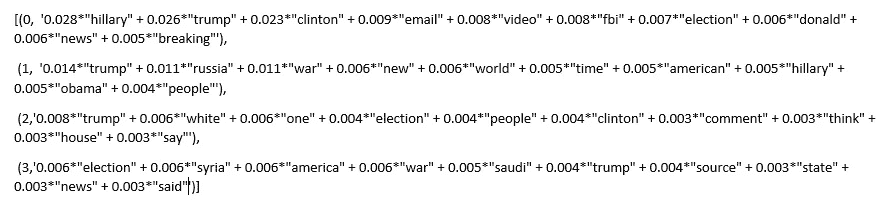

假新闻标题的 LDA

我们也可以用 python 中的库 pyLDAvis 来分析:

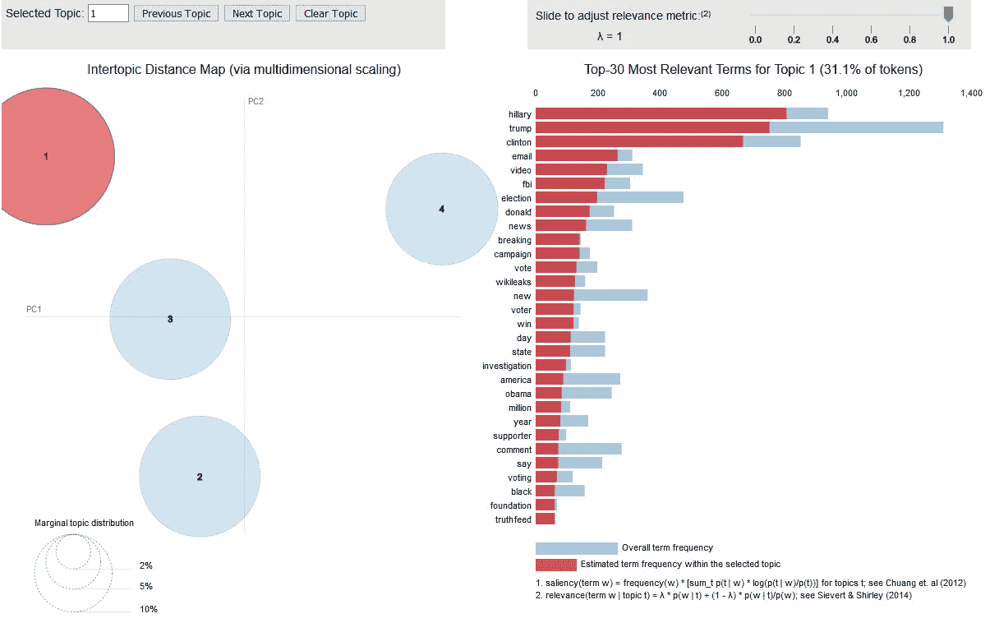

用于假新闻标题可视化的 LDA(主题-1)

让我们为假新闻标题做同样的事情。

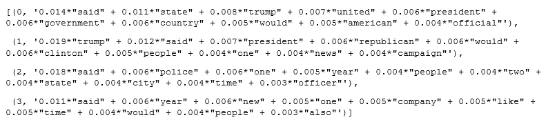

LDA 为不假冒新闻的标题

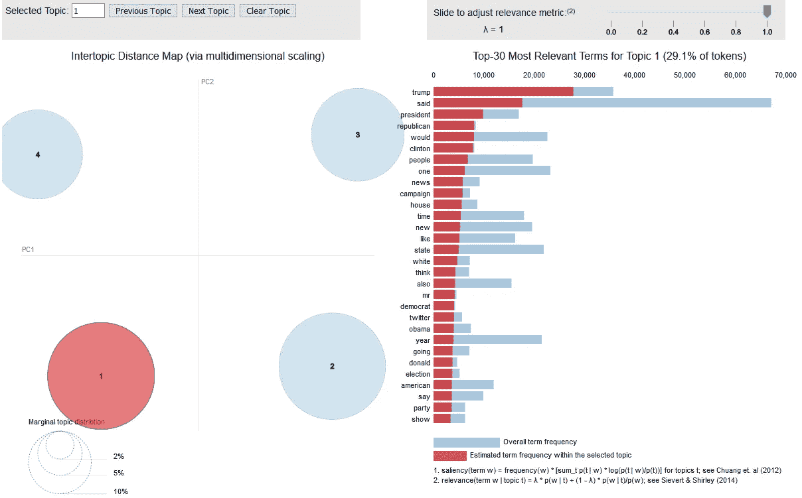

用于非伪造新闻标题可视化的 LDA(主题-1)

我们可以看到，假新闻标题和非假新闻标题的主题建模是不同的。

让我们对新的文本做同样的分析。

以下是针对假新闻的文本 EDA:

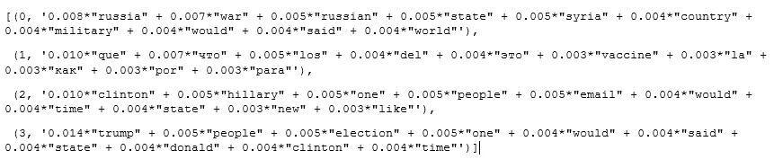

LDA 为假新闻的文本

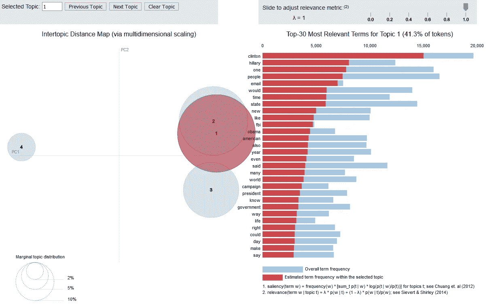

用于假新闻的文本可视化的 LDA(主题-1)

同样的分析也适用于非假新闻:

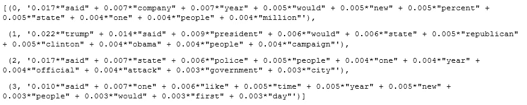

LDA for not fake new 的文本

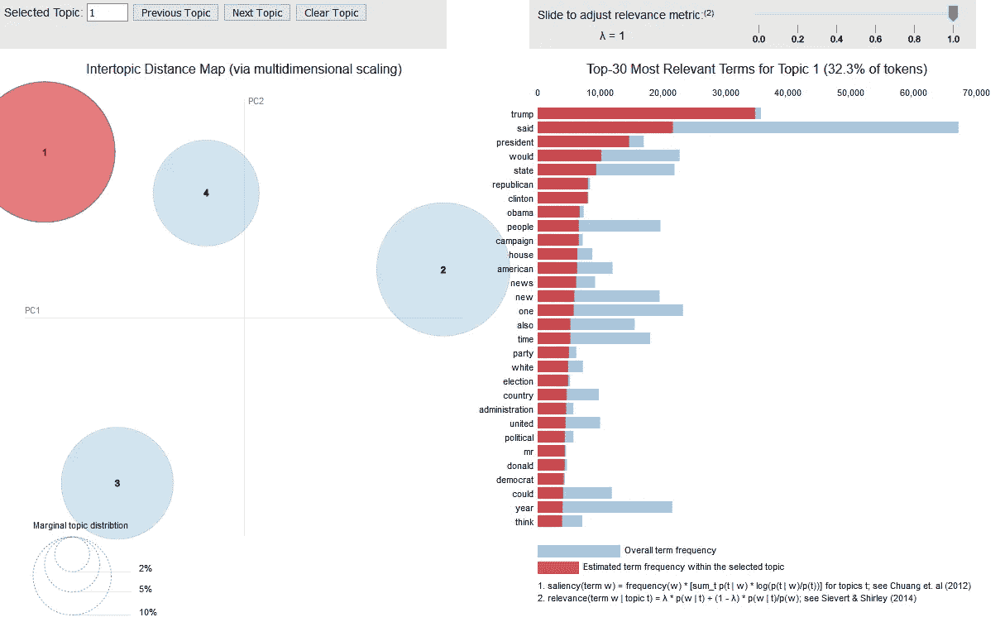

用于非伪造新闻的文本可视化的 LDA(主题-1)

研究结果显示，假新闻和非假新闻的话题是不同的，并且进一步发现假新闻的话题标题和正文是不同的。

我对文本的探索性数据分析的最后一个阶段是词云分析。Wordcloud 是一种表现文本数据的好方法。出现在单词云中的每个单词的大小和颜色表明了它的频率或重要性。用 python 创建单词云很容易，但我们需要语料库形式的数据。幸运的是，我在上一节中准备了它。

下面是 new 标题的词云分析:

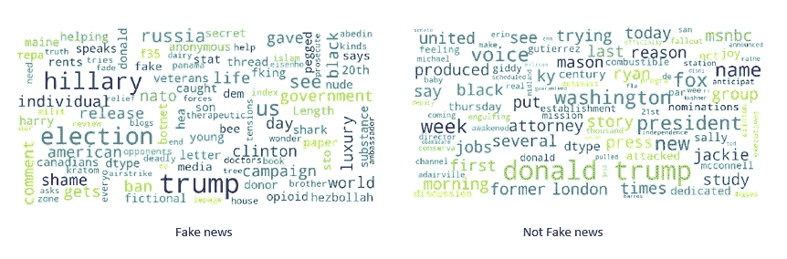

新闻文本的词云分析

以及对新闻文本进行对比词云分析:

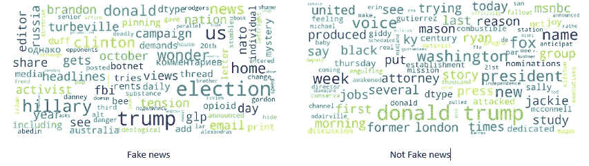

新闻文本的词云分析

在结果中，我们可以看到在新闻的标题和文字中使用的一些词有多频繁，无论是假的还是假的。

# 结论

文本探索性数据分析的结果是比较虚假新闻和非虚假新闻的不同技术。通过这种方法，我们可以创建自己的规则来检测伪造。这种方式难度相当大，需要大量的常规工作。此外，在此示例中，我们可以看到，充满关于美国选举新闻的数据集以及这些数据将难以检测假新闻中的一些一般规则和风格。

让我们给深度学习方法一个机会，让它自动完成。这些故事的下一部分再见。

第二部分你可以阅读——“[深度学习方法假新闻检测器(第二部分)建模](https://medium.com/@andriishchur/fake-news-detector-with-deep-learning-approach-part-ii-modeling-42b9f901b12b)”

第二部分您可以阅读—“[采用深度学习方法的假新闻检测器(第三部分)部署](https://medium.com/@andriishchur/fake-news-detector-with-deep-learning-approach-part-iii-deploy-292be3be7950?source=your_stories_page---------------------------)”

你能在 Git 仓库中找到的所有代码— [链接](https://github.com/AndriiShchur/Fake_news)。