# 基于深度学习方法(第二部分)建模的假新闻检测器

> 原文：<https://towardsdatascience.com/fake-news-detector-with-deep-learning-approach-part-ii-modeling-42b9f901b12b?source=collection_archive---------40----------------------->

## 创建用于假新闻检测的深度学习神经网络。

在这一系列文章中，我将展示我们如何使用深度学习算法来检测假新闻，并比较一些神经网络架构。

这是这个系列的第二部分，我想用 Keras 和 Tensorflow 创建几个深度学习模型。在本系列的[前](/fake-news-detector-with-deep-learning-approach-part-i-eda-757f5c052?source=collection_category---4------0-----------------------)部分，我对假新闻和非假新闻做了探索性的数据分析。我用不同的分析技术来比较假的和非假的新闻，让我们把这项工作交给神经网络吧。

照片由[阿丽娜·格鲁布尼亚](https://unsplash.com/@alinnnaaaa?utm_source=medium&utm_medium=referral)在 [Unsplash](https://unsplash.com?utm_source=medium&utm_medium=referral) 上拍摄

要开始建模，我们需要进行数据预处理。让我们检查列车数据框中的 NA 值:

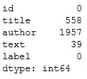

NA 数据检查

正如我们所看到的，我们的数据集中有很多 NA 值。在我的模型中，我计划只使用标题和文本列。为了解决 NA 值问题，我决定用文本替换标题中的 NA 值，反之亦然。这种方法帮助我为训练保存更多的数据。

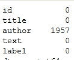

NA 替换结果

因此，我的火车专栏里没有任何 NA。

下一步是文本预处理。我想进行与我在 EDA 中相同的预处理步骤:

*   替换标点符号；
*   小写字母盘
*   按单词拆分
*   堵塞物
*   删除停用词

接下来的步骤是一个热词表示和序列创建，对于**标题**列，最大句子长度为 20，对于**文本**列，最大句子长度为 100。这一步对于创建正确形式的数据集以用于神经网络非常重要。

我的第一个模型将只用于带有二进制目标假/假的**标题**列。

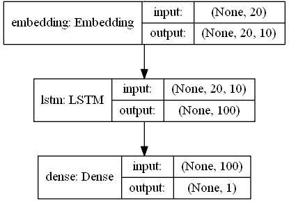

标题模型的模型拱门

第一层是嵌入。单词嵌入是对文本的学习表示，其中具有相同含义的单词具有相似的表示。单词嵌入实际上是一类技术，其中单个单词被表示为预定义向量空间中的实值向量。每个单词都被映射到一个向量，向量值以类似神经网络的方式学习，因此该技术通常被归入深度学习领域。这种方法的关键是对每个单词使用密集分布的表示法。

每个单词用一个实值向量来表示，往往是几十维或者几百维。这与稀疏单词表示所需的数千或数百万维形成对比，例如一键编码。

分布式表示是基于单词的使用来学习的。这允许以相似方式使用的单词产生相似的表示，自然地捕捉它们的意思。这与单词包模型中清晰但脆弱的表示形成对比，在单词包模型中，除非明确管理，否则不同的单词具有不同的表示，不管它们如何使用。

Keras 提供了一个嵌入层，可用于文本数据上的神经网络。

它要求输入数据是整数编码的，因此每个字都由一个唯一的整数表示。嵌入层用随机权重初始化，并将学习训练数据集中所有单词的嵌入。

第二层是 LSTM。这一层的主要概念是:

*   它使用顺序信息。
*   它有一个记忆，可以记录到目前为止已经计算过的内容。

我说过我们试图解决二进制分类问题，所以:

*   我们输入每个单词，单词在某些方面相互关联。
*   当我们看到那篇文章中的所有单词时，我们在标题/正文的末尾进行预测。
*   rnn 从最后一个输出绕过输入，能够保留信息，并能够在最后利用所有信息进行预测。

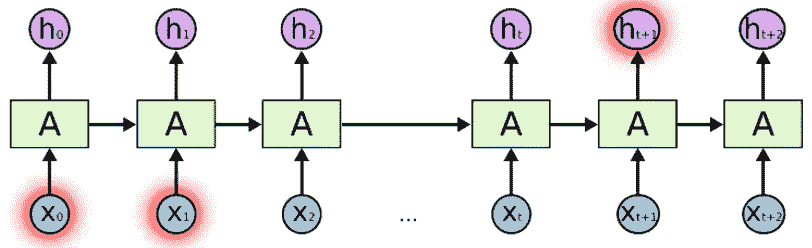

[https://colah.github.io/posts/2015-08-Understanding-LSTMs/](https://colah.github.io/posts/2015-08-Understanding-LSTMs/)

我的网络的输出是用于二进制分类的具有 1 个输出 sigmoid 激活函数的密集层。为了编译我的模型，我使用二进制交叉熵作为损失函数和准确性度量。对于优化器，我像往常一样使用 Adam。

让我们运行模型并检查结果:

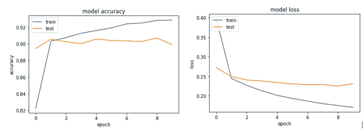

模型训练过程

正如我们所见，该模型有点过度拟合，这在ащк LSTM 架构和 LSTM 层中非常常见。为了避免这种情况，我们可以使用脱落层。我想在 Kaggle 排行榜上查看我的成绩。比赛已经结束，但我可以查看我的结果。

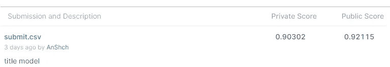

我的第一次提交

让我们创建相同的模型(仅将最大句子长度更改为 1000，并将嵌入向量特征更改为 100)，但仅针对**文本**列，并查看结果。

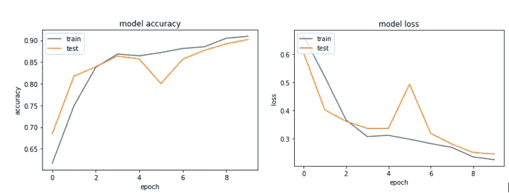

模型训练过程

这个结果还算不错，但比仅仅是**冠名的**车型还要糟糕。为了增加这些结果，我可以增加这个(文本)数据的历元数，或者稍微改变一下我的架构。

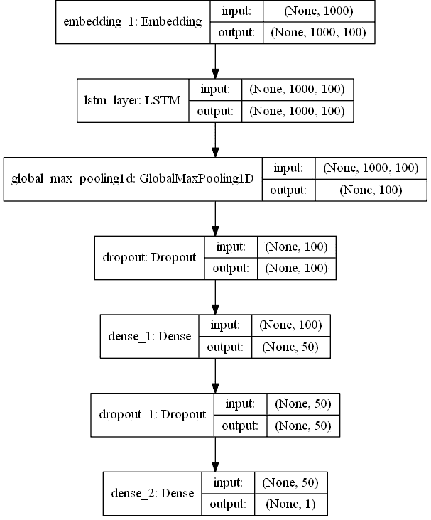

文本模型第二版的模型拱门

如您所见，我添加了 GlobalMaxPool1D 来对输入制图表达进行缩减采样，添加了密集图层来生成更多要素，添加了 Dropout 来避免模型过度拟合。

GlobalMaxPool1D 的工作原理:

*   通过获取时间维度上的最大值对输入制图表达进行缩减采样。
*   全局最大池=池大小等于输入大小的普通最大池层(精确地说，减去过滤器大小+ 1)。
*   全局池层可用于多种情况。首先，它可用于降低某些卷积层输出的特征图的维度，以取代分类器中的平坦层，有时甚至是致密层(Christlein 等人，2019)。此外，它还可以用于例如单词识别(Sudholt & Fink，2016)。这是由于它允许检测*噪声*，从而“大输出”(例如上面例子中的值 9)。然而，这也是全局最大池的缺点之一，和常规一样，我们接下来将讨论全局平均池。

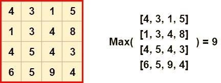

[全局池层(矩阵示例)](https://www.machinecurve.com/index.php/2020/01/30/what-are-max-pooling-average-pooling-global-max-pooling-and-global-average-pooling/)

或者换个角度来看:

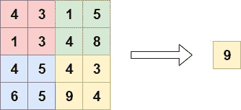

[全局池层(可视化示例)](https://www.machinecurve.com/index.php/2020/01/30/what-are-max-pooling-average-pooling-global-max-pooling-and-global-average-pooling/)

让我们开始训练:

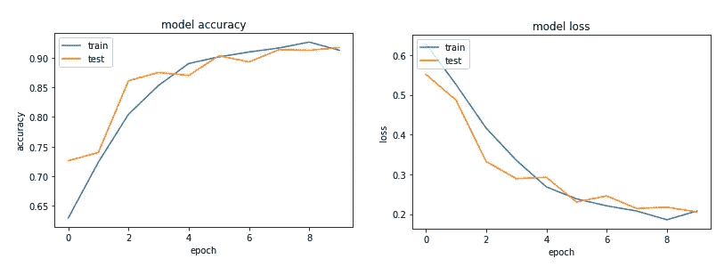

模型训练过程

该模型比前一个版本执行得更好，但对我来说，我们需要更多的纪元才能获得更好的结果。让我们在 Kaggle 上检查一下这个模型:

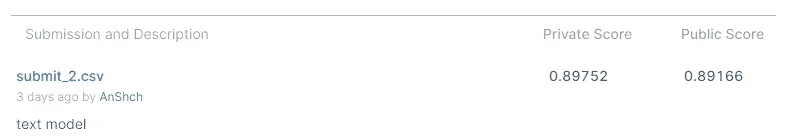

我的第二次提交

我可以将精度提高到与以前的模型相同的水平，但让我们想象一下，我们需要一个好的模型，它将在 10 个时期内给出好的结果。所以我创造了第四个模型:

多输入模型 arch

在这里，您可以看到，我创建了一个多输入模型，将两个以前的架构合并为一个。我使用的函数式 API 是一种创建模型的方法，比 tf.keras.Sequential API 更灵活。功能 API 可以处理具有非线性拓扑的模型、具有共享层的模型以及具有多个输入或输出的模型。使用这种架构，我可以从以前的两种架构中为两个独立的功能获得最好的东西，并将其合并到一个模型中。

好吧，让我们来看看训练结果:

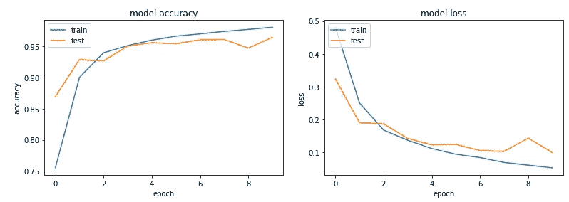

模型训练过程

是之前所有车型的最好成绩。让我们在 Kaggle 上检查一下。

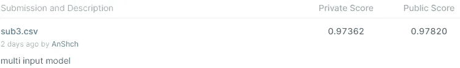

我的第三次提交

所以，结果看起来很棒。这将是这场激烈竞争中的第三名。

# 结论

作为这个分析的结果，我们可以看到不同的数据量(标题/正文)，不同的神经网络架构带来不同的结果。有时，最好将两个模型合并为一个，而不是试图调整其中一个。

在这些故事的第三部分，我将尝试部署这个模型，并为假新闻检测建立实时管道。

您可以阅读的第一部分—“[采用深度学习方法的假新闻检测器(第一部分)EDA](https://medium.com/@andriishchur/fake-news-detector-with-deep-learning-approach-part-i-eda-757f5c052) ”

你能在 Git 仓库中找到的所有代码— [链接](https://github.com/AndriiShchur/Fake_news)。

附言

所有建模都通过 Azure Data Science 虚拟机进行了训练和评分:

*   NC12 型(2 个 NVIDIA K80)