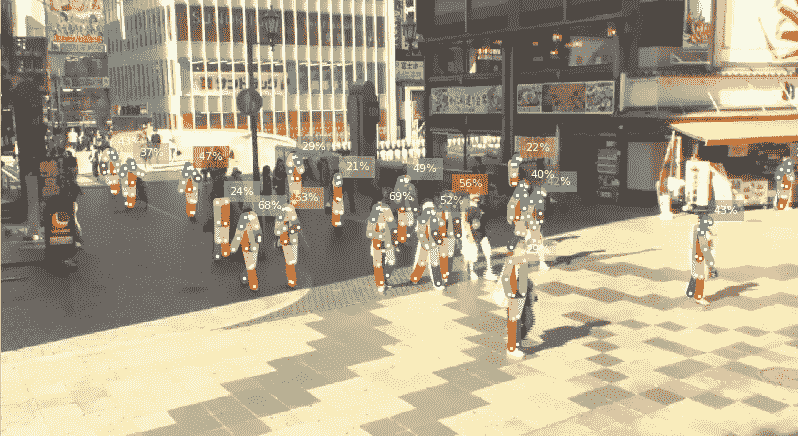
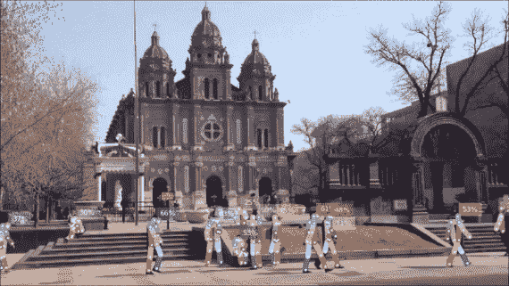
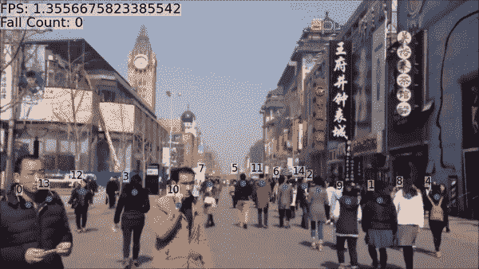
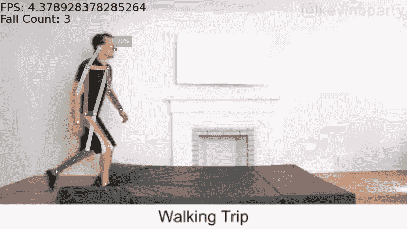
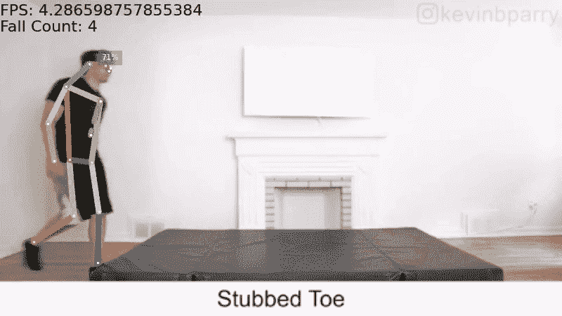
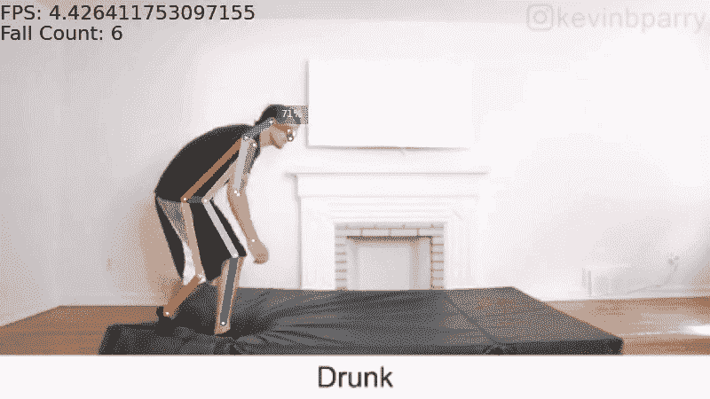
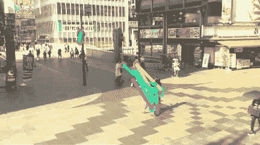
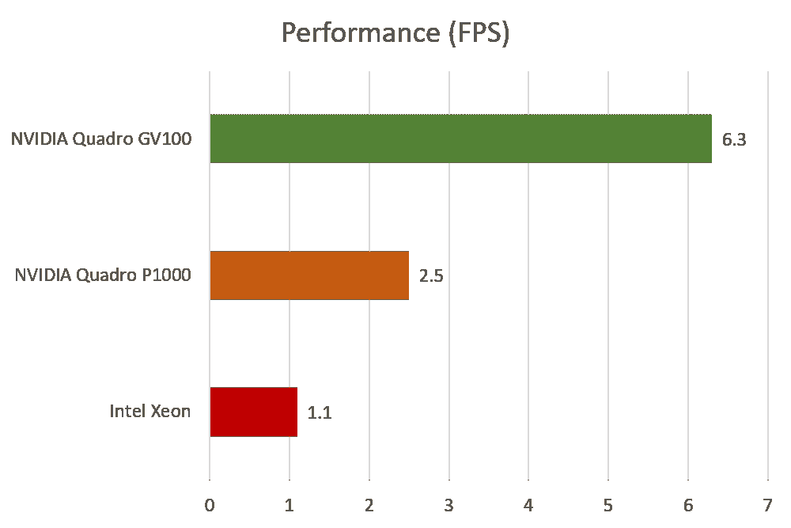

# 使用姿态估计的跌倒检测

> 原文：<https://towardsdatascience.com/fall-detection-using-pose-estimation-a8f7fd77081d?source=collection_archive---------6----------------------->

## 开发人工智能来检测跌倒

Pose estimation detection (Screen capture from [大阪 道頓堀 ライブカメラ osaka Dotonbori LiveCamera by ラジカルビデオジョッキー RVJJP](https://www.youtube.com/watch?v=UVfsgWb0_YU))

F all detection 已经成为动作识别研究中的重要敲门砖——也就是训练一个 AI 对行走、坐下等一般动作进行分类。对于人工智能来说，人类解释为一个人脸朝下摔倒的明显动作只是一系列混杂的像素。为了使人工智能能够理解它收到的输入，我们需要教会它检测某些模式和形状，并制定自己的规则。

为了建立一个人工智能来检测跌倒，我决定不去经历积累大型数据集和专门为此目的训练模型的折磨。相反，我使用姿态估计作为构建模块。

# 姿态估计

姿态估计是图像和视频帧中人体关节(通常称为关键点)的定位。典型地，每个人将由许多关键点组成。将在关键点对之间绘制线条，有效地映射出该人的粗略形状。有多种基于输入和检测方法的姿态估计方法。想要更深入的姿势估计指南，[一定要看看 Sudharshan Chandra Babu](https://nanonets.com/blog/human-pose-estimation-2d-guide/) 的这篇文章。

为了让每个人都能容易地访问这个模型，我选择了 RGB 图像作为输入，并用 OpenCV 进行处理。这意味着它兼容典型的网络摄像头，视频文件，甚至 HTTP/RTSP 流。

# 预训练模型

我使用的姿态估计模型是 EPFL VITA 实验室的[OpenPifPaf](https://pypi.org/project/openpifpaf/)。检测方法是自下而上的，这意味着人工智能首先分析整个图像，并找出它看到的所有关键点。然后，它将关键点组合在一起，以确定图像中的人。这不同于自上而下的方法，在自下而上的方法中，人工智能使用基本的人物检测器来识别感兴趣的区域，然后放大以识别单个关键点。要了解 OpenPifPaf 是如何开发的，请[查看他们的 CVPR 2019 论文](http://openaccess.thecvf.com/content_CVPR_2019/html/Kreiss_PifPaf_Composite_Fields_for_Human_Pose_Estimation_CVPR_2019_paper.html)，或者[阅读他们的源代码](https://github.com/vita-epfl/openpifpaf)。

# 多流输入

大多数开源模型在任何时候都只能处理单个输入。为了在未来使其更加通用和可伸缩，我利用 Python 中的[多重处理库，使用子进程同时处理多个流。这使我们能够充分利用具有这种能力的机器上的多个处理器。](https://docs.python.org/2/library/multiprocessing.html)

姿态估计模型能够在两个流上同时运行(上、下:来自[中国 I 北京 I 街道场景的视频由 gracetheglobe](https://www.youtube.com/watch?v=v0rY4x87xfs)

# 人员跟踪

在有多人的视频帧中，可能很难找出摔倒的人。这是因为算法需要在连续的帧之间关联同一个人。但是，如果他/她不停地移动，它怎么知道它是否在看着同一个人呢？

解决方案是实现一个多人跟踪器。不必花里胡哨；一个简单的通用对象跟踪器就足够了。跟踪是如何完成的非常简单，可以概括为以下步骤:

1.  计算质心(作为颈部点)
2.  为每个质心分配唯一的 ID
3.  计算下一帧的新质心
4.  计算当前帧和前一帧的质心之间的欧几里德距离，并根据最小距离将它们关联起来
5.  如果找到相关性，用旧质心的 id 更新新质心
6.  如果没有找到相关性，给新的质心一个唯一的 id(新人进入帧)
7.  如果这个人在设定的帧数内离开了该帧，则移除质心和 id

简单的人物跟踪(视频来自[中国 I 北京 I 街景由 gracetheglobe](https://www.youtube.com/watch?v=v0rY4x87xfs) 提供)

如果你想要一步一步的用实际代码进行物体跟踪的教程，看看 Adrian Rosebrock 的这篇文章。

# 跌倒检测算法

最初概念化的跌倒检测算法相对简单。我首先选择颈部作为稳定的参考点(与摆动的手臂和腿进行比较)。接下来，我根据定义整个人的边界框来计算这个人的感知高度。然后，我以帧为间隔计算颈部点之间的垂直距离。如果垂直距离超过人的感知高度的一半，该算法将发出跌倒的信号。

然而，在看过多个 YouTube 视频后，我意识到摔倒有不同的方式和方向。当视野处于某一角度时，一些跌倒没有被检测到，因为受害者似乎没有剧烈的运动变化。我的模型也不够健壮，当人们弯腰系鞋带或径直跑下视频帧时，它会不断抛出假阳性。

我决定实现更多功能来完善我的算法:

*   我没有分析一维运动(y 轴)，而是分析了二维运动(x 轴和 y 轴),以涵盖不同的摄像机角度。
*   增加了一个边界框来检查这个人的宽度是否大于他的高度。这假设人在地面上并且不是直立的。我能够通过使用这种方法消除快速移动的人或骑自行车的人的假阳性。
*   增加了两点检查，如果人的颈部和脚踝点都可以检测到，则只需注意跌倒。这防止了在由于遮挡而不能完全识别人的情况下对人的高度的不准确计算。

改进跌倒检测算法的结果(上、中、下:凯文·帕里的 [50 种跌倒方式视频)](https://www.youtube.com/watch?v=8Rhimam6FgQ)

# 试验结果

在撰写本文时，缺乏广泛的跌倒检测数据集。我选择了 [UR 跌倒检测数据集](http://fenix.univ.rzeszow.pl/~mkepski/ds/uf.html)来测试我的模型，因为它包含了不同的跌倒场景。在总共 30 个视频中，该模型正确地识别了 25 个跌倒，并在对象从帧中掉出时错过了另外 5 个。这给了我 83.33% 的精度和 90.91% 的 F1 分数。

这些结果可以被认为是一个良好的开端，但由于样本量小，还远未得出结论。没有其他类似摔倒的动作，比如系鞋带，这也意味着我不能对我的模型进行压力测试，以防出现假阳性。

测试在两个 NVIDIA Quadro GV100s 上执行，平均达到 6 FPS，这对于实时处理来说勉强足够。多层的结果是计算非常密集。声称运行速度超过 15 FPS 的模型通常是不准确的，或者由庞大的 GPU 支持。

[Modified OpenPose model](https://github.com/PINTO0309/MobileNetV2-PoseEstimation) with MobileNetV2 as the backbone network (Video from [大阪 道頓堀 ライブカメラ osaka Dotonbori LiveCamera by ラジカルビデオジョッキー RVJJP](https://www.youtube.com/watch?v=UVfsgWb0_YU)). This processed at an average of 11 FPS on an Intel Xeon CPU, but is highly inaccurate.

三种处理器的性能比较。作者图表。

# 应用程序

跌倒检测可以应用在许多场景中以提供帮助。一个不完整的列表包括:

*   喝醉的人
*   老年人
*   操场上的孩子们
*   患有心脏病或中风等疾病的人
*   不小心绊倒的人

对于更严重的情况，对跌倒的迅速反应可能意味着生与死的差别。

# 未来的发展

跌倒检测的精度很大程度上取决于姿态估计的精度。典型的姿态估计模型在具有对象的正面全景的清晰图像上进行训练。然而，跌倒会导致对象以怪异的姿势扭曲，并且大多数姿势估计模型不能够在这种情况下准确地定义骨架。此外，这些模型不够稳健，不足以克服遮挡或图像噪声。

为了获得人类水平的检测精度，当前的姿态估计模型将需要在更多种类的姿态上被重新训练，并且包括具有遮挡的较低分辨率图像。

当前的硬件限制也阻碍了姿态估计模型在高帧速率的视频上平滑运行的能力。这些模型能够在任何配备基本 GPU 的笔记本电脑上轻松运行，甚至只配备 CPU，还需要一段时间。

除了姿势估计，专门针对跌倒训练的深度学习模型可能表现得一样好，甚至更好。必须仔细训练该模型，以将跌倒与其他类似跌倒的动作区分开来。当然，这必须结合广泛的、公开的秋季数据集来训练模型。当然，这种模型在范围上是有限的，因为它只能识别一个特定的动作，而不能识别各种动作。

另一种可能的方法也是基于知识的系统，它正在开发一种模型，以便能够像人类一样学习。这可以通过基于规则的系统或基于案例的系统来实现，在基于规则的系统中，它根据某些规则做出决定，在基于案例的系统中，它应用过去案例中的相似性来对新案例做出明智的判断。

# 结论

要解决更困难的一般动作识别问题——它包含大量的动作——我们必须首先理解和掌握检测单个动作的复杂性。如果我们能够像你我一样开发出一个可以轻松识别跌倒的模型，我们将能够提取出某些模式，使该模型能够轻松地检测其他类型的行为。

通向动作识别的道路无疑仍然是一条充满挑战的道路；但就像其他尖端模型一样，如 [OpenAI 的 GPT-3](https://www.technologyreview.com/2020/07/20/1005454/openai-machine-learning-language-generator-gpt-3-nlp/) ，我们将能够发现以前闻所未闻的新技术。

如果你想分享任何想法或观点，请在下面留下评论，或者[在 LinkedIn](https://www.linkedin.com/in/weilooncheng/) 上给我留言。

如果你想看看我是如何开发完整模型的，[请查看我的 GitHub 库，获取源代码](https://github.com/cwlroda/falldetection_openpifpaf)。