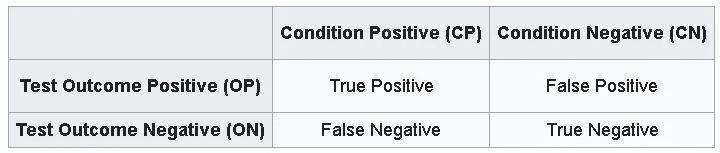
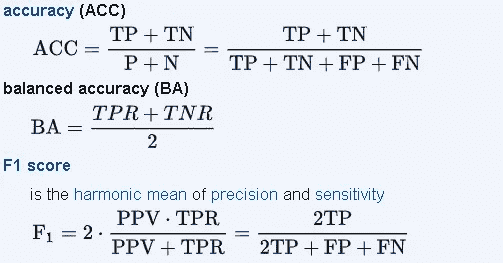
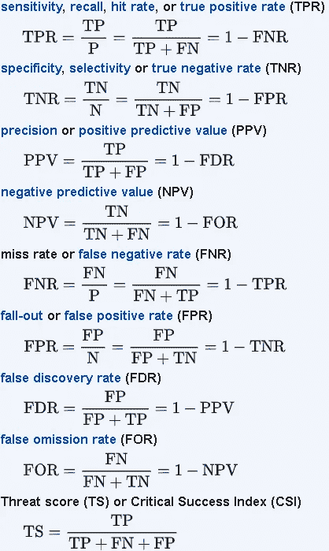
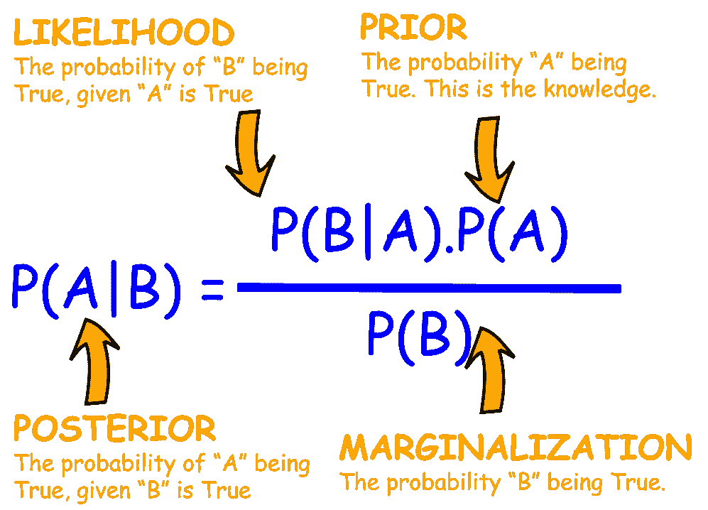
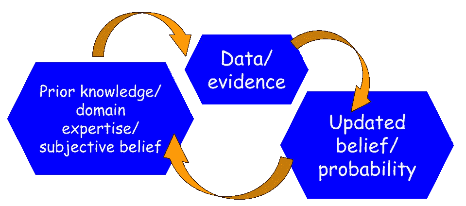
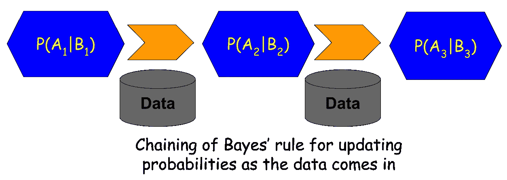

# 新冠肺炎检验的假阳性/假阴性和贝叶斯规则

> 原文：<https://towardsdatascience.com/false-positives-negatives-and-bayes-rule-for-covid-19-testing-750eaba84acd?source=collection_archive---------1----------------------->

## 为什么假阳性和假阴性都不利于新冠肺炎测试。为什么贝叶斯规则对这些情况很重要。

图片来源:[**pix abay**](https://pixabay.com/photos/corona-world-mask-virus-disease-4912807/)

***编者按:*** [*走向数据科学*](http://towardsdatascience.com/) *是一份以数据科学和机器学习研究为主的中型刊物。我们不是健康专家或流行病学家，本文的观点不应被解释为专业建议。想了解更多关于疫情冠状病毒的信息，可以点击* [*这里*](https://www.who.int/emergencies/diseases/novel-coronavirus-2019/situation-reports) *。*

***作者注*** : *我是一名半导体工艺师，有兴趣将数据科学和机器学习应用于与我领域相关的各种问题。我没有医学、分子生物学、流行病学或任何与新冠肺炎相关的专业知识。请不要给我发这种问题的邮件。*

# 什么是假阳性/假阴性？

一种疾病筛查医学测试，就像用来检测你是否感染了可怕的新冠肺炎病毒的测试，本质上给你一个是/否的答案。但是，这里有一些问题需要思考。

*   你会毫不含糊地相信答案吗？
*   正面结果的错误答案**概率**是否高于负面结果？
*   一个错误的对一个错误答案的**代价是什么？回答“是”和回答“否”的成本相同吗？**
*   做多重测试是否更好，以增加获得正确诊断的概率？“是”和“否”的答案哪个更有意义？

**其实没有一个测试是百分百准确的**。你可能已经在新闻上看到，在为新冠肺炎快速开发和部署的测试中，有各种各样的准确性。但是，事实证明，当涉及到医学测试时，即使是“准确性”这个术语也意味着一个非常具体的东西。

这里有一篇最近的文章是关于备受吹捧的 Abbot 快速新冠肺炎测试的。

 [## 该公司表示，雅培的快速测试在某些情况下会产生假阴性

### 一种在美国广泛使用并由联邦政府分发的快速冠状病毒测试的制造商…

www.cnn.com](https://www.cnn.com/2020/04/21/health/abbott-laboratories-coronavirus-rapid-test/index.html) 

如果你想一想，对于一个特定的人，对于一个特定的测试结果，有四种不同的场景。

*   你可能真的被感染了，检测说‘是’。这叫做**真阳性(TP)** 。
*   你可能没有被感染，但测试结果仍然是肯定的。这叫做**【假阳性】(FP)** 。
*   你可能没有被感染，测试结果是‘没有’。这叫做**【真负(TN)】**。
*   你可能真的被感染了，但检测结果显示没有。这被称为**假阴性(FN)** 。

现在，从个人的角度来看，我会对测试的表现感到满意，如果它能为我检测出“正确的条件”。这意味着，如果它有高 TP 和高 TN，它为我做了工作，*个人*。不仅仅是*关于检测出阳性新冠肺炎患者并给出“是”的结论，而且*和*关于正确地对新冠肺炎阴性患者说“不”。*

> …事实证明，在医学测试中，即使是简单的术语“准确性”也意味着非常具体的东西。

确切的术语可能稍有不同，但是，在几乎所有的情况下,“准确性”测量将表示测试相对于总磷和总氮的总和在总测试中所占的百分比。

但是高准确度并不是判断测试的唯一标准。同样重要的是其他指标，如 FP 和 FN 值。

为什么？

因为在上述四种情况中，只有一种会导致*不动作且没有后果*，即 TN 情况。在这种情况下，你在接受测试后，将会回家，不会对医疗系统造成负担，也不会有任何长期的健康影响。

所有其他三种情况都有不同程度的相关成本(社会、医疗、经济，无论你怎么称呼它们)。州或国家的总成本可能很大程度上取决于测试在这些指标上的表现。

> 不仅仅是*关于检测出一名新冠肺炎阳性患者并给出“是”的结论，而且*也是*关于正确地对一名新冠肺炎阴性患者说“不”。*

# *成本不同，但都很重要*

**

*图片来源: [**Pixabay**](https://pixabay.com/photos/medic-hospital-laboratory-medical-563423/)*

## *真阴性情况(TN)*

*让我们先来看看最便宜的一个——TN 的例子。如上所述，在这种情况下，你将在接受测试后回家，而不会给医疗系统带来任何长期健康影响。唯一的代价是你在等待考试进行和结果出来时的情绪波动。*

## *真阳性情况(TP)*

*这是个人害怕的场景(但不是最糟糕的！).你被检测为新冠肺炎阳性患者，现在苦难开始了。根据你的具体健康状况和症状的严重程度，你可能会被建议自我隔离或去医院检查。在这两种情况下，成本当然是不同的。一个对你和你的直系亲属征税更多，而另一个对医疗系统征税更多。*

*但是，至少，你得到了一个正确的评估！还有一种更糟糕的结局，就是下一种情况。*

## *假阴性情况(FN)*

*就新冠肺炎而言，这无疑是最糟糕的情况。肺部有病原体的人将得不到治疗。根据潜在的健康状况和许多其他生理参数，结果不一定是死亡，但肯定比 TP 病例有更高的个人和社会成本。如果这种情况发生在高风险人群中的某个人身上，那么一场悲惨的(也可能是可以避免的)生命损失就会以足够高的可能性接踵而至。*

## *假阳性情况(FP)*

*对于医疗系统来说，这是最可怕的情况，实际上没有携带病毒的病人被宣布为阳性。这里的结果可能会有所不同。该人可能被临时接纳进入医疗保健系统，从而使系统超负荷，更重要的是，占用了极其有限的资源，而这些资源本可以用于真正的阳性患者。如果这个人被送回家，他/她会经历巨大的情绪波动——没有任何意义——因为他/她真的没有被感染。*

> *但是高准确度并不是判断测试的唯一标准。同样重要的是其他指标，如 FP 和 FN 值。*

## *统计学家已经做了很长时间了*

*本质上，这种是/否测试属于所谓的[二元分类](https://en.wikipedia.org/wiki/Binary_classification)系统。统计学家已经与这些系统打交道很长时间了，他们用不同的名称来称呼相同的指标——一类[和二类](https://www.statisticssolutions.com/to-err-is-human-what-are-type-i-and-ii-errors/)。*

*他们甚至为我们讨论的所有场景的表格化表示起了一个有趣的名字，叫做'**'混乱矩阵，看起来像下面这样:***

******

***图片来源:[维基百科](https://en.wikipedia.org/wiki/Binary_classification)(知识共享许可)***

***最近机器学习系统和算法的复兴，其中许多在其核心使用某种形式的二元(或多类)分类器(例如，逻辑回归、决策树、支持向量机和神经网络)，使得这种混淆矩阵流行起来。这是判断 ML 系统性能最广泛使用的指标之一。***

***这个矩阵的最大特点是，一旦生成，我们就可以从这四个数字中计算出许多有用的指标，***

******

***图片来源:[维基百科](https://en.wikipedia.org/wiki/Precision_and_recall)(知识共享许可)***

******

***图片来源:[维基百科](https://en.wikipedia.org/wiki/Precision_and_recall)(知识共享许可)***

***特定生物医学测试(或 ML 系统情况下的软件算法)的特征和变化将导致这些指标的不同数值。您可以简单地为这些指标分配不同的成本，并调整测试/算法以最小化总成本。***

***然而，就新冠肺炎的具体情况而言，我们不会冒险这样做。对这样一个改变生活的全球性疫情的成本效益分析应该留给最高级别的专家和决策者。作为数据科学从业者，您将能够知道，您在 ML 算法或统计建模中使用的相同工具也用于衡量任务关键型医疗测试和公共卫生系统的成功。***

***然而，我们将进一步讨论使用贝叶斯概率推理对测试结果进行更高级分析的这些措施的效用。***

# ***新冠肺炎检验的贝叶斯法则？***

## ***寻求第二意见的统计方法***

***贝叶斯定理(或称贝叶斯定律或贝叶斯法则)被称为概率统计中最强有力的规则。它描述了一个事件发生的概率，基于可能与该事件相关的条件的先验知识。***

******

*****贝叶斯规则公式*****

***这是一个强有力的概率法则，它将“主观性”或“信任度”的概念引入到冰冷、生硬的统计建模中。它让我们从一个假设和对该假设的一定程度的信任开始，基于领域专长或先前的知识。此后，我们收集数据并更新我们最初的信念。如果数据支持假设，那么概率上升，如果不匹配，那么概率下降。***

******

***在医学测试领域，这种持续更新的方法意味着，我们永远不会满足于一套测试。我们可以从测试数据中计算出一个人被感染的概率，再次重复测试，将之前测试的结果再次馈入同一个公式，更新我们的概率。***

***这就像看到医生对疾病诊断的第二个(或第三个)意见。***

> ***对这样一个改变生活的全球性疫情的成本效益分析应该留给最高级别的专家和决策者。作为数据科学从业者，您将能够知道，您在 ML 算法或统计建模中使用的相同工具也用于衡量任务关键型公共卫生系统的成功。***

## ***假阳性/假阴性的知识是直接适用的***

***你如何宣布一个人新冠肺炎阳性？在你测试出阳性结果后。***

***但是，正如我们所讨论的，每个测试结果在某种程度上都是不确定的。因此，我们实际上不能 100%肯定地说一个人是新冠肺炎阳性，我们只能说有足够高的概率。现在，如果我们用概率来描述测试过程，这里有一些我们可以写的量，***

*****P(新冠肺炎阳性|测试=阳性):**这表示假设测试结果为阳性，此人真的是新冠肺炎阳性*的概率。它被称为[条件概率](https://www.statisticshowto.com/what-is-conditional-probability/)表达式。我们要计算这个。现在，如果你看看上面的贝叶斯规则公式，你会发现它等价于**后验表达式 P(A|B)。******

*****P(检验=阳性|新冠肺炎阳性):**这是贝叶斯法则中的**似然 P(B|A)** 。这只不过是**灵敏度**即在所有阳性病例中(实际上)有多少真阳性(测试结果)。***

*****P(新冠肺炎阳性):**这是一个随机的人被新冠肺炎病毒感染的概率。在医学测试领域，这被称为“**患病率**”。这一项出现在贝叶斯规则的分子中(贝叶斯规则中的 **P(A)** )，作为**之前的**。这是不特定于测试的信息片段，但需要领域知识或更广泛的统计测量。对于新冠肺炎，专家可能会说，在倾倒了来自世界各地的大量数据后，一般流行率为 0.1%，即每 1000 人中可能有 1 人感染该病毒。当然，这个数字可以根据国家、卫生系统、积极的社会距离措施等而变化。特别是， [**抗体测试或所谓的血清学测试**](https://www.centerforhealthsecurity.org/resources/COVID-19/serology/Serology-based-tests-for-COVID-19.html) 可以很好地衡量这一比率。***

*****P(测试=阳性)**:这是贝叶斯法则等式中的分母，即 **P(B)** 。这可以计算为，***

*****P(检验=阳性)= P(检验=阳性|新冠肺炎阳性)*P(新冠肺炎阳性)+P(检验=阳性|新冠肺炎阴性)*P(新冠肺炎阴性)*****

***显然，这种计算考虑到了这样一个事实，即我们可以对一个真正受感染的人得到阳性检测结果，也可以对一个未受感染的人得到假阳性检测结果。术语 **P(测试=阳性|新冠肺炎阴性)**就是从混淆矩阵计算出的假阳性率。术语 **P(测试=阳性|新冠肺炎阳性)**是出现在分子中的灵敏度(如上所述)。***

***因此，我们可以看到，医疗测试的所有特征都可以很容易地用在贝叶斯计算中。***

***但是贝叶斯统计的意义远不止于此！***

> ***它让我们从一个假设和对该假设的一定程度的信任开始，基于领域专长或先前的知识。此后，我们收集数据并更新我们最初的信念。如果数据支持假设，那么概率上升，如果不匹配，那么概率下降。***

## ***链式贝叶斯规则***

***贝叶斯推理最好的一点是**使用先验知识**的能力，先验知识是贝叶斯定理分子中的先验概率项。***

***在新冠肺炎测试的设置中，**先验知识只不过是一个测试的计算概率，然后反馈到下一个测试**。***

***这意味着，对于这些病例，在一般人群中的患病率较低，增加测试结果可信度的一种方法是，如果第一次测试结果为阳性，则规定后续测试，并应用链式贝叶斯计算。***

******

## ***循序渐进的例子***

***请看下面的文章，了解药物筛选中的相同过程，这与新冠肺炎测试完全相同。本文通过一个数字示例和图表来使计算清晰，并清楚地显示了特定测试的特征如何影响测试结果的总体置信度。***

*** [## 贝叶斯法则及简单实用的例子

### 我们用 Python 代码演示了简单而实用的贝叶斯规则应用示例。

towardsdatascience.com](/bayes-rule-with-a-simple-and-practical-example-2bce3d0f4ad0) 

> 这意味着，对于这些病例，在一般人群中的患病率较低，增加测试结果可信度的一种方法是，如果第一次测试结果为阳性，则规定后续测试，并应用链式贝叶斯计算。

# 摘要

自第二次世界大战以来最大的全球性危机和自 1918-1919 年西班牙流感以来最大的全球性疫情今天降临了。每个人都在关注[每天死亡人数的上升](https://www.worldometers.info/coronavirus/coronavirus-death-toll/)和这种新型病毒的快速[指数传播](https://www.washingtonpost.com/weather/2020/03/27/what-does-exponential-growth-mean-context-covid-19/)。

数据科学家，像其他各行各业的许多人一样，也可能感到焦虑。知道数据科学和统计建模的熟悉工具与分析关键测试和疾病相关数据非常相关，这可能有点令人放心。

本文的目标是给出这方面的一些基本概念的概述。当你看到关于新冠肺炎测试及其准确性的讨论时，你应该问这些问题，并根据数据驱动的合理性来判断结果。

正如[这篇文章所指出的](https://www.cidrap.umn.edu/news-perspective/2020/04/antibody-tests-may-hold-clues-covid-19-exposure-immunity-its-complicated)、**即使是抗体或血清学检测也会受到同样的假阳性/假阴性的限制**。

医学专家和流行病学家一直在进行这种分析。现在是我们尽可能分享这种知识和理解，并将其正确应用于讨论或决策的时候了。

注意安全，各位！

***作者注*** : *我是一名半导体技术专家，对将数据科学和机器学习应用于与我领域相关的各种问题感兴趣。我没有医学、分子生物学、流行病学或任何与新冠肺炎相关的专业知识。* ***请不要给我发那种查询的邮件*** *。*

> 当你看到关于新冠肺炎测试及其准确性的讨论时，你应该问这些问题，并根据数据驱动的合理性来判断结果。*** 

***如果您有任何问题或想法要分享，请通过[**tirthajyoti【AT】Gmail . com**](mailto:tirthajyoti@gmail.com)联系作者。此外，您可以查看作者的 [**GitHub**](https://github.com/tirthajyoti?tab=repositories) **知识库**中的代码、思想和机器学习和数据科学方面的资源。如果你和我一样，对人工智能/机器学习/数据科学充满热情，请随时[在 LinkedIn 上添加我](https://www.linkedin.com/in/tirthajyoti-sarkar-2127aa7/)或[在 Twitter 上关注我](https://twitter.com/tirthajyotiS)。***

*** [## Tirthajyoti Sarkar - Sr .首席工程师-半导体、人工智能、机器学习- ON…

### 通过写作使数据科学/ML 概念易于理解:https://medium.com/@tirthajyoti 开源和有趣…

www.linkedin.com](https://www.linkedin.com/in/tirthajyoti-sarkar-2127aa7/)***