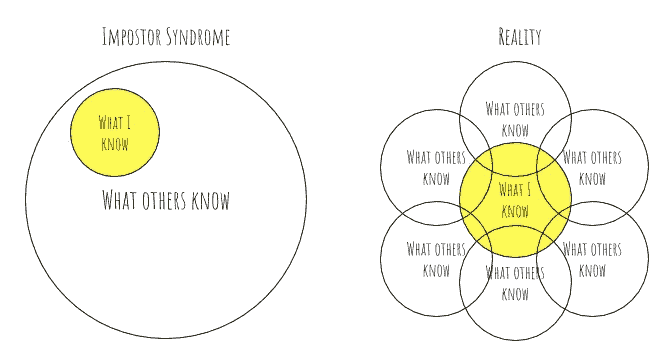
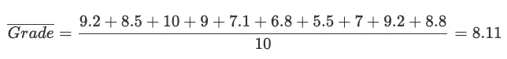
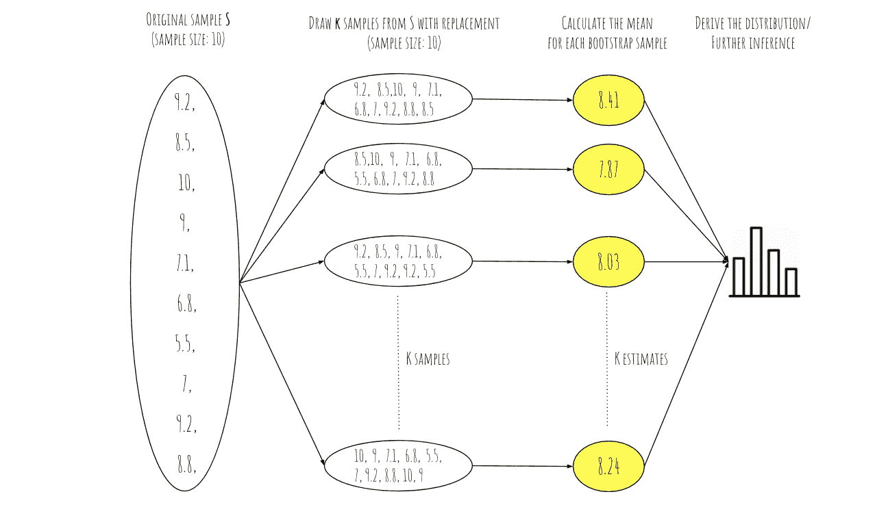
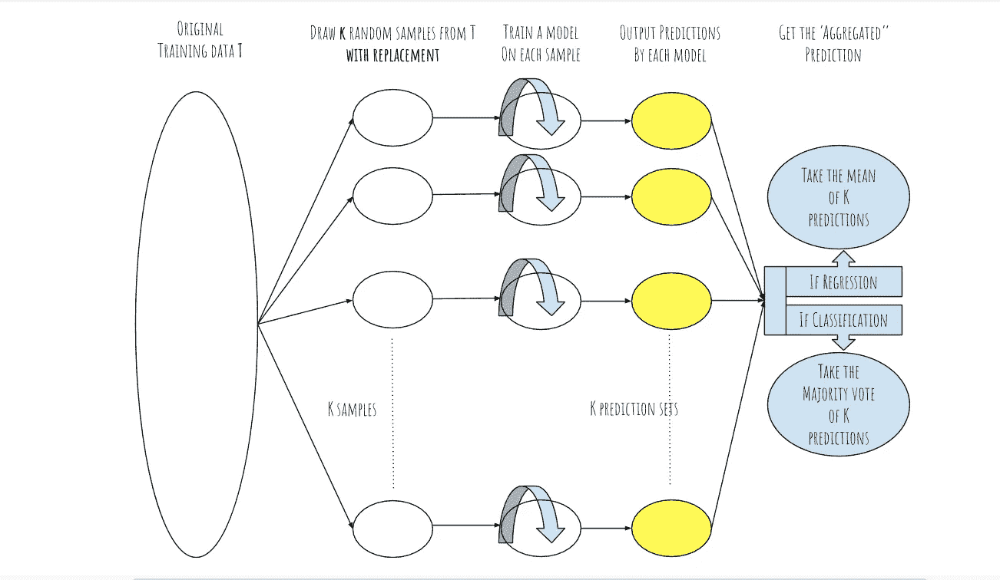

# 装袋、助推、引导:一种直观的方法

> 原文：<https://towardsdatascience.com/fancy-ds-terms-that-are-actually-easy-to-understand-part-i-c12df4d99780?source=collection_archive---------33----------------------->

## 容易理解的自命不凡的数据科学术语

由 [Unsplash](https://unsplash.com?utm_source=medium&utm_medium=referral) 上[卡拉·维达尔](https://unsplash.com/@karlavidal?utm_source=medium&utm_medium=referral)拍摄的照片

如果你曾经和聪明的数据科学家呆在一个房间里，他们抛出的词汇大部分对你来说没有意义，欢迎加入这个俱乐部。你可能正处于学习的[自觉无能](/the-stages-of-learning-data-science-3cc8be181f54)阶段。我们都经历过(或仍然经历过)。在这一阶段，你对构建模块很熟悉，但开始意识到数据科学的深度，并可能在你的过程中患上了冒名顶替综合症。

原图:[https://getwerkin.com/blog/imposter-syndrome](https://getwerkin.com/blog/imposter-syndrome)

**数据科学具有挑战性，但有些概念被高估了。我们经常使用听起来很复杂的词汇，可能会吓跑新手。实际上，这些术语背后的概念非常容易理解。**

在这一系列的文章中，我将分享我曾经觉得难以启齿的术语列表，但是一旦你真正读到它们，你就会意识到它们是多么的直观。

照片由[梅勒妮·德雷维奇](https://unsplash.com/@designwilde?utm_source=medium&utm_medium=referral)在 [Unsplash](https://unsplash.com?utm_source=medium&utm_medium=referral) 上拍摄

**注意:**这是试图用一种高层次的直观方法来解释这些概念。他们说，如果你不能简单地解释它，你就理解得不够好。所以我来试试。

在第一篇文章中，我们将试着理解:

*   拔靴带
*   制袋材料
*   助推

# 拔靴带

比方说，你想估计 9 年级学生的平均数学成绩。由于你无法获得每一个九年级学生的分数(也就是你的**人口**)，你能做的最好的事情就是根据你自己的 10 个学生的分数(也就是你的**样本**)来估计一个平均值:

S = {9.2，8.5，10，9，7.1，6.8，5.5，7，9.2，8.8}。

要估计平均值，您会选择:

但问题是，你只有 10 个数据点，可能无法完全代表整个人口。所以，你不能真的确定你的估计 8.11，需要一个误差幅度。你**能**做的就是充分利用你拥有的小数据和引导:

自举流程。

请注意，由于绘制的样本与原始样本具有相同的大小，并且它们是用替换的绘制的**，一些点在一些样本中重复出现，而其他点则被忽略。如你所见，当这样做 K 次时，我们最终得到 K 个不同的估计值，在这种情况下，从 7.87 到 8.41 不等。回想一下，我们最初的估计是 8.11。**

## 这给了我们什么？

为了能够对我们的总体以及我们的参数估计的代表性进行推理，我们需要它的可变性的某种图像。通过从随机重新抽样的人群中连续估计度量(在这种情况下是平均值),我们获得了关于我们的 bootstrap 度量的分布及其稳定性的信息。最重要的是，通过 bootstrap 分布，我们可以得出我们估计的[标准误差](https://www.investopedia.com/terms/s/standard-error.asp)，并且知道在考虑我们的估计时要考虑多少误差。

## 什么是引导应用？

除了所讨论的用例，自举还用于建立置信区间、验证和稳定预测模型性能。后者广泛使用的方法是装袋。

# 制袋材料

**b**ootstrap**agg**regat**ing**(bagging)背后的想法如下:为了有一个更稳健的预测模型，将你的初始训练数据引导到 K 个样本中，对每个样本训练预测模型，并对它们的结果进行“平均”。

装袋流程。

# 助推

最后，boosting 算法旨在通过从简单的“弱”模型开始，然后在先前模型的基础上迭代改进其性能，来提高整体预测能力。一种这样的算法是 AdaBoost。从第一次迭代的简单分类器开始，该算法然后给被错误分类的观察值更高的权重。通过这种方式，与第一次迭代相比，在下一次迭代中构建的分类器通过提高性能而“更加关注”那些观察结果。然后重复该过程。

**延伸阅读**

一旦你有了这些术语背后的直觉，我推荐你阅读一些更技术性的概述，比如关于自举的[这篇文章](/an-introduction-to-the-bootstrap-method-58bcb51b4d60)和关于打包和助推的[这篇文章](/ensemble-methods-bagging-boosting-and-stacking-c9214a10a205)。

## 下一步是什么

在本系列的后续文章中，我计划涵盖自由度、校准、蒙特卡洛模拟等术语。我也很想听听你的清单里有什么，如果我能试着解释一下的话。

# 差不多就是这样！

希望这对你有用。呆在家里，保持安全，保持高效。

凯利·西克玛在 [Unsplash](https://unsplash.com?utm_source=medium&utm_medium=referral) 上的照片