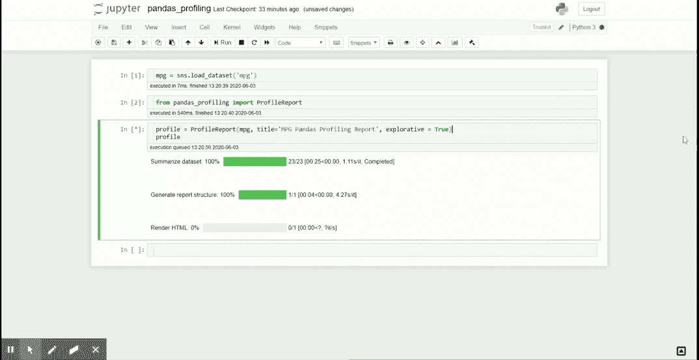
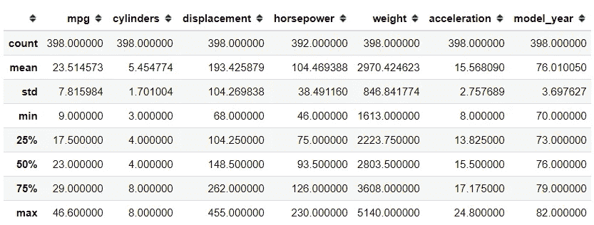
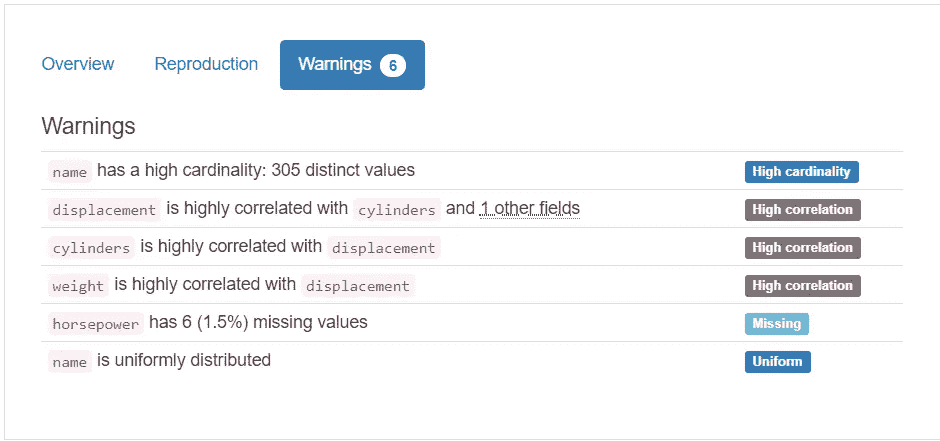
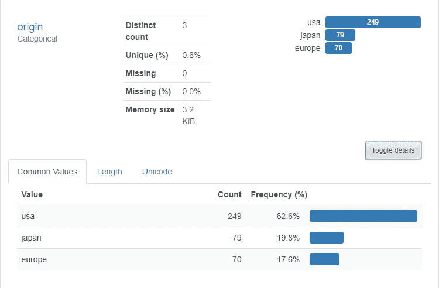
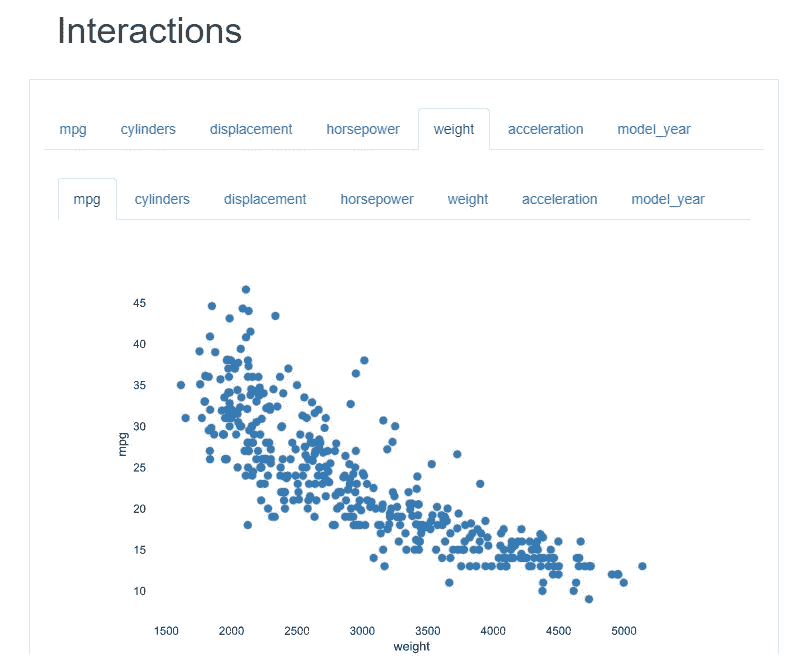
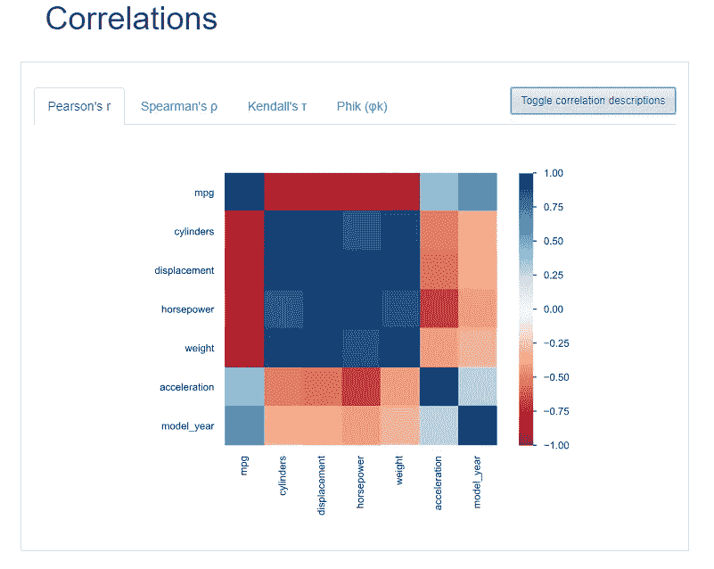
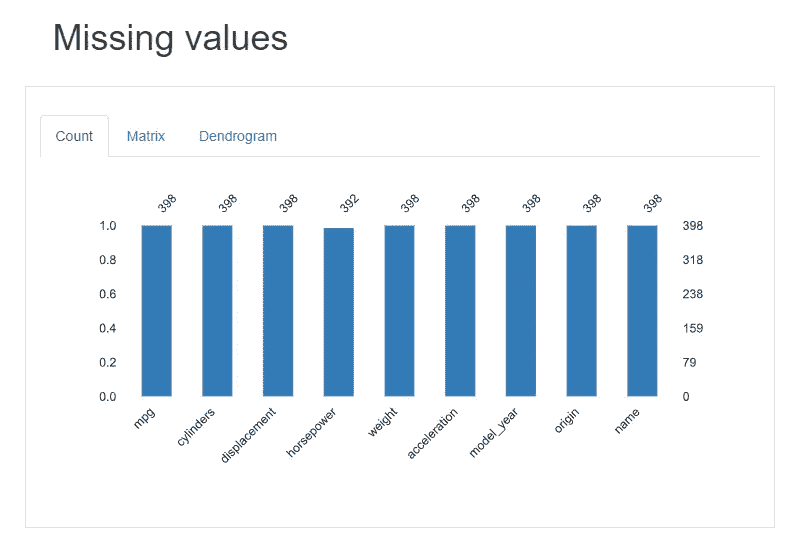
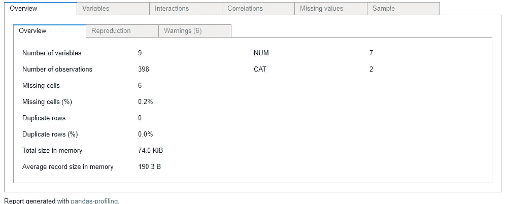
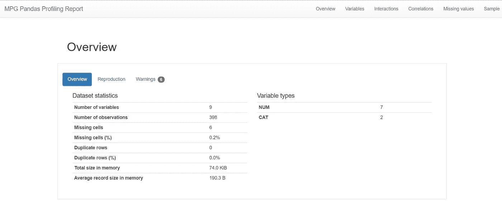

# 带有熊猫档案的神奇熊猫数据框报告

> 原文：<https://towardsdatascience.com/fantastic-pandas-data-frame-report-with-pandas-profiling-a05cde64a0e2?source=collection_archive---------12----------------------->

## 将您的基本报告提升到下一个级别



来源:作者创作

作为一名数据科学家，我们会在日常工作中探索数据。对于 Pythonist 来说，使用熊猫模块是必须的。虽然令人信服，但有时我们发现报告太过简单。下面我举个例子来说明一下。

```
import pandas as pd
import seaborn as sns#Loading dataset 
mpg = sns.load_dataset('mpg')
mpg.describe()
```



我们可以使用`.describe()`属性生成基本的统计数据，但是我们可以让我们的报告看起来更有吸引力，而不是像上面的例子那样的基本报告。


只要看看报告变得多么不同。它让我们的日常探索变得更加容易。此外，您可以将报告保存为 HTML 格式，并与任何人分享。让我们开始吧。

# 熊猫简介

在[熊猫档案模块](https://pandas-profiling.github.io/pandas-profiling/docs/master/rtd/pages/introduction.html)的帮助下，我们可以创建一个如上的精彩报告。这个模块最适合在 Jupyter 环境中工作，因此本文将涵盖 Jupyter 笔记本中生成的报告。现在，要使用这个模块，我们需要安装这个模块。

```
#Installing via pip
pip install -U pandas-profiling[notebook]#Enable the widget extension in Jupyter
jupyter nbextension enable --py widgetsnbextension#or if you prefer via Conda
conda env create -n pandas-profiling
conda activate pandas-profiling
conda install -c conda-forge pandas-profiling#or if you prefer installing directly from the source
pip install [https://github.com/pandas-profiling/pandas-profiling/archive/master.zip](https://github.com/pandas-profiling/pandas-profiling/archive/master.zip)#in any case, if the code raise an error, it probably need permission from user. To do that, add --user in the end of the line.
```

这样，我们就可以生成报告了。我们将使用 Pandas Profiling 函数，就像下面的代码一样。

```
#Importing the function
from pandas_profiling import ProfileReport#Generate the report. We would use the mpg dataset as sample, title parameter for naming our report, and explorative parameter set to True for Deeper exploration.profile = ProfileReport(mpg, title='MPG Pandas Profiling Report', explorative = True)profile
```

等待一段时间后，我们将得到如下的 HTML 报告。


在第一部分中，我们将获得数据框的概述信息。如果我们使用 Pandas 数据框对象中的`.info()`属性，情况类似，但是 Pandas 分析提供了更多信息。例如，警告部分。



警告部分的优点是给出的信息不仅仅是基本信息，比如缺失数据，而是更复杂的信息，比如高相关性、高基数等。我们可以修改它有多高，以考虑什么是“高基数”或“高相关性”，但我不会在本文中讨论它。

如果我们向下滚动，我们会看到 Variables 部分，其中显示了所有数字和分类列的更多细节。下面是数值变量的例子。


我们可以看到，对于每个变量，我们都获得了完整的统计信息。此外，还有一些部分，我们可以从中获得最常见值和极值的信息。

分类变量怎么样？让我在下图中展示给你看。



就像数字变量一样，我们获得了关于变量的完整信息。进一步向下滚动；我们会到达互动区。在这个部分，我们可以得到两个数值变量之间的散点图。



它下面是相关性部分。



本节以热图的形式显示数值变量之间的相关值。此处仅提供四种相关性计算，如果您需要相关性描述，可以单击“切换相关性描述按钮”。

还有一个部分专门讨论丢失的值，就像下面的例子一样。



最后一部分将只显示数据样本——没什么有趣的。

如果您需要一种更简单的方式来显示报告，我们可以使用下面的代码来转换报告。

```
profile.to_widgets()
```



只需一行代码，我们就可以获得与上面我展示的相同的信息。唯一的区别只是用户界面变得更加直观。尽管如此，信息还是一样的。

最后，如果您想将报告导出到外部 HTML 文件中，我们可以使用下面的代码。

```
profile.to_file('your_report_name.html')
```


你可以在 Jupyter 笔记本的同一个文件夹中找到 HTML 文件。如果您打开该文件，它会自动在您的默认浏览器上打开，其漂亮的用户界面类似于我们 Jupyter 笔记本中的界面。



# 结论

我已经向您展示了如何使用 Pandas Profiling 模块将 Pandas 数据框中的基本报告转换为更具交互性的形式。希望有帮助。

# 如果您喜欢我的内容，并希望获得更多关于数据或数据科学家日常生活的深入知识，请考虑在此订阅我的[简讯。](https://cornellius.substack.com/welcome)

> 如果您没有订阅为中等会员，请考虑通过[我的介绍](https://cornelliusyudhawijaya.medium.com/membership)订阅。