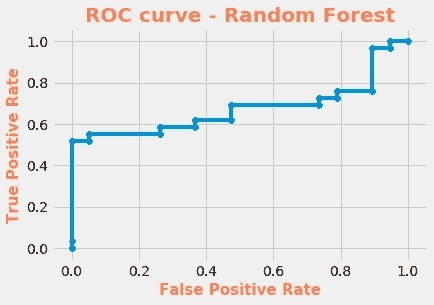
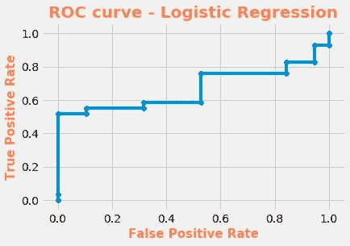
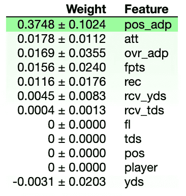
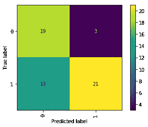
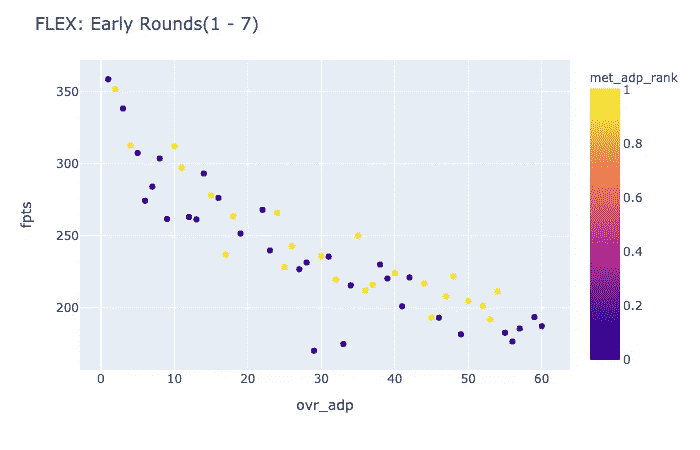

# 梦幻足球和机器

> 原文：<https://towardsdatascience.com/fantasy-football-and-the-machine-b37864c5acd4?source=collection_archive---------36----------------------->

## 使用机器学习提高梦幻足球选秀的水平

[安德鲁·尼尔](https://unsplash.com/@andrewtneel?utm_source=unsplash&utm_medium=referral&utm_content=creditCopyText)在 [Unsplash](https://unsplash.com/s/photos/computer-draft?utm_source=unsplash&utm_medium=referral&utm_content=creditCopyText) 上拍照

在梦幻足球运动员中有一句古老的格言说:“你不能在选秀中赢得一个联赛，但你肯定会失去它。”对于许多球员来说，选秀是梦幻足球赛季中最令人期待、最令人兴奋和最令人愉快的一部分，但这远远不是一个完美的过程。球员们在网上搜寻并尽可能多地吸收信息，包括季前赛排名、预测，当然还有平均选秀位置。问题是这些方法都不能保证你能在选秀当天做对，所以也许有更好的方法。在这篇博文中，我将使用一个机器学习模型来预测一个球员是否会达到/超过他们的平均选秀位置(ADP)排名。

这里的目标是一个二元分类——要么一个玩家被预测达到/超过 ADP 等级，要么不达到他们的 ADP 等级。例如，考虑一下上赛季的 Saquon Barkley 的情况。几乎所有你去过的网站都把他列为 ADP 排名第一的球员，这意味着他通常是第一个被选中的球员。他也有本赛季的最高分预测，但在他的位置上结束了一年的前 5 名之外。如果你去年第一次选中了他，你很可能会因此而遭受损失(我知道我是这样做的)。那么，我们怎样才能找到一个模型来帮助我们做出这些决定呢？

为了建立这个模型，我希望它拥有一个典型的梦幻足球运动员在选秀前拥有的相同类型(和缺乏)的信息:ADP(整体和位置)和预测。在这种情况下，我使用了 fantasypros.com 2019 赛季的预测和 ADP。我还需要比较玩家*实际上*如何结束这一年的能力，所以我也使用了 fantasypros.com 的 2019 年幻想总点数。最后，我只包括跑卫(RBs)，外接手(WRs)和紧端(TEs)，被称为“灵活”组。四分卫、防守和踢球者都有独特的得分，但灵活球员都是通过触球(抢球/接球)、达阵和码数来衡量的。

**沿 X 轴的总体 ADP，沿 y 轴的投影幻想点。黄点表示达到/超过 ADP 等级的玩家，紫点表示没有达到/超过 ADP 等级的玩家。**

既然已经建立了数据，下一步就是建立基线。我了解到去年有 59%的玩家*“达到/超过”*他们的 ADP 排名，所以如果我们简单地预测每个玩家都会达到预期值，我们大约有 60%的时间是正确的。正如你所看到的，这里的问题是，随着你在草案中的位置越来越低，预测越来越接近于零，符合 ADP 等级的比率就会上升。在某种程度上，这是有道理的，因为如果一个球员预计得 0 分，但到年底却得了 20 分，那么这个球员看起来很有价值。然而现实是，从幻想的角度来看，我们真的不关心那些球员*(从长远来看，克里斯蒂安·麦卡弗里去年在 PPR 联赛中以超过 400 分的幻想得分领先球员)*。

有鉴于此，准确性显然不是最好的衡量标准，ROC AUC 分数将是模型技能的更好衡量标准。简而言之，ROC AUC 分数衡量预测模型处理假阳性和假阴性的能力。因此，举例来说，如果模型预测玩家符合 ADP 等级，但实际上他们没有，这将被认为是假阳性，与此相反的情况将被认为是假阴性。**所以请记住，我们的准确率基线是 59%，ROC 基线是 0.5。**这里的另一个步骤是将数据分成训练、验证 *(val)* 和测试集，因此模型有一些信息用于训练*(学习)*，一些信息用于验证*(测验)*，还有一部分用于实际测试。现在让我们开始建模。

**验证集上随机森林的 ROC 曲线。一个“完美”的模型应该到达左上角，并且在曲线下有最大的面积，这表明没有假阳性和假阴性。**

我使用了两个不同的模型，第一个是随机森林。为了清楚起见，随机森林是一种基于树的模型，它基于一系列“决策”进行预测该模型通过在 ROC 分数为 0.67 的 val 集上获得 64%的准确性来完成击败基线的任务。

**验证集上逻辑回归的 ROC 曲线**

我使用的第二个模型是逻辑回归，它的工作原理与随机森林稍有不同，通过将任何实数映射到 0 到 1 之间的输出来通知其预测。虽然 val 集的 ROC 值仍然是 0.67，但准确率确实提高了一点，达到了 66%。然而，我选择这个模型的原因是它的“低”训练准确率为 67% *(随机森林的训练准确率远远超过 80%)* 。这一点很重要，因为训练集的精度越高，表明模型可能会过度拟合数据，因此可能无法很好地处理以前没有见过的数据。因此，由于我希望这个模型能够帮助我对未来的梦幻足球选秀做出决定，我选择了逻辑回归，因为它展示了更强的概括能力。

**测试集上 logistic 回归的 ROC 曲线**

最后一步是看看这个模型在我展示的测试集上表现如何。最终，逻辑回归模型获得了 71%的测试准确度和 0.84 的 ROC 分数，两者都大大超过了基线。现在，在你对在你的下一个草稿中使用这个感到兴奋之前，我必须指出，在不到 400 个观察值的情况下，样本大小不够理想。然而，我们至少可以说这个模型展示了一些技巧，我认为它是一个很好的起点，可以通过更多的数据来改善。现在，让我们看看*的模型是如何工作的，并做出预测，看看是否有我们可以学习或开始应用的东西。*

**逻辑回归模型的排列重要性**

**逻辑回归模型预测的 Shap 值**

我们可以看到，该模型考虑的最重要的因素是球员的位置 ADP *(pos_adp)* 、投射的幻想点数 *(fpts)* 和投射的触球 *(att/rec)* 。对于任何经验丰富的梦幻足球运动员来说，这似乎是显而易见的。但远不那么明显、让我有点吃惊的是，预测的触地得分缺乏重要性。正如足球迷和幻想玩家所知，触地得分在现实生活中是一件大事，往往会在幻想玩家中产生最大的兴奋，那么为什么模型不认为这些事件是“重要的”我认为这说明了一个更广泛的观点，即体育运动中的任何事件都很难预测，但触地得分可能是最难预测的事情之一，因此该模型根本不关心预计的触地得分。这让人们认识到，在梦幻足球中，机会是最大的预测因素，一名球员每年触地得分的次数可能更多的是噪音而不是信号。现在让我们从假阳性和假阴性的角度来仔细看看模型的预测。

**逻辑回归模型的混淆矩阵**

混淆矩阵沿着对角线示出了“真”预测(19 表示不符合 ADP 等级，21 表示符合)和其他地方的“假”预测(3 个假阳性，13 个假阴性)。我很满意这个模型只预测了样本中的 3 名球员达到 ADP 等级，而他们实际上并没有达到，但是我也认识到在漏报方面还有改进的空间。例如，模型预测 Zeke Elliott 将*不会*达到他的 ADP 等级，而事实上他达到了。

**总体 ADP 沿 X 轴，投射幻想点数沿 y 轴。黄点表示达到/超过 ADP 等级的玩家，紫点表示没有达到/超过 ADP 等级的玩家。**

最终，即使对计算机来说，预测体育比赛的结果也是很难的。该模型在草案后期的预测方面做得相当不错，但在最初几轮中还有一些不足之处。看上面的图片，我们可以看到为什么预测选秀状元的这些球员更加困难——去年只有 43%的人达到了他们的 ADP 排名！

**位置 ADP 与整体 ADP 的部分相关性图，较浅的颜色表示达到/超过 ADP 等级的概率较高**

使用两个特征的部分相关图，我们可以看到概率如何基于相对于目标的位置 ADP 和整体 ADP(met ADP 等级)而变化。我们可以看到，根据逻辑回归模型，位于剧情左下方的球员(选秀顶端的球员)命中其 ADP 排名的概率最低。同样，这有一定的道理，因为这些玩家有更高的期望，这自然更难满足。

这里的要点是，这些早期的选择比我们想象的要难做得多。我以前听人说过，你不需要太担心你的前几个选秀权，因为这些选秀权代表了所有最好的球员。这一探索表明了完全相反的情况，即这些是你最需要担心的选择。因此，对我来说，新的教训是在最初几轮选择时考虑更逆向的方法，因为传统的选择可能被高估。