# 如何访问 Fantasy Premier League API，构建数据框架，并使用 Jupyter、Python 和 Pandas 进行分析

> 原文：<https://towardsdatascience.com/fantasy-premier-league-value-analysis-python-tutorial-using-the-fpl-api-8031edfe9910?source=collection_archive---------2----------------------->


图片来自 [Pixabay](https://pixabay.com/?utm_source=link-attribution&utm_medium=referral&utm_campaign=image&utm_content=1866738) 的[像素](https://pixabay.com/users/Pexels-2286921/?utm_source=link-attribution&utm_medium=referral&utm_campaign=image&utm_content=1866738)

## 从 FPL API 建立熊猫数据框架的文档，并在 19/20 季节运行价值分析

在撰写本教程时，在比赛周 30+之前，我在梦幻英超足球队(球队:尹)中排名世界第 3919 位，相当于世界排名前 0.05%。

这不是偶然发生的，也不全是*的运气。*

玩这个游戏花了几年时间来学习成功所需的耐心、技巧和策略。从 2011/12 年的#1，181，262 到 2018/19 年的#39，804，再到现在 2019/20 年的#3，919，还剩 8gw:

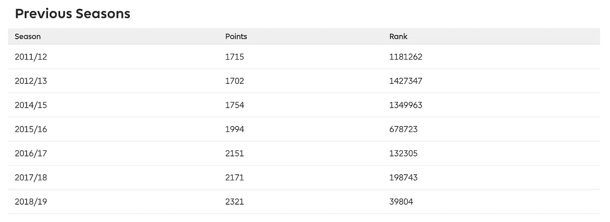

作者上一季在 fantasy.premierleague.com 的表现截图

这几年来，我学到了两个非常有用的技能:

1.  识别你的偏见
2.  了解如何读取数据

第一个会帮助你停止犯愚蠢的错误。第二个将帮助你发现其他幻想经理所没有的价值。

本教程将通过教你如何访问新数据来帮助你发展这两种技能。然后帮助你以新的方式看待它。

这篇文档远非完美，但至少，它将让您体验 Jupyter 笔记本、Pandas、Python 和一个新数据源的可能性。

本教程结束时，你将具备从梦幻英超 API 中提取数据的基本技能，并利用这些数据挤出新的理解。

让我们开始吧。

***作者注:*** *对于您的下一次 FPL API 挑战赛，请在这里为我的博客添加书签，我的博客介绍了“元素-概要”FPL API 端点:*

[](/looping-through-the-fantasy-premier-league-api-element-summary-endpoint-to-download-player-df4ab5151fcb) [## 通过梦幻英超 API“元素-概要”端点循环下载球员…

### 创建当前赛季和过去所有玩家游戏周历史的主数据框架的文档…

towardsdatascience.com](/looping-through-the-fantasy-premier-league-api-element-summary-endpoint-to-download-player-df4ab5151fcb) 

## 目录:

1.  [入门](#b9ab)
2.  [通过请求访问 API](#8ef2)
3.  [从您的 API 请求响应构建一个数据框架](#34cd)
4.  [使用数据框架](#99db)
5.  [导出为 CSV 格式，以便在谷歌工作表或 Excel 中进行分析(如果你喜欢的话)](#be64)

# 第一步:开始

本教程假设您对 Jupyter 和 Python 有点熟悉。如果你刚刚开始，从我的教程开始吧:

[](https://medium.com/@deallen7/getting-started-with-python-pandas-and-jupyter-notebooks-bd08c963914) [## Python、Pandas 和 Jupyter 笔记本入门

### 用 Jupyter 笔记本设置您的机器并开始用 Python 编程所需的所有文档…

medium.com](https://medium.com/@deallen7/getting-started-with-python-pandas-and-jupyter-notebooks-bd08c963914) 

一旦你完成了你的设置，马上回到这篇文章！

如果你已经安装了 Jupyter、Python 和 Pandas，那么继续第 2 步！

# 步骤 2:用请求访问 API

首先，我们需要我们的包导入。我们真的只需要 3:

```
import requests
import pandas as pd
import numpy as np
```

*注意:如果您得到一个导入错误，这可能是因为您没有将包添加到您的环境中，或者没有激活您的开发环境。前往您的 Anaconda Navigator，确保将所需的包添加到您为 Jupyter 笔记本工作激活的任何环境中。应用更新，在激活开发环境之前，不要忘记重启终端！*

接下来，我们需要 API URL:

```
url = '[https://fantasy.premierleague.com/api/bootstrap-static/'](https://fantasy.premierleague.com/api/bootstrap-static/')
```

使用 requests 包从 API 端点发出 GET 请求:

```
r = requests.get(url)
```

然后，将请求转换成一个 json 对象:

```
json = r.json()
```

让我们看看 json 键，然后我们将创建我们的数据帧

```
json.keys()
```

这将返回 json 的所有键的列表:

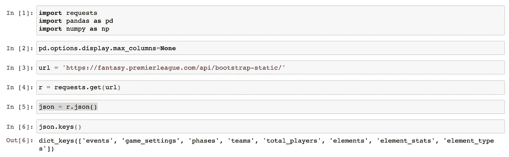

作者笔记本成绩截图

这篇文章中我真正关心的三个关键词是`elements`、`element_type`和`teams`。

接下来，我们将使用这三个键创建三个不同的数据帧，然后将来自`teams`和`element_type`数据帧的一些列映射到我们的`elements`数据帧中。

# 步骤 3:从 API 请求响应构建一个数据框架

一旦我们构建了数据框架，我们就能够处理数据，进行排序、过滤、映射(类似于 Excel 中的 v-lookup ),并将数据组织到数据透视表中。

让我们从构建数据框架开始:

```
elements_df = pd.DataFrame(json['elements'])
elements_types_df = pd.DataFrame(json['element_types'])
teams_df = pd.DataFrame(json['teams'])
```

使用`head()`方法预览数据帧的前 5 行。像这样:

```
elements_df.head()
```

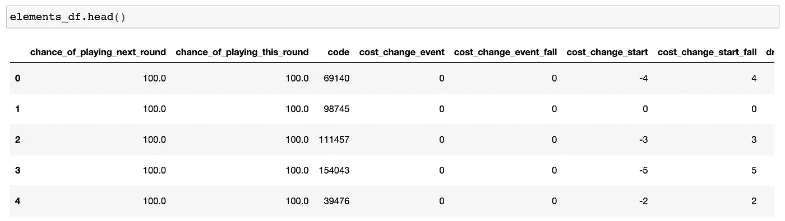

作者笔记本成绩截图

您还可以使用`columns`方法浏览每个数据帧中的所有列:

```
elements_df.columns
```

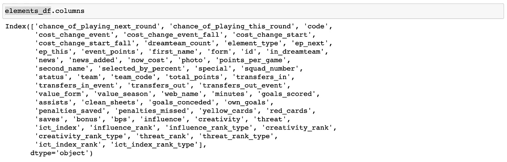

作者笔记本成绩截图

数据量非常大，所以我将复制这个数据帧，但只复制一些列。我喜欢在这些更小、更轻的数据帧副本前加上`slim_`:

```
slim_elements_df = elements_df[['second_name','team','element_type','selected_by_percent','now_cost','minutes','transfers_in','value_season','total_points']]
```

现在，我目前感兴趣的大多数数据都可以在一个窗口中查看:

```
slim_elements_df.head()
```

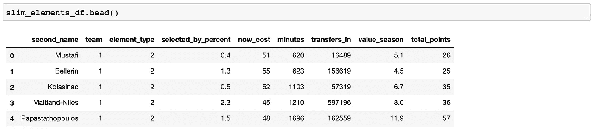

作者笔记本成绩截图

成功！我们继续吧。

# 步骤 4:使用数据框架

本节将分为几个小节:

*   [使用 map()](#7043)
*   [使用 astype()](#5828)
*   [使用 sort_values()](#a7da)
*   [使用 pivot_table()](#556f)
*   [使用 loc[]](#a476)
*   [使用 hist()](#28e7)

## 使用地图()

我要做的第一件事是将位置名称从`elements_type_df`映射到`slim_elements_df`。如果你曾经使用过 Excel，你会注意到`map()`非常类似于 v-lookup。

```
slim_elements_df['position'] = slim_elements_df.element_type.map(elements_types_df.set_index('id').singular_name)
```

现在我们已经完成了，看看最上面的几行:

```
slim_elements_df.head()
```

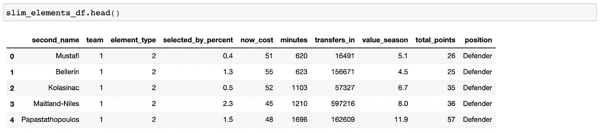

作者笔记本成绩截图

太好了，现在我们可以很容易地看到位置。当我们按位置组织 value_season 时，这将派上用场。

接下来，让我们添加团队名称。我们可以通过映射 teams_df 中的“name”来做到这一点:

```
slim_elements_df['team'] = slim_elements_df.team.map(teams_df.set_index('id').name)
```

瞧:

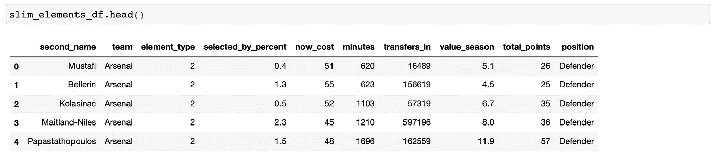

作者笔记本成绩截图

接下来，我们按`value_season`对这张表进行排序。我很好奇今年最有价值的选择。

## 使用 astype()

但是首先，我们必须创建一个名为`value`的新栏目。

为什么？因为列`value_season`中的一些值是字符串值。我知道这一点，因为我试图按`value_season`排序，得到了一个奇怪的、不正确的结果。数据帧中无法解释的行为通常是由于存储在同一列中的数据类型冲突造成的(例如:字符串、整数和浮点值都存储在同一列中)。

我们需要确保每个值都是同一类型的。为此，我们将创建一个新列，并使用`astype()`方法将所有值设置为一个浮点值(带小数的数字，例如:4.5)。

```
slim_elements_df['value'] = slim_elements_df.value_season.astype(float)
```

现在我们可以对列`value`上的数据帧进行排序。让我们开始吧:

## 使用 sort_values()

Sort_values()允许您对值进行排序:)

默认情况下，Pandas 将按照从低到高的升序对值进行排序。但是我们希望值按降序排列:从高到低。所以我们需要显式地将`ascending`参数设置为`False`，如下所示:

```
slim_elements_df.sort_values('value',ascending=False).head(10)
```

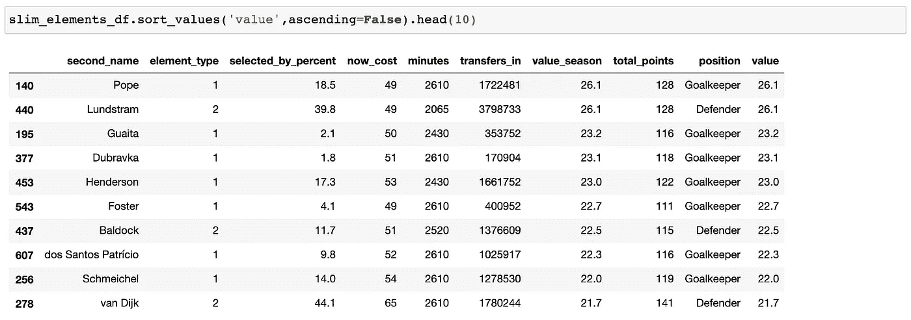

作者笔记本成绩截图

好吧，你能看看吗？两名选手并列第一。波普和伦德斯特拉姆。一名守门员和一名防守队员。很好。

这实质上意味着 Pope 和 Lundstram 的单位成本得分最高，因为价值是通过用`total_points`除以`now_cost`简单计算出来的。

> 价值=积分/成本

你料到会是这样吗？一个后卫和一个守门员？这可能会改变你对明年团队选择的看法吗？还是下周？

## 使用 pivot_table()

接下来，我们将在列`position`上创建一个 pivot_table，并按位置查看值:

```
slim_elements_df.pivot_table(index='position',values='value',aggfunc=np.mean).reset_index()
```

在创建 pivot_table 并将 pivot_table 赋给变量`pivot`之后，我们将按照值对数据透视表进行降序排序:

```
pivot=slim_elements_df.pivot_table(index='position',values='value',aggfunc=np.mean).reset_index()pivot.sort_values('value',ascending=False)
```

这给了我们:

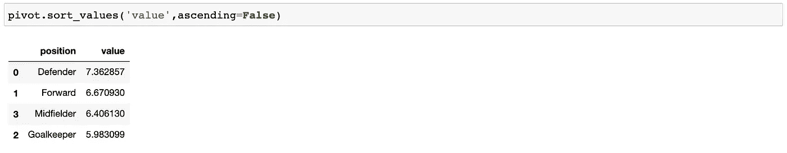

作者笔记本成绩截图

有意思。游戏中价值最高的两个球员之一是守门员，然而守门员位置贡献的平均价值最低。我认为这是可能的，因为所有的守门员都踢 0 分钟。降低首发球员的平均水平。

为了解决这个问题，让我们把这个赛季所有上场时间为零的球员从数据框中去掉。我们将首次使用`loc[]`:

## 使用。位置[]

。loc 允许您定位具有特定列值的特定行。这就像根据列中的特定值过滤电子表格一样。

对于我们当前的目的，我们希望定位数据帧中所有值大于零的行，以便删除所有值= 0 的行。我们这样做不仅仅是为了饲养员。我们需要对每个位置都这样做。我们写道:

```
slim_elements_df = slim_elements_df.loc[slim_elements_df.value > 0]
```

现在让我们再次运行数据透视表:

```
pivot = slim_elements_df.pivot_table(index='position',values='value',aggfunc=np.mean).reset_index()
```

然后:

```
pivot.sort_values('value',ascending=False)
```

现在你知道了:

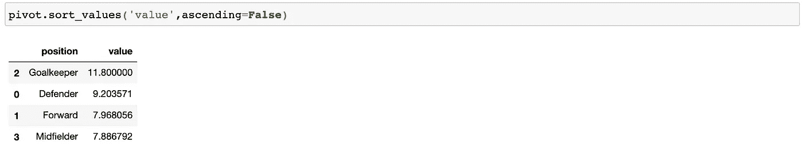

作者笔记本成绩截图

现在让我们接下来做一个不同类型的数据透视表。这一次，我们将看看今年哪些团队提供了最大的价值。关于这个 pivot_table 语句，唯一需要更改的是索引和 pivot_table 变量。看一看:

```
team_pivot = slim_elements_df.pivot_table(index='team',values='value',aggfunc=np.mean).reset_index()
```

现在我们将显示 team_pivot 排序，从最高值团队到最低值团队:

```
team_pivot.sort_values('value',ascending=False)
```

结果如下:

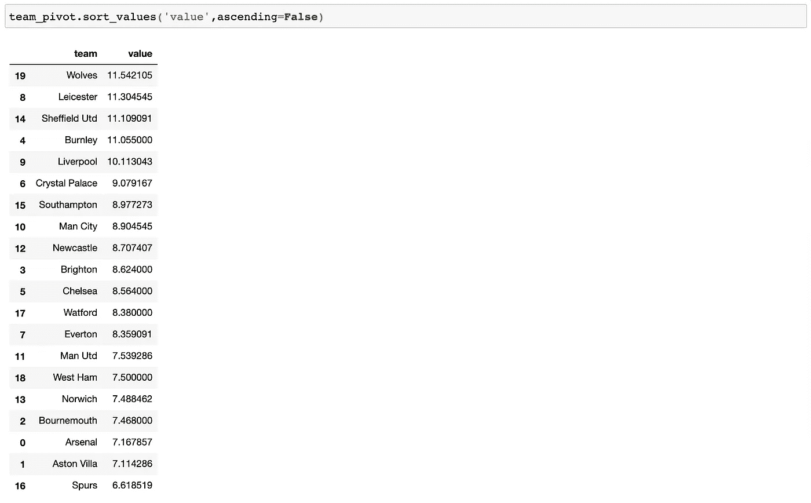

作者笔记本成绩截图

狼队球迷不必担心他们天生的偏见。幸运！

另一方面，马刺球迷今年必须更加意识到他们对自己球队的偏见，才能在 FPL 取得成功。压力真大。

## 使用。历史()

接下来，让我们看一个按位置分布的直方图。在此之前，我们将为每个位置创建一些过滤后的数据帧。我们将使用。再次锁定以实现这一点:

```
fwd_df = slim_elements_df.loc[slim_elements_df.position == 'Forward']mid_df = slim_elements_df.loc[slim_elements_df.position == 'Midfielder']def_df = slim_elements_df.loc[slim_elements_df.position == 'Defender']goal_df = slim_elements_df.loc[slim_elements_df.position == 'Goalkeeper']
```

然后，我们将在我们的`goal_df.value`数据帧列上使用`.hist()`方法:

```
goal_df.value.hist()
```

这给了我们:

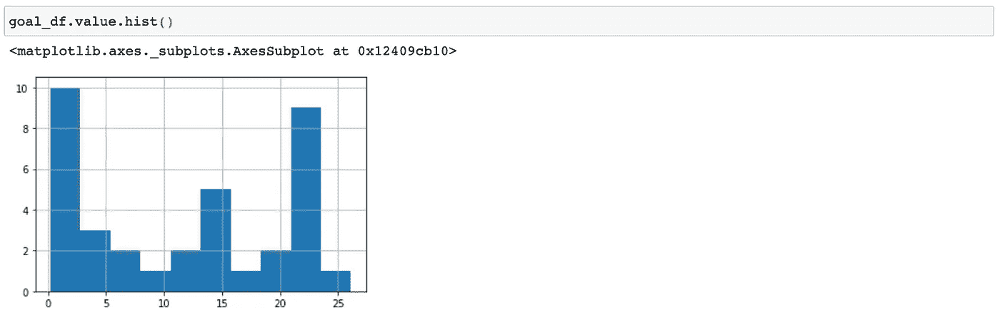

作者笔记本成绩截图

这里有一个超过 20 的可观的价值。让我们看看我们的数据框架，按值排序，看看这些字符是谁:

```
goal_df.sort_values('value',ascending=False).head(10)
```

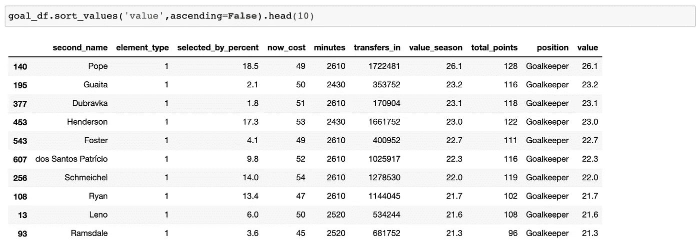

作者笔记本成绩截图

外卖？守门员的位置很有价值。

有很多其他的方法来切这块奶酪，但是让我们来看看防守者位置的直方图:

```
def_df.value.hist()
```

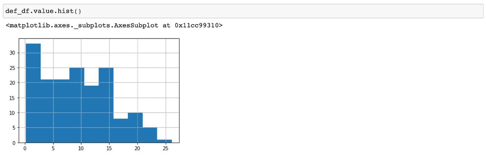

作者笔记本成绩截图

我们的防守直方图指出了一些有趣的事情。注意到门将直方图和后卫直方图的区别了吗？

对于一个门将来说，有一个“最佳”的选择，但我们真的不知道谁将开始新赛季。事实证明，守门员的选择是相当宽容的，看看有多少守门员提供的价值在 20 到 26 之间:

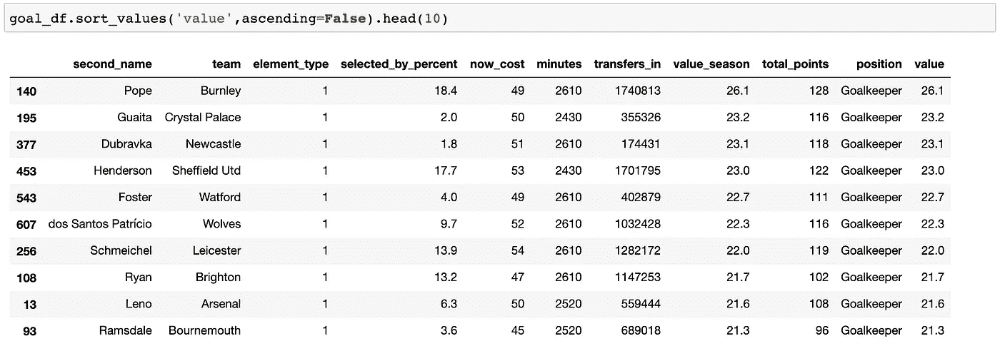

作者笔记本成绩截图

另一方面，捍卫者今年只有一个明显的赢家，只有少数其他在 20-25 价值范围内脱颖而出。让我们看看防御者价值表的顶部:

```
def_df.sort_values('value',ascending=False).head(10)
```

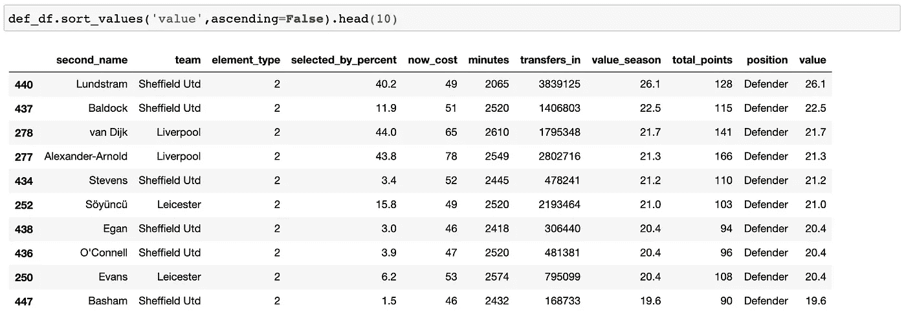

作者笔记本成绩截图

伦德斯特拉姆是今年最重要的后卫，提供了巨大的单位成本价值:26.1 英镑。印象深刻！

从整个分析中最重要的一点是，守门员和后卫比中场和前锋更有价值。但如果你回顾一下 FPL 的推特，你会发现许多 FPL 的经理并不十分理解这一观点。我的朋友，这就是所谓的“机会”

当然，这不完全是价值的问题。这是一个团队优化的挑战。你有 100 个货币单位可以花，一队高价值回报者可能没有足够的分数来挑战你在迷你联赛或整体比赛中的高分。一个由最高价值回报者组成的团队会在银行里给你留一些钱。这个游戏是用你的钱来换取点数，而不是价值。

让我们看看顶级中场，例如:

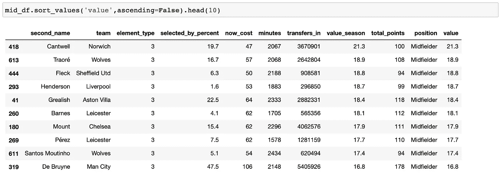

作者笔记本成绩截图

坎特威尔是所有中场球员中价值最高的，但他仍然只有 100 分。与此同时，德·布鲁因的得分只有 16.8，但总得分为 178 分…

重点是？你既需要价值，也需要高回报。你在寻找一种平衡；价值和积分的平衡优化。

# 步骤 5:导出到 CSV

在我们开始之前，我想向您展示如何导出到一个 CSV 文件，您可以在 Google Sheets 或 Excel 中使用它。

很简单:

```
slim_elements_df.to_csv('~/Desktop/fpl_data.csv')
```

运行该单元，然后爆炸！完成了。干得好:)

现在，如果你喜欢的话，享受在 Google Sheets 或 Excel 中探索数据的乐趣吧。

如果你喜欢阅读这样的故事，并想支持我成为一名作家，可以考虑报名成为一名媒体成员。每月 5 美元，让您可以无限制地访问数以千计的 Python 指南和数据科学文章。如果你使用[我的链接](https://deallen7.medium.com/membership)注册，我会赚一小笔佣金，不需要你额外付费。

[](https://deallen7.medium.com/membership) [## 通过我的推荐链接加入媒体-大卫艾伦

### 阅读大卫·艾伦(以及媒体上成千上万的其他作家)的每一个故事。您的会员费直接支持…

deallen7.medium.com](https://deallen7.medium.com/membership)