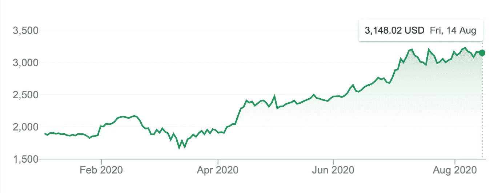
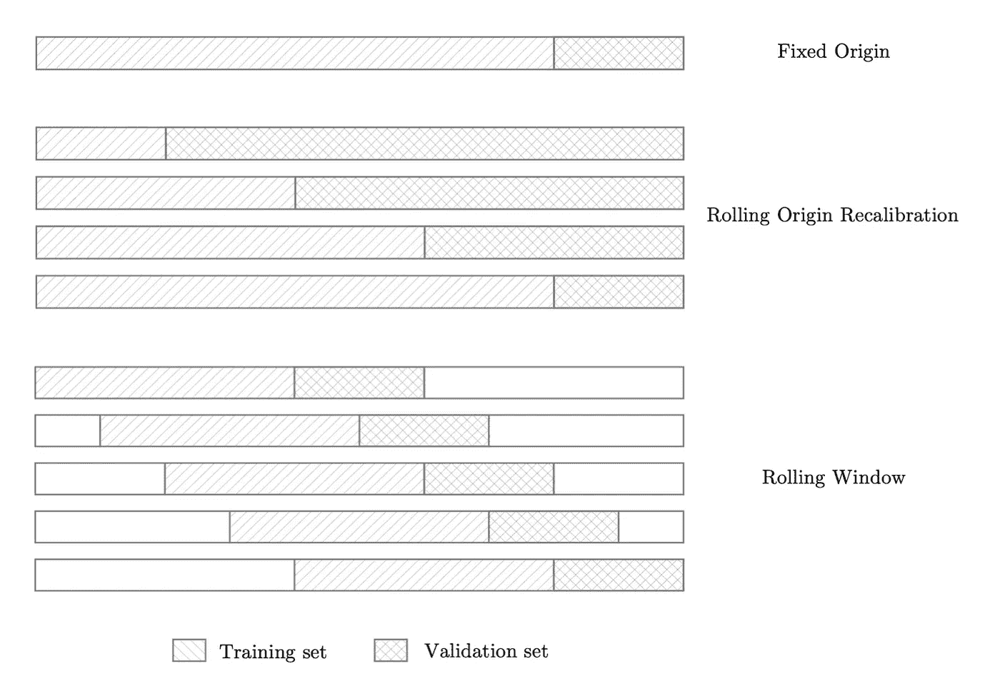
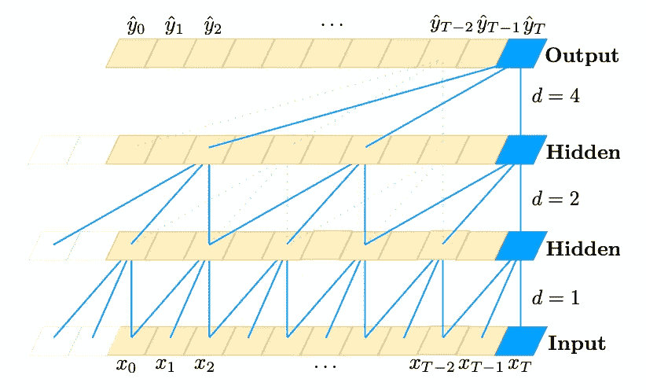
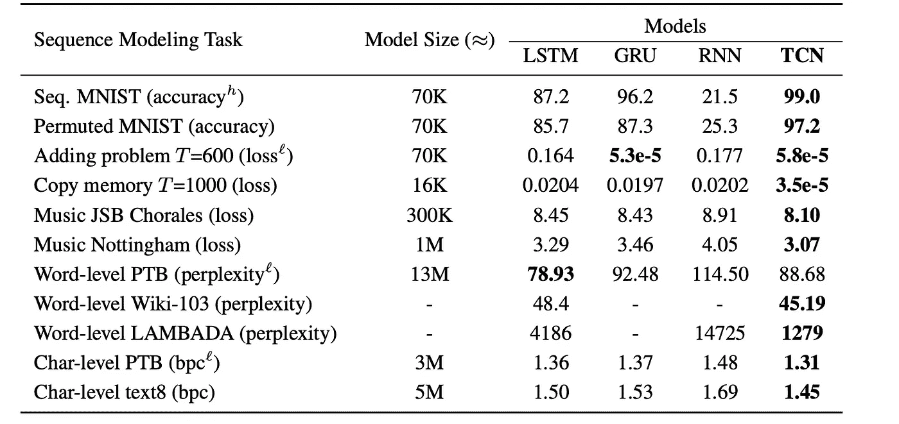
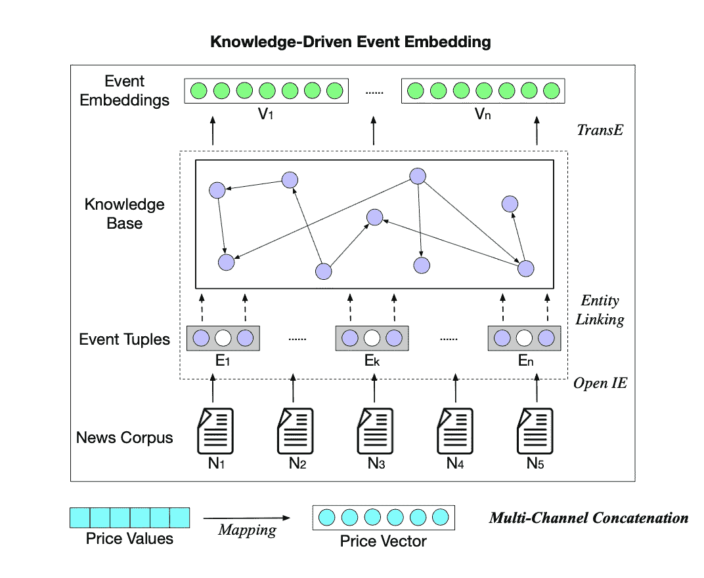
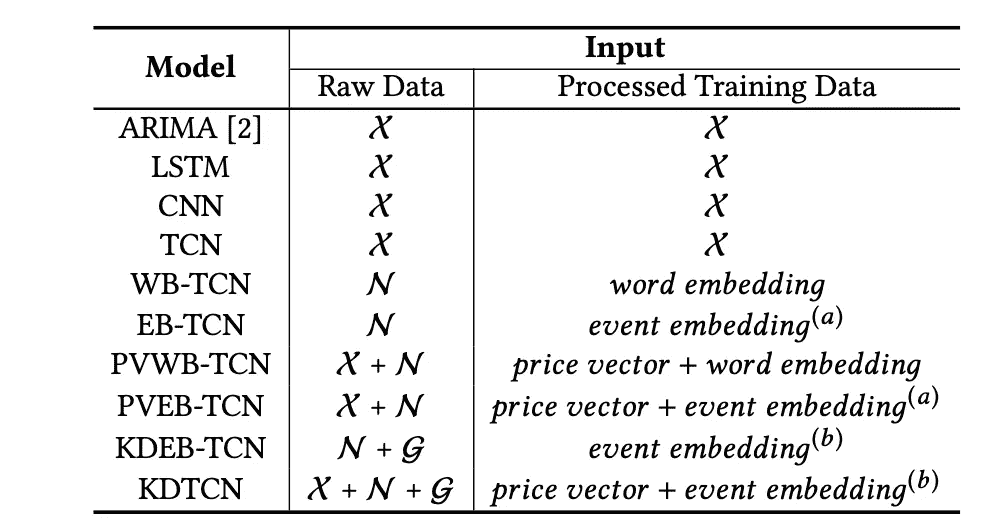
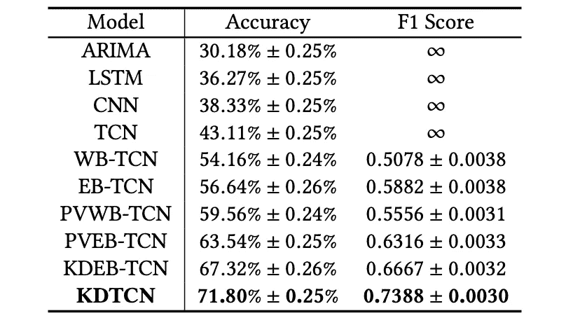
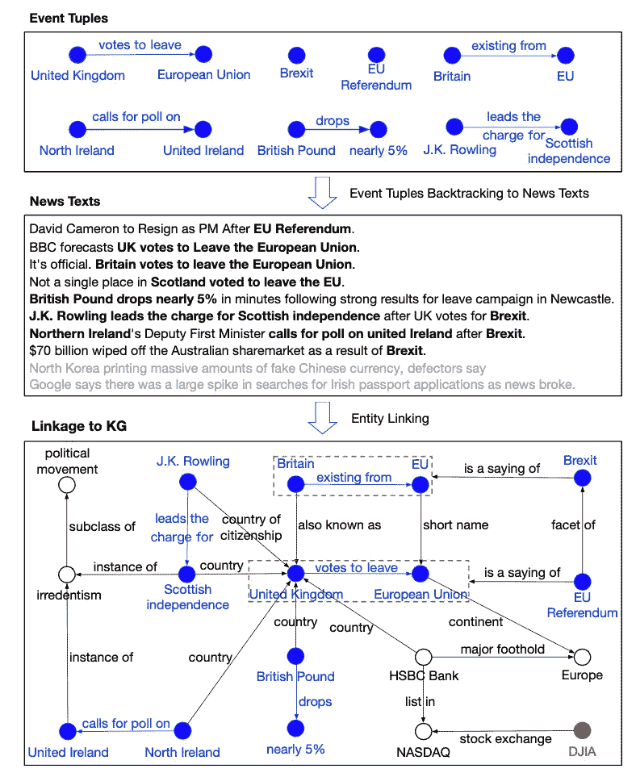

# 告别 RNNs，欢迎 TCNs

> 原文：<https://towardsdatascience.com/farewell-rnns-welcome-tcns-dd76674707c8?source=collection_archive---------1----------------------->

## 时间卷积网络如何有利于序列建模-股票趋势预测。

照片由 [Unsplash](https://unsplash.com/s/photos/wall-street?utm_source=unsplash&utm_medium=referral&utm_content=creditCopyText) 上的 [Aditya Vyas](https://unsplash.com/@aditya1702?utm_source=unsplash&utm_medium=referral&utm_content=creditCopyText) 拍摄

*免责声明:本文假设读者对 LSTM 神经网络的模型直觉和架构有初步的了解。*

# 概观

1.  ***FTS 深度学习背景***
2.  ***FTS 值得注意的数据预处理做法***
3.  ***时态卷积网络架构***
4.  ***FTS 时态卷积网络应用实例***

*   ***通过 TCN 进行知识驱动的股票走势预测和解释***

# 1.背景

金融时间序列(FTS)建模是一项历史悠久的实践，它在 20 世纪 70 年代初首次革新了算法交易。FTS 的分析分为两类:基本面分析和技术面分析。这两种做法都受到了有效市场假说(EMH)的质疑。自 1970 年首次出版以来备受争议的 EMH 假设股票价格最终是不可预测的。这并没有限制通过使用线性、非线性和最大似然模型对 FTS 进行建模的研究，如下文所述。

由于金融时间序列具有非平稳、非线性、高噪声的特点，传统的统计模型很难对其进行高精度的预测。因此，近年来越来越多的人试图将深度学习应用于股票市场预测，尽管还远远不够完美。仅举几个例子:

> ***2013***

[林*等*](https://ieeexplore.ieee.org/document/6706743/) 提出了一种利用支持向量机建立两部分特征选择和预测模型进行股票预测的方法，并证明该方法比传统方法具有更好的泛化能力。

> ***2014***

万贾瓦*等人*。提出了一种使用带有误差反向传播的前馈多层感知器的人工神经网络来预测股票价格。结果表明，该模型可以预测一个典型的股票市场。

> **2017**

进入**LSTM**——关于 LSTM 神经网络应用于时间序列数据的研究激增。

[赵*等*](https://www.semanticscholar.org/paper/Time-Weighted-LSTM-Model-with-Redefined-Labeling-Zhao-Rao/d89fa15ae56701ac8901ee5baf9187b41e3d8968) ，神经网络加入了时间加权函数，结果超过了其他模型。

> **2018**

[张*等*](https://journals.plos.org/plosone/article/file?id=10.1371/journal.pone.0227222&type=printable) 后来把卷积神经网络(CNN)和递归神经网络()结合起来提出了一种新的架构，即深度和广域神经网络()。结果表明，与一般的 RNN 模型相比，DWNN 模型可以将预测均方差降低 30%。

[哈*等人*。](https://www.sciencedirect.com/science/article/abs/pii/S0957417418301416)，CNN 被用来开发一种定量选股策略，以确定股票走势，然后使用 LSTM 来预测股票价格，推广一种混合神经网络模型，用于定量择时策略，以增加利润。

[姜*等人*。](https://link.springer.com/chapter/10.1007/978-3-319-93351-1_32)用 LSTM 神经网络和 RNN 构建模型，发现 LSTM 能更好地应用于股票预测。

> **2019**

[金*等人*。](https://link.springer.com/article/10.1007/s00521-019-04504-2?shared-article-renderer)在模型分析中增加投资者情绪倾向，引入经验模态分解(EMD)结合 LSTM，获得更准确的股票预测。基于注意机制的 LSTM 模型在语音和图像识别中很常见，但在金融中很少使用。

[*等*](https://d4mucfpksywv.cloudfront.net/better-language-models/language_models_are_unsupervised_multitask_learners.pdf) 现在热门的前身， **GPT-3** ，GPT-2 的目标是设计一个多任务学习器，它利用预训练和监督微调的结合来实现更灵活的转移形式。因此，它有 1542 米的参数，比其他比较模型大得多。

[舒敏*等人*](https://core.ac.uk/download/pdf/222446995.pdf) 。使用*时间卷积网络(* KDTCN)进行股票趋势预测和解释的知识驱动方法。他们首先从金融新闻中提取结构化事件，并利用知识图获得事件嵌入。然后，结合事件嵌入和价格值来预测股票趋势。实验证明，这可以(I)更快地对突然变化做出反应，并在股票数据集上胜过最先进的方法。(这将是本文的重点。)

> ***2020***

[嘉鱼*等人*。](https://journals.plos.org/plosone/article?id=10.1371/journal.pone.0227222#pone.0227222.ref016)和 [Thomas *等人*和](https://arxiv.org/abs/1812.07699)提出了基于最近新闻序列的混合注意网络来预测股票走势。具有注意机制的 lstm 优于常规 lstm，因为它由于其独特的存储单元结构而防止了长期依赖性。

[红岩*等人*](https://arxiv.org/pdf/2002.12530.pdf) 提出了一种探索性的架构，称为*时态卷积基于注意的网络(TCAN)* ，它结合了时态卷积网络和注意机制。TCAN 包括两个部分，一个是*时间注意(TA)* ，它捕捉序列内部的相关特征，另一个是*增强残差(ER)* ，它提取浅层的重要信息并传递到深层。

上面的时间线仅仅是为了提供对 FTS 在深度学习方面的历史背景的一瞥，而不是淡化序列模型学术界在类似时期所做的重要工作。

然而，这里有一句话值得一提。FTS 预测领域的学术出版物可能经常误导人。由于大量使用模拟器，许多 FTS 预测论文倾向于夸大其表现以获得认可，并过度拟合其模型。这些论文中声称的许多表现很难复制，因为它们不能概括预测的特定 FTS 的未来变化。

# 2.FTS 值得注意的数据预处理实践

## 2.1 去噪

金融时间序列数据——尤其是股票价格，会随着季节性、噪音和自动修正而不断波动。传统的预测方法使用移动平均线和差分来减少预测的噪声。然而，FTS 通常是非平稳的，并且表现出有用信号和噪声的重叠，这使得传统的去噪无效。

小波分析在图像和信号处理等领域取得了显著的成就。由于其能够弥补傅立叶分析的缺点，逐渐被引入到经济和金融领域。**小波变换在解决传统的时间序列分析问题上具有独特的优势，因为它可以从不同的时间和频率域尺度上分解和重构金融时间序列数据**。

小波变换本质上是利用多尺度特征对数据集进行去噪，有效地将有用信号从噪声中分离出来。在由 [*邱佳宇、、*](https://journals.plos.org/plosone/article/file?id=10.1371/journal.pone.0227222&type=printable) *、*的论文中，他们使用了具有三个分解层的 coif3 小波函数，并通过其信噪比(SNR)和均方根误差(RMSE)来评价小波变换的效果。**信噪比越高，RMSE 越小，小波变换的去噪效果越好**:

[*嘉鱼秋 1、*、](https://journals.plos.org/plosone/article/file?id=10.1371/journal.pone.0227222&type=printable)

## 2.2 数据洗牌

在 FTS，选择哪部分数据作为验证集并不简单。事实上，有无数的方法可以做到这一点，对于不同波动性的股票指数必须仔细考虑。

固定原点法是最简单、最常用的方法。给定一定的分割大小，数据的开始是训练集，结束是验证集。然而，这是一个特别基本的选择方法，尤其是对于亚马逊这样的高增长股票。出现这种情况的原因是，亚马逊的股价一开始波动性很低，随着股价的增长，波动性越来越大。

AMZN 年初至今价格(来源:谷歌财经)

因此，我们将训练一个关于低波动动态的模型，并期望它处理未知的高波动动态以进行预测。事实证明，这是很困难的，而且这类股票的表现是有代价的。因此，如果我们只考虑这一点，我们的验证损失和性能基准可能会产生误导。然而，对于像英特尔这样波动性更恒定的股票(COVID 危机前)，这种方法是合理的。

滚动原点重新校准方法比固定原点重新校准方法稍不容易受到影响，因为它允许通过取数据的各种不同分割的平均值来计算验证损失，以避免遇到高波动性时间框架的非代表性问题。

最后，**滚动窗口法**通常是最有用的方法之一，因为它特别适用于长时间运行的 FTS 算法。事实上，该模型输出多个滚动数据窗口的平均验证误差。这意味着我们得到的最终值更能代表最近的模型性能，因为我们不太会因为遥远过去的表现好坏而产生偏差。

洗牌技术可视化( [Thomas Hollis，Antoine Viscardi，Seung Eun Yi，2018](https://arxiv.org/abs/1812.07699)

由 [Thomas Hollis、Antoine Viscardi、Seung Eun Yi](https://arxiv.org/abs/1812.07699) 完成的一项研究表明，滚动窗口(RW)和滚动原点重新校准(ROR)描述了比简单的固定原点方法略微更好的性能(58%和 60%)。这表明，对于像亚马逊这样不稳定的股票，使用这些洗牌方法是不可避免的。

洗牌方法的性能比较

# 3.时间卷积网络

**时间卷积网络**，或简称为 TCN，是一种用于序列建模任务的卷积神经网络，结合了 RNN 和 CNN 架构的各个方面。对 TCNs 的初步经验评估表明，简单的卷积架构在各种任务和数据集上优于 LSTMs 等规范的递归网络，同时表现出更长的有效记忆。

TCNs 的显著特征是:

1.  体系结构中的卷积是因果的，这意味着从未来到过去没有信息“泄漏”。
2.  **该架构可以接受任意长度的序列，并将其映射到相同长度的输出序列，就像 RNN 一样。TCN 使用非常深的网络(用剩余层扩充)和扩张的卷积的组合，拥有非常长的有效历史大小(即，网络查看非常远的过去以做出预测的能力)。**

## 3.1 模型架构概述

**3.1.1 因果卷积**

如上所述，TCN 基于两个原则:网络产生与输入长度相同的输出，以及未来不会泄漏到过去。为了实现第一点，TCN 使用了 1D 全卷积网络(FCN)架构，其中每个隐藏层的长度与输入层相同，长度的零填充(内核大小 1)被添加到**以保持后续层与先前层的长度相同**。为了实现第二点，TCN 使用*因果卷积*，卷积在时间 *t* 的输出仅与来自时间 *t* 和先前层中更早的元素卷积。

简单来说: **TCN = 1D FCN +因果卷积。**

**3.1.2 扩张的脑回**

一个简单的因果卷积只能回顾网络深度中具有线性大小的历史。这使得将上述因果卷积应用于序列任务具有挑战性，尤其是那些需要较长历史的任务。由白、科特和科尔顿(2020 年 *)* 实施的解决方案是采用扩大的回旋来实现指数级大的感受野。更正式地说，对于一维序列输入 x ∈ Rⁿ和滤波器 f:{0，…，k1 }→r，序列元素 s 上的扩展卷积运算 f 定义为:

其中 *d* 为膨胀因子， *k* 为滤波器大小，*s*—*d**I*表示过去的方向。因此，膨胀相当于在每两个相邻的滤波器抽头之间引入一个固定的步长。当 *d* = 1 时，一个膨胀的卷积会变成一个规则的卷积。使用更大的扩张使顶层的输出能够代表更大范围的输入，从而有效地扩展了 ConvNet 的感受域。

膨胀因子 d = 1，2，4 且滤波器大小 k = 3 的膨胀因果卷积。感受野能够覆盖来自输入序列的所有值。

**3.1.3 剩余连接**

残余块有效地允许层学习对身份映射的修改，而不是整个变换，这已被反复证明有益于非常深的网络。

由于 TCN 的感受野取决于网络深度 *n* 以及过滤器尺寸 *k* 和扩张因子 *d* ，更深更大的 TCN 的稳定变得重要。

## 3.2 利弊

使用 TCN 进行序列建模的几个优点:

**平行度**。不像在 rnn 中，对后面时间步长的预测必须等待它们的前一个完成，卷积可以并行完成，因为在每一层中使用相同的滤波器。因此，在训练和评估中，长输入序列可以在 TCN 中作为一个整体来处理，而不是像在 RNN 中那样按顺序处理。

**灵活的感受野大小。TCN 可以通过多种方式改变其感受野的大小。例如，堆叠更多的膨胀(因果)卷积层，使用更大的膨胀因子，或增加滤波器大小都是可行的选择。因此，TCN 可以更好地控制模型的内存大小，并且易于适应不同的领域。**

**稳定梯度**。不同于递归架构，TCN 有一个反向传播路径不同于序列的时间方向。因此，TCN 避免了爆炸/消失梯度的问题，这是 rnn 的一个主要问题(并导致了 LSTM 和 GRU 的发展)。

**训练所需内存低**。尤其是在长输入序列的情况下，LSTMs 和 GRUs 很容易用尽大量存储器来存储其多个单元门的部分结果。然而，在 TCN 中，过滤器跨图层共享，反向传播路径仅取决于网络深度。因此，在实践中，发现门控 rnn 可能比 TCN 使用多数倍的存储器。

**可变长度输入**。就像以递归方式模拟可变长度输入的 RNNs 一样，TCNs 也可以通过滑动 1D 卷积核来接受任意长度的输入。这意味着对于任意长度的顺序数据，TCN 可以作为 rnn 的替代。

使用 TCN 有两个明显的缺点:

**评估期间的数据存储**。TCN 需要接收原始序列直到有效历史长度，因此在评估期间可能需要更多的存储器。

**域名转让的潜在参数变化。**不同的领域对模型进行预测所需的历史数据量有不同的要求。因此，当将模型从只需要很少内存的域(即，小的 *k* 和 *d* )转移到需要更长内存的域(即，大得多的 *k* 和 *d* )时，TCN 可能会因为没有足够大的感受野而表现不佳。

## 3.3 基准

对典型序列建模任务的 TCN 和递归架构的评估，这些任务通常用于基准 RNN 变体( [Bai、Kolter 和 Koltun，2020](https://arxiv.org/abs/1803.01271) )

执行摘要:

结果强烈表明，在广泛的序列建模任务中，具有最小调整的通用 TCN 体系结构*优于规范的递归体系结构*，这些任务通常用于测试递归体系结构本身的性能。

# 4.通过 TCN 进行知识驱动的股票趋势预测和解释

## **4.1 背景**

股票趋势预测中的大多数深度神经网络都有两个共同的缺点:(i) **当前的方法对股票趋势的突然变化不够敏感**；以及(ii) **预测结果对人类来说不可解释**。为了解决这两个问题，[邓等，2019](https://dl.acm.org/doi/10.1145/3308560.3317701) 提出了一种新颖的*知识驱动的时态卷积网络(KDTCN)* 用于股票趋势预测和解释，通过将背景知识、新闻事件和价格数据融入深度预测模型，解决了股票趋势预测和解释的突变问题。

为了解决突变预测问题，从财经新闻中提取事件并结构化为事件元组，如“英国退出欧盟”表示为(*英国*、*退出*、从、*欧盟*)。然后将事件元组中的实体和关系链接到 kg，比如 Freebase 和 Wikidata。其次，将结构化知识、文本新闻以及价格值分别矢量化，然后连接在一起。最后，将这些嵌入内容输入到基于 TCN 的模型中。

实验表明，KDTCN 可以(I)更快地对突变做出反应，并在股票数据集上优于最先进的方法，以及(ii)促进对预测的解释，特别是在突变的情况下。

此外，基于具有突变的预测结果，为了解决做出解释的问题，通过使用知识图(KG)呈现事件之间的联系来可视化事件的影响。通过这样做，我们可以解释(I)知识驱动事件如何在不同层面上影响股票市场波动，以及(ii)知识如何帮助将事件与股票趋势预测中的突变联系起来。

*注下面这一节仅仅概括成一篇论文的大概概述* [*舒敏等人*](https://core.ac.uk/download/pdf/222446995.pdf) *。，如果你想了解更多的技术细节，可以参考这篇论文。*

## **4.2 模型架构概述**

这里提到的基本 TCN 模型架构源自上面的第 3 节——由因果卷积、剩余连接和扩张卷积组成的通用 TCN 架构。

KDTCN 架构的概述如下所示:

KDTCN 框架说明

原始模型输入为**价格值*X*、**新闻文集*N*、**知识图*G*。价格值被标准化并映射到价格向量，表示为******

其中，每个向量 p *t* 代表一个股票交易日的实时价格向量 *t* ，时间跨度为 *T* 。

对于新闻语料，将新闻片段表示为事件集，*ε*；然后，结构化为事件元组 ***e* = ( *s* ， *p* ， *o* )** ，其中 ***p*** 为动作/谓词， ***s*** 为动作者/主体， ***o*** 为动作所针对的对象；然后，将事件元组中的每一项链接到 KG，对应 KG 中的实体和关系；最后，通过训练事件元组和 KG 三元组获得事件嵌入 *V* 。更详细的过程记录在[舒敏*等人*](https://core.ac.uk/download/pdf/222446995.pdf) *中。*

最后，事件嵌入，结合价格向量被输入到一个基于 TCN 的模型。

## **4.2.1 数据集&基线**

**数据集:**

1.  **时间序列价格数据*X***:*DJIA 指数日价值记录的价格数据集*
2.  ***文本新闻数据 *N* :** 由来自 Reddit 世界新闻频道的历史新闻标题组成的新闻数据集(基于投票的前 25 个帖子)。*
3.  ***结构化知识数据 *G* :** 由两个常用于研究的开放知识图的结构化数据构建的子图——Freebase 和 Wikidata。*

***基线:***

**

*具有不同输入的基线模型。在第一列中，前缀 WB 表示单词嵌入，EB 表示事件嵌入，PV 表示价格向量，KD 表示知识驱动。注意**事件嵌入(a)** 和**事件嵌入(b** 分别表示无 KG 和有 KG 的事件嵌入。*

## *4.4 预测评估*

*KDTCN 的性能在三个方面进行了基准测试:(I)基本 TCN 架构的评估，(ii)不同模型输入对 TCN 的影响，以及(iii)基于 TCN 的模型对突变的性能。*

***基本 TCN 建筑:***

**

*用不同的基本预测模型对 DJIA 指数数据集进行股票趋势预测的结果。*

*请注意，本部分报告的所有实验仅输入**价格值**。*

*在股票趋势预测任务上，TCN 大大超过了基线模型。TCN 取得了比传统的最大似然模型(ARIMA)或深度神经网络(如 LSTM 和 CNN)更好的性能，表明 TCN 在序列建模和分类问题上具有更明显的优势。*

***TCN 的不同型号输入:***

**

*基于 TCN 模型的不同输入的整个 DJIA 指数数据集的股票趋势预测结果。*

*正如所见，WB-TCN 和 EB-TCN 都比 TCN 表现更好，表明文本信息**有助于提高预测。***

*KDTCN 获得了最高的准确性和 F1 分数，这样的结果证明了模型输入与结构化知识、金融新闻和价格值集成的有效性。*

***突变的模型性能:***

**

*使用不同的模型输入，对突然变化的本地 DJIA 指数数据集的股票趋势预测结果。*

*据观察，具有知识驱动的事件嵌入输入的模型，如 KDEB-TCN 和 KDTCN，可以大大优于基于数字数据和基于文本数据的模型。这些比较结果表明，知识驱动模型在对股票市场的突然变化做出快速反应方面具有优势。*

*关于如何量化股票波动程度的补充说明如下。*

*首先，通过计算相邻两个股票交易日的股票波动程度 D( *波动)*的差异，得到突变的时间间隔*

**

*其中在时间 *t* 的 *x* 表示股票交易日 t 的股票价格值，那么波动程度之差 C 定义为:*

**

*如果|Ci |超过某个阈值，可以认为股价在第 *i* 天发生了突变。*

## *预测的解释*

*对为什么知识驱动事件是没有 ML 专业知识的人的突变的常见来源的解释在两个方面完成:(i) **可视化知识驱动事件**对具有突变的预测结果的影响，以及(ii) **通过将事件链接到外部 KG** 来检索知识驱动事件的背景事实。*

***事件效果可视化:***

*下图的预测结果是，DJIA 指数的趋势将会下降。注意，相同颜色的条柱具有相同的事件效果，条柱的高度反映了效果的程度，事件受欢迎程度从左到右递减。直觉上，流行度较高的事件对突变的股票趋势预测应该有较大的影响，但并不总是如此。*

**

*事件对股票趋势预测的影响举例*

*几乎所有其他具有负面影响的事件都与这两个事件有关，*例如*。，(*英镑下跌近 5%* )和(*北爱尔兰，呼吁对联合爱尔兰进行投票*)。*

*虽然也有一些事件对预测股票走势上涨有积极作用，并且具有很高的知名度，*即*。，(*富，变得，更富*)，总的效果是负的。因此，股票指数波动的突变可以看作是事件的影响和流行的综合结果。*

***链接到 KG 的事件元组的可视化:***

**

*以公斤为单位的三元组与事件关联的图示*

*首先，搜索在股票趋势运动中具有重大影响或高人气的事件元组。然后，回溯到包含这些事件的新闻文本。最后，通过实体链接检索与事件元组链接的相关 KG 三元组。在上图中，每个事件元组都用蓝色标记，其中的实体都链接到 KG。*

*这些列出的事件元组，如(*英国，退出，欧盟*)、(*英国，投票离开，欧盟*)、(*英镑，下跌，近 5%* )、( *J. K .罗琳，带头支持苏格兰独立*)和(*北爱尔兰，呼吁对联合王国进行投票*)，从字面上看并不是很相关。然而，通过与 KG 的联系，它们可以相互建立关联，并与英国退出欧盟事件和欧盟公投密切相关。通过纳入对事件影响的解释，可以证明知识驱动的事件是突变的常见来源。*

# ***5。结论***

*递归网络在序列建模中享有的优势可能在很大程度上是历史的遗迹。直到最近，在引入扩张卷积和剩余连接等架构元素之前，卷积架构确实比较弱。最近的学术研究表明，有了这些元素，简单的卷积架构在不同的序列建模任务中比 LSTMs 等递归架构更有效。由于 TCNs 的可比较的清晰和简单性，在 [*Bai，s .、Kolter，j .和 Koltun，v .【2020】*](https://arxiv.org/abs/1803.01271)*、*中提出卷积网络应被视为序列建模的自然起点和强有力的工具包。*

*此外，如上文在股票趋势预测中 TCNs 的应用中所见，通过结合新闻事件和知识图，TCNs 可以显著优于规范 RNNs。*

# *引文和参考文献*

*[1][t . Hollis，Viscardi，a .和 Yi，S. (2020)。*预测金融时间序列的 Lstms 与注意机制的比较*。](https://arxiv.org/abs/1812.07699)*

*[2] [邱健，王 B，周 C. (2020)。*基于注意机制的长短期记忆神经网络预测股票价格。*](https://doi.org/10.1371/journal.pone.0227222)*

*[3] [Bahdanau、Dzmitry、Kyunghyun Cho 和 Yoshua Bengio。(2020).*“联合学习对齐翻译的神经机器翻译”*。](https://arxiv.org/abs/1409.0473)*

*[4] [白，s .，科尔特尔，j .和科尔敦，v .，2020。*用于序列建模的通用卷积和递归网络的经验评估*。](https://arxiv.org/abs/1803.01271)*

*[6] [邓，s，张，n，张，w，陈，j，潘，j，陈，h，2019。*通过时态卷积网络进行知识驱动的股票趋势预测和解释*。](https://dl.acm.org/doi/10.1145/3308560.3317701)*

*[5] [郝海林，王，夏，杨，赵，沈，等，2020。*时序建模的基于时态卷积注意力的网络*。](https://arxiv.org/abs/2002.12530)*