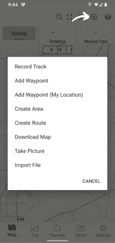

# 使用 QGIS 创建包含土壤和高程数据的农场地图

> 原文：<https://towardsdatascience.com/farm-design-with-qgis-3fb3ea75bc91?source=collection_archive---------20----------------------->

## 使用土壤数据、高程等高线(地形图)和地块创建免费的卫星地图。农场规划、关键线路设计和农林绘图始于良好的场地评估。

Wolfgang Hasselmann 在 [Unsplash](https://unsplash.com?utm_source=medium&utm_medium=referral) 上拍摄的照片

今年夏天，我的家人正在进行一个项目，利用农林业和永久农业原理在德克萨斯州设计和种植一个小果园。鉴于我对橡树和可食用植物的热爱，这是我一直想追求的梦想。这是从我尝试用橡子制作 T4 食品的创业过程中收集到的渴望。

我们的家庭遵循萨瓦纳研究所(Savanna Institute)概述的规划原则，萨瓦纳研究所是一个致力于多功能农业的非营利组织，旨在促进“生态弹性、气候稳定、经济繁荣和充满活力的社区”。该组织的新书《常年路径:种植树木作物》概述了规划和种植成功的农林地块的必要步骤。

耕作的艰辛始于对土地的了解。地图是进行现场评估的最佳起点。正如 j .罗素.史密斯在《树木作物》中所说:

> 农业必须“适应……自然条件”；"耕作应该适合土地。"

在挑选植物或准备田地之前，我们必须建造场地平面图。鉴于我对数据科学的兴趣，我主动提出帮助制作我们果园的地图。以下是我在开源平台 [QGIS 3](https://qgis.org/en/site/forusers/download.html) 中创建地图的步骤。我还使用 Google Earth Pro 处理包裹数据，使用 Gaia GPS 移动应用程序进行实地测绘。

谢尔盖·马朱加在 [Unsplash](https://unsplash.com/s/photos/soil-map?utm_source=unsplash&utm_medium=referral&utm_content=creditCopyText) 上的照片

# 步骤 1:获取包裹信息

首先，让我们向 QGIS 添加一个卫星栅格，这样您就可以获得您的方位。我遵循了哈塔里实验室的指示。

那么，有几种方法来划分你的包裹。您可以:

一个**。**)在 QGIS 中创建一个自定义的[多边形(如果是这样，可以跳到步骤 2)或者…](https://youtu.be/Zer558SnKX4)

b.)导入 shapefile。

我们正在评估的地块沿着一条小溪，因此我们需要地块的准确坐标。因此，我从县评估区下载了适当的 shapefile 宗地数据。

许多评估区公开发布 shapefile 数据。然而，我们的土地与一个没有在其网站上发布此类信息的县重叠。通过一封快速的信函和少量的费用，我们能够通过公开记录请求获得适当的数据。然后我保存了这个。我电脑上的 shp 文件。

接下来是棘手的部分…获取所有的县评估区数据，并将其缩小到您需要的几个地块。我们发现这个筛选过程在 Google Earth Pro 中更简单:

Google Earth Pro 中的包裹

打开桌面上的谷歌地球专业版。转到文件>导入>(在此选择县包裹文件)>打开>全部导入。大多数评估区将数据存储为 ESRI shp 文件。因此，在导入时，记得选择文件类型为 ESRI 形状文件。

导入后，在地图上查找您的特定农场宗地。右键单击并转到“保存位置为…”然后您可以将其保存在您的计算机上作为一个 kmz 文件。如果您在该县有多个包裹，请重复此步骤。

在 QGIS 中添加矢量

现在，要将特定宗地导入 QGIS，请打开 QGIS 软件，然后转至图层>添加图层>添加矢量图层。选择在 Google Earth Pro 中保存 kmz 文件的源和矢量数据库，然后单击添加。瞧啊。

在 QGIS 中拥有宗地图层后，右键单击并选择导出>要素另存为，然后将其另存为 ESRI shapefile。这些文件是您感兴趣的领域，四个文件扩展名(.shp，。shx，。prj，。dbf)将是后续步骤所必需的。

# 步骤 2:导入土壤数据

按绿色按钮启动美国农业部[网络土壤调查](https://websoilsurvey.sc.egov.usda.gov/App/HomePage.htm)。选择导入 AOI，然后从形状文件创建 AOI。选择并打开步骤 1 中保存的四个文件，然后单击“设置 AOI”按钮。

您感兴趣的领域现在应该已经选定。查看顶部的黄色选项卡，并选择下载土壤数据选项卡。向下滚动并选择创建下载链接。然后点击标题为:下载链接下创建的 zip 文件。祝贺您——您现在拥有的土壤数据比您想要或需要的还要多！

我的目标是为了种植的目的可视化土壤图。为了做到这一点，我回到我的 QGIS 地图，然后我添加了土壤地图的新矢量层。

转到图层>添加图层>添加矢量图层。然后选择你下载的土壤地图压缩文件。单击添加按钮。将出现几个文件。选择以 spatial/soilmu_a_aoi.shp 结尾的文件，这是一种矢量文件类型。该选择将添加您寻找的矢量线。

QGIS 中的美国农业部 WSS 数据和宗地地图

要添加土壤类型标签，右键单击新图层，然后转到属性。然后转到标签。选择单个标签。选择 MUSYMBOL 作为值。

此操作将显示相应土壤类型的符号。为了更具体地探究这一关键点，我会在 WSS 网站上或通过 Microsoft Access 中的表格数据来进行。

# 步骤 3:导入高程等高线

a.)对德州人来说:

德克萨斯州有一个独特的激光雷达和高程数据中心。我使用这个数据，因为它是非常当前有限的数据差距。

您可以下载特定绘图区域的 [TNRIS 高程数据](https://tnris.org/stratmap/elevation-lidar/)。只需点击该地区，然后在地图上点击你想下载的多边形。然后点击地形图。下载完成后，你可以进入图层>添加图层>添加矢量图层导入高程等高线。我更喜欢 2 英尺的。层，但也有 5 英尺。层次。

带有土壤类型和高程等高线矢量的农场地图

b.)对于美国的其他人:

或者，如果你不住在德克萨斯州，或者想使用不同的方法。美国地质调查局-国家地图是一个伟大的资源。简单地说，去 [TNM 下载网站](https://viewer.nationalmap.gov/basic/)，选择高程源数据(3d EP)——LIDAR，IfSAR。然后选择 DEM 源。您可以从地图上找到适合您所选矩形或地址的产品。

[USGS 国家地图](https://viewer.nationalmap.gov/basic/)

下载所有的产品压缩文件，解压并保存。这些 zip 文件中包含一个 tiff 文件。返回 QGIS，然后转到图层>添加图层>添加栅格图层。选择 tiff 文件，然后按添加。

现在你会看到一个黑白图像覆盖在你的地图上。转到光栅>提取，轮廓。输入图层应该是您添加的 tiff 文件。等高线之间的间隔是以米为单位的数量。它默认为 10，但我喜欢更多的细节，所以我把它改为 1 米的间隔。

美国地质调查局国家地图栅格中的高程等高线

# 步骤 5:向地图添加基础设施

将现有或计划中的基础设施添加到地图中(水管、栅栏、谷仓等)。).您可以转到图层>创建图层>新建 shapefile 图层。您可以选择所需的几何类型。例如，可以为树添加一个点，为栅栏添加一条线，为谷仓添加一个多边形。

选择几何类型并创建新层

# 第六步:在手机上添加盖亚 GPS 现有的树木或兴趣点。

规划场地的一个重要步骤是进行实地考察，在你的地块上寻找杂草、树木和其他感兴趣的地方。我们在手机上安装了 Gaia GPS 应用程序，以捕捉我们希望包含在地图上的树木和道路。

您可以单击加号并添加路线、路点和区域。你甚至可以给树(或其他物品)拍照，并把它和你的路点一起分类。这些都保存在屏幕底部的 saved 文件夹中。您可以点击任何保存的项目，然后将它们导出为 GPX、KML 或 CSV 文件。我把它作为 KML 保存在 dropbox 文件夹中，这样我就可以在我的电脑上访问它了。

然后，要将这些数据导入 QGIS，我只需进入图层>添加图层>添加矢量图层，并选择保存在我的 dropbox 文件夹中的文件。

# 第七步:执行！

总之，您现在应该有一张地图，其中包含了您在种植布局、物种选择和其他基本设施因素方面做出决策所需的大部分信息。如果您有任何问题，请随时通过我的网站联系我:[www.mimis-musings.com。](http://www.mimis-musings.com.)

我还要感谢[费伦·费雷尔](https://www.upwork.com/freelancers/~01205a1b2961dc4745)的帮助。