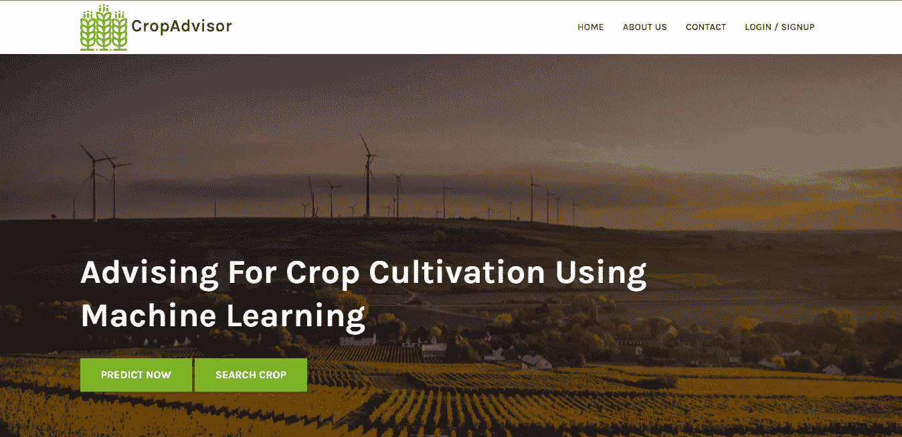
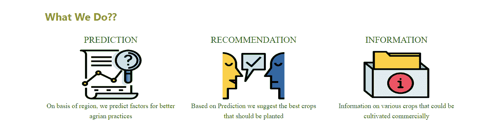
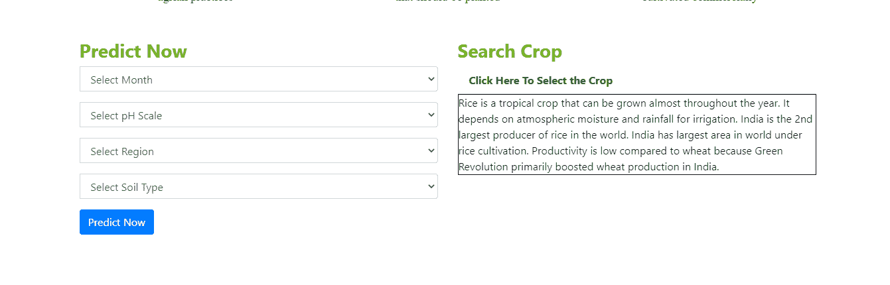
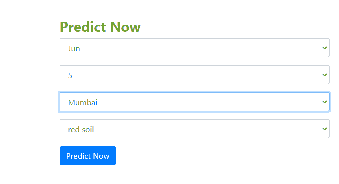
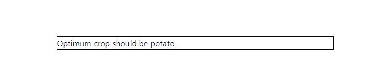
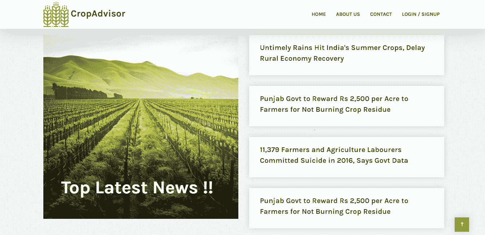

# FarmEasy:轻松为农民推荐作物

> 原文：<https://towardsdatascience.com/farmeasy-crop-recommendation-portal-for-farmers-48a8809b421c?source=collection_archive---------14----------------------->

## 这是我最后一年项目的预演，我建立了一个网站，使用机器学习向农民推荐作物

如果你觉得这篇文章有用，请留下你的掌声，它对我帮助很大！:D



网站主页

> 为了缓解当前现状下的土地危机，需要更好的推荐系统，通过帮助农民在开始种植作物之前做出明智的决定来缓解危机。

# 项目重点:根据几个参数推荐农民种植的最佳作物，并帮助他们在种植前做出明智的决定

这里考虑的主要参数是:

1.作物名称

2.播种时间(月)

3.地区

4.温度-最低和最高

5.降雨量-最小和最大

6.土壤的 pH 值

7.土型


数据文件头

# ***下面我们详细讨论一下*** 的步骤

**第一步:数据收集**

这是项目建设过程中最重要和最关键的一步。

由于没有特定的数据集可用，我不得不从头开始构建数据集，并相应地选择参数。此外，我还考虑了其他几个参数，如*土壤含氮量、灌溉设施、作物轮作周期*，但由于数据不足，无法将它们考虑在内。

获得的数据分布在不同的文件中，例如:

1.  *土壤类型*
2.  *经济作物*
3.  *花*
4.  *水果*
5.  *纹路*
6.  *草药*
7.  *灌木*
8.  *香料*
9.  *树木*
10.  *蔬菜*
11.  *平均降雨量*
12.  *平均温度*

**第二步:数据转换**

数据也有一些不一致之处，因为它是从几个不同的来源获得的，例如:

1.  *缺失值*

必须从数据集中删除缺失值，因为它们会导致数据不一致，并最终导致错误的预测。

2.*拼写失常*

文件中的拼写不一致，必须标准化为单个值以提高模型的准确性。

3.*冗余数据*

冗余数据必须被丢弃，因为它们不会给该过程增加任何额外的意义。

这些数据最终被合并成一个数据集，以简化模型建立和计算的过程。

一旦收集了数据，就检查数据类型并进行更改，例如在需要时从 String -> Integer 更改。

此外，由于机器学习模型只能处理数字，因此需要将字符串值转换为数值。为此，我使用了 ***标签编码技术*** *。*

> *"Label Encoder 是 Scikit Learn 提供的一款工具，可帮助用户将分类特征/变量编码为数字特征。编码器的目标变量在 0 到* n_classes-1 *之间，其中 n 是不同标签的数量*

通过参考官方 Scikit 学习文档[这里](https://scikit-learn.org/stable/modules/generated/sklearn.preprocessing.LabelEncoder.html)，可以了解更多关于标签编码的信息。

**第三步:建模**

这里使用的模型是: ***集成学习模型。***

好的，首先让我们了解一下集成学习是怎么回事！

根据[维基百科](https://en.wikipedia.org/wiki/Ensemble_learning)集成学习陈述如下:

> “集成学习方法在统计和机器学习中使用多种学习算法，以实现比单独使用任一组成学习算法可能获得的更高的预测效率。”

这里，我利用了 Scikit Learn 提供的投票分类器的功能。

```
from sklearn.ensemble import VotingClassifiermodel=VotingClassifier(estimators=[('rf', random_forest),('gnb',gaussian_naive_bayes),('knn',k_nearest_neighbours), ('dt',decision_tree)  ], voting=''hard) 
```

从上面的代码片段可以看出，该模型是使用下面列出的算法构建的:

> *随机森林算法*
> 
> *高斯朴素贝叶斯算法*
> 
> *K-最近邻算法*
> 
> *决策树算法*

此处投票参数设置为“硬”，因为模型使用预测类标签进行多数规则投票。

**第四步:模型部署**

为了部署农民使用的训练模型，我们需要一个简单的用户界面，农民可以利用的应用程序。

因此，这里我用 HTML、CSS 和 Bootstrap 制作了一个简单的 web 界面。

下一步是建立一个数据库来存储我使用的数据:MongoDb

最后，我想预测从用户那里获得的值的结果，为此我利用 Flask 框架来集成后端和前端。此外，我为我们的模型生成了 pickle 文件，以便为输入数据生成预测。好吧，你可能会想什么是泡菜文件？我们也来看看吧。

根据 docs.python.org 的官方 Python 文档:

> pickle 模块实现了二进制协议来序列化和反序列化一个 Python 对象结构“pickle”是将 Python 对象层次转换为字节流的过程，“unpickling”是相反的操作，将字节流(从一个 [*二进制文件*](https://docs.python.org/3/glossary.html#term-binary-file) *或* [*类似字节的对象*](https://docs.python.org/3/glossary.html#term-bytes-like-object) *)转换回对象层次*

简而言之，pickled 文件将训练好的模型转换成字节流，并被发送到网站，在网站上再次被解压缩，用于训练来自农民的输入数据。

# **网站**

*   ***农民登录页面***


农民需要输入他们的详细信息，例如:

> 名字
> 
> 电子邮件 Id
> 
> 密码

*   ***提供的服务***



> 预言；预测；预告
> 
> 建议
> 
> 信息

*   ***预测现在&搜索一茬***



如果农民想要搜索特定作物的更多信息，那么“*搜索作物部分”*将会提供帮助*。*

它帮助农民更好地了解农作物的详细信息。

**预测现在章节**

**预测现在为农民引入了以下参数:**

> **月**
> 
> **pH 标度**
> 
> **地区**
> 
> **土型**

**此外，根据农民提到的地区，从数据库本身考虑 2 个参数**

> **温度**
> 
> **降雨**

****

**输入值后，农民可以点击“现在预测”按钮。**

**最佳*作物名称*显示给农民种植。**

****

# ****实施的附加功能****

****RSS 新闻提要****

****

**为农民增加了 RSS 功能，使他们可以阅读和更新信息丰富的新闻！**

****基于声音的建模系统****

**此外，我还尝试实现了一个问答系统模型，在这个模型中，我以问题的形式给出语音输入，然后以语音的形式得到回答。**

**该系统已被纳入网站，以减轻农民在申请饲养的过程。农民只需要点击输入栏下面的🎙️就可以说话了！**

**此处使用的概念和库:**

*   **iNLTK(自然语言工具包)——用本地语言(这里是印地语)输入**
*   **语音识别-用于接收农民的语音输入**
*   **gTTS(谷歌文本到语音)-通过语音向农民提供输出**
*   **Scikit Learn-使用 NLP 库**

# ****结论****

**我与我的同事 [Nipun Iyer](https://medium.com/u/670ba1679b7b?source=post_page-----48a8809b421c--------------------------------) 合作，为农民建立了一个门户网站，这将帮助他们获得有关作物种植策略的帮助，主要是农作物的预测、推荐和信息服务。**

**感谢您抽出时间阅读这篇文章！🙂**

**如果您有任何疑问，或者想对项目进行更多的讨论和了解，请联系我这里的，我们将非常乐意与您交谈！**