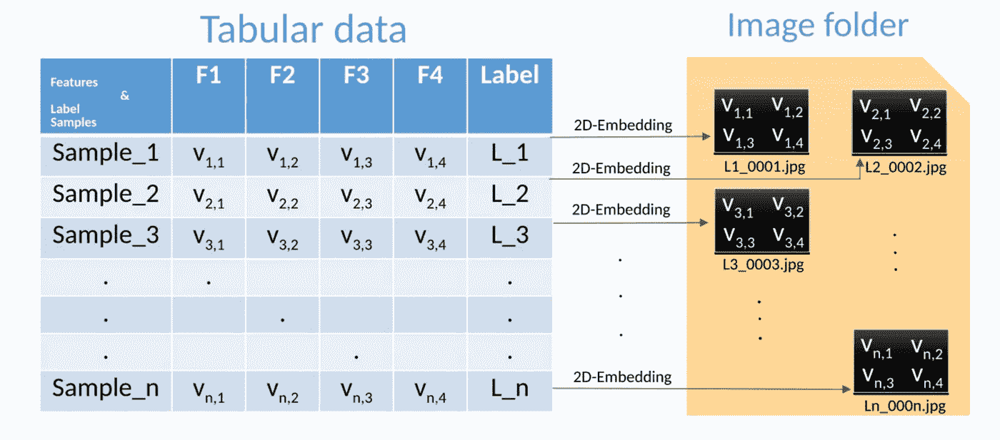
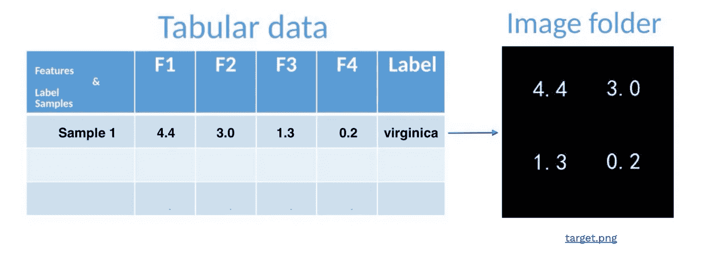
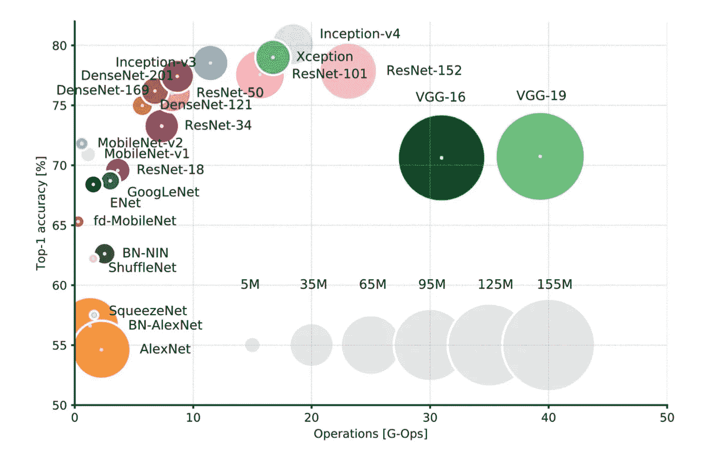
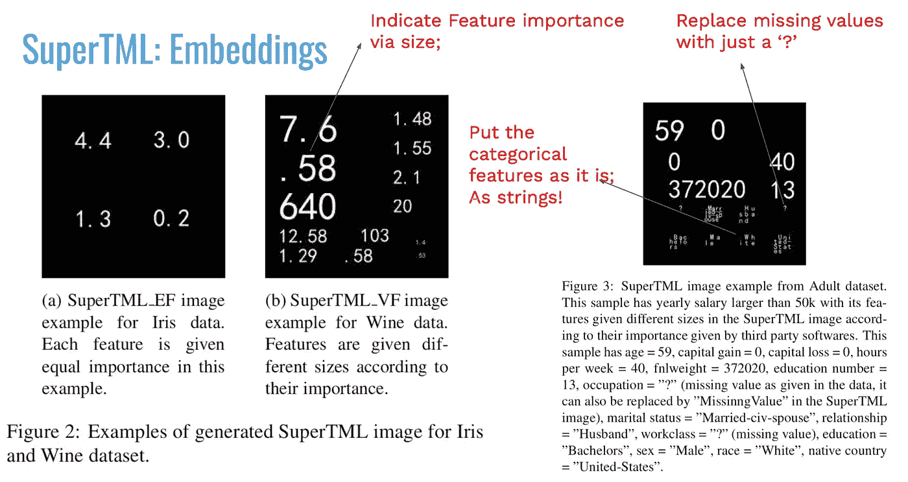
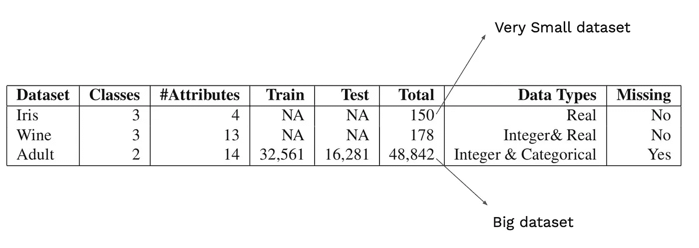
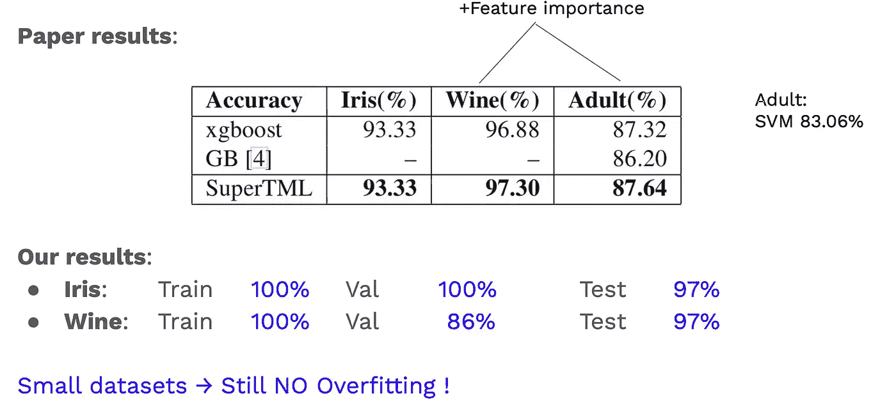

# 用神经网络和迁移学习对表格数据建模！怎么做，为什么？

> 原文：<https://towardsdatascience.com/fast-and-accurate-learning-with-transfer-learning-on-tabular-data-how-and-why-dfe4e752bb2d?source=collection_archive---------13----------------------->

SuperTML([https://arxiv.org/abs/1903.06246](https://arxiv.org/abs/1903.06246))

*我们如何微调自然图像的分类器来执行表格数据的机器学习任务？答案叫 SuperTML。*

# 介绍

一般来说，我们可以将我们的数据分为**非结构化**数据(那些可以用不统一的格式维护的数据，如图像和文本)和**结构化**数据(常见的表格)。在第一类中，大部分赢家是深度学习模型(CNN、RNNs 等)。然而，在后一种情况下，基于提升树的算法(如 XGBoost，LightGBM，CatBoost)占据主导地位。

通常，当数据科学家处理表格数据时，他们花费大约 60%-80%的时间进行数据预处理步骤(清理数据、探索数据分析(EDA)、可视化图形等)。相比之下，在非结构化数据的任务中，例如图像分类，我们只需**将我们的图像从它们离开的离散空间去量化到连续空间，以便能够执行反向传播。神经网络的另一个主要优势是执行迁移学习的能力——我们不是从随机初始化开始，而是对数百万数据使用预先训练的模型，希望(主要)第一层卷积已经捕获了数据的一些重要的一般概念。**

问题是:是否有另一种新颖的方式来制作表格，即
更容易实现，
帮助我们节省一些时间，
归档很好的结果？

> 完整的代码可以在[这里](https://github.com/ioangatop/super_tml)找到

# 方法:SuperTML

受最近 NLP 研究的启发，**超级字符**方法的**二维嵌入**能够在大型数据集基准上实现最先进的结果， *Sun 等人。艾尔。(*【https://arxiv.org/abs/1903.06246】*)*借用这个概念来解决表格机器学习(TML)的问题！

这个被称为 SuperTML 的想法既超级简单又疯狂；它由两个步骤组成:

*   创建二维嵌入；
    将表格数据中的特征投影到生成的图像上

将表格数据投影到图像上。([https://arxiv.org/abs/1903.06246](https://arxiv.org/abs/1903.06246))

*   使用**预先训练的 CNN** 模型(在 ImageNet 上？！)对生成的 SuperTML 图像进行微调。

深度神经网络分类器在 ImageNet 上的性能。([https://www . ee journal . com/article/neural-net-inference-benchmarks/](https://www.eejournal.com/article/neural-net-inference-benchmarks/))

也许这个过程中最疯狂的部分是，图像(或二维嵌入)现在具有以下属性:

SuperTML 数据属性。(【https://arxiv.org/abs/1903.06246】T2

*   如果某些特性比其他特性更重要(先验知识)，只需*增加数量的大小！*
*   缺失数据？只是用“？”替换它们(!！)
*   分类特征？就按原样(作为字符串)放好了

> 重述:
> **核心思想**:表格数据可以嵌入二维矩阵(一个图像)
> **问题:**这种方法行得通吗？如果是，为什么？！

很多读者大概和我有一样的反应:“这不可能行得通！这工作太疯狂了！”。并为实验和评估部分创建了一个不错的事务

# 实验

在本节中，除了论文中介绍的结果，我将分享我的实现结果(代码在此处[可用](https://github.com/ioangatop/super_tml))。

我们将探索 3 个数据集，两个非常小(DNN 模型容易过度拟合)和一个大的。下表显示了它们的详细信息:

([https://arxiv.org/abs/1903.06246](https://arxiv.org/abs/1903.06246))

以下内容表明了神经网络适应任何给定任务的能力，并且非常疯狂:

([https://arxiv.org/abs/1903.06246](https://arxiv.org/abs/1903.06246))

那些仍然没有被打动的人，这篇论文展示了一个非常具有挑战性的任务的结果，希格斯玻色子挑战。30 个特征的数据集；25，000 个训练/ 55，000 个测试样本不足以阻止 SuperTML 并允许它大幅度攀升到顶端(更多详细信息，请参考论文)！

> 一个超级琐碎的想法，非常容易实现，以 0.170 的优势超过了 kaggle 竞赛(需要大量的功能工程)的获胜者！就凭一张图片！

# 为什么会这样？？

*作者的意见来了...*

似乎该算法学习特征(数字、文本)的视觉表示，并且**学习**与来自另一个样本的它们的类似物进行比较。

它知道 4 接近 5，但知道数字之间的相对距离；即使对于标准算法，4.5 和 4.7 的距离与 4.1 和 4.3 具有相同的值(或权重)，该算法通过数据学习它们的关系，现在我们也许可以认为这个距离是*学习的*(我们可以认为该算法学习自己的算法)！

# 概观

**优点** 简单的想法易于使用和操作
无需数据标准化，无需分类特征特殊处理无需通过网格搜索进行昂贵的微调
利用最好的 CNN 分类器
无需在小数据集上过度拟合

**缺点:** 确保图像上的特征不重叠
数值在数字的形状背后有一些隐藏的关系，比如 6.01 和 5.999(到目前为止确实阻止了我们！)

# 最后的问题

所以，

> **我们真的需要表格数据中的数值吗**
> 
> 运筹学
> 
> **特性的关系就够了？**🤔

如前所述，完整的代码可以在这里找到[。你可以随意摆弄它，尝试更多疯狂的想法！](https://github.com/ioangatop/super_tml)

下次再见，保重！

论文:[https://arxiv.org/abs/1903.06246](https://arxiv.org/abs/1903.06246)代号:[https://github.com/ioangatop/super_tml](https://github.com/ioangatop/super_tml)