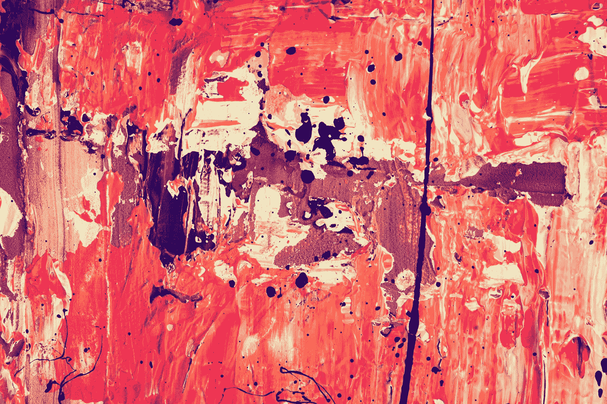
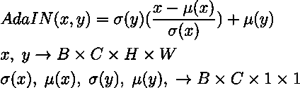
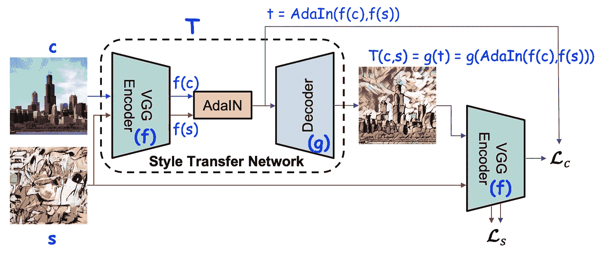
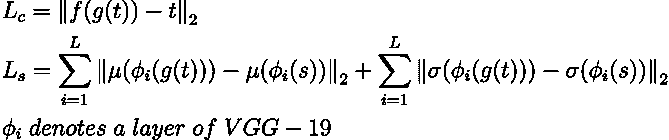

# 快速任意的风格转换

> 原文：<https://towardsdatascience.com/fast-and-arbitrary-style-transfer-40e29d308dd3?source=collection_archive---------34----------------------->

## 神经类型转移，进化

## 基于自适应实例归一化的图像风格转换

[斯蒂夫·约翰森](https://unsplash.com/@steve_j?utm_source=unsplash&utm_medium=referral&utm_content=creditCopyText)在 [Unsplash](https://unsplash.com/s/photos/modern-art?utm_source=unsplash&utm_medium=referral&utm_content=creditCopyText) 上拍照

## 介绍

加蒂丝*等人的开创性工作*。[R1]表明深度神经网络(DNNs)不仅编码图像的*内容，还编码图像的 ***风格*** 信息。此外，图像样式和内容在某种程度上是可分的:可以在保留图像内容的同时改变其样式。他们的 [*方法*](/slow-and-arbitrary-style-transfer-3860870c8f0e) 足够灵活，可以将 ***的内容和风格任意组合*** 的画面。然而，它依赖于一个 ***非常慢*** 的优化过程。*

*具有前馈神经网络的快速近似[R2，R3]已经被提议用于 ***加速*** 神经类型转移。不幸的是，速度的提高是有代价的:网络要么被*限制为一个 [*单一样式*](/fast-and-restricted-style-transfer-bbfc383cccd6) *，*或网络被束缚于一个 [*样式*](/fast-and-less-restricted-style-transfer-50366c43f672) *的有限集合。***

**黄和解决了这个基本的灵活性和速度的两难问题。众所周知，CNN 的 ***卷积特征统计*** 可以捕捉到一幅图像的风格。Gatys*et al .*【R1】使用二阶统计量作为优化目标，而 Li*et al .*【R5】表明匹配许多其他统计量，包括通道方式的均值和方差，对于风格转换也是有效的。因此，我们可以认为 [***实例归一化***](https://becominghuman.ai/all-about-normalization-6ea79e70894b) 通过归一化特征统计，即均值和方差，执行了一种形式的*样式归一化。***

> *****为什么不批量归一化？*****
> 
> ***由于 **BN** 对一批样本而不是单个样本的特征统计进行归一化，因此可以直观地理解为对一批样本进行归一化，使其以单个样式为中心，尽管需要不同的目标样式。***
> 
> ***另一方面，中的**可以将每个个体样本的风格归一化为目标风格:不同的仿射参数可以将特征统计归一化为不同的值，从而将输出图像归一化为不同的风格。*****

## ***自适应实例规范化***

******AdaIN*** 接收一个 ***内容*** 输入 ***x*** 和一个 ***样式*** 输入 ***y*** ，并简单地对齐 ***x*** 的信道均值和方差以匹配 ***y*** 。与 BN、IN 或 CIN *(* [***条件实例规范化***](/fast-and-less-restricted-style-transfer-50366c43f672?source=your_stories_page---------------------------) *)* 不同，AdaIN 没有可学习的仿射参数。相反，它 ***自适应地*** 从样式输入中计算仿射参数。***

****

****图 1** 。自适应[实例规范化](https://becominghuman.ai/all-about-normalization-6ea79e70894b)**

**直观地，让我们考虑一个检测某种风格的笔触的特征通道。具有这种笔画的风格图像将为该特征产生 ***高平均激活*** 。此外，这一特定笔触的微妙风格信息将由 ***方差*** 捕获。因为 AdaIN 仅缩放和移动激活，所以保留了内容图像的 ***空间信息*** 。**

## **风格转移网络**

**AdaIN ***风格传递网络*** ***T*** (图 2)以一个 ***内容图像 c*** 和一个任意的 ***风格图像 s*** 作为输入，并合成一个 ***输出图像*** ***T(c，s)*** ，该输出图像重新组合了各个输入图像的内容和风格。网络采用简单的编解码架构，其中 ***编码器*** ***f*** 固定在一个预训练好的 VGG-19 的前几层。在特征空间中对内容和风格图像进行编码之后，两个特征图都被馈送到一个 ***AdaIN*** 层，该层将内容特征图的均值和方差与风格特征图的均值和方差对齐，产生 ***目标特征图*** ***t*** 。一个随机初始化的 ***解码器 g*** 被训练将 ***t*** 反转回图像空间，生成 ***风格化图像 T(c，s)*** 。**

****

****图 2** 基于 AdaIN 的风格传递网络。图片取自“[R4]通过自适应实例规范化实时传输任意样式”。蓝色的自我注释。**

> ****解码器中的归一化层数？****
> 
> **除了使用最近的上采样来减少棋盘效应，以及在 f 和 g 中使用反射填充来避免边界伪像之外，一个关键的架构选择是在解码器中使用标准化层**而不是**。因为 IN 将每个样本归一化为单一样式，而 BN 将一批样本归一化为以单一样式为中心，所以当我们希望解码器以非常不同的样式生成图像时，两者都是不理想的。**

## **损失函数**

**使用内容损失函数 ***Lc*** 和风格损失函数 ***Ls*** 的加权组合来训练风格传递网络 ***T*** 。**

****

**图三。内容和风格损失函数**

**内容损失是目标特征*和输出图像特征 ***f(g(t))*** 之间的欧几里德距离。AdaIN 输出 ***t*** 用作内容目标，而不是内容图像的常用特征响应，因为它与反转 AdaIN 输出 ***t*** 的目标一致。***

**由于 AdaIN 层仅传输风格特征的平均值和标准偏差，所以风格损失仅匹配风格图像 ***s*** 和输出图像 ***g(t)*** 的特征激活的这些统计。在 VGG-19 的多层(i=1 到 L)上，风格损失是平均的。**

## ****结论****

**本质上，上述 AdaIN 风格传输网络提供了在*中组合 ***任意*** 内容和风格图像的灵活性。***

## **参考**

1.  **利昂·A·加蒂斯、亚历山大·S·埃克和马蒂亚斯·贝奇。[使用卷积神经网络的图像风格转换](https://www.cv-foundation.org/openaccess/content_cvpr_2016/papers/Gatys_Image_Style_Transfer_CVPR_2016_paper.pdf)。在 *CVPR* ，2016。**
2.  **贾斯廷·约翰逊，亚历山大·阿拉希和李菲菲。[实时风格转换和超分辨率的感知损失](https://arxiv.org/abs/1603.08155)。在*ECCV*2016 年。**
3.  **文森特·杜穆林，黄邦贤·史伦斯，曼朱纳斯·库德鲁尔。[艺术风格的学术代表](https://arxiv.org/abs/1610.07629)。在 *ICLR，* 2017。**
4.  **塞尔日·贝隆吉·黄浚。[通过自适应实例标准化实时传输任意样式](https://arxiv.org/abs/1703.06868)。在 *ICCV，* 2017。**
5.  **李，王乃彦，，侯晓迪。[揭秘神经风格转移](https://arxiv.org/abs/1701.01036)。在 IJCAI，2017。**