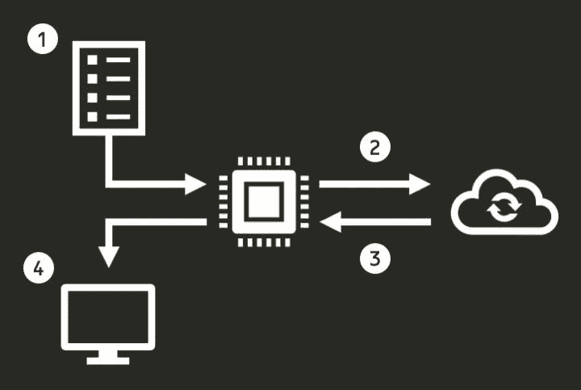

# Python 中的快速和异步

> 原文：<https://towardsdatascience.com/fast-and-async-in-python-accelerate-your-requests-using-asyncio-62dafca83c33?source=collection_archive---------0----------------------->

## 使用 asyncio 加速您的请求


照片由[马克-奥利维尔·乔多因](https://unsplash.com/@marcojodoin)在 [Unsplash](https://unsplash.com/photos/NqOInJ-ttqM) 拍摄

几周前，我正在编写一个 Python 脚本，为一个基于内容的推荐器提取图书的元数据。几个小时后，我意识到我需要向 Google Books API 发出数千个请求来获取数据。所以我想一定有办法可以加速这个过程。

因为我喜欢学习，尤其是当这也是一个拖延我的目标的机会时，我决定用 asyncio 建立一个项目。后来，我为浪费的时间感到内疚，决定用我在这个过程中学到的东西来写这篇教程。

本文旨在提供如何使用 *asyncio* 向 API 发出异步请求的基础知识。我主要关注实际代码，跳过大部分理论(除了下面的简短介绍)。但是，如果您正在寻找关于 *asyncio* 的更深入的介绍，请查看参考资料中的建议。

# 30 秒或更短时间内的异步

asyncio 是一个 Python 库，它允许你以看似并发的方式执行一些任务。它通常用于网络服务器和数据库连接。它对于加速 IO 绑定的任务也很有用，比如需要发出许多请求或等待外部 API 的服务。

*asyncio* 的本质在于，它允许程序在等待特定进程完成时继续执行其他指令(例如，对 API 的请求)。在本教程中，我们将看到如何使用 *asyncio* 来加速一个向 API 发出多个请求的程序。

# 顺序与异步

所以还是言归正传吧。为了从本教程中获得最大收益，请尝试自己运行代码。这些代码片段已经通过了 Python 3.8.3 的测试。您可以尝试使用更新的版本运行它们，但是它们可能需要一些小的更改。

在运行代码之前，您需要安装所需的库:`requests`和`aiohttp`。然后，你可以在一个 **Jupyter 笔记本**中运行下面的代码片段。如果你想使用一个 **Python 脚本**来运行代码片段，你需要做一些小的改动来让它工作。

我们将构建一个小程序的顺序版本和异步版本，并比较它们的结果和结构。这两个程序将做同样的事情:

1.  阅读 ISBNs(图书的国际标识符)列表
2.  向 Google Books API 请求图书的元数据
3.  解析请求的结果
4.  将结果打印到屏幕上。

该算法类似于下图。



算法图

现在，我们将比较两种构建该算法的可能方法。首先是*选项 A* ，它按顺序执行请求。然后，*选项 B* ，它使用 *asyncio* 异步运行请求。

# 选项 A:顺序算法

该算法的顺序版本可能如下所示:

```
import os
import json
import requests  
from requests.exceptions import HTTPError

GOOGLE_BOOKS_URL = "https://www.googleapis.com/books/v1/volumes?q=isbn:"
LIST_ISBN = [
    '9780002005883',
    '9780002238304',
    '9780002261982',
    '9780006163831',
    '9780006178736',
    '9780006280897',
    '9780006280934',
    '9780006353287',
    '9780006380832',
    '9780006470229',
]

def extract_fields_from_response(item):
	"""Extract fields from API's response"""
    volume_info = item.get("volumeInfo", {})
    title = volume_info.get("title", None)
    subtitle = volume_info.get("subtitle", None)
    description = volume_info.get("description", None)
    published_date = volume_info.get("publishedDate", None)
    return (
        title,
        subtitle,
        description,
        published_date,
    )

def get_book_details_seq(isbn, session):
	"""Get book details using Google Books API (sequentially)"""
    url = GOOGLE_BOOKS_URL + isbn
    response = None
    try:
        response = session.get(url)
        response.raise_for_status()
        print(f"Response status ({url}): {response.status_code}")
    except HTTPError as http_err:
        print(f"HTTP error occurred: {http_err}")
    except Exception as err:
        print(f"An error ocurred: {err}")
    response_json = response.json()
    items = response_json.get("items", [{}])[0]
    return items

with requests.Session() as session:
    for isbn in LIST_ISBN:
        try:
            response = get_book_details_seq(isbn, session)
            parsed_response = extract_fields_from_response(response)
            print(f"Response: {json.dumps(parsed_response, indent=2)}")
        except Exception as err:
            print(f"Exception occured: {err}")
            pass
```

现在，让我们分解代码来理解发生了什么。

像往常一样，我们从导入所需的库开始。然后，我们定义两个变量:

*   用于指定我们将用于请求的 Google API 的 URL。对 Google Books API 的请求看起来是这样的:`[https://www.googleapis.com/books/v1/volumes?q=isbn:9780002005883](https://www.googleapis.com/books/v1/volumes?q=isbn:9780002005883)`
*   `LIST_ISBN`、*、*这是测试程序的 ISBNs 的样本列表。

```
import os
import json
import requests
from requests.exceptions import HTTPError

GOOGLE_BOOKS_URL = "https://www.googleapis.com/books/v1/volumes?q=isbn:"
LIST_ISBN = [
    '9780002005883',
    '9780002238304',
    '9780002261982',
    '9780006163831',
    '9780006178736',
    '9780006280897',
    '9780006280934',
    '9780006353287',
    '9780006380832',
    '9780006470229',
]
```

接下来，我们定义`extract_fields_from_response` 功能。该函数将来自 API 的响应作为输入，并提取我们感兴趣的字段。

```
def extract_fields_from_response(response):
    """Extract fields from API's response"""
    item = response.get("items", [{}])[0]
    volume_info = item.get("volumeInfo", {})
    title = volume_info.get("title", None)
    subtitle = volume_info.get("subtitle", None)
    description = volume_info.get("description", None)
    published_date = volume_info.get("publishedDate", None)
    return (
        title,
        subtitle,
        description,
        published_date,
    )
```

`extract_fields_from_response`中的解析过程基于来自 Google Books API 的响应结构，如下所示:

```
{
 "kind": "books#volumes",
 "totalItems": 1,
 "items": [
  {
   "kind": "books#volume",
   "id": "3Mx4QgAACAAJ",
   "etag": "FWJF/JY16xg",
   "selfLink": "https://www.googleapis.com/books/v1/volumes/3Mx4QgAACAAJ",
   "volumeInfo": {
    "title": "Mapping the Big Picture",
    "subtitle": "Integrating Curriculum and Assessment, K-12",
    ...
```

最后，我们进入程序最相关的部分:我们如何向 Google Books API 发出请求。

```
def get_book_details_seq(isbn, session):
	"""Get book details using Google Books API (sequentially)"""
    url = GOOGLE_BOOKS_URL + isbn
    response = None
    try:
        response = session.get(url)
        response.raise_for_status()
        print(f"Response status ({url}): {response.status_code}")
    except HTTPError as http_err:
        print(f"HTTP error occurred: {http_err}")
    except Exception as err:
        print(f"An error ocurred: {err}")
    response_json = response.json()
    items = response_json.get("items", [{}])[0]
    return items

with requests.Session() as session:
    for isbn in LIST_ISBN:
        try:
            response = get_book_details_seq(isbn, session)
            parsed_response = extract_fields_from_response(response)
            print(f"Response: {json.dumps(parsed_response, indent=2)}")
        except Exception as err:
            print(f"Exception occured: {err}")
            pass
```

这里有两个主要部分:

*   `get_book_details_seq`，它是执行请求的函数。它将一个 ISBN 和一个会话 object⁴作为输入，并将来自 API 的响应作为 JSON 结构返回。它还处理可能的错误，比如提供了错误的 URL 或者超出了每天的请求限额。
*   在`with requests.Session() as session`下的代码块，是整个管道被编排的地方。它遍历 ISBNs 列表，获取书籍的详细信息，解析它们，最后将详细信息打印到屏幕上。

对我来说，**执行这个过程需要 4 到 6 秒**。如果你只需要这样做几次，你不会发现使用 *asyncio* 有什么好处。然而，如果不是 10 个请求，而是 10，000 个请求，那么程序中的并发性是值得的。在下一节中，我们将看到如何使用 *asyncio* 使这个算法更快。

# 选项 B:异步算法

同一算法的异步版本可能如下所示:

```
import aiohttp
import asyncio
import json
import osfrom aiohttp import ClientSession

GOOGLE_BOOKS_URL = "https://www.googleapis.com/books/v1/volumes?q=isbn:"
LIST_ISBN = [
    '9780002005883',
    '9780002238304',
    '9780002261982',
    '9780006163831',
    '9780006178736',
    '9780006280897',
    '9780006280934',
    '9780006353287',
    '9780006380832',
    '9780006470229',
]

def extract_fields_from_response(response):
    """Extract fields from API's response"""
    item = response.get("items", [{}])[0]
    volume_info = item.get("volumeInfo", {})
    title = volume_info.get("title", None)
    subtitle = volume_info.get("subtitle", None)
    description = volume_info.get("description", None)
    published_date = volume_info.get("publishedDate", None)
    return (
        title,
        subtitle,
        description,
        published_date,
    )

async def get_book_details_async(isbn, session):
    """Get book details using Google Books API (asynchronously)"""
    url = GOOGLE_BOOKS_URL + isbn
    try:
        response = await session.request(method='GET', url=url)
        response.raise_for_status()
        print(f"Response status ({url}): {response.status}")
    except HTTPError as http_err:
        print(f"HTTP error occurred: {http_err}")
    except Exception as err:
        print(f"An error ocurred: {err}")
    response_json = await response.json()
    return response_json

async def run_program(isbn, session):
    """Wrapper for running program in an asynchronous manner"""
    try:
        response = await get_book_details_async(isbn, session)
        parsed_response = extract_fields_from_response(response)
        print(f"Response: {json.dumps(parsed_response, indent=2)}")
    except Exception as err:
        print(f"Exception occured: {err}")
        pass

async with ClientSession() as session:
    await asyncio.gather(*[run_program(isbn, session) for isbn in LIST_ISBN])
```

首先，检查`get_book_details_async`功能。一个`async`关键字在它前面。这个关键字告诉 Python 你的函数是一个协程。然后，在函数体中，有两个 await 关键字。这些命令告诉协程暂停执行，并在等待操作完成时将控制权交还给事件循环。

一个*协程*是 Python 中的一种生成器函数，它不产生值，而是消耗 values⁵.有趣的是，在等待新数据发送给它时，它的执行会暂停。在我们的例子中，这允许程序的其他部分以表面上并发的方式继续执行。

在这种情况下，当请求正在执行时，`get_book_details_async`的执行被暂停:`await session.request(method='GET', url=url)`。当请求响应被解析成 JSON 结构:`await response.json()`时，它再次被挂起。

接下来，我们有了`run_program`协程。这个只是从 API 获取响应、解析响应并在屏幕上打印结果的管道的包装器。它*等待*协程`get_book_details_async`的执行。

最后，我们有了`async with ClientSession() as session:`下的代码块。使用`asyncio.gather`语法，我们告诉程序根据我们提供的协程列表来调度所有任务。这使得我们可以同时执行任务。

对我来说，**运行这个过程大约需要 800-1000 毫秒。**

# 结果

比较这两个版本，我们看到异步版本比顺序版本快 4 到 7.5 倍。如果我们增加请求的数量，您可能会获得更高的加速。此外，**使用 *asyncio* 的版本并不比顺序版本**复杂多少，这使得使用 asyncio 成为我们在教程中回顾的那类任务的一个极好的选择。

# 其他建议

以下是我在与 asyncio 合作时收集的一些技巧

*   *asyncio* 一直在变，警惕老栈溢出答案。其中许多都不符合当前的最佳实践
*   外部 API 不允许您运行无限的并发请求。为了克服这一点，看看 asyncio 的信号量。它将使您能够限制应用程序的并发性。
*   不是所有的程序都可以用 asyncio 加速。在对代码进行任何实质性的修改之前，研究一下你所面临的问题的类型。其他的选择可能对你有用(例如，[线程，](https://docs.python.org/3/library/threading.html) [多重处理](https://docs.python.org/2/library/multiprocessing.html))
*   我制作了一个完整版本的程序，用于获取近 7 千本书的元数据。下面是它的链接:[谷歌图书爬虫](https://github.com/dylanjcastillo/google_books_crawler)。

# 注释和参考文献

[1] Real Python 有两篇精彩的文章介绍了*asyncio*:[Python 中的异步 IO](https://realpython.com/async-io-python/)和[用并发性加速您的 Python 程序](https://realpython.com/python-concurrency)

[2]不是严格的并发执行。但实际上，看起来确实如此。

[3] S. Buczyński，[Python 3.6 中协程和 asyncio 的用例是什么？](https://www.quora.com/What-is-the-use-case-for-asyncio-and-coroutines-in-Python-3-6)

[4]会话对象是来自请求库的一种功能，它允许您跨会话保持某些参数。这通常会降低请求的延迟。点击阅读更多[。](https://2.python-requests.org/en/v1.1.0/user/advanced/)

[5] D. Beasly，[一门关于 Couroutines 和并发性的奇特课程](http://www.dabeaz.com/coroutines/Coroutines.pdf) (2009)