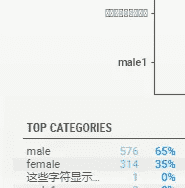

# 使用 Sweetviz 1.1 进行快速、深入的探索性数据分析

> 原文：<https://towardsdatascience.com/fast-and-insightful-eda-exploratory-data-analysis-using-sweetviz-1-1-3dd0f2389b6c?source=collection_archive---------46----------------------->

## 充分利用 Sweetviz 的新功能


Sweetviz 的主要特征—作者图片

其中最刺激(也最吓人！一个数据科学项目中的瞬间是第一次看一组新的数据。

探索其特性、组成和特征就像发现数据的高层故事。您可能知道探索性数据分析(EDA)的过程。

然而，在浏览数据项目时，我发现我总是有同样的问题想要立即得到回答:

*   什么是**特征，它们的类型和分布**？
*   他们之间有没有**什么关联或者关系**？
*   有多少**缺失数据或重复数据**，有哪些常用值？

如果有**目标变量**:

*   它的类型和分布是怎样的？
*   我们的目标和其他特征之间有任何**关系或相关性吗？**

如果**有多个数据集**，或者甚至**在同一个数据集**内比较子群体:

*   数据集/亚群有何不同？(例如，训练与测试数据、男性与女性子集等。)

回答这些问题的过程似乎是不必要的耗时和重复，所以我想:“如果这个过程是自动化的，并且您可以只使用 1-2 行代码来回答所有这些问题，那该多好？”

这就是我创建 [Sweetviz](https://github.com/fbdesignpro/sweetviz) 的原因。它是一个 Python 开源库，可以使用 [pip](https://pypi.org/project/sweetviz/) 安装，目前[托管在 GitHub](https://github.com/fbdesignpro/sweetviz) 上。还有其他高质量的 EDA 软件包，如 [pandas-profiling](https://github.com/pandas-profiling/pandas-profiling) 和 [AutoViz](https://autoviz.io) ，你也应该检查一下，因为个人需求和偏好各不相同。重要的是找到对你最有帮助的工具。然而，就我个人而言，我发现他们没有提供我想要的所有信息，尤其是关于分离目标变量和比较数据集/子群体的信息。

所以我开发了 Sweetviz 来立即提供尽可能多的信息，并且只用了两行代码。

## Sweetviz 概述

如果您发现 Sweetviz 可能对您有用，并且您还不熟悉它，我写了另一篇[中型文章](/powerful-eda-exploratory-data-analysis-in-just-two-lines-of-code-using-sweetviz-6c943d32f34)，深入介绍了它的核心特性、用法，并提供了一个示例案例研究。

# 充分利用 1.1 的新特性

除了介绍这个库之外，本文的主要目标是展示 1.1 中新特性的最佳用法。这个新版本的库并不是一个主要的更新，但是包含了一些新的特性，这些特性将使所有用户受益，并且它们的用法值得描述。

## 颜色编码的缺失数据


缺失值用颜色编码，从绿色(少量缺失值)到红色(> 75%缺失值)-按作者分类的图像

在数据可视化中，有时一个小的差异会产生很大的影响。1.1 中更具影响力的新增功能之一是，当存在缺失数据时，每个要素的缺失百分比现在会高亮显示并进行颜色编码。

这是 GitHub 上的一个用户建议的，真的很重要。使用此功能，您现在可以快速查看哪些功能缺少数据，以及缺少多少数据。对我来说，它不像报告的其他部分那样美观，但我想这是重点，让人们注意到数据中的缺陷。

## 启用中文、日文、韩文(CJK)字符支持



使用。ini 覆盖，CJK 现在可以正确地呈现在图形中，没有警告(参见上面的例子，这些是如何在图形的顶部呈现为“未知字符”符号)-作者的图像。

尽管 web 浏览器通常为字体中不存在的字符提供后备渲染，但 Sweetviz 的 matplotlib 图形渲染部分不提供，因此用户在渲染包含 CJK(和其他非拉丁语)字符的功能时会遇到问题。

图形仍会呈现，但是在报告生成期间会显示警告，并且图形上会显示“未知字符”符号。

1.1 版本嵌入了 CJK 字体。然而，因为它对于拉丁字符(这是现在的主要用例)来说不够紧凑，**在默认情况下没有启用**。如果您*正在*处理使用 CJK 字符的数据，只需使用一个定制的 INI 来启用它(或者如果您更熟悉 Python 包的安装结构并且在所有项目中都需要它，请编辑已安装的包中的 sweetviz_defaults.ini)。

首先，创建一个包含[General]部分和 use_cjk_font = 1 键的覆盖 INI 文件，如下所示:

```
[General]
use_cjk_font = 1
```

然后，在执行任何其他 Sweetviz 调用之前，加载覆盖文件:

```
sv.config_parser.read("Override.ini")
```

## 删除浏览器弹出窗口

默认情况下，在生成报告后，Sweetviz 会尝试打开它刚刚自动生成的 HTML 文件。在许多情况下，这不是我们想要的行为，所以在 show_html()函数中添加了一个“open_browser”选项。您可以按如下方式使用它:

```
my_report.show_html(filepath='SWEETVIZ_REPORT.html', open_browser=True)
```

## 增强的目标和相关性突出显示


目标变量和显著相关性的新突出显示—作者图片

相关性和关联性是 Sweetviz 自动生成的一些最有价值的信息。1.1 版通过清晰地突出显示目标变量(当存在时)并使用**粗体**显示高于某个阈值的值，增强了这些值的显示。

与 CJK 支持一样，可以使用 INI 覆盖设置该阈值:

```
us since[General]
association_min_to_bold = 0.1
```

# 结论

Sweetviz 1.1 中的这些新功能提高了洞察力和可用性，是该开源项目持续开发的一部分。

Sweetviz 以简洁紧凑的形式汇总数据，回答了我在查看新数据集时遇到的大多数初始问题。它提供了即时的见解，节省了我大量的时间，我希望你和我一样觉得它很有用。