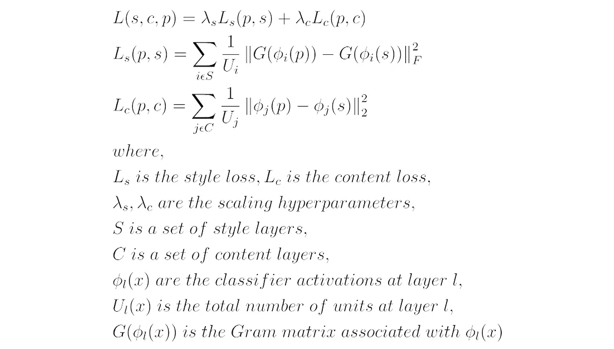
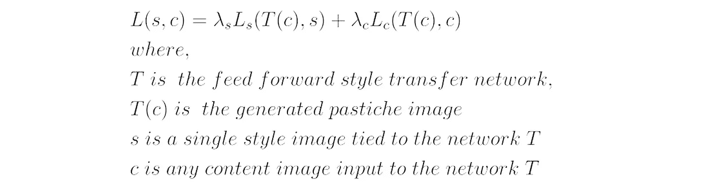
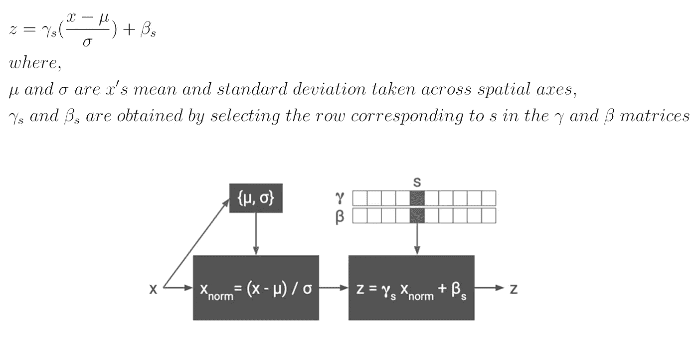
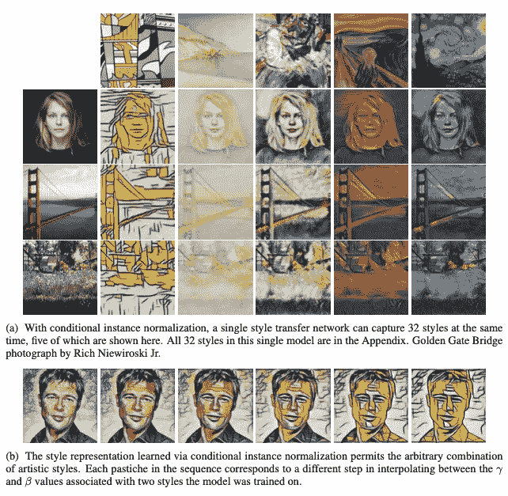

# 更快和更少限制的风格转移

> 原文：<https://towardsdatascience.com/fast-and-less-restricted-style-transfer-50366c43f672?source=collection_archive---------51----------------------->

## 神经类型转移，进化

## 基于条件实例规范化的图像风格转换

## 介绍

仿制品是模仿另一件作品风格的艺术作品。 ***风格转移*** 可以定义为找到一个模仿图像 ***p*** 其内容与一个内容图像 ***c*** 相似但其风格与一个风格图像 ***s*** 相似。

## 背景

> 如果您熟悉[基于优化的风格传递](/slow-and-arbitrary-style-transfer-3860870c8f0e)和[前馈风格传递网络](/fast-and-restricted-style-transfer-bbfc383cccd6)，请随意跳过本节。

神经类型转移算法提出了以下定义:

1.  ***内容相似度*** :如果由训练好的分类器提取的两个图像的高级特征在欧几里德距离上接近，则这两个图像在内容上是相似的
2.  ***风格相似度*** :如果由训练好的分类器提取的两幅图像的低层特征共享相同的统计量，则这两幅图像风格相似。

[***缓慢而随意的风格转移***](/slow-and-arbitrary-style-transfer-3860870c8f0e)

在其原始公式[R1]中，神经风格转移算法进行如下:从***【p】***(例如 ***c、*** 或一些随机初始化)的一些初始化开始，该算法调整 ***p*** 以最小化图 1 中描述的个体内容和风格损失函数。

**图一。**基于优化的神经式传递损失公式

> 而上面的算法是 ***灵活(+)*** ，运行起来就是 ***昂贵(-)*** 。

[***快速和受限风格转移***](/fast-and-restricted-style-transfer-bbfc383cccd6)

为了加速上述过程，引入了称为风格转移网络*【R2】的前馈卷积网络来学习转换。它将内容图像 ***c*** 作为输入，并直接输出仿作图像 ***p*** 。使用图 2 中描述的损失函数在许多内容图像上训练网络。在测试时，变换网络 ***T*** 变换 ***任何*** 内容图像以适应与前馈网络相关联的 ***单个*** 样式图像的样式。*

**

***图二。**前馈神经式传递损失公式*

> *虽然推论是 ***快速(+)*** ，但它是 ***受限的(-)*** ，因为每种个人风格都需要单独的网络来训练*

## *较少限制的前馈式传输网络*

*先前的为每种风格建立单独网络的前馈风格传递方法[R2]忽略了许多风格可能共享某种程度的计算的事实，并且当建立多风格风格传递网络时，这种共享被从零开始训练 N 个网络所丢弃。例如，许多印象派画作的笔触相似，但使用的调色板不同。那样的话，把一套 N 幅印象派的画当作完全独立的风格来看，似乎是非常浪费的。*

*杜谋林*等人*【R3】训练单**有条件 风格转移网络 ***T(c，s)*** 为 ***N 风格*** 。他们不是学习单一的一组仿射参数 *γ* ( ***缩放*** )和 *β* ( ***平移*** )，而是提出了一种 ***条件*** [***实例归一化****(***CIN***在训练期间，从一组固定的样式***【S ∈{ 1，2，…，S}*** 中随机选择一个样式图像及其索引 ***s*** 。然后，内容图像由风格传输网络处理，其中在*层中使用相应的 *γs* 和 *βs* 。令人惊讶的是，网络在**](https://becominghuman.ai/all-about-normalization-6ea79e70894b)** **层中使用 ***相同的卷积参数但不同的仿射参数，可以生成风格完全不同的图像。******

****

****图 4。**条件实例规范化。输入激活 x 在两个空间维度上被归一化，随后使用风格相关的参数向量 *γs 和βs 进行缩放和移位，其中 s 表示风格标签。图片取自“[R3]* 艺术风格的学术代表”**

*****CIN*** (图 4)层的引入允许单个网络学习风格转移为 ***多个风格*** 。它具有以下特性:**

1.  **这种方法 ***灵活*** 但可与单一用途的传输网络相媲美。一个额外的优势是，人们可以通过一个批量大小为 N 的前馈通道将单个图像风格化为 N 种绘画风格(图 5.a)。**
2.  **该模型将每个风格图像简化为嵌入空间中的一个点( *γs，βs* )，从而简洁地捕捉到各种绘画的艺术风格。嵌入空间的表现允许人们以前所未见的新方式任意组合艺术风格(图 5.b)。**

****

****图 5。**由风格转移网络制作的模仿品，该网络根据为其多样性选择的 32 种风格进行训练。图片摘自“[R3]艺术风格的学术代表”**

## **结论**

**以上做法是 ***快*** 然而 ***灵活*** 有一定程度。仍然存在的一个问题是，要包含一个新的样式，您需要将它包含在集合 ***S*** 中，并再次训练网络。**

## **参考**

1.  **利昂·A·加蒂斯、亚历山大·S·埃克和马蒂亚斯·贝奇。[使用卷积神经网络的图像风格转换](https://www.cv-foundation.org/openaccess/content_cvpr_2016/papers/Gatys_Image_Style_Transfer_CVPR_2016_paper.pdf)。在 *CVPR* ，2016。**
2.  **贾斯廷·约翰逊，亚历山大·阿拉希和李菲菲。[实时风格转换和超分辨率的感知损失](https://arxiv.org/abs/1603.08155)。在 2016 年 *ECCV* 。**
3.  **文森特·杜穆林，黄邦贤·史伦斯，曼朱纳斯·库德鲁尔。艺术风格的学术代表。在 *ICLR，* 2017。**