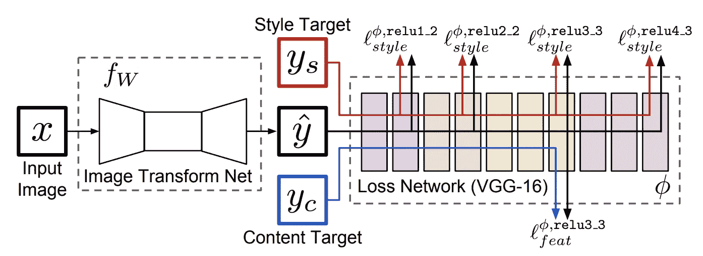

# 快速和受限的风格转换

> 原文：<https://towardsdatascience.com/fast-and-restricted-style-transfer-bbfc383cccd6?source=collection_archive---------45----------------------->

## 神经类型转移，进化

## 使用前馈网络的实时图像风格传递

在他们的开创性工作中，“使用卷积神经网络 的 ***图像风格转移，”Gatys *等人*【R1】*展示了 CNN 在分离和重新组合图像内容和风格以创建复合艺术图像方面的功效。使用从预先训练的 CNN 的中间层提取的特征，他们定义单独的 ***内容*** 和 ***风格*** 损失函数，并将风格转换任务作为一个 ***优化*** 问题。我们从随机图像开始，并更新像素值，从而最小化各个损失函数。更多详情请参考 [*这篇*](/slow-and-arbitrary-style-transfer-3860870c8f0e) 的文章。****

*这种方法的一个明显的警告是，它是 ***慢*** 。调整随机图像需要几次 ***优化*** 迭代，以使其适应两个不同参考图像的 ***内容*** 和 ***样式*** 。为了解决这种低效率，约翰逊*等人*【R2】提出了一种 ***前馈*** 神经网络来 ***近似*** 求解风格转换优化问题【R1】。*

**

*图一。概述“实时风格转换和超分辨率的感知损失”中提出的方法。图像取自同一张纸。*

*本质上，他们提出了一种 ***图像变换网络*** ( *fw* )，这是一种将输入图像 ***x*** 变换为输出图像 ***ŷ*** *的深度残差卷积神经网络。*样式转移的目标是生成一个图像 ***ŷ*** 该图像将目标内容图像 ***y_c*** 的内容与目标样式图像 ***y_s*** 的样式相结合。*

**

*图二。风格传递损失。更多详情请参考前面提到的[博客](/slow-and-arbitrary-style-transfer-3860870c8f0e)。*

*训练时，对于一个 ***固定*** 样式的目标 ***y_s*** ，图像变换网络以一个 ***随机*** 目标内容图像 ***y_c*** ( *或* ***x*** )作为输入，生成图像 ***ŷ.*** 然后调整变换网络，使风格传递损失最小化(参见图 2)。在几次迭代的过程中，网络看到多个内容图像，但是只有一个固定样式的图像。结果，图像变换网络学会将来自任何 参考图像的 ***的内容与特定*参考图像的样式相结合。*****

****

**图三。每个网络一种样式的演示。[图片由](https://ml4a.github.io/ml4a/style_transfer/)提供**

**总之，虽然这种方法以比每图像 优化 ***快三个数量级的速度*执行样式转移，但是它们受限于*到 ***每网络一种样式*** 。*******

## *参考*

1.  *利昂·A·加蒂斯、亚历山大·S·埃克和马蒂亚斯·贝奇。[使用卷积神经网络的图像风格转换](https://www.cv-foundation.org/openaccess/content_cvpr_2016/papers/Gatys_Image_Style_Transfer_CVPR_2016_paper.pdf)。在 *CVPR* ，2016。*
2.  *贾斯廷·约翰逊，亚历山大·阿拉希和李菲菲。[实时风格转换和超分辨率的感知损失](https://arxiv.org/abs/1603.08155)。在 *ECCV* ，2016。*