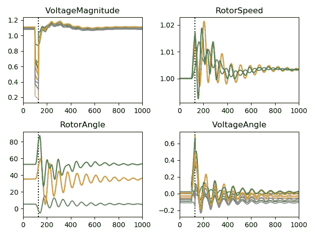
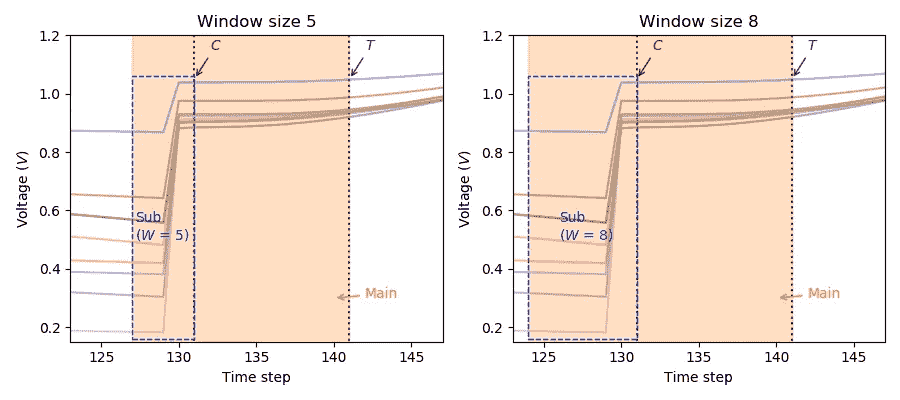
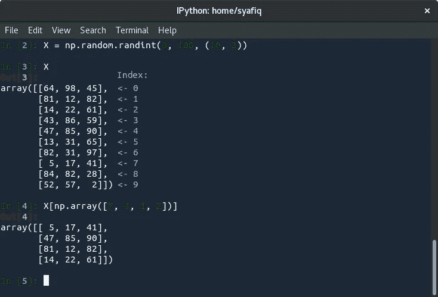
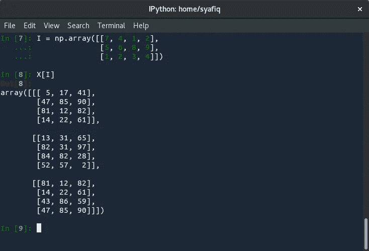
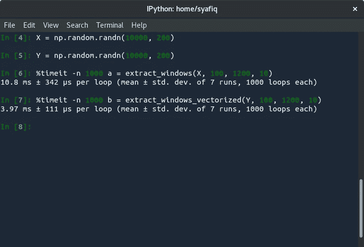
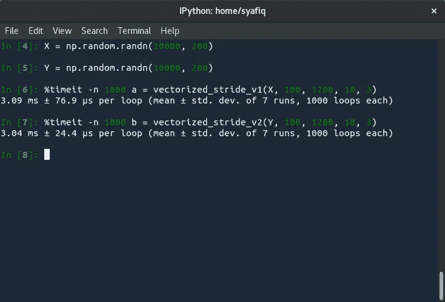

# 用 NumPy 实现快速鲁棒的滑动窗口矢量化

> 原文：<https://towardsdatascience.com/fast-and-robust-sliding-window-vectorization-with-numpy-3ad950ed62f5?source=collection_archive---------2----------------------->

## 探究多元时间序列数据的 NumPy 矢量化技巧。


[宾·福什](https://unsplash.com/@fochs?utm_source=medium&utm_medium=referral)在 [Unsplash](https://unsplash.com?utm_source=medium&utm_medium=referral) 上拍照

偶尔，你会和数据世界的失败者一起工作:时间序列(图像和自然语言最近很受关注！).我很幸运(或者说很不幸)在去年的大部分时间里不得不处理时间序列数据。在我在一维机器学习的古怪世界中的冒险中，我发现了一些非常有用的矢量化方法，使我能够通过 blaze 完成我的数据预处理阶段。我想分享这些有助于加速我的任务的技巧，希望它能对你有所帮助。

在本文中，我们将使用多元时域模拟。我们的目标是学习如何在高性能数据管道中开发组件。NumPy 是我执行矩阵运算的首选库。我们开始吧！

# 概述:多元时间序列

更常见的是，你会看到时间序列是一条单线，在向上或向下前进时穿过一个图。在水平轴上，时间优雅地前进，而在垂直轴上，测量值或数值被记录。横轴上的一个单位就是我们所称的**时间步长。**多变量时间序列是相似的，不同的是，现在孤独的线伴随着平行传播的其他线。


单变量时间序列和多变量时间序列，但是你已经知道了。图片作者。

多变量时间序列数据的一个常见例子是[气象站](https://www.willyweather.com.au/graphs.html?graph=outlook:1,location:4950,series=order:0,id:sunrisesunset,type:forecast,station:349,series=order:1,id:temperature,series=order:2,id:wind,series=order:3,id:delta-t,series=order:4,id:humidity)定期测量温度、湿度、压力和环境的其他方面。另一个是[脑电图](https://en.wikipedia.org/wiki/Electroencephalography)，它使用多个电极捕捉大脑活动，并行产生许多读数。更抽象地说，活页乐谱可以被解释为多元时间序列:乐器是在乐曲的固定采样时间(节奏)内不同的信息通道。

## 电力系统暂态稳定中的电压

我的研究着眼于电力系统发生故障时的暂态稳定性。在电力系统故障期间，采取措施来减轻灾难。根据系统所处的状态、故障发生的位置以及清除故障需要多长时间，系统可以有两种方式:回到稳定或转向不稳定。确定这一点的一种方法是模拟一堆状态、故障位置和清除时间，然后从系统的动力学中学习，以预测系统是稳定还是爆炸(好吧，不是真的)。


一个简单的电力系统，有 3 台发电机、9 条母线和 9 条线路。图片来自郑等(2018)。综合动态 PMU 数据生成:生成对抗网络方法。

我们获取的数据来自电力系统中不同母线(粗实线)在一段时间内的相量测量。由于有许多总线，每个总线测量不同类型的数据，这自然有助于多变量时间序列数据。出于本文的目的，我们将使用其中的一些模拟数据。众所周知，可以通过取整个数据的一小部分来预测暂态稳定现象。大多数剩余的时间序列是多余的。

> 我们的目标是为训练数据集提取信号的重要区域。

在深入研究和扩展提取器的功能之前，我将首先介绍基本提取的核心概念。您可以在此链接或[我的网站](https://syaffers.xyz/)上找到 9 路公交车系统的数据集[，它是一个包含 NumPy 矩阵文件和一些元数据的 gzip 文件夹。这里特别重要的元数据栏是*清除时间*。如果你愿意，可以花几分钟来消化这些数据。](https://syaffers-stuff.s3.amazonaws.com/datasets/IEEE-9Bus.tar.gz)

用于绘制 9 总线数据集中的数据点编号 693 的代码。



693 号案件的所有信息。有 9 条电压母线和 3 条发电机母线。我们可以将所有这些组合成一个 24 通道的多元时间序列数据。图片来自作者。

# 开始简单:基本的滑动窗口提取

我们想要的信号部分是模拟的***清除时间****前后的*。我们希望在结算时间之前和结算时间之后有一个信息窗口；叫做**主窗口**。清除时间后，主窗口可以跨越某个最大时间步长，我们称之为**最大时间**。在主窗口中，我们想要一堆更小的窗口，称为**子窗口**，它们将组成我们的训练示例。主窗口应该在清除时间之前提供子窗口大小的时间步长。这很难捕捉，但也许一个数字可以帮助我们理解这些窗口的结构。我们将使用案例 693 的电压幅度进行所有说明。**

*基本的滑动窗口方案；我们的目标是提取右边的子窗口。图片来自作者。*

*本质上，我们希望在主窗口中一步一步地滑动子窗口，并在每个时间步长收集信息。第一子窗口必须包含清除时间之后的第一时间步。这里的基本原理是，我们只知道故障在系统中被清除的时间(清除时间)。因此，我们最早可以获得可用数据的时间是清除后的下一个时间步。*

## *一个小例子*

*让我们捕获一个最大时间为 10 个时间步长的主窗口。在主窗口中，我们可以取 11 个大小为 5 个时间步长的子窗口。视觉上:*

```
 *1st timestep after clearing --|           |-- max time
                                v           v
main_window = [..., 5, 6, 7, 8, 9, 10, ..., 19]
                             ^
       clearing time index --|sub_windows = [
    [ 5,  6,  7,  8,  9],
    [ 6,  7,  8,  9, 10],
    ...
    [15, 16, 17, 18, 19]
]*
```

*因此，如果我有一个最大时间 *T* 和一个大小为 *K* 的子窗口，我可以从一个模拟中获得 *T* +1 个示例(包括最大时间的索引)。这个方案忽略了 K，因为我们可以将 K 增加到我们想要的大小，这反过来会增加主窗口左半部分的大小(假设我们没有下溢数据矩阵)。这意味着用大小为 5 或 8 的子窗口提取数据会得到相同数量的子窗口，但子窗口大小不同。*

**

*我们可以替代任何子窗口大小，只要左半部分的数据可以容纳。图片来自作者。*

*厉害！现在我们有了框架，我们可以大致规划提取功能。我们将输入信息作为一个二维(2D)矩阵，其中时间步长沿行向下传播，特征分布在列上。从视觉上看，具有 4 个特征和 6 个时间步长的样本输入矩阵如下所示:*

```
 *Feature 1  Feature 2  Feature 3  Feature 4
  ------------------------------------------
[[ -5.29328 , 9.89139  , -2.79590 , -8.73531 ], Time=1 |
 [ -5.29345 , 9.89152  , -2.79595 , -8.73542 ], Time=2 |
 [ -5.29396 , 9.89200  , -2.79644 , -8.73593 ], Time=3 |
 [ -5.29416 , 9.89222  , -2.79671 , -8.73614 ], Time=4 |
 [ -5.29451 , 9.89257  , -2.79702 , -8.73649 ], Time=5 |
 [ -5.29479 , 9.89258  , -2.79732 , -8.73643 ]] Time=6 V*
```

*我们的目标输出矩阵是一个类似于这样的 3D 矩阵(假设我们想要一个大小为 4 的滑动窗口):*

```
 *Feature 1  Feature 2  Feature 3  Feature 4
   ------------------------------------------
[[[ -5.29328 , 9.89139  , -2.79590 , -8.73531 ],  Time=1 |
  [ -5.29345 , 9.89152  , -2.79595 , -8.73542 ],  Time=2 |
  [ -5.29396 , 9.89200  , -2.79644 , -8.73593 ],  Time=3 |
  [ -5.29416 , 9.89222  , -2.79671 , -8.73614 ],  Time=4 V [ -5.29345 , 9.89152  , -2.79595 , -8.73542 ],  Time=2 |
  [ -5.29396 , 9.89200  , -2.79644 , -8.73593 ],  Time=3 |
  [ -5.29416 , 9.89222  , -2.79671 , -8.73614 ],  Time=4 |
  [ -5.29451 , 9.89257  , -2.79702 , -8.73649 ],  Time=5 V [ -5.29396 , 9.89200  , -2.79644 , -8.73593 ],  Time=3 |
  [ -5.29416 , 9.89222  , -2.79671 , -8.73614 ],  Time=4 |
  [ -5.29451 , 9.89257  , -2.79702 , -8.73649 ],  Time=5 |
  [ -5.29479 , 9.89258  , -2.79732 , -8.73643 ]]] Time=6 V*
```

*这应该是微不足道的:只需在时间步长上循环，并切割矩阵的行以获得子窗口。*

## *(朴素的)滑动窗口提取器*

*用 for 循环提取主窗口的片段。很有效率吧？*

*该函数获取从中提取数据的*数组*、作为我们清除时间索引的*清除时间索引*、最大时间步长 ( *T* )和*子窗口大小* ( *K* )。首先，我们声明一个空列表来存储我们的输出子窗口。然后，我们定义开始索引，这是滑动窗口将开始的索引。使用前面解释的 *T* +1 规则，我们知道我们期望多少个数据点。剩下的就是一个 for 循环，使用良好的旧切片从数组中提取数据。*

*因为我们的目标是收集一组 2D 矩阵，所以明智的做法是使用 3D 矩阵批量堆叠数据，其中第一维会告诉您有多少个 2D 矩阵可用。因此使用`expand_dims`和`vstack`来实现这一点。*

## *这个解决方案有多好？*

*这看起来是个好办法，对吧？还不算太糟。或者是？嗯，Python for-loops 是出了名的慢，我们没有利用 NumPy 的花哨的索引功能。目前，我们确实没有什么可以与 for-loop 方法进行比较的，但要努力说服自己，它确实不好，我们可以做得更好。因此，让我们来看看一些有趣的索引技巧，它们将帮助我们实现极快的滑动窗口提取功能。*

# *一些奇特的矢量化技巧*

***诀窍#1:** 我们可以使用整数索引的 1D 矩阵任意索引 2D 矩阵的任意行。*

**

*10×3 矩阵 x 的一维行索引。图片来自作者。*

*我们所做的是通过使用一个索引数组从 2D 矩阵 *X* 中挑选出行索引 7、4、1 和 2。通过知道我们需要什么索引，NumPy 允许我们放弃循环，而是立即索引我们需要的行。*

> *滑动窗口中单个子窗口的模拟是索引一组连续的数字。*

*但是，实际上，与我们在原始代码中使用的切片相比，这并没有更有用，因为您需要循环并创建连续的索引数组来提取所有的子窗口。然而，**第一招**只是一个更强大的招数的前奏。*

***诀窍#2:** 我们可以使用整数索引的 2D 矩阵来索引 2D 矩阵的行的任何 2D 子矩阵(哇，这是一口 2Ds)。*

**

*矩阵 x 的二维行索引。图片来自作者。*

*这有点难以理解，但让我们了解一下发生了什么。首先，我们创建了一个矩阵， *I，*，这是一个 3×4 的整数矩阵。然后，我们使用 NumPy 的花式索引将多行 *X* 索引在一起，得到一个 3D 矩阵。输出 3D 矩阵的第一个索引是 2D 矩阵，就好像我们在矩阵 *X* 上使用了具有索引[7，4，1，2]的**技巧#1** 。类似地，3D 矩阵的第二个索引是对具有索引[5，6，8，9]的 *X* 应用**技巧#1** 的输出。能不能算出输出 3D 矩阵的第三个索引？*

*基本上，我们已经找到了在起始代码中向量化外部 for 循环的方法:我们可以创建一个包含模拟数据连续索引的 2D 整数矩阵，并应用**技巧#2** 快速提取包含这些子窗口的 3D 数组。相反，如果我们用下面的矩阵代替矩阵 *I* ，我们可以很快得到我们的滑动窗口子窗口。*

```
*I = np.array([[0, 1, 2, 3],
              [1, 2, 3, 4],
              [2, 3, 4, 5])*
```

*既然我们知道我们可以任意地索引任何 2D 矩阵，我们可以想出一种系统的方法来组成矩阵 *I* ，以便我们可以将这种索引推广到任何子窗口大小以及任何最大时间来矢量化滑动窗口提取。*

# *滑动窗口索引器的数学*

*这部分有点重数学，有很多符号在飞来飞去，所以如果你不明白，请随意发表评论。*

*知道了第二招，我们想要提取的是一个连续索引的 2D 矩阵，它等于子窗口的宽度。主窗口将从清除时间加 1(*C*)减去子窗口大小( *K* )直到最大时间( *T* )。具体来说，我们希望使用以下( *T+1)* × *K* 索引器矩阵对我们的数据进行奇妙的索引:*

```
 *[[C-K+1  , C-K+2  , C-K+3  , ..., C   ]
    [C-K+2  , C-K+3  , C-K+4  , ..., C+1 ]
I = [C-K+3  , C-K+4  , C-K+5  , ..., C+2 ]
    [                           ...,     ]
    [C+T-K+1, C+T-K+2, C+T-K+3, ..., C+T ]]*
```

*好吧，我必须承认，我确实花了一些时间来理解这个矩阵(主要是因为 Python 的 0-索引方案)。但是，本质上，这是将**技巧#2** 应用到我们的滑动窗口提取中的一般情况。理想情况下，我们也可以在不使用 for 循环的情况下生成这个 2D 索引器矩阵:它们太慢了！实际上，我们可以通过计算起始指数来大大简化这个矩阵。起始指数( *S* )计算为*S*=*C-K+*1 =*C-(K-*1)。因此，我们可以用更简单易懂的方式来表示我们的指数矩阵:*

```
 *[[0    , 1    , 2    , ..., K-1  ]
        [1    , 2    , 3    , ..., K    ]
I = S + [2    , 3    , 4    , ..., K+1  ]
        [                     ...,      ]
        [T    , T+1  , T+2  , ..., T+K-1]]*
```

*简单来说，我们将偏移量 *S、*加到一个( *T+* 1 *)* × *K* 矩阵中。该矩阵具有跨越从 0 到 *K -* 1 的列的连续值行，并且每一行从从 0 到 *T* 的连续值行开始。我们知道我们将有 *T* +1 个子窗口，所以我们只需要有连续的索引，直到子窗口 *T* +1 次的大小。这将得到与上面相同的矩阵。事实上，我们可以用更简单的分解来表示这个矩阵:*

```
 *[[0  , 1  , 2  , ..., K-1]    [[0, 0, 0, ..., 0] 
     [0  , 1  , 2  , ..., K-1]     [1, 1, 1, ..., 1]
S +  [0  , 1  , 2  , ..., K-1]  +  [2, 2, 2, ..., 2]
     [               ...,    ]               ...,
     [0  , 1  , 2  , ..., K-1]]    [T, T, T, ..., T]]*
```

*你们中精明的人可能已经从第二个矩阵中看到了这一点，但是让我们来看一下。因为我们知道每个子窗口的大小为 K，我们只需要做一次连续索引的矩阵。同样，有了 *T* +1 个连续子窗口的信息，我们只需要将值【0，1，2，…】， *T* 一次一个地加到每个子窗口索引上。*

*使用一种称为广播的聪明的向量化技术，我们甚至不必构建加法的整个中间和右边的 2D 矩阵。相反，我们只需要创建一个 1× *K* 和一个( *T* +1)×1 矩阵，而不是两个( *T+1)* × *K* 矩阵:*

```
 *[[0]
                                   [1]
S + [[0  , 1  , 2  , ..., K-1]] +  [2]
                                   ...
                                   [T]]*
```

*通过广播中心行矩阵和右列矩阵的加法，就可以得到我们需要的原始( *T+1)* × *K* 矩阵。让我们看看代码。*

*矢量化滑动窗口提取器。多优雅啊。不再有 for 循环！*

## *性能比较*

*如果优雅对你来说还不够有说服力，也许硬数字可以。为了测试性能，我首先使用 NumPy 的`random.randn`函数创建了两个矩阵， *X* 和 *Y* ，它们大小相等但数据不同。这确保了两个函数之间的任何计算不会在运行之间被缓存。然后我在 *X* 上运行基于循环的提取器，在 *Y* 上运行矢量化提取器。提取产生大小为 1201×10×200 的矩阵。*

**

*10.8 毫秒降低到 3.97 毫秒。这大约是 272%的加速！图片来自作者。*

*多么显著的速度提升啊！我们的矢量化实现绕过了基于循环的提取器。当您处理多个文件并希望从许多不同的文件中一次提取一个窗口时，这特别有用。然而，这种方法有一些注意事项。使用 for 循环，我们可以提取数据，而不必创建 2D 矩阵来索引原始矩阵。这在内存上肯定是“更容易”的，但是我认为由于我们的输出矩阵比索引器矩阵大得多，最终这是决定性的内存消耗者。*

*这几乎是它的核心。现在让我们探索如何充分利用这种矢量化来对时间序列数据执行其他操作。*

# *使得滑动窗提取器更加坚固*

*好吧，让我们添加更多的功能到我们的窗口提取器。当然，我们将保持矢量化的风格。*

## *大步走，不仅仅是滑行*

*如果我们想要滑动窗口超过一个时间步长呢？像这样:*

*请注意，每张幻灯片上的子窗口开始时间跳跃了两个时间步长。图片来自作者。*

*借用卷积神经网络滤波运算的术语，我们把这个叫做**跨窗**。你可以想象这是对我们索引矩阵的一个相对简单的扩充。具体来说，我们正在研究这样一个索引矩阵:*

```
 *[[0 ] 
                                    [V ]
S + [[0  , 1  , 2  , ..., K-1]]  +  [2V]
                                    ...
                                    [T ]]*
```

*我已经用完了聪明的符号名称，所以我将把空格数表示为 *V* 代表**的步幅**。当 *V* 为 1 时，这就是我们上面的基本滑动窗口代码。任何较大的整数值将决定它跳跃多少，从而产生一组较小的输出子窗口。我们需要小心:因为我们的最大时间( *T* )没有改变，我们需要考虑减少最右边向量的大小。有两种方法可以解决这个问题:*

1.  *创建整个索引数组(就像我们之前所做的那样),并进行巧妙的索引以从该数组中选择每一个 *V* 行，或者，*
2.  *创建最右边的向量，看起来像上面的块。*

*让我们对这两个实现进行编码。*

*以两种方式实现 windows。注意有一个新的参数“stride_size”。*

*不确定哪个更好？让我们像以前一样做一个类似的测试，并测量性能。*

**

*关于两种变体的同等性能。图片来自作者。*

*我现在传递给函数的参数中唯一的不同是步幅大小为 3。正如您所看到的，没有太大的区别，但是变体 1 比变体 2 稍微慢一点(但是可以忽略不计)。我将变体 1 中的这种缓慢归因于它必须生成一个完整的(*T*+1*)*×*K*矩阵，然后对其进行切片。相比之下，变体 2 立即创建步幅指数，从长远来看，这可以节省时间和内存。*

## *缩减采样子窗口*

*在我的研究中，模拟器能够产生比实际可能频率高得多的信号。真实世界的设备通常以大约 50Hz 或 60Hz(每秒 50/60 时间步)进行采样，而模拟器可以生成 1kHz 以上的数据(>每秒 1000 时间步)。对模拟数据进行下采样对于训练可在生产环境中部署的模型非常有用。*

*除了创建一个跨越子窗口向量之外，我们可以使用前面跨越窗口部分中介绍的相同技术轻松地对子窗口进行下采样。但这只有在我们的下采样速率能被整除的情况下才能实现。例如，如果我们必须对 1kHz 到 100Hz 进行下采样，我们只需在子窗口中每 10 个时间步长进行一次(我们的**下采样比率**(*R*)**为 10)。然而，如果我们对 1kHz 至 60Hz 进行下采样，我们需要每 16.667 个时间步长进行一次，这不是一个整数下采样比。***

*蓝色块是一个连续的阵列，只是以均匀间隔的时间步长进行采样。注意右边图中的时间跨度。图片来自作者。*

*我们可以通过舍入步骤乘以下采样比率( *R* )来作弊，但不会有太大问题。当 *R* 等于 1 时，这又是我们的基本滑动窗口。更重要的是，我们还需要考虑如何分隔数据窗口。我们想要一个特定的子窗口大小，它现在有一个采样率的间隔。此外，我们需要捕捉的最大时间步长也有类似的间隔。让我们看看我们的好朋友，黑客帝国:*

```
 *[[0 ] 
                                         [R ]
S' + [[0  , R  , 2R  , ..., (K-1)R]]  +  [2R]
                                         ...
                                         [TR]]*
```

*这里有几点需要注意。*S’*是考虑间隔开的子窗口的新的起点索引， *R* 是我们的下采样比率，并且相应地，我们必须调整间隔以捕捉期望的最大时间步长。注意: *R* 不应小于 1；否则，您将在单位时间步长之间采样数据，这需要插值。*

*计算 *S'* 比较简单，我们只需要从清零时间( *C* )中减去子窗口的大小( *K* )减去一乘以采样率；数学上我们有*S ' = C-*(*K*-1)*R*。这将确保清除后的第一个时间步长是第一个索引中的最后一个数据点。好了，数学够了，我们来编码吧。*

*滑动窗口和缩减采样一气呵成，你还想要什么？*

*下采样窗口保持与标准滑动窗口相同的输出窗口大小，但占用更大的时间比例。如果您希望保持数据大小相似，但覆盖间隔更大的时间步长，这将非常有用。*

# *结论*

*我希望您已经找到了一些非常棒的技巧来帮助您矢量化滑动窗口预处理工作流。改变你的思维方式，在没有 for 循环的情况下进行矩阵操作可能会很困难，但是一旦你掌握了诀窍，就会感觉更自然。我最大的挑战是思考高维矩阵的输出，这感觉很陌生(有时仍然如此)。*

*我对这种技术的唯一不满是代码的可维护性降低了，因为您必须确保使用您代码的人能够理解矢量化在做什么。这意味着在函数旁边有可靠的文档是至关重要的，合理地命名变量对于其他人的理解是至关重要的。*

*对基本滑动窗口矢量化的扩展有望激发您尝试自己的复杂矢量化，以加速您的数据管道。当你启动它的时候，你会觉得自己像个忍者，真的！尽管如此，性能的提高将使您等待文件处理的时间大大减少。还有什么更好的方法来保持更多的工作，并尽量减少你的空闲时间。对吗？*