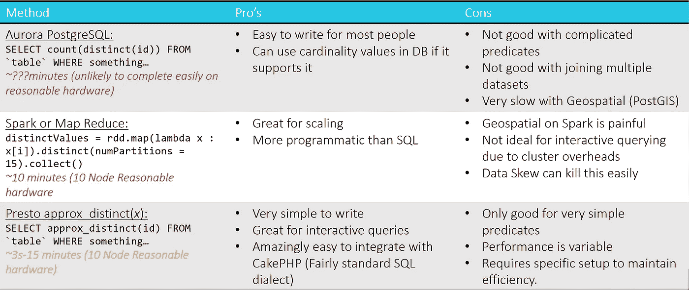
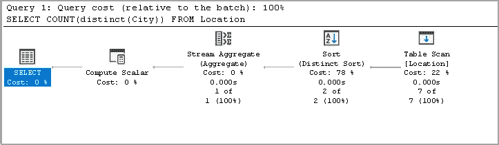
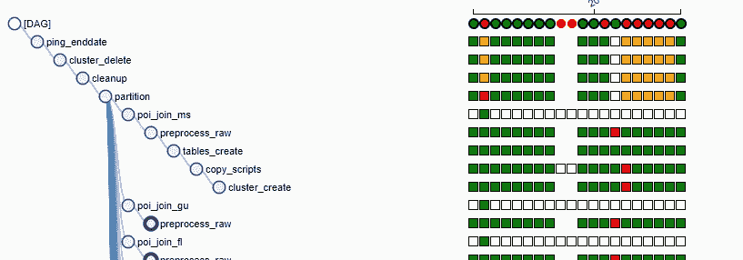
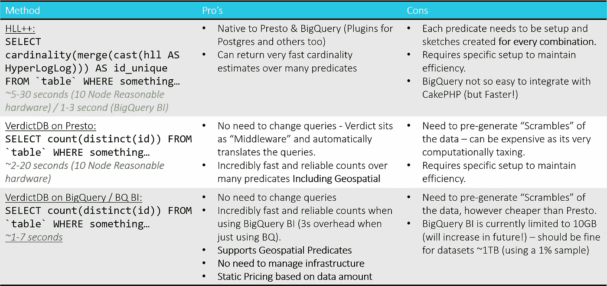

# 使用 Presto 或 BigQuery 和 VerdictDB 快速计算大数据系统

> 原文：<https://towardsdatascience.com/fast-counts-on-spatial-big-data-systems-using-presto-or-bigquery-and-verdictdb-ce2ac82b9b37?source=collection_archive---------40----------------------->

当用户可以定义自己的谓词时，如何一致快速地(不到 4 秒)获得数十亿行的计数估计值？

克里斯·贾维斯在 [Unsplash](https://unsplash.com?utm_source=medium&utm_medium=referral) 上的照片

# 问题是:

> *“创建一个系统，客户可以通过选择和组合不同的滤镜来设计自己的受众”*

在本文中，我不会深入分析这个问题，但是我们最终找到了一个可以生成“查询”(不一定是 SQL)的系统，我们可以对我们的数据仓库运行该系统来产生受众。

其中棘手的部分是 ***“我们如何向客户展示对受众规模的估计”？***

由于最终用户可以从 8 个过滤器的任意组合中设计受众(每个过滤器包含 100-1000 个选项，这些选项会随着新数据的进入而频繁变化)，预缓存每个处理的计数实际上并不可行，特别是因为我们还提供了在特定日期之间进行过滤的功能，这意味着每个日期范围也需要预缓存！

# 早期实验

我们决定使用一个示例查询作为我们的基本基准测试用例，它看起来像这样:

示例查询

我们尝试了许多不同的方法来感受每个平台及其提供的功能。自然，我们从基础和众所周知的产品开始，但是，我们有许多来自每个数据库/数据仓库的不同需求，这在许多方面并不能真正与它们进行公平的比较(例如，我们需要地理空间功能，这排除了许多其他平台)。

# 为什么 count(distinct())是准确性之王—但肯定不公平。

大多数读者会理解 count(distinct())是做什么的，但许多人不理解(或想不到)的是它是如何做什么的。

非重复计数操作的查询计划

在一个巨大的数据集中计算不同的实体实际上是一个困难的问题，如果对数据进行排序会稍微容易一些，但是根据所使用的底层平台，在每次插入时对数据进行重新排序会变得非常昂贵。

通常，非重复计数执行非重复排序，然后对分组值的每个“桶”中的项目进行计数。

如果您需要 100%准确的计数，那么不幸的是，这几乎是您在随机数据集上获得计数的唯一方式，您可以在如何在平台中构造事物方面做一些技巧，以使事情更有效(例如，分区、聚类/分块)，但它本质上仍然必须执行相同的操作。

# 权衡——精度与速度

卢克·切瑟在 [Unsplash](https://unsplash.com?utm_source=medium&utm_medium=referral) 上的照片

通常有一些用例**不要求 100%的准确性，**我们的就是其中之一，因为观众规模只是一个估计值——这给了我们一些额外的选择。

有许多现有的采样方法，但它们的精度对于我们的要求来说太低了——在这种情况下，我们需要一些具有**正确平衡**的方法。

# 使用 VerdictDB 的解决方案

在这个过程的早期，我们联系了 VerdictDB，他们发布了一个开源产品的早期测试版，声称完全符合我们的要求。VerdictDB 使用概率/统计理论在大型数据集上创建基数估计值。但对我们来说最重要的是，它允许在整个表上创建。

我们使用气流建立了一个管道来协调数据准备，以确保一切就绪

所有的错误！

VerdictDB 通过创建表的“扰码”来工作，这是一个预处理阶段，需要大量的处理能力，但只需要在添加新数据时进行一次。

我们在 Presto 和 BigQuery 上都执行了这一操作——big query 对于我们的特定用例来说更便宜，但这有许多原因(不适用于本文)。

# 决赛成绩

下表列出了每种方法的最终结果。作为后台数据仓库，BigQuery 脱颖而出有许多不同的原因，但是它的焦点实际上是 VerdictDB 在简单性和速度方面相对于传统方法(如 HyperLogLog)真正能提供什么。

# 结论

通过使用 VerdictDB，Presto 和 BigQuery 都提供了允许人类界面进入我们的数据仓库所需的速度，BigQuery out 在许多领域都表现出 Presto 的性能，特别是当 BigQuery BI 进入等式时，尽管这仍处于测试阶段，仅提供 10GB(应该足以缓存 1TB 数据的 1%加扰)，但它在提供大数据的经济高效和快速界面方面具有巨大的潜力。

如果您想避免供应商锁定，那么 Presto 是一个很好的选择，但是需要考虑延迟和您用来确保足够快的分区模式！一旦在 Presto 上构建了扰码，还有其他几个选项可以用作查询接口。

