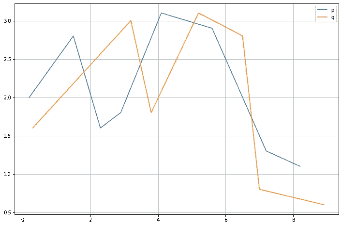
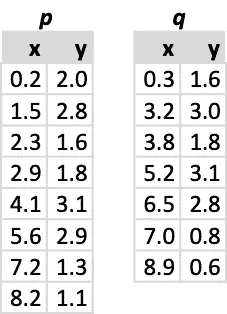
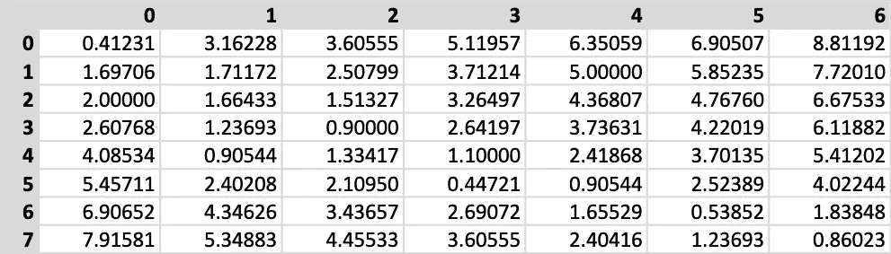
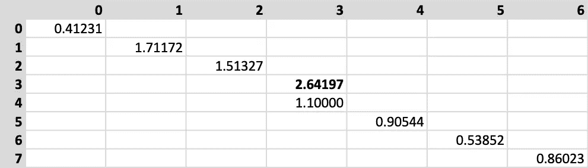
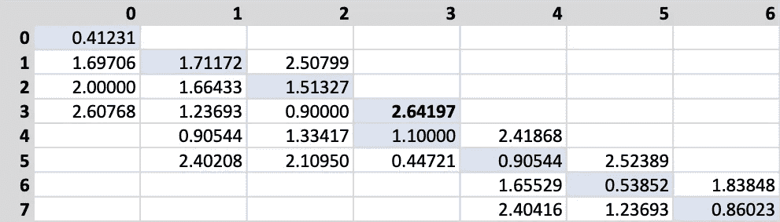
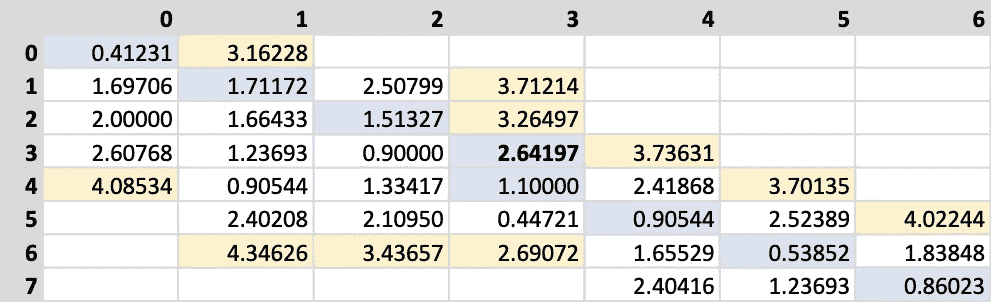
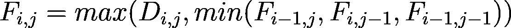
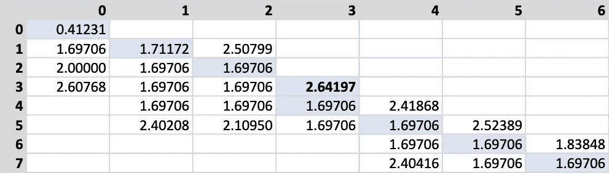
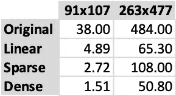

# 快速离散弗雷歇距离

> 原文：<https://towardsdatascience.com/fast-discrete-fr%C3%A9chet-distance-d6b422a8fb77?source=collection_archive---------22----------------------->

## 如何提高离散弗雷歇距离计算性能？

安德里·波迪尔尼克在 [Unsplash](https://unsplash.com?utm_source=medium&utm_medium=referral) 上拍摄的照片

> 一个人牵着一条狗在散步:这个人可以在一条曲线上走，狗在另一条曲线上走；两者都可以改变速度，但不允许回溯。足以穿过两条曲线的最短皮带长度是多少？[1]

上面的引用有助于发展两条曲线之间的弗雷歇距离的定义的直觉。它的离散对应物测量两条有向多边形线之间的相似性，定义为某个度量空间中的连接点集合。在定向的多边形线中，顶点序列是感兴趣的，并且描述了方向，就像车辆的轨迹。其他相似性度量，如 Hausdorff 距离，不考虑线的方向，并且对于顶点接近但方向相反的多边形线产生高相似性。

我已经在[的另一篇文章](https://medium.com/tblx-insider/how-long-should-your-dog-leash-be-ba5a4e6891fc)中描述了这个相似性度量，在那里我讨论了基于动态编程的原始实现。我通过线性化算法(用两个嵌套循环代替递归)提供了一个速度优化版本，性能提高了近 10 倍。虽然新的升级算法运行速度更快，但它仍然消耗相同数量的内存，这对于非常大的折线是不可取的。

本文提供了同一个算法的两个备选实现，根据最近的一组论文[2，3]，这两个实现包含了性能改进。第一种实现使用线性数组来存储数据，而第二种实现使用基于字典的稀疏数组来存储非常大的折线。所有代码都使用 [Numba 包](http://numba.pydata.org/)进行 JIT 编译，以获得最佳性能。

# 逻辑优化

如前所述，计算离散弗雷歇距离(DFD)需要构建一个矩形矩阵，其维数对应于每条折线中的点数。原始的动态规划算法通过对每个元素执行距离计算来填充整个数组。然后，它将该距离与左侧和顶部邻居的递归计算值进行比较。显然，折线越大，算法计算矩阵的时间就越长。

我们可以通过线简化算法减少每条折线中的点数，让算法运行得更快，比如著名的 [Ramer-Douglas-Peucker 算法](https://en.wikipedia.org/wiki/Ramer%E2%80%93Douglas%E2%80%93Peucker_algorithm)。我过去曾用这种算法帮助我在地图上显示非常大的轨迹。它的工作原理是从折线上移除点，同时保持其整体形状。用户获得相同的信息，而地图显示软件避免处理无用的顶点，从而提高性能和响应能力。我不会在这里探讨这种优化，将在以后的文章中探讨。

另一个优化隐藏在 DFD 计算数学中，并且*类似于*与[动态时间扭曲](https://en.wikipedia.org/wiki/Dynamic_time_warping)相关的“扭曲窗口”概念。我们只需要计算一些靠近主对角线的矩阵元素。通过不计算所有其他项目，我们不仅提高了速度，还可以在非常大的折线上节省内存。这种优化也意味着我们必须考虑不同的数据结构来存储矩阵，可能是一个稀疏的数组。除了避免计算不必要的数据，我们也不分配不必要的内存。

如果你看一个完全计算的矩阵，优化的想法变得明显。为了了解这一点，让我们看一个例子。我们将计算欧几里得空间中定义的两条折线的 DFD。

这是我们将用来说明快速 DFD 计算的两条示例折线。

多段线坐标如下。

上图显示了两条折线的笛卡尔坐标。

现在，我们可以计算两条折线之间的距离矩阵。注意，在算法执行期间，该步骤不会完全发生。我在这里使用它只是为了说明，因为它清楚地说明了当你远离对角线时，值是如何增加的。改进的算法利用这一特性来减少计算次数和所需的存储空间。

上面矩阵的每个单元对应于两条折线的边之间的欧几里德距离。

我们从只考虑对角线单元开始，但是尽管在正方形矩阵上定义对角线非常简单，但是矩形矩阵的对角线需要更多的工作。代替论文的方法，我决定重温一个老朋友， [Bresenham 的画线算法](https://en.wikipedia.org/wiki/Bresenham%27s_line_algorithm)。如果你把一个矩阵想象成一个光栅显示器，算法的有用性就变得显而易见了。我没有使用该算法来画线，而是使用它来生成矩阵索引对，以连接左上角和右下角。

在对角线确定之后，我们只得到那些单元的距离值。上图描述了这一步的结果。粗体显示的是最大对角线值，它对后面的内容很重要。

在计算对角线后，我们将它的最大值作为最终距离的上限。该算法从左到右遍历对角线，计算每一列的距离，如果它们小于参考最大值，则存储它们。同样的过程也适用于行。下图描述了与此案例相关的结果。为了便于阅读，我用浅蓝色背景突出了对角线。

上图显示了算法的第一步。我们计算对角线下方及其右侧的所有距离，直到估计的最大值( *2.64197* )。

相对容易看出我们节省了多少内存。我们只储存了其中的 26 件，而不是预期的 42 件。尽管如此，我们计算出的距离比我们保存的距离要多，这在下图中有所描述。

黄色背景的单元格表示计算出的距离没有存储在矩阵中，因为它们大于对角线最大值。

我们不能依靠传统的 NumPy 阵列来节省 RAM，因为这些阵列会分配不必要的内存。这里我们将使用基于字典的稀疏矩阵，我将在下面讨论它的实现细节以及代码优化。

我们现在准备进入第二步，进行最后的计算。首先，我们必须创建一个新的矩阵，弗雷歇矩阵，来存储最终的结果。该过程从将距离对角线数据复制到弗雷歇矩阵开始。接下来，我们从对角线开始迭代每个距离矩阵元素，并应用一个简单的算法来计算最终的弗雷歇像元值。

上面的公式基于距离矩阵 D 中的相应值以及左侧和顶部的三个相邻值来确定弗雷歇矩阵 F 中的值。如果其中任何一个缺失，我们用无穷大来代替它。D 矩阵的第一个对角线值被复制到 f。

最终计算沿着距离矩阵对角线进行。一旦完成，弗雷歇矩阵看起来像下面的图像。

最终的弗雷歇矩阵源自距离矩阵。与往常一样，两条折线之间的距离位于左下角的元素中。

请注意，由于计算是如何进行的，可以不使用第二矩阵(F ),而仅使用距离矩阵(D)来执行所有计算。与往常一样，最终距离值位于右下角的单元格中。

# 代码优化

您可以在其 [GitHub 库](https://github.com/joaofig/discrete-frechet)中找到本文的所有代码。除了 DFD 最初的实现之外，代码现在还包含了另外两个基于论文见解的实现。对于较小的折线，可以使用名为 **FastDicreteFrechetMatrix** 的基于 NumPy 数组的版本。对于较大的折线，您可能应该使用稀疏数组版本，称为**fastdiscrechetsparse**。最后一个版本使用字典来模拟稀疏数组。

现在大部分代码都使用 Numba 进行了 JIT 编译，从而显著提高了性能。这个包的目标是科学计算代码，并且理解 NumPy 的大部分代码，让你的代码快如闪电。使用 Numba 时，有一些事情需要注意。

您将注意到的第一件事是编译后的代码首次执行速度很慢。这种延迟是由于编译的 JIT 阶段造成的，在这个阶段，Python 代码被转换成机器代码。所有后续运行将全速进行。

Numba 的第二个问题是，由于 Python 和 NumPy 的兼容性问题，它需要一些时间来适应。不是所有的代码都能工作，即使工作了，也不会提高性能。您应该通读软件包的文档以充分利用它。当你明白如何使用它时，Numba 就是一种乐趣。

# 表演

为了了解这些算法是如何执行的，我建立了一个 Jupyter 笔记本来比较两组轨迹(请参见附带的代码)。第一套比较小，91 和 107 分，第二套大一点，263 和 477 分。这些代码针对这两个集合运行所有四个算法，正如你在笔记本中看到的。

下表显示了作者的 MacBook Pro 上以毫秒为单位测量的执行时间。

如你所料，最初的递归算法总是慢很多。接下来是它的线性适应，运行速度要快得多(一个数量级)。然后，我们混合了改进算法的稀疏实现的结果。在较小的集合中，它比前两个运行得更快，但在较大的集合中运行得更慢。这种性能差异是由于基于字典的稀疏阵列实现造成的，它不能很好地扩展。这段代码的未来版本将集中于用一个更高性能的组件来替换这个组件，尽管还不清楚这可能是什么。最后，改进算法的基于阵列的实现始终更快。

看起来，对于当前的实现，我们将不得不在速度和大小之间达成妥协。不幸的是，对于非常大的折线，我们将不得不使用速度较慢的算法。希望这在未来会有所改善。

# 结论

本文使用最近的一篇论文的结果回顾了离散弗雷歇距离的性能改进。不用计算所有的距离对，我们可以集中在距离矩阵对角线周围的一组有限的单元上。这种方法不仅节省了空间，还提高了性能。

在以后的文章中，我将说明离散弗雷歇距离在轨迹聚类中的使用。要聚合的每个项目都是由可变数量的位置定义的地理空间轨迹，DFD 是这种情况下选择的距离度量。本文中提出的性能改进毫无疑问会在那里有用。

# 参考

[1]托马斯·海特和海基·马尼拉。**计算离散弗雷歇距离。**技术报告 CD-TR 94/64，克里斯琴·多普勒专家系统实验室，奥地利维也纳技术大学，1994 年。

[2]t . devo gele，Etienne，l . es nault，m .，& Lardy，F. (2017)。**优化轨迹间的离散弗雷歇距离。** *第六届 ACM SIGSPATIAL 大地理空间数据分析研讨会会议录——Big spatial’17*。[https://doi.org/10.1145/3150919.3150924](https://doi.org/10.1145/3150919.3150924)

[3]托马斯·德沃盖尔，马克森斯·埃斯瑙特，洛朗·艾蒂安。 [**距离 discrète·德·弗雷切特优化**](https://hal.archives-ouvertes.fr/hal-02110055) 空间分析和地理信息(SAGEO)，2016 年 11 月，法国尼斯。

[4]小群林、安托万·皮特鲁和斯坦利·塞伯特。2015. **Numba:一个基于 LLVM 的 Python JIT 编译器。**在*HPC 中 LLVM 编译器基础设施第二次研讨会会议录*(*LLVM’15*)。美国纽约州纽约市计算机械协会，第 7，1–6 条。https://doi.org/10.1145/2833157.2833162

# 资源

[GitHub 知识库](https://github.com/joaofig/discrete-frechet)

# 相关文章

 [## 你的狗带应该有多长？

### 计算曲线间的离散弗雷歇距离。

medium.com](https://medium.com/iotransportation/how-long-should-your-dog-leash-be-ba5a4e6891fc)  [## joo Paulo Figueira—数据科学家—TB . LX by Daimler Trucks & bus | LinkedIn

### 查看 joo Paulo Figueira 在全球最大的职业社区 LinkedIn 上的个人资料。圣保罗列出了 1 份工作…

www.linkedin.com](https://www.linkedin.com/in/joao-paulo-figueira/)