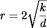
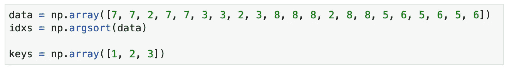
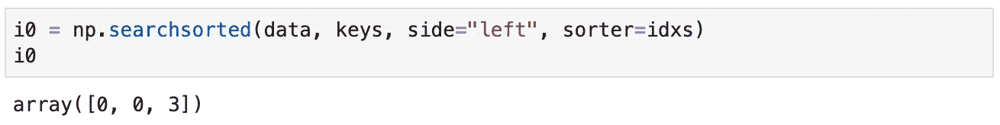
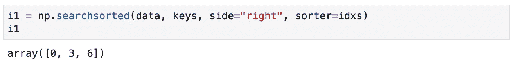
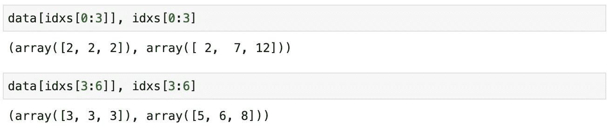
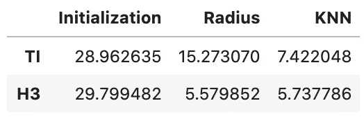
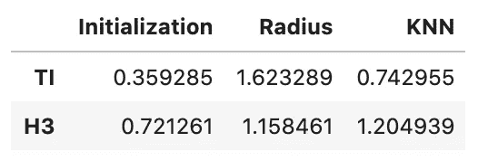

# H3 的快速地理空间索引

> 原文：<https://towardsdatascience.com/fast-geospatial-indexing-with-h3-90e862482585?source=collection_archive---------20----------------------->

## H3 六角电力重装上阵！

安娜斯塔西娅·彼得罗娃在 [Unsplash](https://unsplash.com?utm_source=medium&utm_medium=referral) 上的照片

在本文中，我将继续前两篇文章中介绍的内容，即关于使用 H3 的[地理空间索引](/geospatial-indexing-with-ubers-h3-766399b690c)和关于如何使用三角不等式查询地理数据的[。我将使用这两种方法来说明两个最有用的地理空间查询的实现:半径和 KNN。我们使用这些查询通过参考点从地理空间数据库中检索位置。半径查询返回距离参考点预设距离内的所有点，而 KNN 查询返回最近的 K 个点。](https://medium.com/iotransportation/using-the-triangle-inequality-to-query-geographic-data-7148a1b103a0)

我上一篇关于三角形不等式的文章讨论了索引过程的几何基础，并实现了一个简单版本的 radius 查询。虽然我暗示 KNN 实现起来很简单，但我把它作为一个练习留给了读者。在本文中，我给出了基于三角不等式的两个查询的完全修改和完整的实现。

在工作的时候，我想知道我是否可以使用 [H3 地理空间索引](https://eng.uber.com/h3/)方法进行同样的计算。一旦散列到它们的 H3 索引，所有的点都立即和快速可索引，但还有更多。由于其固有的几何形状，H3 六边形瓦片具有允许我们以令人印象深刻的性能执行半径和 KNN 查询的相关属性。

让我们先处理未竟的事业，然后再去看看 H3。

# KNN 和三角不等式

让我们从完成未完成的工作开始，解释如何使用三角不等式实现 KNN 查询。我们回到上一篇文章的 [GitHub 库](https://github.com/joaofig/geo-spoke)并从那里构建它。

自代码上次发布以来，有一些变化值得注意。第一个变化与如何计算两个*焦点*有关。在 Python 代码的第一个版本中，这些是硬编码的。现在，它们的位置取决于输入位置的质心，输入位置位于纬度相差 90 度的另一个半球。*焦点*本身具有 90 度的经度差，以输入位置的质心为中心。

每个“辐条”的数据由排序距离数组和原始位置数据的排序索引组成。

## **半径查询**

半径查询保持原来的设计，从参考点沿两条“辐条”计算给定半径内的所有位置，并将两个结果集相交。最后的强力距离计算确保我们将位置保持在给定的半径内。

如您所见，代码非常简洁，没有循环。

## **KNN 查询**

KNN 查询建立在 radius 查询的基础上，但是逻辑相反。其思路是从小半径开始，查询其范围内的点。如果找到的点数小于 *K* ，代码增加搜索半径并重复。一旦超过了所需的位置数量，该算法就结束另一次强力距离计算，以保留最近的 *K* 。

我们如何计算初始半径值？我对此问题的解决方案是使用数据集的边界框来估算平均输入点密度(每平方米的位置数)。使用这个值，我们可以估计包含 *K* 个点的最小“正方形”的大小。为了得到半径的初始值，我们需要得到面积的平方根。我选择将这个值乘以 2，以补偿用边界框近似输入区域所引入的误差。

初始半径公式

在上面的公式中，字母“ *d* 是包围盒密度。

代码从沿着两条辐条定位查询点开始。接下来，它进入一个循环来搜索最近的位置。参考点周围的半径定义了以每个焦点为中心的扇形。通过相交这两个区域，我们找到查询点的最近位置。当没有足够的交点时，循环不断增加半径长度。

注意，该算法并不总是保证找到 K 个最近的位置。这个问题的原因在于相交区域类似于正方形而不是圆形。然后，有可能在正方形外面有一些点，但是仍然比正方形里面的其他点更靠近，就像靠近每个角的那些点。解决方案是添加一个额外的循环，以确保我们覆盖了所有内容，代价是性能损失。

# 进入 H3

H3 提供了几个智能特性，这使得它成为支持这两种查询类型的绝佳选择。首先是效率和速度。Cython 编译的包现在为您提供了几个如何表示六边形索引的选项。对于本文的代码，我选择使用无符号的 64 位整数，所有返回集合的函数都是通过 NumPy 数组返回的。软件包 API 也非常完整，配备了支持几种不同用例的特性。最后，六边形非常适合所处理的查询类型。

该图像描绘了近似圆形的六边形。六边形渲染级别为 11，围绕中心的“环”有两层。

## **半径查询**

正如你从上图中看到的，我们可以很容易地用一组六边形来近似一个圆形。为了执行以图像的环岛为中心的半径查询，我们可以枚举覆盖所需圆的所有六边形。这个过程会生成一个 H3 散列列表，然后我们用它来查询数据集中所有的匹配点。最后，对结果位置的封闭强力查询产生结果。

请注意我是如何使用 NumPy 函数在一个排序数组中进行搜索来检索源数据集中的索引范围的。对同一服务有两个调用，不同之处仅在于“side”参数。在第一个调用中，我们获取范围的初始索引，而第二个调用提供结束索引。缺失值在起始和结束索引处获得相同的编号，因此它们很容易区分。这是它如何工作的一个例子。

上面的代码定义了范围搜索过程的源数据结构。我们希望找到键数组中值的范围。请注意，键“1”没有匹配项。

在上图中，您可以看到一些定义了三个数组的示例代码。第一个包含未排序的源数据集。第二个数组包含排序后的源数据集的索引，而第三个数组包含我们要查找其范围的值。请注意，第一个值(1)不存在，而其他两个值存在。对于这些，我们希望在排序的源数据集中收集它们的范围。

接下来的两幅图像显示了如何获得初始和最终范围索引。

初始范围索引的检索

检索结束范围索引。请注意丢失的值如何具有相同的初始和最终索引。

我们现在可以用一个简单的表达式来重建现有值的范围。

正在检索 2 和 3 的序列。请注意上面检索到的索引在这里是如何使用的。

与使用集合包含测试的替代方法相比，这种实现具有速度极快的优点。

不过，有一个问题。在初始化期间，您必须指定生成 H3 散列的级别。默认情况下，代码使用十级，这似乎适合城市环境。然而，您应该对您的数据集进行测试，以检查是否有性能下降。请记住，H3 级别的较小值对应于较大的六边形。

H3Index 构造函数显示了并行处理以提高性能。

请注意构造函数代码在处理大规模数组时如何使用并行处理来提高性能。H3 软件包未来版本的一个可能的改进是一些函数的矢量化。

## **KNN 查询**

KNN 查询使用与三角不等式相似的方法。代码不是增加以查询点为中心的半径，而是添加以查询点为中心的六边形的同心层。然后，该算法使用相应的 H3 哈希来匹配源数据集并检索最近的位置。

我应该做一个与上面类似的笔记。这是可能的，虽然不太可能，这个算法可能会错过一些点。假设您要查询的位置靠近封闭六边形的一个顶点。这种倾斜可能会导致一些最近的点位于生成的“环”之外的情况不过，解决方案是一样的。一旦你有了 *K* 个最近的点，再迭代一次，你应该被覆盖了。

# 性能比较

为了比较两种方法和两种查询的性能，我使用来自[Dublin bus 数据集](https://medium.com/iotransportation/cleaning-the-dublin-buses-dataset-a-tutorial-2783ba2edab4)的数据运行了一个基准测试。该数据集包含超过四千四百万个地理参考数据点。每一次基准测试都会从这些点中随机抽取 100 个样本，并使用两种方法运行两个查询。

100 个随机位置(10 个样本)的平均性能(秒)

100 个随机位置(10 个样本)的标准偏差(秒)

跑了十次，得到了上面的结果。虽然 H3 在初始化时损失了一点点，但它在查询时却把基于三角形不等式的算法打得落花流水。

请注意，里程可能会有所不同，具体取决于数据集和 H3 初始化参数。

# 结论

在本文中，我使用三角形不等式完成了 KNN 查询的实现。使用 H3 算法及其相关的 Python 包，我实现了 radius 和 KNN 查询，并展示了它们卓越的性能。

H3 在性能和功能方面很强大，如果您使用地理空间数据，请将它放在您的工具包中。

# 参考

[GitHub 库](https://github.com/joaofig/geo-spoke)

[H3:优步的六边形层次空间索引](https://eng.uber.com/h3/)

# 相关文章

 [## 利用三角形不等式查询地理数据

### 一种快速简单的查询大量位置的方法。

medium.com](https://medium.com/iotransportation/using-the-triangle-inequality-to-query-geographic-data-7148a1b103a0)  [## 优步 H3 的地理空间索引

### 六边形动力！

towardsdatascience.com](/geospatial-indexing-with-ubers-h3-766399b690c)  [## 清理都柏林公交数据集-教程

### 使用运动学和地理标准清理数据

medium.com](https://medium.com/iotransportation/cleaning-the-dublin-buses-dataset-a-tutorial-2783ba2edab4)  [## joo Paulo Figueira-数据科学家- tb.lx by 戴姆勒卡车和公共汽车| LinkedIn

### 查看 joo Paulo Figueira 在全球最大的职业社区 LinkedIn 上的个人资料。圣保罗列出了 1 份工作…

www.linkedin.com](https://www.linkedin.com/in/joao-paulo-figueira/)