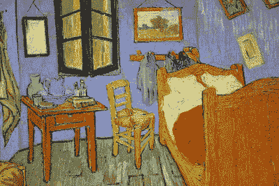
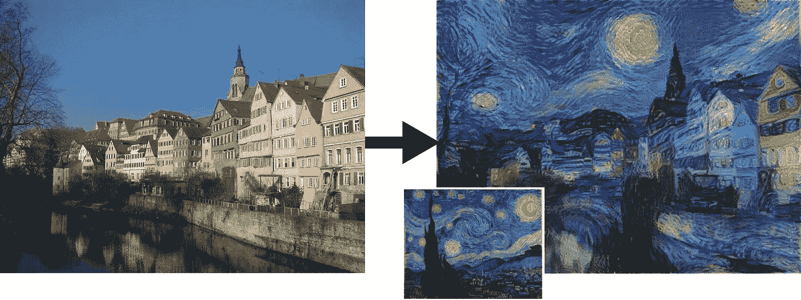
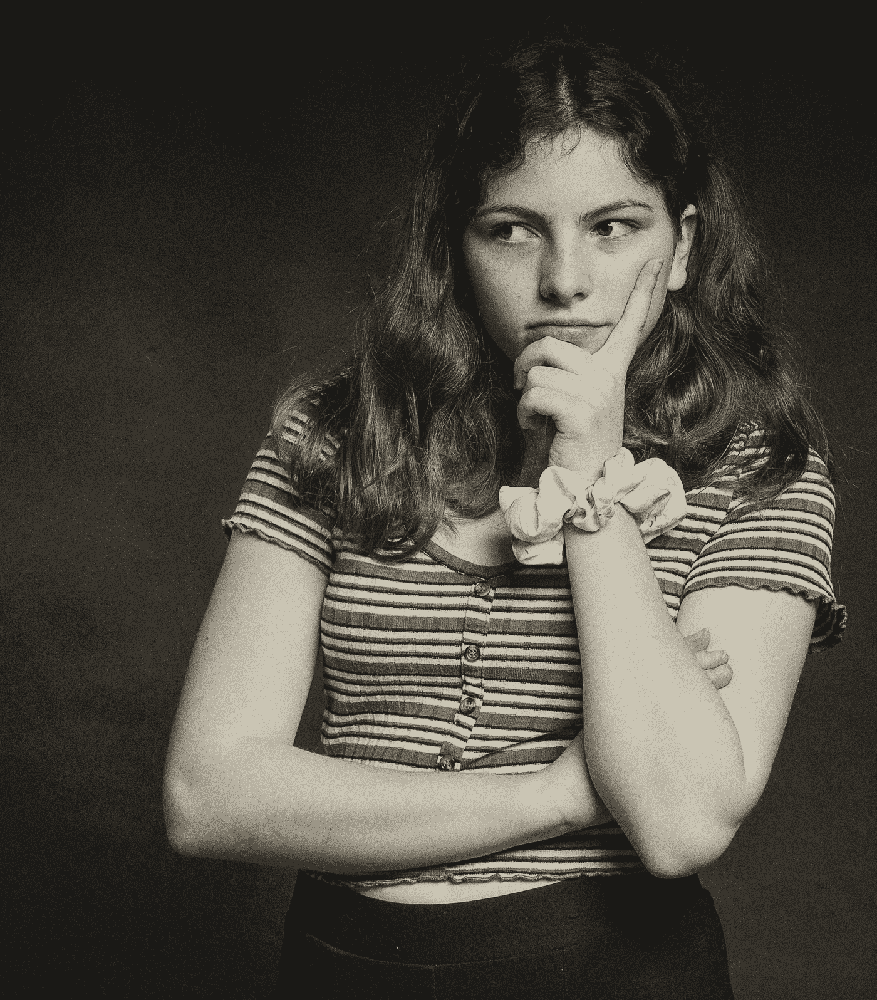
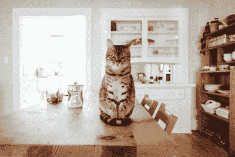
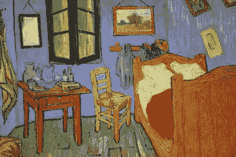
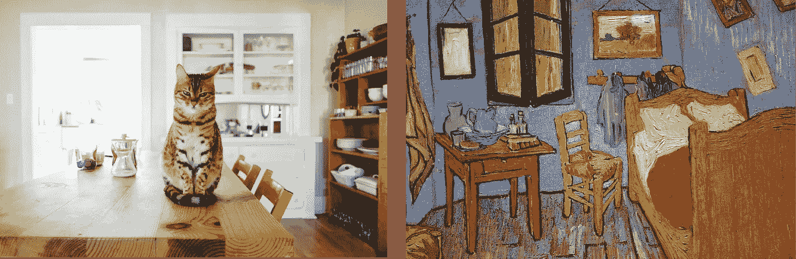
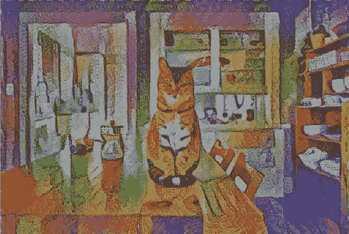
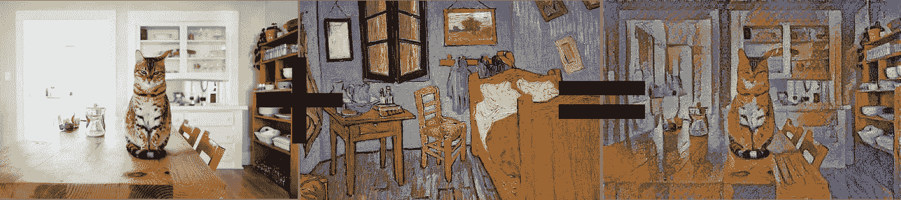

# TensorFlow Hub & Magenta 在 5 分钟内实现快速神经风格转换

> 原文：<https://towardsdatascience.com/fast-neural-style-transfer-in-5-minutes-with-tensorflow-hub-magenta-110b60431dcc?source=collection_archive---------23----------------------->

## 深度学习案例研究

## 用 Magenta 的任意图像风格化网络和深度学习将梵高的独特风格转移到照片上

在我们开始教程之前:如果你正在阅读这篇文章，我们可能有相似的兴趣，并且正在/将要从事相似的行业。那么我们就通过 [*Linkedin*](https://linkedin.com/in/orhangaziyalcin/) *来连线吧！请不要犹豫发送联系请求！*[*Orhan g . yaln—Linkedin*](https://linkedin.com/in/orhangaziyalcin/)

图一。用[任意图像风格化网络](https://tfhub.dev/google/magenta/arbitrary-image-stylization-v1-256/2)制作的[神经风格转移](https://en.wikipedia.org/wiki/Neural_Style_Transfer)示例

*我相信你一定遇到过将著名画家的风格转移到新照片的深度学习项目。嗯，我一直在考虑做一个类似的项目，但我意识到你可以在几分钟内完成神经类型的转换，如图 1 所示。我马上会告诉你怎么做。但是，让我们先介绍一些基础知识:*

# 神经类型转移

N eural style transfer 是一种混合两个图像并通过复制另一个图像的样式从内容图像创建新图像的方法，称为样式图像。这个新创建的图像通常被称为风格化图像。

## NST 的历史

图像风格化是[非真实感渲染](https://en.wikipedia.org/wiki/Non-photorealistic_rendering)领域二十年的老问题。非照片真实感渲染与[照片真实感](https://en.wikipedia.org/wiki/Photorealism)相反，后者是尽可能逼真地再现图像的研究。神经风格转移模型的输出是看起来类似于内容图像但是以风格图像的风格的绘画形式的图像。

图二。[原作](https://www.cv-foundation.org/openaccess/content_cvpr_2016/papers/Gatys_Image_Style_Transfer_CVPR_2016_paper.pdf)的[莱昂·加蒂斯](https://scholar.google.de/citations?user=ADMVEmsAAAAJ&hl=en)对[CV-基金会](https://www.cv-foundation.org/)

**神经风格转移(NST)** 最早发表于 [Gatys](https://scholar.google.de/citations?user=ADMVEmsAAAAJ&hl=en) 等人的论文《[一种艺术风格的神经算法](https://arxiv.org/pdf/1508.06576.pdf)，最初发布于 2015 年。NST 方法的新颖性在于使用深度学习将图像内容的表示与其描绘风格分离开来。为了实现这一点， [Gatys](https://scholar.google.de/citations?user=ADMVEmsAAAAJ&hl=en) 等人使用了 [VGG-19 架构](https://arxiv.org/pdf/1409.1556.pdf)，该架构在 [ImageNet](http://www.image-net.org/) 数据集上进行了预训练。尽管我们可以按照相同的方法构建自定义模型，但在本教程中，我们将受益于 TensorFlow Hub 中提供的模型。

## 形象类比

在 NST 推出之前，图像风格化最突出的解决方案是[图像类比](https://mrl.nyu.edu/publications/image-analogies/analogies-72dpi.pdf)方法。**图像模拟**是一种根据训练数据自动创建非真实感渲染过滤器的方法。在这个过程中，学习照片(A)和非真实感拷贝(A’)之间的转换。在这个学习过程之后，该模型可以从另一张照片(B)产生一个非照片真实感拷贝(B’)。然而，由于难以找到图像类比模型的训练数据，NST 方法通常优于图像类比。因此，我们可以谈论 NST 在现实世界应用中相对于图像类比的优越性，这也是为什么我们将重点放在 NST 模型的应用上。

图 3。乔纳森·科森斯在 [Unsplash](https://unsplash.com/photos/DKmeqN8An2I) 上拍摄的照片

## 是艺术吗？

嗯，一旦我们建立了模型，你会看到，创造非真实感图像与神经风格转移是一个非常容易的任务。你可以将漂亮的照片和天才艺术家的画作融合在一起，创造出很多样品。人们一直在讨论，这些输出是否被视为艺术，因为创作者只需在最终产品中添加很少的工作。请随意构建模型、生成样本，并在评论部分分享您的想法。

现在，您已经了解了神经类型转移的基础知识，我们可以继续学习 TensorFlow Hub，这是我们在 NST 工作中使用的存储库。

# 张量流集线器

TensorFlow Hub 是一组经过训练的机器学习模型，您可以轻松使用。TensorFlow 对该中心的官方描述如下:

> TensorFlow Hub 是一个经过训练的机器学习模型库，可随时进行微调，并可部署在任何地方。只需几行代码就可以重用经过训练的模型，如 BERT 和更快的 R-CNN。

除了预训练模型，如 BERT 或更快的 R-CNN，还有大量预训练模型。我们将使用的是 Magenta 的任意图像风格化网络。我们来看看洋红色是什么。

# 洋红色和任意图像风格化

## 洋红色是什么？

图 4。[上的洋红色标志](https://magenta.tensorflow.org/assets/magenta-logo-bottom-text.png)[上的洋红色标志](http://magenta.tensorflow.org)

Magenta 是一个开源研究项目，由谷歌支持，旨在为音乐家和艺术家提供机器学习解决方案。Magenta 在 Python 和 Javascript 中都有支持。使用洋红色，您可以创作歌曲、绘画、声音等等。对于本教程，我们将使用 Magenta 团队训练和维护的网络进行任意图像风格化。

## 任意图像风格化

在观察到 NST 的[原作](https://arxiv.org/pdf/1508.06576.pdf)对风格转换提出了缓慢的优化后，Magenta 团队开发了一种[快速艺术风格转换方法](https://arxiv.org/pdf/1705.06830.pdf)，可以实时工作。尽管模型的可定制性有限，但使用 NST 执行非真实感渲染工作已经足够令人满意。TensorFlow Hub 下的任意图像风格化是一个可以对任意绘画风格进行快速艺术风格转换的模块。

到现在为止，你已经知道什么是神经类型转移了。你也知道，我们将受益于 Magenta 团队开发的任意图像风格化模块，该模块在 TensorFlow Hub 中维护。

现在是编码的时候了！

# 获取图像路径

图 5。Paul Hanaoka 在 [Unsplash](https://unsplash.com/photos/w2DsS-ZAP4U) 上拍摄的照片

我们将从选择两个图像文件开始。我将直接从 URL 加载这些图像文件。你可以自由选择任何你想要的照片。只需在下面的代码中更改文件名和 URL。我为本教程选择的内容图像是一只猫盯着相机的照片，如图 5 所示。

图 6。[阿尔勒的卧室](https://upload.wikimedia.org/wikipedia/commons/8/8c/Vincent_van_gogh%2C_la_camera_da_letto%2C_1889%2C_02.jpg)作者[文森特·梵高](https://en.wikipedia.org/wiki/Vincent_van_Gogh)

我想转移梵高的风格。所以，我选择了他的一幅名画:[阿尔勒的卧室](https://en.wikipedia.org/wiki/Bedroom_in_Arles)，这是他 1889 年在法国罗讷河畔阿尔勒时画的。同样，你可以自由选择任何艺术家的任何作品。你甚至可以用你自己的画。

下面的代码设置了获取图像文件的路径，如图 5 和图 6 所示。

# 图像缩放的自定义功能

我注意到一件事，即使我们在模型定制方面非常有限，通过重新调整图像，我们可以改变照片的风格。事实上，我发现图像越小，模型越能更好地传递风格。如果你想尝试，只需使用 *max_dim* 参数。请注意，更大的 *max_dim* 意味着，生成风格化图像需要的时间稍长。

我们将在下面的 load_img 函数中调用 img_scaler 函数。

# 用于预处理图像的自定义函数

既然我们已经设置了要加载的图像路径和缩放已加载图像的 img_scaler 函数，我们就可以用下面的自定义函数加载图像文件了。

以下要点中的每一行都有注释。请仔细阅读。

现在我们的自定义图像加载函数 *load_img* 也创建好了。我们要做的就是调用它。

# 加载内容和样式图像

对于内容图像和样式图像，我们需要调用一次 *load_img* 函数，结果将是一个 4 维张量，这是我们下面的模型所需要的。下面几行是为这次行动准备的。

现在我们已经成功加载了我们的图像，我们可以用 [**matplotlib**](https://matplotlib.org/) 来绘制它们，如下所示:

这是输出结果:

图 7。左边的内容图片(照片由 [Paul Hanaoka](https://unsplash.com/@plhnk) 在 [Unsplash](https://unsplash.com/photos/w2DsS-ZAP4U) 上拍摄)|右边的风格图片([阿尔勒的卧室](https://upload.wikimedia.org/wikipedia/commons/8/8c/Vincent_van_gogh%2C_la_camera_da_letto%2C_1889%2C_02.jpg)由[文森特·梵高](https://en.wikipedia.org/wiki/Vincent_van_Gogh)拍摄)

你不会相信的，但最困难的部分已经过去了。现在我们可以创建我们的网络，并传递这些图像张量作为 NST 操作的参数。

# 加载任意图像风格化网络

我们需要导入 ***tensorflow_hub*** 库，以便我们可以使用包含预训练模型的模块。导入 tensorflow_hub 后，我们可以使用 ***加载*** 函数加载 [***任意图像风格化***](https://tfhub.dev/google/magenta/arbitrary-image-stylization-v1-256/2) 模块，如下图所示。最后，如[文档](https://tfhub.dev/google/magenta/arbitrary-image-stylization-v1-256/2)所示，我们可以将内容和样式图片作为参数以[***TF . constant***](https://www.tensorflow.org/api_docs/python/tf/constant)对象格式传递。该模块以数组格式返回我们的风格化图像。

我们要做的就是用这个数组，用 [**matplotlib**](https://matplotlib.org/) 来绘图。下面几行创建了一个不受所有轴影响的图，足够大到可以让你查看图像。

…这是我们的风格化图像:

图 8。[保罗·花冈](https://unsplash.com/@plhnk)神经风格转移后的照片

图 9 总结了我们在本教程中所做的工作:

图 9。用[任意图像风格化网络](https://tfhub.dev/google/magenta/arbitrary-image-stylization-v1-256/2)制作的[神经风格转移](https://en.wikipedia.org/wiki/Neural_Style_Transfer)实例

# 恭喜

正如你所看到的，用最少的代码(我们甚至没有训练一个模型)，我们用[文森特·梵高](https://en.wikipedia.org/wiki/Vincent_van_Gogh)的一幅画，在从 [Unsplash](https://unsplash.com/) 获得的随机图像上做了一个相当好的[神经风格转移](https://en.wikipedia.org/wiki/Neural_Style_Transfer)。尝试不同的[照片](https://unsplash.com/)和[画作](https://en.wikipedia.org/wiki/100_Great_Paintings)来发现任意图像风格化网络的能力。此外，摆弄一下 [max_dim](https://gist.github.com/ogyalcin/a768a710daa51697f406d41bc04ceceb) 的大小，你会看到风格转移变化很大。

# 订阅邮件列表获取完整代码

如果你想在 Google Colab 上获得完整的代码，并获得我的最新内容，请订阅邮件列表:✉️

> [*现在就订阅*](http://eepurl.com/hd6Xfv)

# 喜欢这篇文章

如果你喜欢这篇文章，可以考虑看看我的其他类似文章:

 [## 使用 MNIST 数据集在 10 分钟内完成图像分类

towardsdatascience.com](/image-classification-in-10-minutes-with-mnist-dataset-54c35b77a38d)  [## TensorFlow 和 VGG19 可以帮助您将照片转换成美丽的波普艺术作品

### 神经风格转移基于安迪沃霍尔的门罗双联画与预训练的计算机视觉网络 VGG19，转移…

towardsdatascience.com](/tensorflow-and-vgg19-can-help-you-convert-your-photos-into-beautiful-pop-art-pieces-c1abe87e7e01)  [## 利用生成性对抗网络在 10 分钟内生成图像

### 使用无监督深度学习生成手写数字与深度卷积甘斯使用张量流和…

towardsdatascience.com](/image-generation-in-10-minutes-with-generative-adversarial-networks-c2afc56bfa3b)  [## 伯特和拥抱脸 10 分钟情感分析

### 学习预训练的自然语言处理模型的基础，伯特，并建立一个使用 IMDB 电影评论的情感分类器…

towardsdatascience.com](/sentiment-analysis-in-10-minutes-with-bert-and-hugging-face-294e8a04b671)