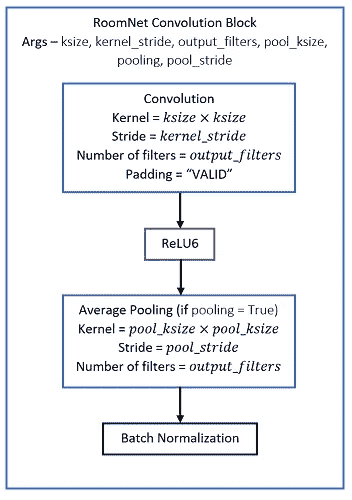

# 基于带代码的机器学习的快速房地产图像分类

> 原文：<https://towardsdatascience.com/fast-real-estate-image-classification-using-machine-learning-with-code-32e0539eab96?source=collection_archive---------38----------------------->

RoomNet 是一个非常轻量级( *700 KB* )和快速卷积神经网络，用于对一所房子/公寓的不同房间的图片进行分类，在 1839 张图片中具有 **88.9 %的验证准确性**。我用 python 和 [TensorFlow](https://medium.com/u/b1d410cb9700?source=post_page-----32e0539eab96--------------------------------) 写了这个。

顺便说一句，我制作了这个艺术品，是的，我*实际上*不是三年级学生，尽管它引发了诱人的流行观点。

这是一个我设计的自定义架构，用于将输入图像分类为以下 6 个类别之一(按照类别 id 的顺序)

> **后院** -0、**浴室** -1、**卧室** -2、**前院** -3、**厨房** -4、**客厅** -5

照片来源按顺时针方向从左至右依次为 [Chastity Cortijo](https://unsplash.com/@chastityco?utm_source=medium&utm_medium=referral) 在 [Unsplash](https://unsplash.com?utm_source=medium&utm_medium=referral) (浴室)拍照、 [Roberto Nickson](https://unsplash.com/@rpnickson?utm_source=medium&utm_medium=referral) 在 [Unsplash](https://unsplash.com?utm_source=medium&utm_medium=referral) (卧室)拍照、 [Jason Briscoe](https://unsplash.com/@jsnbrsc?utm_source=medium&utm_medium=referral) 在 [Unsplash](https://unsplash.com?utm_source=medium&utm_medium=referral) (厨房)拍照、 [Shaun Montero](https://unsplash.com/@notsazuki?utm_source=medium&utm_medium=referral) 在 [Unsplash](https://unsplash.com?utm_source=medium&utm_medium=referral) (后院)拍照、 [Roberto Nickson 拍照](https://unsplash.com/@rpnickson?utm_source=medium&utm_medium=referral)

# 建筑积木-

这些模块用于构建最终的神经网络。它们由基本的基本神经层组成，如卷积、平均池和批量标准化。

RoomNet 卷积块。这是最基本的块

RoomNet 剩余块。它由前面描述的卷积模块组成。

RoomNet 密集块。这将在最后从提取的图像特征中进行分类。

# 完整的网络架构-

使用上面描述的构建块，下面呈现的是具有相关参数的完整神经网络架构。

训练和部署它的代码可以在 GitHub 上找到

 [## ironhide23586/RoomNet

### 一个卷积神经网络，以 88.9 %的验证准确率对房屋/公寓的不同房间的图片进行分类…

github.com](https://github.com/ironhide23586/RoomNet) 

# 创新推理-

优化了 **infer.py** 中的推理代码。参考 *main* 方法中调用 *classify_im_dir* 方法的短代码。

# 培训-

验证准确性

*   输入图像尺寸= 224 x 224(尝试了 300 x 300，600 x 600)
*   *Softmax 交叉熵损失*与 *L2 权重归一化*一起使用
*   *辍学*从 0(最初)到 0.3(间歇地接近训练结束)不等。放置在每个块之后的漏失层。
*   *批量正常化*移动手段&var 在中途退出训练时被冻结。
*   *Adam Optimizer* 用于指数学习率衰减。
*   最初接受批量计算批量移动方法/变量的培训。接下来是训练网络，通过在训练期间禁用该计算和使用冻结的平均值/变量。*导致验证准确度立即跃升约 20%**(在训练步长 150，000 附近明显)。我将很快发表另一篇深入研究这一现象的文章。*
*   批量大小从 8(开始时)到 45(接近训练结束时)不等，如-8-> 32-> 40-> 45
*   异步数据读取器采用基于队列的架构设计，即使批量较大，也能在训练期间实现快速数据 I/O。

# 转换到推理优化版本-

*   从张量流图中丢弃了所有与反向传播/训练相关的计算节点。
*   模型大小从大约 2 MB 减少到大约 800 KB。
*   *network.py* 包含定义名为“RoomNet”的模型的类
*   输出是一个 excel 文件，将每个图像路径映射到其标签。还提供了将输入目录分割成对应于类名的目录，并自动将相关图像填充到其各自的目录中。

# 培训环境-

*   使用 Tensorlfow + CUDA 10.0 + cuDNN 在 NVIDIA GTX 1070 笔记本电脑级 GPU(带 8GB GPU 内存)上完成培训
*   使用计算机系统是外星人 m17 r4 膝上型电脑。
*   使用的 CPU 是英特尔酷睿 i7–6700 HQ 处理器，带有 8 个逻辑内核，基本速度为 2.6 GHz(睿频加速至约 3.3 GHz)
*   从零开始到达到最佳模型的训练步骤数为 157，700。
*   花在培训上的时间——大约 48 小时

# 以前的方法尝试过-

*   尝试训练最后的密集 NASnet 移动，但准确率从未超过 60%。
*   在 InceptionV3 中尝试了同样的方法，但是收敛时间太长了。

# 性能图-

## 验证班级 F 分数

F-Score 是精确度和召回率的调和平均值。

## 验证类级精度

## 验证类级召回

*如果你觉得这很有帮助，请随时关注我的更多文章:)*

我是以下出版物的编辑，该出版物发表了与 AI & ML 在地球数字地图绘制中的使用相关的技术文章。请随时关注以保持更新:)

 [## 数字制图中的机器学习和人工智能

### 策划尖端人工智能和人工智能研究文章，来自从事设备、边缘、云和混合领域工作的行业科学家…

medium.com](https://medium.com/ai-ml-cv-in-enriching-digital-maps-navigation) 

# 我的个人资料-

 [## Souham (Sean) Biswas -高级数据科学家(深度学习/计算机视觉)- HERE Technologies…

### 我是芝加哥伊利诺伊理工大学的计算机科学毕业生。我感兴趣的领域包括机器学习、并行…

www.linkedin.com](https://www.linkedin.com/in/souham/)  [## ironhide23586 -概述

### HERE Maps(一家宝马、奥迪、奔驰公司)的高级数据科学家。北极代码库贡献者驳回注册…

github.com](https://github.com/ironhide23586) 

# 临时演员—

在 [Twitch](https://medium.com/u/48b36b89f6d6?source=post_page-----32e0539eab96--------------------------------) 上直播我🤪🤡

我也是一名音乐家。这是我的[音云](https://medium.com/u/94f5b1677695?source=post_page-----32e0539eab96--------------------------------)简介中的一个声音封面。

> *谢谢:)*