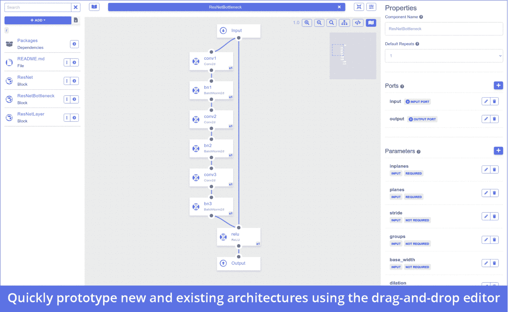
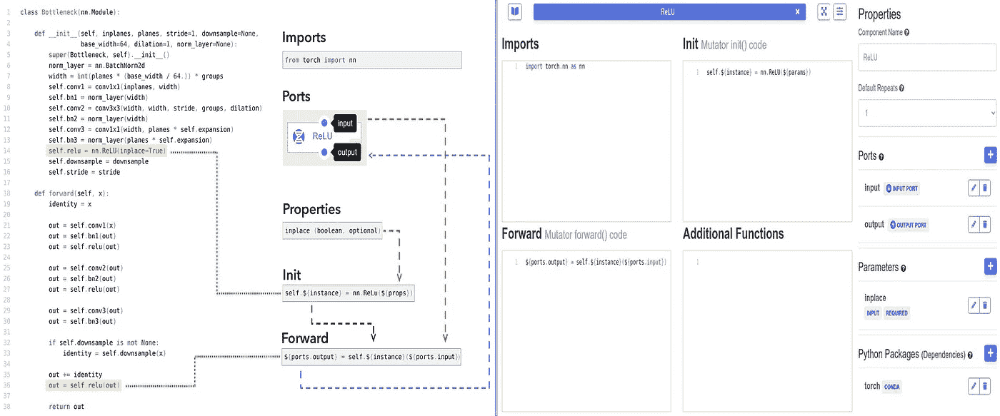
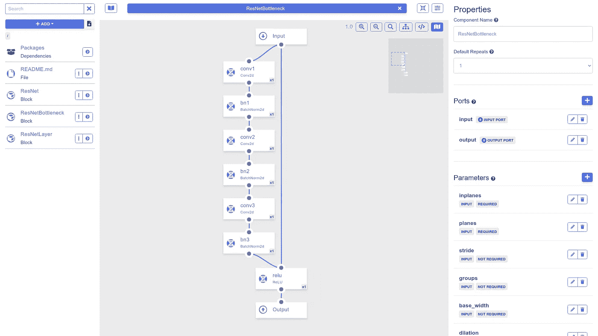

# 基于 PrototypeML.com 的快速视觉神经网络设计

> 原文：<https://towardsdatascience.com/fast-visual-neural-network-design-with-prototypeml-com-ed83ef4f6f64?source=collection_archive---------52----------------------->

## 新的直观和强大的视觉神经网络设计平台，允许快速模型原型。

神经网络体系结构通常是从概念上设计并以视觉术语描述的，但通过编写容易出错的代码来实现。PrototypeML.com 是一个新的(目前在 alpha 中)开放神经网络开发环境，允许您(a)通过直观的可视化拖放和代码编辑界面快速原型化/设计任何神经网络架构,( b)基于社区驱动的网络构建块库进行构建，以及(c)导出完全可读的 PyTorch 代码用于培训。在[PrototypeML.com](https://prototypeml.com)尝试一下。



*作者图片。*

# PrototypeML 如何工作

PyTorch 在研究界越来越受欢迎，它以概念简单、动态图形支持、模块化和面向未来的设计而闻名。PrototypeML 与 PyTorch 框架紧密耦合，支持普通 PyTorch 模型中可用的全部动态功能和任意代码执行。我们通过几个基本构件来实现这一点。

## 将神经网络表示为语法树代码图

首先，我们利用 PyTorch“作为常规 Python 程序的深度学习模型”设计范式，以静态语法树代码图的形式表示神经网络模型，而不是预定义的神经组件图。

## 变异体

其次，我们引入了“变异体”的概念。mutator 组件封装了普通 PyTorch 或任意 Python 代码的片段，并定义了一种标准化的格式，通过这种格式可以表示数据输入和输出以及参数。

PyTorch 模型使用[nn 表示。模块](https://pytorch.org/docs/master/generated/torch.nn.Module.html) 类范例，其中带有参数的神经网络层在 [*nn 中被实例化。模块*](https://pytorch.org/docs/master/generated/torch.nn.Module.html) 类 *init()* 函数，并在网络正向传递期间调用 [*nn。模块*](https://pytorch.org/docs/master/generated/torch.nn.Module.html) 类 *forward()* 函数。Mutators 通过将执行 *init()* 函数中的代码实例化和相应的 *forward()* 执行代码所需的代码封装到单个组件中来构建这个模式，该组件包含运行代码所需的一切，而不管它将在哪里使用。

赋值函数定义了以下字段:

1.  必需的导入(如标准 PyTorch 库，或任何第三方 PyTorch 库或 Python 代码库)。如果 mutator 需要安装一个包，请在 Python 包部分中指定
2.  在 *forward()* 阶段流入和流出 mutator 的数据流是通过端口定义的
3.  在 *init()* 中初始化代码所需的参数在**参数部分中定义**
4.  **在 *nn 中初始化组件的代码。模块 init()* 函数**
5.  **执行 *nn 内组件的代码。模块转发()*功能**
6.  **任何需要的附加功能**

**Mutators 实现了各种神奇的变量，允许通过代码中的可视化界面访问设置，具体来说:**

*   ***${instance} |* 可用于 *init()* 和*forward()*|用于表示当前实例名(为了允许多次使用同一个赋值函数，init 中的变量名应该包括这个神奇的变量)**
*   ***$ {港口。<名称> }* |仅在 *forward()* 中可用|用于表示输入或输出端口变量。<名称>应替换为您在可视界面中选择的名称**
*   ***${params}* |仅在 *init()* 中可用|为 *init()* 函数实例化生成逗号分隔的输入参数列表的快捷方式(例如， *${params}* 可能会变成 spam="eggs ")**
*   ***${params。< name > }* |仅在 *init()* 中可用|用于表示参数的内容(${params.spam}可能会变成“eggs”)**

****

**ReLU Mutator 示例。*图片作者。***

## **阻碍**

**第三，我们实现“块”容器来封装子节点之间的关系。一个块组件代表一个[nn。模块](https://pytorch.org/docs/master/generated/torch.nn.Module.html) 类，并用一个可视化图形表示。通过从库栏拖放，可以将变异子和其他块作为节点添加到图形中，并且在各个节点之间绘制的边代表神经网络模型的数据流。**

****

**演示跳过连接的 ResNet 瓶颈层。*作者图片。***

## **代码生成**

**为了生成代码(可通过界面中的小下载按钮或块编辑器中的查看代码按钮访问)，遍历块图，将 mutator 和块 *init()* 和 *forward()* 代码段组合到它们各自的函数中，并解析各个组件之间的输入和输出依赖关系和参数。只需一次点击，您就可以下载您的模型的编译代码，包括所有依赖项、conda/pip 环境/需求文件等。**

# **构建 MNIST 分类器**

**随着本质细节的方式，让我们看看所有这些如何帮助我们更快地原型神经网络！我们将构建一个基本的 MNIST 分类器，因为这几乎是神经网络的“Hello World ”(不过不要担心，生成一个类似的网络来处理 CIFAR-10，甚至 ImageNet 也一样容易！).下面详细介绍的项目可以在 https://prototypeml.com/prototypeml/mnist-classifier 的[找到。继续前进，分叉它(在你创建了一个帐户之后)，这样你就可以跟着走了。](https://prototypeml.com/prototypeml/mnist-classifier)**

1.  **[签到](https://prototypeml.com/login) /R [注册](https://prototypeml.com/register)和[叉](https://prototypeml.com/prototypeml/mnist-classifier)MNIST 选粉机项目。**
2.  **在项目页面上，单击右上角的 Edit Model 按钮。这将把您带到模型编辑器界面。在你的左手边是库栏，在那里你所有的组件被管理。中间是你编写变异函数和构建模块的地方。右侧是编辑 mutator、block 和 component 实例属性的位置。**
3.  **首先，从包存储库中添加已经构建(并自动生成)的 PyTorch 库。在库栏中，点击“添加”按钮，选择“添加包依赖”。接下来，选择 PyTorch(它应该在顶部附近)，然后单击“使用”按钮。这将把这个包作为一个依赖项添加到您的项目中(添加任何其他依赖项的过程也是一样的！).现在，您应该在库栏中看到一个包目录。如果您导航到 Packages 目录，并单击 PyTorch，您将找到整个 PyTorch 神经网络函数库。**
4.  **返回到您的根目录(单击“添加”按钮下面的面包屑中的“/”)，并通过“添加”按钮添加一个块(您可以随意命名)。点击块打开它，你会看到块编辑界面。如果再次导航到 Packages/PyTorch 目录，现在可以将其中一个子文件夹中的任何可用组件拖到项目中。**
5.  **继续并开始构建您的模型:将组件从库栏拖到块编辑器中，并开始通过将边从输出端口拖到输入端口来连接它们(端口是组件实例顶部/底部的圆)。单击组件实例以查看和设置特定于该组件的参数。如果你想得到一些帮助来弄清楚要拖动什么，请随意查看示例项目。**
6.  **在块编辑器中的任何时候，点击块编辑器工具栏中的>按钮，查看将要生成的代码——探索当您拖动组件并将它们连接在一起时，代码是如何变化的。请注意，当两条边进入单个输入端口时，代码将自动包含一个连接操作(对此进行配置，或通过单击输入端口将其更改为替代的组合函数)。**
7.  **编辑完模型后，单击库栏中“添加”按钮旁边的下载代码按钮，您就可以开始培训了。**

# **使用外部库&设计变异函数**

**到目前为止，我们一直使用 PyTorch 库中包含的 mutator，但是如果您发现您需要某个组件，而这个组件的 mutator 还没有在包存储库中编写(或者您想在您的网络中包含完全自定义的代码)，那么您将需要自己设计。我们将构建一个 mutator，包装 [EfficientNet 库](https://github.com/lukemelas/EfficientNet-PyTorch)的 PyTorch 实现。**

1.  **首先，通过单击“add”按钮添加一个 mutator。**
2.  **在编辑器右侧的属性栏中，通过单击 parameters 旁边的“+”按钮，添加这个 mutator 所需的两个参数(模型名称和输出类的数量)。**
3.  **我们需要在 *Imports* 部分导入库，如下所示:**

```
**from efficientnet_pytorch import EfficientNet**
```

**4.接下来，让我们在 *Init* 部分编写初始化 EfficientNet 模型所需的代码，就像这样。注意我们如何使用神奇变量 *${instance}* 而不是变量名称，并使用 *${params 填充参数。<名称> }* 语法:**

```
**self.${instance} = EfficientNet.from_pretrained(${params.model}, num_classes=${params.num_classes})**
```

**5.最后，编写调用 *Forward* 部分中的 EfficientNet 模型所需的代码，就像这样(同样，注意我们是如何使用神奇变量 *${ports。<名称> }* 引用输入/输出变量， *${instance}* 同上):**

```
**${ports.output} = self.${instance}(${ports.input})**
```

**6.我们完事了。当拖动到一个块中时(配置设置为:name='efficientnet '，model='efficientnet-b0 '，num_classes=10)，这个 mutator 将产生以下代码(假设块的其余部分为空):**

```
**import torch
from efficientnet_pytorch import EfficientNetclass EfficientNet_Classifier(torch.nn.Module):
    def __init__(self):
        super(EfficientNet_Classifier, self).__init__() 

        self.efficientnet = EfficientNet.from_pretrained('efficientnet-b0', num_classes=10)def forward(self, input):
        efficientnet_output = self.efficientnet(input)

        return efficientnet_output**
```

**完整的 MNIST 的例子可以在 https://prototypeml.com/prototypeml/mnist-classifier 找到。**

# **结论**

**PrototypeML 实现了一个强大而直观的接口和组件标准，允许快速原型化强大的神经网络架构和实验。我们希望听到您对平台的想法和反馈，并期待在不久的将来从 alpha 升级到 beta。你可以在 https://PrototypeML.com[访问平台，在这里](https://PrototypeML.com,)[访问预印本](https://arxiv.org/abs/2007.01097)，在 https://Docs.PrototypeML.com访问文档，在 https://discord.gg/zq8uqSf访问我们的 Discord 社区频道。**