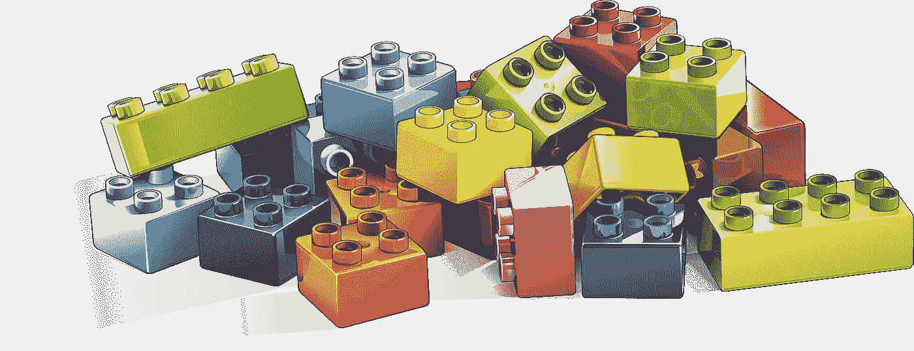
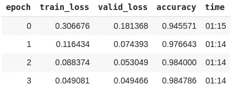
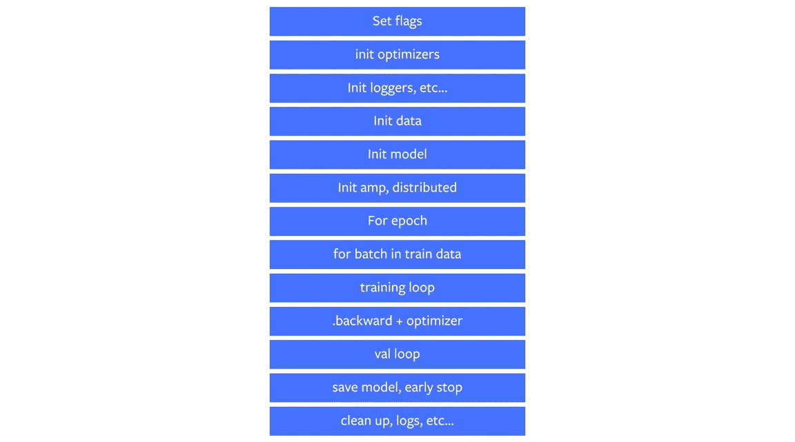
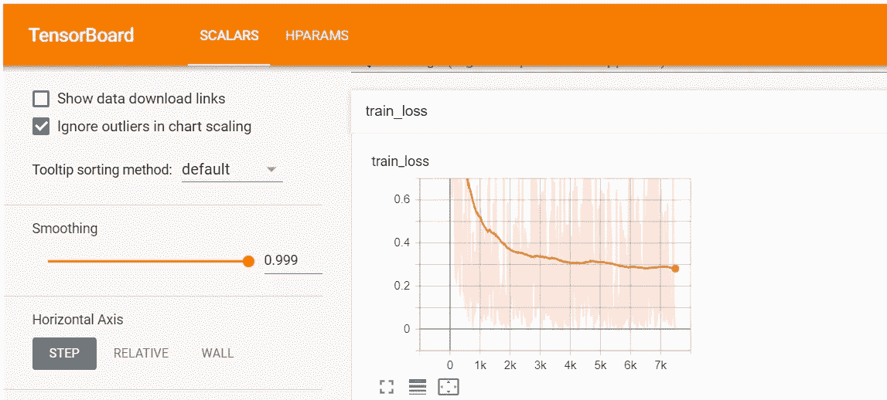

# fastai 和 PyTorch Lightning 正在使人工智能民主化

> 原文：<https://towardsdatascience.com/fastai-and-pytorch-lightning-are-democratising-ai-92318ff224b1?source=collection_archive---------11----------------------->

## 这两个框架如何使深度学习对从业者可用，同时对研究人员保持高度可攻击性。



图片由来自 [Pixabay](https://pixabay.com/?utm_source=link-attribution&utm_medium=referral&utm_campaign=image&utm_content=3388163) 的 [Francis Ray](https://pixabay.com/users/Painter06-3732158/?utm_source=link-attribution&utm_medium=referral&utm_campaign=image&utm_content=3388163) 拍摄

深度学习框架对推动该领域向前发展的突破性研究负有巨大责任。像 [TensorFlow](https://www.tensorflow.org/) 和 [PyTorch](https://pytorch.org/) 这样的大型项目，像 [DL4J](https://deeplearning4j.org/) 这样的特定语言项目，以及像 [Swift for TensorFlow](https://www.tensorflow.org/swift) 这样的实验项目，为从业者和研究人员提供了各种各样的选择。

**然而，深度学习对于没有数学背景的软件工程师来说仍然太难，而像 TensorFlow 和 PyTorch 这样的框架对于没有扎实工程背景的数据科学研究人员来说又很复杂。**


为此，像 [Keras](https://keras.io/) 、 [fastai](https://docs.fast.ai/) 和 [PyTorch Lightning](https://pytorch-lightning.readthedocs.io/en/latest/) 这样的库在完善的代码基础上提供了更高的抽象。Keras 大多使用 TensorFlow 作为后端，而 fastai 和 PyTorch Lightning 都是基于 PyTorch 构建的。在这个故事中，我们考察了后两者，它们提供了什么，以及新版本给我们带来了什么；fastai 2.0 和 PyTorch Lightning 0.7.1。

> [学习率](https://www.dimpo.me/newsletter)是我每周给那些对 AI 和 MLOps 世界好奇的人发的简讯。你会在每周五收到我关于最新人工智能新闻、研究、回购和书籍的更新和想法。在这里订阅！

# 法斯泰

fastai 是一个深度学习库，主要由[杰瑞米·霍华德](https://github.com/jph00)和[西尔万·古格](https://github.com/sgugger)开发，由数百名贡献者维护。它使从业者能够毫不费力地获得最先进的结果，并促进研究人员的深入实验。该框架于 2017 年推出，以支持相关的[课程](https://course.fast.ai/)和[第二版](https://dev.fast.ai/)预计于 2020 年 7 月推出。

## 介绍

在这个故事中，我们主要谈论即将推出的 fastai 库的第二个版本。考虑到这一点，fastai 采用分层方法进行设计。**它为实践者提供了可以快速交付最新成果的高级组件，为研究人员提供了可以以各种方式组合的低级模块，从而实现了对新的深度学习方法的实验****【1】**。

更高级别的 API 对初学者或主要想应用预先存在的深度学习技术的人工智能从业者很有用。 **fastai 默认支持四个应用领域:计算机视觉、自然语言处理、表格数据或时间序列、协同过滤推荐系统。**此外，fastai 是一个固执己见的框架，提供带有合理默认值的可定制模型。预定义的超参数遵循最佳实践，并参考了相关的最新研究成果。这种设计会产生清晰、易于理解的代码，即使有错误也很少。

另一方面，低级 API 通过优化的原语支持中级和高级功能。**那些原语主要是在流行的 Python 库之上开发的，比如**[**py torch**](https://pytorch.org/)**，**[**numpy**](https://numpy.org/)**，**[**pandas**](https://pandas.pydata.org/)**或者**[**PIL**](https://pillow.readthedocs.io/)**。然而，为了能够被黑客攻击，fastai 与每一个底层库无缝地互操作。例如，fastai 可以很容易地将其组件注入 PyTorch 模块或使用 fastai 的原始 PyTorch 功能。**

简而言之，fastai 的目标是为初学者提供平坦的学习曲线，但对研究人员来说足够灵活。

## 代码示例

为了更好地理解每个库的设计选择，我们为 MNIST 数据集实现了一个最先进的分类器。毕竟，MNIST 可以说是深度学习的“ *Hello world* ”范例。



该框架的高级 API 允许我们用大约五行代码来解决 MNIST 挑战。尽管这只是一个玩具示例，但它突出了分层架构的可能性。再者，训练深度学习模型的几个关键要素对我们是隐藏的；最优学习速率、批量和其他超参数是自动设置的，而损失函数是由数据推断的。迁移学习可以轻松处理，ResNet 架构会自动根据手头的问题进行调整。

在 MNIST 数据集上，仅用了五行代码和不到五分钟的 GPU 训练就达到了 98%以上的准确率。面临 fastai 默认支持的挑战(例如，视觉、文本、表格数据或协同过滤)的从业者可能有类似的经历。在任何其他情况下，只需稍作调整就能取得很大成就。

## 2.0 版中的新功能

fastai 版是对第一版的完全重写。代码库中有许多突破性的变化，你可以在杰瑞米·霍华德的相关 YouTube 系列中浏览其中的大部分。

但是，最显著的修改总结如下:

*   一种新的可黑客攻击的数据块 API，可以为深度学习准备任何数据集
*   一种新的灵活回拨系统
*   一种基于 GPU 的新型高性能数据增强系统
*   一种通用的优化器设计，具有可以混合和匹配的块，允许您只需几行代码就可以实现任何优化器

你可以在去年的[课程](https://course.fast.ai/)的第二部分中体验一下新的 API，而当 2020 年的课程可用于流媒体时，预计会有更多的示例。

# PyTorch 闪电

PyTorch Lightning 是一款面向研究人员的轻量级 PyTorch 包装器，由[威廉·法尔肯](https://github.com/williamFalcon)开发。然而，它很快被为主要组织工作的研究团队采用(例如 [FAIR](https://ai.facebook.com/) )，并获得了风险投资家的资助，一个全职团队就在我们说话的时候成立了。PyTorch Lightning 更像是一个风格指南，帮助你将科学代码从工程中分离出来。

## 介绍

PyTorch Lightning 是 PyTorch 上的一个灵活的轻量级包装器，它为如何构建深度学习代码设置了一个标准。这样，**它可以处理大部分的工程工作，让你专注于科学。这种方法导致更少的样板代码，因此，更少的担忧和错误。**

成为一个瘦包装器意味着研究人员或生产团队不需要学习另一个框架的额外好处。同时，它提供了极大的灵活性，可以在抽象工程细节的同时尝试尖端的想法。

PyTorch Lightning 的主要模块是`LightningModule`和`Trainer`。所有科学逻辑都进入了`LightningModule`；数据准备、优化器初始化、训练循环和正向传递。另一方面，所有的工程工作都隐藏在`Trainer`模块中；拟合、自动记录、检查点、提前停止等等。



正如其创建者所说，PyTorch lightning 的目标是**在深度学习社区中推广最佳实践，并促进研究的可重复性。**

## 代码示例

现在让我们看看如何使用 PyTorch 闪电解决 MNIST。我们需要使用相同的预训练模型来避免作弊。为此，继续前面的例子，我们将在训练之前从学习者(即 fastai 学习者)那里抓取模型。我们这样做是因为学习者已经根据 MNIST 挑战调整了模型。如果我们只是获得一个新的 ResNet-34 模型，它将被定制以解决 ImageNet 挑战，这意味着最后一层的输出数量不同。我们需要改变的一件事是告诉第一个卷积期望单通道输入。

我们现在准备实施一个`MNISTSolver`。

为了适应这个模型，我们只需实例化`Trainer`就可以开始了。

PyTorch Lightning 默认提供 TensoBoard 日志记录功能。只需在 Jupyter 中运行下一个魔法命令。

```
%reload_ext tensorboard
%tensorboard --logdir lightning_logs/
```



## 新功能

PyTorch Lightning 的新稳定版本是 0.7.1。在那里，我们可以找到令人兴奋的新功能，总结如下:

*   支持 TPU 培训
*   普通的 16 位精度支持
*   内置性能分析器
*   与新的记录器集成，如 [TensorBoard](https://www.tensorflow.org/tensorboard) 、[彗星](https://www.comet.ml/site/)、 [neptune.ai](https://neptune.ai/) 、 [MLflow](https://mlflow.org/) 或[权重&偏差](https://www.wandb.com/)

请访问该项目的 [GitHub 页面](https://github.com/PyTorchLightning/pytorch-lightning)以获取更多信息，并访问[文档页面](https://pytorch-lightning.readthedocs.io/en/stable/)以深入了解。

# 结论

在这个故事中，我们看到了 fastai 和 PyTorch Lightning 如何让从业者和研究人员轻松实现深度学习解决方案。

fastai 提供了更高层次的抽象，让您更快地获得最先进的结果。另一方面，PyTorch Lightning 对那些熟悉 PyTorch 的人来说有一个更平坦的学习曲线，提供 TPU 支持和与许多伐木工的集成。

最后，你选择什么取决于你面临的挑战。无论如何，你不会错的！

> **我叫 Dimitris Poulopoulos，是希腊比雷埃夫斯大学***[**BigDataStack**](https://bigdatastack.eu/)***的机器学习研究员和博士(c)。我曾为欧洲委员会、欧盟统计局、国际货币基金组织、欧洲中央银行、经合组织和宜家等主要客户设计和实施人工智能和软件解决方案。如果你有兴趣阅读更多关于机器学习、深度学习、数据科学的帖子，在 twitter 上关注我*** *[**中**](https://medium.com/@dpoulopoulos)**[**LinkedIn**](https://www.linkedin.com/in/dpoulopoulos/)**或**[**@ james2pl**](https://twitter.com/james2pl)**。******

# ****参考****

****[1]霍华德、杰里米和西尔万·古格。" fastai:用于深度学习的分层 API . "*信息* 11.2 (2020): 108。****