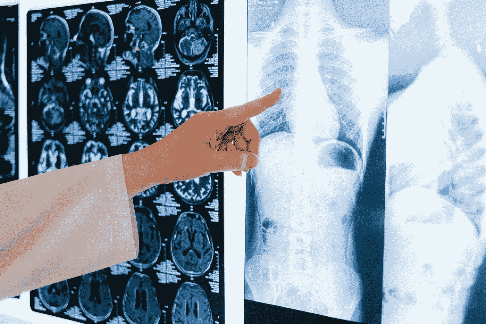

# Fastai 锦囊妙计 Kaggle 数据集实验—第 1 部分

> 原文：<https://towardsdatascience.com/fastai-bag-of-tricks-experiments-with-a-kaggle-dataset-part-1-135e46da72f2?source=collection_archive---------13----------------------->

图片来自 [Pexels](https://www.pexels.com/) 的 [Anna Shvets](https://www.pexels.com/@shvetsa)

在这篇文章中，我将解释我使用 Kaggle 数据集"[胸部 X 射线图像(肺炎)](https://www.kaggle.com/paultimothymooney/chest-xray-pneumonia)"进行的实验，以及我如何在这个过程中解决不同的问题，从而在验证集和测试集上获得完美的准确性。我的目标是向您展示在 fastai (v2)的帮助下您可以轻松使用的不同技巧，并分享我对这个数据集的实验，作为一种消融研究。我假设你了解深度学习的基础知识，熟悉 python 的 DL 框架，尤其是 PyTorch 和 fastai。所以让我们开始吧。

图片来自 [Kaggle](https://www.kaggle.com/paultimothymooney/chest-xray-pneumonia)

# 下载数据集

您可以通过下面的命令轻松地获得数据集。在此之前，你需要创建一个 Kaggle 帐户，以防你还没有，并使用你自己的 API 令牌信息来运行代码。

# 入门指南

我首先看一下数据集的结构，并加载图像文件名。在这个数据集中，我们有机器学习数据集中常见的训练、验证和测试集。

这里我使用 *get_image_files* 来读取我们数据的三个分区的图像文件名，然后我使用 *L* 来映射三个文件名列表上的 *len* 函数，这是 fastai 的 Python 中 List 类的一个很好的替代。如您所见，我们分别有 5216、16 和 624 幅图像用于训练、验证和测试集。我们的验证集真的很小，我将在本文后面谈到它

让我们来看看一个微型 EDA。我想知道数据集是否平衡，也就是说，正常与肺炎类别的项目数量是否大致相同。

每个类别的项目数，按作者分类的图像

由于这在现实世界中很常见，特别是在医学数据集上，我们在这两个类别的项目数量上有很大差距(肺炎与正常病例的比例为 3:1)。所以我们要考虑的第一个问题是用某种技巧来解决这种不平衡。实际上，我不建议在处理这个问题之前花太多时间，我更愿意建议先用不平衡的数据建立你的初始模型，然后看看结果如何！

# 数据块和数据加载器

在这里，我将创建我的数据块和数据加载器，将数据输入到模型中。在 fastai 中，这真的很容易做到，然而，对于这篇文章，我不打算详细介绍每段代码做什么，我强烈建议[在课程网站上免费阅读他们的书](https://www.amazon.com/Deep-Learning-Coders-fastai-PyTorch/dp/1492045527)或[书的 Jupyter 笔记本](https://course.fast.ai/start_colab)。但是对于那些熟悉 PyTorch 和 fastai 的人来说，我在这里构建了我的训练和验证数据加载器以及数据扩充。

一批图像放大和调整大小后，由作者图像

即使在这一小组图像中，阶级不平衡也很明显！

我在这里使用数据扩充来缓解小数据集的问题。虽然它不会改变我们的正面与负面案例的比率，但它可以通过引入更多正面案例来帮助模型解决不平衡问题，这将有助于它更强有力地学习潜在模式。在医疗数据集的数据扩充中，请确保您添加了有意义的数据，并且不会在使数据与真实世界数据差异太大的情况下更改您的数据。在这里，我首先使用“squish”方法将图像的大小调整为 512，以便不丢失可能重要的数据部分(我在这里没有裁剪，但是在文章的下一部分，我们将看到裁剪是如何工作的)。之后， *RandomResizedCropGPU* 从那张 512 的图像中随机裁剪出大小为 224 的小块。fastai 一书的作者将这种技术称为“预先调整大小”。然后我们将进一步增加*旋转*和*缩放*。我不会翻转或扭曲或改变我的图像的亮度和对比度(对于大多数计算机视觉任务来说，这些都是合法的数据增强类型)，因为我认为这将不再代表实际的 X 射线图像。还要记住，在某些特定任务中(这里可能不多)，甚至水平翻转在 X 射线图像中也会有问题，特别是当身体器官的位置很重要时。例如，右位心是一种罕见的情况，其中心脏位于胸部的右侧，翻转图像将使模型瘫痪，无法检测这些情况。

另外，我想在这里澄清一些事情。该数据集中的图像是单通道灰度图像。但是，我们将在本文后面使用的 ImageNet(以及 fastai 中其他现成模型架构的默认模式)上预训练的模型，预计模型会有一个 3 通道 RGB 输入。我们不必担心这一点，因为数据块和 PILImage 类通过重复我们的第一个通道 2 次以上来克服这一点，使其成为三通道图像，我们已经准备好在任何模型上正常训练它。

# 基线模型

我称之为基线，因为我们在这里没有使用花哨的技巧，但它不会是一个真正的基线模型，就像我们通过堆叠 Conv 和线性图层构建的模型一样。我先从 XResNet18 架构说起。XResNets 实际上很像香草 ResNets，但有一些调整，你可以在线搜索它们或阅读童和等人的论文 [*卷积神经网络图像分类锦囊*](https://arxiv.org/abs/1812.01187) 。艾尔。了解更多的不同之处。因为这将是一个基准模型，我将从头开始训练它，在这种情况下，我不会使用预训练模型。

lr_finder plot，图片由作者提供

正如情节所示和我所料，3e-3 的学习率在这里看起来不错。因此，让我们用*一个周期策略*训练它 10 个周期，然后看看效果如何。

基线模型性能，图片由作者提供

好吧！我们做得并不差，但我们远非完美！这些结果中有一些要点。如果你看看准确性和 f1 成绩的结果，他们似乎是不稳定的，这是由于一些原因。第一，我们是从零开始训练模型(甚至连数据都没有归一化！)这会导致这里的训练更加不稳定。其次，我们的验证集非常小！它只有 16 项可能不能很好地代表模型正在接受训练的数据。最后，我在这里使用一个循环训练，它增加了前 25%迭代的学习率，这可能会在训练的早期导致更高的 valid_loss。

让我们这样来思考我们的模型。我们有 3875 例肺炎和 1341 例正常病例。因此，如果我们的模型简单地为它在训练集中看到的每个项目输出“肺炎”，它可以轻松地达到大约 75%的准确率。我们的模型在这里没有做确切的事情(因为我们的 f1 分数表明它已经在某种程度上学会了区分这两个类别),但是我们应该知道最简单的基线是什么样的！

毕竟，我认为我们在这个相当小的数据集上只训练了 4 分钟就取得了很好的结果。但是，在这篇文章和下一篇文章中，我们将尝试很多很酷的东西来使它变得更好。

# 克服阶级不平衡问题

正如我在前面提到的，我们的问题之一是阶级不平衡问题。您可以在计算机视觉文献中找到许多方法来克服数据集的这个真正常见的问题。我强烈建议阅读 [*一篇系统研究卷积神经网络*](https://arxiv.org/abs/1710.05381) 中的类不平衡问题的论文，这篇论文在比较解决这个问题的不同方法方面做得非常好。在其摘要中，您可以找到以下内容:

> 基于我们的实验结果，我们得出结论:( I)类别不平衡对分类性能的影响是**有害的**；(ii)在几乎所有分析场景中占主导地位的解决类别不平衡的方法是**过采样…** (iv)与一些经典的机器
> 学习模型相反，**过采样不会导致 CNN 的过拟合**

真好看！我们刚刚得到了答案！让我解释一下。克服类不平衡最常用的方法是对具有较高比率的类进行下采样(使用较少的数据),或者对具有较低比率的类进行过采样。本文建议采取后者；在我们的例子中，通过简单地在训练数据集中重复它们来增加“正常”案例的数量。我们可以这样做:

我们需要做的就是这两行代码！在第一行中，我在一个列表中收集“正常”案例的文件名(实际上是 L！).在第二行中，我以某种方式堆叠了三个列表:一个列表包含我以前的训练文件名(不平衡的正常和肺炎病例)，一个列表包含重复两次的“正常”文件名(normal_cases*2)，一个列表包含 16 个验证文件(我们稍后将在数据块中分离训练和验证集，就像上一节中的代码一样)。现在我们有 3875 例肺炎和 4023 例正常病例，大致相当。确保将这个过采样列表与训练集和验证集的新索引一起提供给数据块。让我们在这个新数据集上再次训练我们的模型(从头开始构建模型，与之前完全相同):

获得 100%的准确率，图片由作者提供

哇！我们刚刚获得了 100%的准确率！据我所知，在撰写本文时，这是迄今为止在所提供的验证集上最好的结果，并且训练时间比其他人在这个数据集上建议的模型短得多。

我们的模型完美地对验证集进行了分类。通过进行这种过采样，训练过程似乎比以前的模型更稳定。我们的验证损失现在显著低于以前的模型，并且更接近于训练损失。因此，我们可以用这个来确认那篇论文的结果，因为我们没有过度拟合就得到更好的结果。

结果绝对很棒，但是不要太高兴！:)您可能记得我们的验证集非常小，只有 16 个样本。这个样本数量远远小于我们对模型性能得出的可靠结论。实际上，如果你尝试我在这里所做的，你可能会得到不同的结果，因为在这种低数量的样本中，随机机会有很大的作用！我在测试集上测试了这个模型(我知道现在使用这个部分还为时过早，但我还是做了！)我得到了 85%的准确率，这证实了我在这里所说的，该模型不能很好地概括(目前！).

因此，为了训练一个真正好的和健壮的模型，从现在开始，在本文中，我将数据集提供的测试集合并到验证集，以便我们可以在实现其他技巧时更准确地判断我们的模型的行为，并决定下一步如何处理这些信息。下面是如何合并验证集和测试集:

合并 val 和测试集

这是过采样数据集上的新基线模型结果，合并了验证和测试集以及两个新指标，即精度和召回率:

合并验证和测试集后的模型性能，图片由作者提供

如你所见，结果越来越稳定，不会从一个数字跳到另一个数字。在接下来的每一部分中，我会在我们的训练过程中增加一个技巧，看看它是如何影响训练的。

# 正常化

在本节中，我将通过减去平均值并除以标准差来标准化我的数据。首先，我需要从我的数据中获得这些统计数据。我执行以下操作来获得每个通道的平均值和标准偏差:

正如你看到的，均值或标准差的三个数字是相同的，因为通道是相同的，正如我在上一节中所说的。

通过将以下内容添加到用于创建数据块的代码中，您将使您的数据规范化:

当我从头开始再次训练同一个模型时，我得到了以下结果:

标准化后的模型性能，图片由作者提供

这并没有造成很大的差异，主要是因为我们是从零开始训练，模型也可以适应非标准化的数据。

# 迁移学习和预训练模型

通过使用迁移学习和预训练模型来开始你的项目(或者在一些基线模型之后)几乎总是一个好主意。它们比随机初始化你的权重更有帮助，帮助你的模型更容易更快地收敛。在迁移学习中，重要的是你的输入数据与模型被训练的数据具有相似的特征；因此，我们将对数据进行归一化处理，使每个通道的均值为零，标准差为一。还记得我们(其实是 fastai！)重复我们拥有的单个通道，以便用三个通道使我们的图像像自然图像一样。所以，我们现在准备微调我们的第一个模型！像以前一样构建您的数据块，在您的 *batch_tfms* 中包含 *Normalize* ，然后您可以像这样轻松地构建您的预训练模型:

这里有几件事需要注意。我已经将架构更改为 resnet18，这与前一个非常相似，我在这里使用 *cnn_learner* ，默认情况下，它会加载模型的预训练权重，并冻结大多数层(除了新的随机初始化的模型头部)，以便它们的权重不会更新。可以找到学习率，像以前一样训练模型。请记住，在 fastai v2 中，您可以使用 *fine_tune* 方法轻松地微调预训练的模型，该方法首先训练冻结的模型，然后将其解冻并训练更多的时期。但在这里，我是手动完成这个过程的:

预训练 resnet18 性能，图片由作者提供

好吧！通过使用预训练的模型，精确度提高了大约 2%。在图中，你可以看到看起来最好的结果是在训练的中间(时期 6 ),我们可能有比需要更多的时期。正如[杰瑞米·霍华德](https://medium.com/u/34ab754f8c5e?source=post_page-----135e46da72f2--------------------------------)在 2020 fastai 课程中提到的，最好是根据所需的历元数重新训练模型(例如，在本例中为 6 个)，而不是使用具有大量历元的 EarlyStopping 或 SaveModel 回调。原因是我们正在使用一个周期训练，并且我们在最后的迭代中显著降低了学习率，这可能导致在损失表面中找到更好的最优值，这可以帮助模型更好地概括，并且如果我们在学习率高时在迭代中途停止训练，我们会失去这个机会。

# 解冻

现在我们解冻模型，并通过对不同的层使用不同的学习率来训练所有的层。我们知道，在迁移学习中，模型的早期层不需要改变太多的权重，因为他们负责学习的东西在 CV 任务中几乎是常见的。另一方面，随着我们在模型中深入，我们对各层使用更高的学习速率，以使它们适应新的任务。但在此之前，我们先来看看应该使用哪些学习率:

这是 lr_find()的结果:

作者图片

对 *lr_find* 情节的解释有时会变得困难。但在这种情况下是相当简单的。我将给出 slice(1e-6，1e-4)作为模型不同层的学习速率范围(早期层将具有 1e-6 的最大 *lr* ，最深层将具有 1e-4 作为它们的 *max_lr* )。我发现这个范围工作得很好，即使 *lr_find* 图不是很有帮助。

解冻后的模型性能，图片由作者提供

我们的准确度提高了 1%。正如你可能已经注意到的，我在这里训练的次数较少，因为我在此之前训练过一次，我发现 5 次就足够了，根据我之前在上一节中所说的早期停止，我重新训练了它，而不是在程序的中途停止训练。在下一节中，我们将进一步增强模型的性能。

# 渐进调整大小

到目前为止，我们用 224 * 224 大小的图片来训练我们的模型，与超过 512 * 512 的原始大小的图片相比，这是一个相当小的图片。这里，我们将使用尺寸为 360 * 360 的较大图像对上一节中的模型进行微调，以向我们的模型引入更多数据，并帮助它学习模式。你唯一需要改变的是:

我就是这样把尺寸改成 360 的。我们需要再次冻结模型并对其进行一点训练，然后解冻并进行更多训练。为了减少文章的篇幅，我只给你看最后的结果:

最终结果，图片由作者提供

那真的太牛逼了！我们在合并的验证和测试集上获得了大约 95%的准确率，并且精确度和召回分数都非常高。

在下一节中，我们将更彻底地解释我们的模型的结果。

# 模型解释

在这里，我将向您展示如何使用 fastai 轻松地获得模型的解释。让我们看一下获取混淆矩阵的代码:

混淆矩阵，作者图片

很公平！让我们也来看看分类报告:

分类报告，按作者分类的图像

这些数字表明我们在这个相当小的数据集上做得很好。我们现在可以检查我们在初始验证集(这 16 张图片)上做得如何。我知道这很奇怪，因为这些图像已经在我们的合并验证集中，但这只是一个简单的检查，以确保我们的模型比以前更强大，并且在提供的验证集上具有相同的性能:

好极了。百分之百的准确率、f1_score、精度和召回率。正如你所记得的，在文章的开始，在做了过度采样后，我们得到了 100%的准确性，这里我们重复了一遍。但是这个模型更健壮，因为在我们制作的更大的验证集的帮助下，我们能够测试不同的技巧，并使用培训期间打印出来的损失和指标来决定我们下一步应该做什么以及如何调整我们的模型。但不利的一面是，我们不再有任何测试集，我们实际上不知道这个模型在真实数据上表现如何，因为我们可能在合并的验证集上过度拟合了模型。但是结果真的很有希望，我们以后可能不会有问题。

# **文章的下一部分**

由于这篇文章很长，我将在另一篇文章中解释其他技巧和实验，作为本文的第二部分。我们将看到如何使用 **Grad CAM** 和简单的**热图**来可视化我们的模型在图像中所关注的内容，我们将尝试**超参数调整**(调整**重量衰减**和**学习速率**)，我想你会对此感到非常兴奋。之后，我们将尝试**标签平滑**、**混合**、**半精度**训练和其他**模型架构**和**数据增强**方法，我们将看到它们中的每一个如何影响项目。

***来源*** *:我用了《fastai 和 PyTorch* *和 Fastai 课程的程序员* ***深度学习》这本书里的很多思想。我强烈建议给他们一个尝试。***

> **关于我**:我是一名医科学生，我喜欢深度学习和我们能够用它来改善我们生活质量的酷东西。我要用它的力量来克服我们在医学上面临的障碍。除了医学课程，我还花了很多时间研究深度学习，我的目标是在人工智能和医学相遇的跨学科领域工作:)