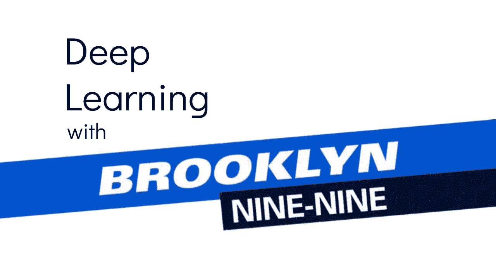
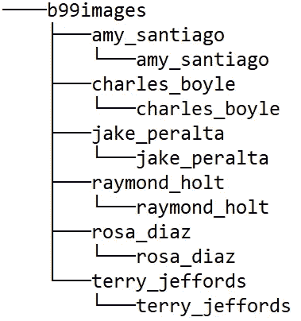
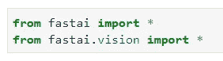
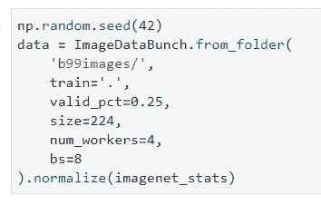
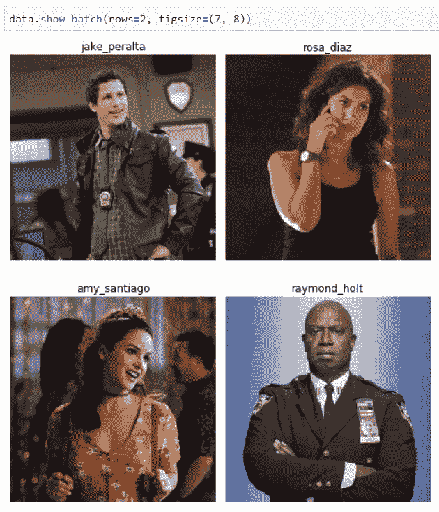
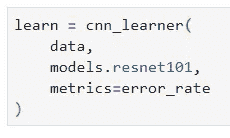
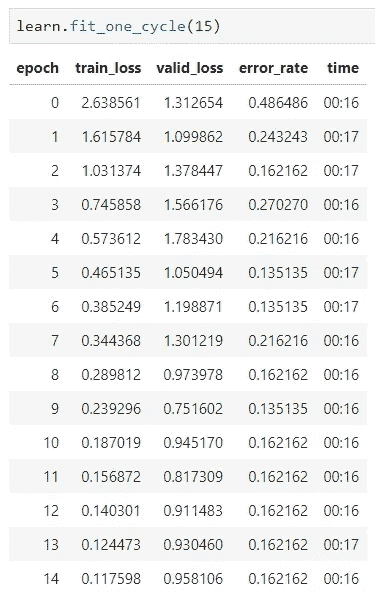
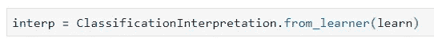
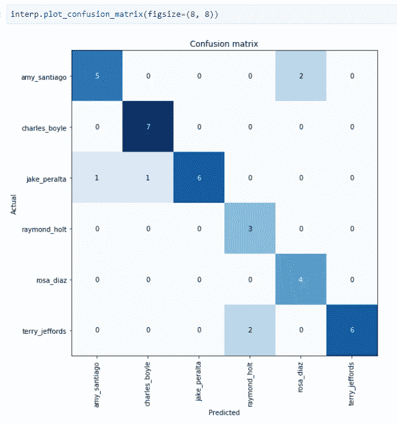
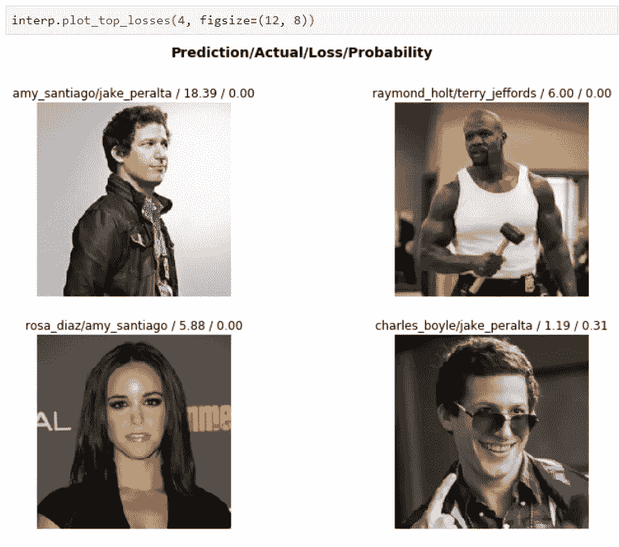

# FastAI:用深度学习对布鲁克林九九演员进行分类

> 原文：<https://towardsdatascience.com/fastai-classifying-brooklyn-nine-nine-actors-with-deep-learning-4b06a8ab3cab?source=collection_archive---------16----------------------->

## 他们看见我在跳舞——他们憎恨我

随着第七季的播出，毫无疑问,[布鲁克林九九](https://www.imdb.com/title/tt2467372/)是一部受欢迎的电视剧。我不会去探究原因，但是如果你还没有看过这部电影，并且有时间，那就没有理由至少不去尝试一下。

修改后的图片来自[维基共享资源](https://commons.wikimedia.org/wiki/File:Brooklyn_nine-nine_logo.png)

但这不是一篇电视节目文章——这是一篇**深度学习**文章。更准确地说，这篇文章旨在利用深度学习的力量对节目中演员的图像进行分类。

***好吧，但是，你将从哪里得到这些图像呢？***

好问题。基本上这个想法是从网上下载图片——这并不是说我的意图是在之后出售这个模型(*谁会从中受益？*)。下载后，我们只需要做基本的图像操作——裁剪**。**

**本质上，所有的图像都被裁剪成正方形，并且没有做任何准备工作。原因是将使用一个复杂的深度学习库来处理训练过程— *FastAI* 。**

**我以前写过关于它的文章，如果您想继续学习，请确保正确安装和配置了它。这篇文章可能会派上用场:**

** [## FastAI 简介:安装和构建我们的第一个分类器

### 提示:仅用 5 行代码就能在 MNIST 上达到 98%的准确率！

towardsdatascience.com](/intro-to-fastai-installation-and-building-our-first-classifier-938e95fd97d3)** 

# **数据结构**

**以下是我设法找到一些质量不错的照片的角色列表:**

*   **杰克·佩拉尔塔**
*   **艾米·圣地亚哥**
*   **特里·杰福兹**
*   ***雷蒙德·霍尔特***
*   **罗莎·迪亚兹**
*   **查尔斯·博伊尔**

**所以没有希区柯克*和史高丽*不幸的是，因为他们在大多数镜头中都在一起，所以我不想花几个小时在 Photoshop*里。无论如何，对于上面提到的 6 个演员中的每一个，都保存了 25 张质量不错的照片。*****

**以任何标准来看都不是很多，这就是为什么我们将使用 **ResNet** 预训练网络来帮助我们一点。如果您决定自己搜索图像，然后制作分类器，下面是您应该如何构建目录:**

****

**是的，你没看错。此时， *FastAI* 库需要这种结构——或者至少我还没有设法让它工作。如果有，请告诉我。**

*****还跟着我？*****

**很好，现在我们可以进行模型训练了！**

**由[吉菲](https://giphy.com/gifs/brooklynninenine-brooklyn-99-captain-holt-hot-damn-f3jZ8moRBbEvNJjOtu)**

# **让我们做一个模型**

**首先，我们需要进行两次导入——并且都来自于 *FastAI* 库(如果没有安装，请参考上面的文章):**

****

**让我们现在做一点准备。我们将用以下参数创建一个`ImageDataBunch`对象:**

*   **`path`:根图像文件夹的路径**
*   **`train`:将用于训练的图像路径。如果图像不是在*训练/测试*文件夹中构建的，您可以使用`.`来代替**
*   **`valid_pct`:由于我们在*训练/测试*文件夹中没有图像，此参数指定了用于验证的图像百分比**
*   **`size`:每幅图像将要变换的尺寸**
*   **`bs`:批量大小**

**我还将随机种子设置为 42，这样读者就可以复制结果。用它给出的代码实现:**

****

**现在让我们看看来自**单个批次**的几幅图像看起来会是什么样子:**

****

****准备工作已经完成！****

**现在我们可以实例化一个`cnn_learner`:**

****

**请注意我是如何使用 **ResNet101** 网络的预训练权重的。我们只有一些图像，如果我们不从头开始，结果通常会更好。ResNet101 已经知道人类“长什么样”，建议用它来处理类似这样的案例。**

**很好，我们有开始训练模型所需的一切。让我们训练它 15 个周期，看看会发生什么:**

****

**最终，我们的准确率在 **84%** 左右，这对于训练数据如此有限的多类分类问题来说并不算太差。**

**但是接下来让我们更深入的探讨**车型评测**。**

# **模型评估**

**对于这种类型的问题，查看一个**混淆矩阵**来看看我们的模型在哪里表现得好，在哪里表现得不好，这将是很好的。**

**因此，我们可以创建一个`ClassificationInterpretation`的实例来访问混淆矩阵:**

****

**很好，现在混乱矩阵本身:**

****

**似乎我们的模型在某些情况下对这两种组合有问题:**

1.  ***特里·杰福兹—雷蒙德·霍尔特***
2.  **艾米·圣地亚哥—罗莎·迪亚兹**

**我的意思是，对于这有限数量的图像，可以解释为什么模型是混乱的，但它仍然表现得相当不错——如果你考虑到 FastAI 库需要的时间和精力是多么少的话。**

**FastAI 可以做的另一件很酷的事情是向你展示它最容易与混淆的图像——这种方法被称为`.plot_top_losses()`:**

****

**在这里，除了第一条，我什么都能理解——对我来说，这似乎是一个清晰的镜头。**

# **在你走之前**

**现在你知道了，利用如此有限的数据，只需几行代码，我们就可以开发出一种基于深度学习的多类分类算法，准确率约为 84%。**

**由[吉菲](https://giphy.com/gifs/KxiRwO7tqXCTDVKobo/html5)**

**我的目标是未来在这个问题上花更多的时间，收集更多的图像，也许在 **PyTorch** 中编码整个事情。如果你想看的话，请告诉我。**

**我希望这对你来说是有趣的。感谢阅读。**

**喜欢这篇文章吗？成为 [*中等会员*](https://medium.com/@radecicdario/membership) *继续无限制学习。如果你使用下面的链接，我会收到你的一部分会员费，不需要你额外付费。***

** [## 通过我的推荐链接加入 Medium-Dario rade ci

### 作为一个媒体会员，你的会员费的一部分会给你阅读的作家，你可以完全接触到每一个故事…

medium.com](https://medium.com/@radecicdario/membership)**