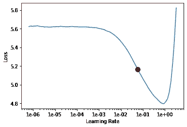
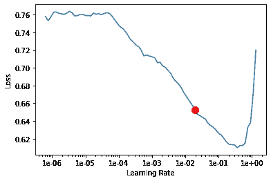

# 用 ULMFiT 进行快速灾害预测

> 原文：<https://towardsdatascience.com/fastai-disaster-prediction-using-ulmfit-4dd244d3889c?source=collection_archive---------66----------------------->

## 迁移学习在自然语言处理领域的应用


照片由来自 [Pexels](https://www.pexels.com/photo/person-holding-blue-ballpoint-pen-on-white-notebook-669610/) 的 [Lucas](https://www.pexels.com/@goumbik?utm_content=attributionCopyText&utm_medium=referral&utm_source=pexels) 拍摄

上个月，我启动了[fastai](http://course19.fast.ai)MOOC(2019)——面向程序员的深度学习。它涵盖了各种主题，如计算机视觉、自然语言处理、协同过滤等。我发现最吸引人的部分是迁移学习在自然语言处理领域的应用。 [fastai](http://course.fast.ai) 使用的方法是**通用语言模型微调(**[**ulm fit**](https://arxiv.org/abs/1801.06146)**)**，这是一种应用于自然语言处理领域的迁移学习方法论。

[](https://course.fast.ai/) [## 面向编码人员的实用深度学习

### 如果你现在就准备好投入进去，下面是开始的方法。如果你想更多地了解本课程，请阅读…

course.fast.ai](https://course.fast.ai/) 

> **根据** [**维基百科**](https://en.wikipedia.org/wiki/Transfer_learning) **的说法，迁移学习** (TL)是机器学习**中的一个研究问题** (ML)侧重于存储在解决一个问题时获得的知识，并将其应用于另一个不同但相关的问题。例如，在**学习**识别汽车时学到的知识可以应用到识别卡车上。

为了展示 **ULMFiT** 的用例，我将同样应用在[上真实与否？NLP 与灾难推文](https://www.kaggle.com/c/nlp-getting-started)在 **Kaggle** 上竞争。为了让您对数据有个大概的了解，数据集包含两个 **CSV** 文件`train.csv` 和`test.csv`分别代表训练数据集和测试数据集。训练集包含`text`列中的 tweet 数据和`target`列中的 target 值，如果是真正的灾难，则 target 值为`1`，如果不是真正的灾难，则 target 值为`0`。测试集只包含 tweet 数据，没有目标值。任务是预测一条推文是否代表一场真正的灾难。

以下段落摘自[了解 ULMFiT 的构建模块](https://medium.com/mlreview/understanding-building-blocks-of-ulmfit-818d3775325b#:~:text=High%20level%20idea%20of%20ULMFIT,learning%20rates%20in%20multiple%20stages):

> ULMFiT 的高级思想是使用像 wiki text-103(1.03 亿个标记)这样的非常大的语料库来训练语言模型，然后采用这个预训练模型的编码器并将其与定制的头部模型相结合，例如用于分类，并在多个阶段中使用有区别的学习率仔细地进行良好的旧的微调。ULMFiT 用于其语言建模任务的架构是一个 [AWD-LSTM](https://arxiv.org/pdf/1708.02182.pdf) 。这个名字是 ASGD 减肥 LSTM 的缩写。

如果你想了解更多关于乌尔姆菲特的信息，请参考杰瑞米·霍华德和塞巴斯蒂安·鲁德写的这篇论文。

在计算机视觉问题中，迁移学习用于直接帮助分类，但是在 NLP 的情况下，我们首先建立一个语言模型，该模型基本上预测句子的下一个单词(该模型必须理解书写文本的语言(例如，英语等)。))然后使用语言模型的编码器和词汇表构建我们的分类模型。

正如在[的论文](https://arxiv.org/abs/1801.06146)中提到的，我们将使用在维基百科上预先训练好的 [AWD-LSTM](https://arxiv.org/pdf/1708.02182.pdf) 架构。我们可以直接使用这个预先训练的语言模型来建立我们的灾难推文分类器，但这里的要点是维基百科的英语语言将不同于推文的英语语言。因此，我们将使用推文数据微调我们预先训练的语言模型，然后在此基础上建立我们的分类器。正如《Fastai 和 PyTorch 的程序员深度学习》一书中所解释的，他们在 IMDb 评论数据集上使用了相同的预训练架构来分类评论是正面还是负面。他们解释说，IMDb 评论英语更不正式，包含电影、导演、演员等的名字。比普通的维基百科英语更好，架构是在维基百科英语上预先训练的。

## 我们开始吧！！

我们导入我们的`test.csv`和`train.csv`来获得我们的训练数据集和测试数据集。我不能分享数据集，因为它来自一个 [**Kaggle** 竞赛](https://www.kaggle.com/c/nlp-getting-started/data)，你可以登录你的帐户并遵守竞赛规则自行下载。

```
# Importing Pandas
import pandas as pd# Importing fastai libraries for text and callbacks
from fastai.text import *
from fastai.callbacks import *train = pd.read_csv('train.csv')
test = pd.read_csv('test.csv')
```

我不会详细介绍语言模型是如何构建的，你应该去看看 [MOOC](http://course.fast.ai) 和[Fastai 和 PyTorch](https://www.amazon.in/Deep-Learning-Coders-fastai-PyTorch/dp/1492045527) 的《程序员深度学习》这本书，做进一步的阅读。基本思想是文本数据不能直接输入到模型中，它需要被转换成数字，这样我们就可以应用我们的数学函数。这通过使用**记号化**和**数字化**来完成。在**记号化**中，我们将文本转换成记号列表，在**数字化**中，我们根据它们的索引将它们转换成数字。如果你想潜得更深，你应该参考[书](https://www.amazon.in/Deep-Learning-Coders-fastai-PyTorch/dp/1492045527)。

我们将使用**数据块 API** 在幕后为我们完成上述工作，然后我们将把创建的**数据块**输入到我们的语言模型中。

```
data_lm = (TextList.from_df(pd.concat([train[['text']], test[['text']]], ignore_index=True, axis=0))
           .split_by_rand_pct(0.15)
           .label_for_lm()
           .databunch(bs=128))
data_lm.show_batch()
```

文本列显示标记化和数值化的数据

我们忽略标签，从训练和测试数据中提取文本语料库。请记住，我们现在正在制作一个语言模型，而不是一个分类模型。我们只是尽可能多地包含文本数据，以便我们的语言模型预测句子的下一个单词。接下来，我们使用我们的`data_lm`数据束来制作我们的语言模型。

```
learn = language_model_learner(data_lm, AWD_LSTM, drop_mult = 0.5)
learn.lr_find()
learn.recorder.plot(suggestion = True)
```



```
learn.fit_one_cycle(1, 1e-2, moms=(0.8,0.7))
```

我们将解冻模型，我们将适应更多。我们将使用回调来选择最佳模型。

```
Better model found at epoch 0 with accuracy value: 0.4097544550895691.
Better model found at epoch 1 with accuracy value: 0.4404464364051819.
Better model found at epoch 2 with accuracy value: 0.4609375.
Better model found at epoch 3 with accuracy value: 0.47495537996292114.
Better model found at epoch 4 with accuracy value: 0.48810267448425293.
Better model found at epoch 5 with accuracy value: 0.49515628814697266.
Better model found at epoch 6 with accuracy value: 0.4975222945213318.
Better model found at epoch 9 with accuracy value: 0.49756699800491333.
```

我们将选择 9 号纪元时的最佳精度。然后我们将保存语言模型和编码器。

```
learn.save('fine_tuned')
learn.save_encoder('fine_tuned_enc')
```

接下来，我们将制作分类器。为此，我们需要创建一个新的数据中心。我们将验证集设为 10%,我们将保持我们的词汇表与语言数据库中的词汇表相同。我们还将在单独的`add_test`参数中添加我们的测试数据。

```
data_clas = (TextList.from_df(df, vocab=data_lm.vocab)
             .split_by_rand_pct(0.1)
             .label_from_df('target')
             .add_test(TextList.from_df(test['text'], vocab=data_lm.vocab))
             .databunch(bs=128))
```

我们将使用与语言模型相同的编码器来构建分类器。

```
learn = text_classifier_learner(data_clas, AWD_LSTM, drop_mult=0.5, metrics=[accuracy, FBeta(beta=1)])
learn.load_encoder('fine_tuned_enc')
```

我们将进行`lr_find()`检查，然后绘制图表。



我们来拟合一个周期。我们看到我们得到了 77.66%的精度**。**

```
learn.fit_one_cycle(1, 1e-3, moms=(0.8,0.7))
```

**让我们解冻最后 2 层，训练一个周期。我们的准确度提高到 **79.5** %。**

```
learn.freeze_to(-2)
learn.fit_one_cycle(1, slice(1e-3/(2.6**4),1e-2), moms=(0.8,0.7))
```

**我们将解冻最后 3 层，然后再训练一个周期。我们的准确率提高到 **81.73%** ！**

```
learn.freeze_to(-3)
learn.fit_one_cycle(1, slice(5e-3/(2.6**4),5e-3), moms=(0.8,0.7))
```

**我们在这里使用的是在 ULMFiT 中引入的区别学习率。正如文章[中所解释的，我从 fast.ai v3](/10-new-things-i-learnt-from-fast-ai-v3-4d79c1f07e33) 中学到的 10 个新东西:**

> ****预训练模型的判别学习率** 以超低学习率训练早期层，以较高学习率训练后期层。这个想法是不要剧烈地改变几乎完美的预训练权重，除了极少量的，并且更积极地教导输出附近的层。在 ULMFiT 中引入了判别学习率。**

**我们将解冻所有层，训练，并使用回调来选择我们的最佳模型。**

```
callbacks = SaveModelCallback(learn,monitor="accuracy", mode="max", name="best_classification_model")
```

```
Better model found at epoch 0 with accuracy value: 0.8160315155982971.
Better model found at epoch 1 with accuracy value: 0.8173456192016602.
Better model found at epoch 2 with accuracy value: 0.822601854801178.
Better model found at epoch 9 with accuracy value: 0.8239158987998962.
```

**我们得到的准确率为 82.39% ！！**

# **结论**

**在迁移学习中，我们使用来源的知识，并将其应用于我们的目标。在自然语言处理领域中同样的实现提供了非常先进的结果，因为我们使用了预先训练的网络，所以只需要最少的训练。如果你想看代码的运行，你可以看看我在 Kaggle 上的笔记本: [**NLP -灾难预测 ULMFiT**](https://www.kaggle.com/sachin93/nlp-disaster-prediction-ulmfit/)**

****注:我在这里用的是法士泰 V1。fastai V2 和新的 MOOC 于 8 月 21 日发布。看看这里****

# **参考**

 **[## 用于文本分类的通用语言模型微调

### 归纳迁移学习极大地影响了计算机视觉，但现有的自然语言处理方法仍然需要…

arxiv.org](https://arxiv.org/abs/1801.06146)** **[](https://www.oreilly.com/library/view/deep-learning-for/9781492045519/) [## 利用 fastai 和 PyTorch 为编码人员提供深度学习

### 深度学习通常被视为数学博士和大型科技公司的专属领域。但是作为这个实践指南…

www.oreilly.com](https://www.oreilly.com/library/view/deep-learning-for/9781492045519/) [](https://course.fast.ai/) [## 面向编码人员的实用深度学习

### 如果你准备好现在就开始，这里有一些方法。如果你想更多地了解本课程，请阅读…

course.fast.ai](https://course.fast.ai/) [](https://fastai1.fast.ai/vision.html) [## 视力

### 模块 fastai . vision . transform:get _ transforms(do _ flip:bool = True，flip_vert: bool…

fastai1.fast.ai](https://fastai1.fast.ai/vision.html) [](https://medium.com/mlreview/understanding-building-blocks-of-ulmfit-818d3775325b) [## 了解 ULMFIT 的构建模块

### 上周，我有时间处理了一个 Kaggle NLP 竞赛:Quora 虚假问题分类。因为很容易…

medium.com](https://medium.com/mlreview/understanding-building-blocks-of-ulmfit-818d3775325b) [](/10-new-things-i-learnt-from-fast-ai-v3-4d79c1f07e33) [## 我从 fast.ai v3 中学到的 10 件新事情

### 参加课程 3 周后的学习要点

towardsdatascience.com](/10-new-things-i-learnt-from-fast-ai-v3-4d79c1f07e33)**