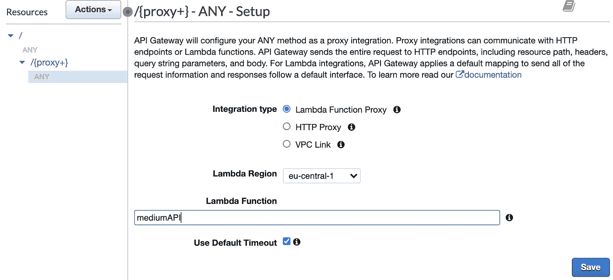

# FastAPI + AWS =健壮的 API(第 1 部分)

> 原文：<https://towardsdatascience.com/fastapi-aws-robust-api-part-1-f67ae47390f9?source=collection_archive---------0----------------------->

## [理解大数据](https://towardsdatascience.com/tagged/making-sense-of-big-data)

## 让我们用 FastAPI、AWS Lambda 和 API Gateway 构建一个可伸缩的无服务器的基于 Python 的 REST API


背景照片由[斯潘塞·塞洛弗](https://www.pexels.com/@spencer-selover-142259?utm_content=attributionCopyText&utm_medium=referral&utm_source=pexels)拍摄，来自[Pexels](https://www.pexels.com/photo/adult-color-palette-colorful-colors-567452/?utm_content=attributionCopyText&utm_medium=referral&utm_source=pexels)——作者编辑

astAPI 彻底改变了开发现代基于 Python 的 REST APIs 的方式。从一开始，这个项目就被大公司采用，如微软、优步和网飞，而且它越来越受欢迎，我们可以通过每天增长的 Github 明星数量来观察。

能够构建快速、健壮、安全和可伸缩的 API 是任何后端(数据)工程师的必备技能。在本文中，我们将构建一个简单的 REST API，以您选择的货币(*欧元、美元等)显示市场情绪和所选加密货币的当前价格。*)。

我们将使用**自顶向下的方法**:从打包和部署 API 到深入了解它的细节。在第 1 部分中，我们将利用 Amazon Lambda 和 API Gateway 将 FastAPI 代码部署到 AWS。在[未来的文章(第 2 部分)](/fastapi-aws-secure-api-part-2-1123bff28b55)中，我们将确保通过使用 API 密钥来保护我们的 API。我们还将演示如何启用分布式跟踪和日志记录来跟踪应用程序的健康状况。让我们开始吧！

## 目录:

1.  用虚拟环境创建一个 Pycharm 项目
2.  安装所需的库
3.  在本地测试 API
4.  打包您的代码并准备部署管道(*包括创建 Lambda 函数*)
5.  在 API 网关中创建 REST API
6.  将 Lambda 函数配置为代理，将请求从 API Gateway 转发到 Amazon Lambda
7.  将 API 部署到`dev`阶段
8.  测试端点
9.  深入探究这一切是如何协同工作的
10.  使用 Swagger UI 演示加密货币 API
11.  结论

# 1.用虚拟环境创建一个 Pycharm 项目

让我们从在 Pycharm 中创建一个具有虚拟环境的项目开始。你可以使用`Virtualenv`或`Conda`——随你喜欢。我一般在 macOS 上用`Virtualenv`，在 Windows 上用`Conda`。


苹果电脑上 Pycharm 中的 Virtualenv 图片由作者提供


Windows 上 Pycharm 中的 Conda 虚拟环境—图片由作者提供

如果你想跟进，[这个 Github 库](https://github.com/anna-anisienia/cryptoAPI)包含了这个项目的代码。

# 2.安装所需的库

让我们将当前工作目录更改为`api`文件夹，并安装所需的包:

```
cd api && pipinstall -r requirements.txt
```

# 3.在本地测试 API

安装完所有的包依赖项后，我们可以在终端中启动 Uvicorn ASGI 服务器:

```
uvicornmain:app --reload
```

如果您配置了虚拟环境，并从 Github 下载(或克隆)了代码，那么您应该能够从浏览器访问交互式 Swagger UI:

```
http://localhost:8000/docs
```


我们正在构建并部署到 AWS 的简单 API 图片由作者提供

# 4.打包您的代码并准备部署管道

为了使我们的 API 可以从 API Gateway 访问，我们需要:

*   将我们的 API 代码和所有的`site-packages`依赖项压缩成一个 zip 文件，这个文件将被我们的 Lambda 函数使用

*   将这个 zip 文件上传到 S3 ( *理论上，我们可以将它直接上传到 Lambda，但是有一个 10MB 的 zip 文件大小限制* → *为了准备我们的应用程序的增长，我们将把它直接上传到 S3，并且在 Amazon Lambda 创建期间，我们将确保 Amazon Lambda 使用这个来自 S3 的 zip 文件*

> 注意:本部分要求您安装并配置 AWS CLI

*   使用 Python 3.8 运行时创建 Amazon Lambda 函数，选择选项*“创建一个具有基本 Lambda 权限的新角色”，*，将 Lambda 处理程序配置为`main.handler`，如 GIF 所示:


创建一个 Lambda 函数+配置处理程序——图片作者

*   更新函数以确保它使用来自 S3 的打包代码(*我们也可以从管理控制台执行此操作*):

```
*aws* lambda update-function-code --function-name medium-demo \
--s3-bucket $bucket_name --s3-key lambda.zip
```

# 5.在 API 网关中创建 REST API

从管理控制台，确保为 API Gateway 中的 API 选择与 Lambda 函数相同的区域。尽管 API 网关和 Lambda 函数可能位于不同的区域，但这可能会导致[一些额外的延迟](https://stackoverflow.com/questions/57704237/multi-region-api-lambda-architecture-latency-issue)。

然后:创建 API →选择 REST API ( *不是私有的* ) →构建→输入你的 API 的名字→创建 API。


创建 REST API—按作者分类的图像


为 API 选择一个名称。保留区域端点—按作者分类的图像

# 6.将 Lambda 函数配置为代理，将请求从 API Gateway 转发到 Amazon Lambda

现在我们需要为我们的请求方法配置**集成点**。使用 Lambda 函数作为`ANY`类型请求(*即 GET、POST、PATCH、DELETE 等)的集成点。*)，我们将创建一个**方法** ( *处理根路径*)和一个子**资源** ( *处理所有子路径*)。我们将通过使用 **Lambda 代理集成** [1]来配置它们，以处理对 API 网关的任何请求。

## 创建一个方法

*   从下拉菜单**中选择动作:**
    1。创建方法
    2。选择`ANY`
    3。选择 Lambda 函数作为您的集成类型，并确保选中复选框*“使用 Lambda 代理集成”*
    4。添加您的 Lambda 函数的名称(*及其对应的区域*)并保留其他所有内容的默认值→保存


1.创建方法—按作者创建图像


2.选择任意→添加 Lambda 函数的名称→保存—按作者分类的图像


确认权限-按作者分类的图像

当弹出窗口询问您是否要授予 API 网关调用 Lambda 函数的权限时，请确认。没有它，API Gateway 将无权调用您的 Lambda 函数。

## 创建资源

类似于*“方法”*配置，转到操作→创建资源。确保选中复选框*“配置为代理资源”*，并保留默认设置以启用 Lambda 代理集成(*与之前的*)，然后选择您的 Lambda 函数并保存。


创建资源-按作者分类的图像


将 Lambda 配置为代理—按作者排序的图像



从菜单中选择你的 Lambda 函数并保存——作者图片

再次确认您允许 API Gateway 代表您的 API 请求调用 Lambda 函数:


确认权限-按作者分类的图像

# 7.部署 API

既然我们的 Lambda 现在已经配置好了，我们就可以部署 API 了。我们可以把它命名为`dev`阶段。部署对于激活 Lambda 函数集成至关重要。


# 8.测试端点

将 API 部署到任何部署阶段都可以确保 API Gateway 创建一个 URL 作为 API 的前门。您可以点击这个 URL 并测试 API 是否已经正确配置。


在您的浏览器中，您应该会看到对应于 FastAPI 代码的根 GET 路径的响应:

```
{"Hello Medium Reader": "from FastAPI & API Gateway"}
```

我们可以继续直接从浏览器测试更多的端点:


***边注:*** 如果端点`dev/v1/prices/ETH`不为您工作，并且您得到消息`{"message": "Missing Authentication Token"}`，您应该重试创建资源代理并重新部署 API。

至此，我们可以看到任何人都可以公开访问我们的 API。在第 2 部分的[中，我们将通过直接从 API 网关控制台创建一个 API 键](/fastapi-aws-secure-api-part-2-1123bff28b55)来改变它。

# 9.深入探究这一切是如何协同工作的

现在，你可能有许多问题。我将试着猜测并以问答的形式回答这些问题:

**1。我们如何让本地 FastAPI 代码与 Amazon Lambda 一起工作？**

我们使用了`Mangum`库[5]，它是运行在 AWS Lambda 和 API Gateway 内部的 ASGI APIs 的包装器。它提供了一种适配器，该适配器:

*   将对 API 网关的请求路由到我们的 Lambda 函数，
*   将 Lambda 函数响应路由回 API 网关。

我们只需添加两行(*第 1 行和第 7 行*)就可以将`main.py`中的 FastAPI 代码转换为 Amazon Lambda 处理程序:

**2。API Gateway 中的方法和资源有什么区别？**

`ANY` **方法**将把请求路由到根路径`/`到执行 FastAPI 代码的 Lambda 函数。相比之下，子**资源**将以贪婪模式路由根路径`/`下的所有路径(*贪婪路径参数:* `*{proxy+}*` ) [7]，即，它会将 FastAPI 代码中定义的所有其他端点路由到 Lambda，例如路径`/v1/prices/BTC/.`

**3。为什么我们需要** `**{proxy+}**` **？**

使用代理，我们不需要编写任何映射模板来将特定路径路由到不同的 Lambda 函数——相反，我们有一个服务于所有端点的 Lambda 函数[6]。然后，API Gateway 会将所有类型的请求( *GET、POST、DELETE、PATCH、…* )从 API Gateway 路由到`FastAPI`代码中定义的路径。由于有了`Mangum`适配器，FastAPI 代码可以在 Lambda 函数内部执行。

**4。这种架构如何扩展？**

每个对 API Gateway 的请求都会调用一个 Lambda 函数。这意味着我们可以有数以千计的对我们的 API 的并行请求，因为每一个都将由一个单独的 Lambda 函数调用来服务。

请注意，对于每个帐户可以有多少个并行 Lambda 执行，存在软并发限制(在撰写本文时为 1000 个)。如果你需要更多，你可以使用[支持中心控制台](https://console.aws.amazon.com/support/v1#/case/create?issueType=service-limit-increase)请求增加这个限制【2】。

**5。这种架构为什么有吸引力？**

它提供了一个**完全无服务器的** API 基础设施，有很多好处:

*   Python 和令人惊叹的`FastAPI`库的所有优势与无服务器架构的优势相结合
*   **可伸缩性** &无需管理后端服务器——API Gateway 将根据需要运行尽可能多的 Lambda 函数来处理对我们 API 的所有请求
*   非常**划算**，尤其是对于那些可能还没有收到数百万次请求的小型 API
*   性能:由于 Lambda 的**上下文重用**，连续的请求(从前一个请求起 15 分钟内的*)重用冻结的执行上下文，允许减轻无服务器功能的冷启动*
*   如果启用，API 网关**缓存**允许进一步改善延迟
*   API 密钥的简单管理
*   **API Gateway 提供与活动目录和第三方身份验证提供者的集成，例如通过 **Cognito** 使用*“Google/Amazon 帐户登录”***
*   **所有 API 请求和响应的现成集中式**日志**，以及通过`CloudWatch`的访问日志**
*   **通过启用 X 射线追踪的分布式**追踪**功能。**

****6。为什么我们使用虚拟环境中的站点包来安装包依赖项？****

**我们可以将库安装到某个特定的目录中(例如`libs`目录)添加标志`-t`，代表目标:**

```
pip install -r requirements.txt -t ../libs/
```

**然后我们可以将这个目录添加到我们的`lambda.zip`中。**

**然而，这样一来，我们的项目将会被安装到项目目录中的 Python 包弄得乱七八糟，并且这可能会使其他开发人员以后更难区分实际的 API 代码和它的依赖项。我们可能必须将`libs`目录添加到`.gitignore`中。总的来说，这会增加额外的工作，如果我们使用虚拟环境和它的`site-packages`，就不需要这样做。**

****7。我们是否可以使用无服务器框架或 AWS SAM 来创建部署管道？****

**是的，这种设置与[无服务器框架](https://github.com/serverless/serverless)配合得很好。下面是一个可能的例子:**

**[](https://github.com/jordaneremieff/serverless-mangum-examples/tree/main/fastapi-example) [## jordaneremieff/无服务器-mangum-示例

### 此时您不能执行该操作。您已使用另一个标签页或窗口登录。您已在另一个选项卡中注销，或者…

github.com](https://github.com/jordaneremieff/serverless-mangum-examples/tree/main/fastapi-example) 

然而，我更喜欢最小化我的项目中的依赖性，并且`serverless`需要额外的组件，比如节点包管理器。

您也可以将此设置与 [AWS SAM](https://docs.aws.amazon.com/serverless-application-model/latest/developerguide/what-is-sam.html) 一起使用。

**8。这要花多少钱？**

使用免费等级，您可以每月(*免费*)访问:

*   100 万个 API 网关请求
*   每月 100 万次 Lambda 调用，计算时间高达 320 万秒

除此之外，价格可能会根据您的 AWS 地区和您的请求数量而有所不同(*批量折扣*)，但它们的范围是每一百万个请求 1-4.25 美元(在撰写时为*)。Lambda 的定价基于调用次数和代码运行时间，以毫秒为单位。你可以在这里找到更多[，在这里](https://aws.amazon.com/lambda/pricing/)找到更多[。](https://aws.amazon.com/api-gateway/pricing/)*** 

# **10.使用 Swagger UI 演示加密货币 API**

**最后，这是 API 正在做的事情——所有功能都基于来自 CryptoCompare [4]的信息:**

*   **我们正在获取交易信号，以获得关于特定加密货币的市场情绪的信息，即当前是上升还是下降趋势**
*   **我们正在获取选定加密货币的实时价格，并可以用我们选择的特定货币显示它们。**

****

**我们的示例 API 的演示——作者制作的 GIF**

# **11.结论**

**在本文中，我们讨论了利用 FastAPI、API Gateway 和 Amazon Lambda 将 REST API 部署到 AWS 的过程。在这个过程中，我们学习了如何打包代码和创建部署管道，并讨论了所有这些微服务组件如何协同工作。**

**在第 2 部分文章中，我们将继续构建这个 API，通过 API 密钥添加身份验证、分布式日志记录和跟踪，以及在对 FastAPI 代码进行更改后如何重新部署 API。**

**[](/fastapi-aws-secure-api-part-2-1123bff28b55) [## FastAPI + AWS =安全 API(第 2 部分)

### 让我们用 FastAPI、AWS Lambda、API Gateway、CloudWatch 和 AWS X-Ray 构建一个安全且可观察的 Python REST API

towardsdatascience.com](/fastapi-aws-secure-api-part-2-1123bff28b55) 

**如果这篇文章有用，** [**关注我**](https://medium.com/@anna.anisienia) **看我下一篇文章。**

**参考文献:**

肖恩·拜尔的博客

[2] [亚马逊 Lambda 文档](https://docs.aws.amazon.com/lambda/latest/dg/gettingstarted-limits.html)

[3] [API 网关文档](https://docs.aws.amazon.com/apigateway/latest/developerguide/apigateway-rest-api.html)

[4] [CryptoCompare API 文档](https://min-api.cryptocompare.com/documentation?key=Price&cat=SingleSymbolPriceEndpoint)

[5] [曼古姆文档](https://mangum.io/)

[6]关于[λ代理整合](https://docs.aws.amazon.com/apigateway/latest/developerguide/api-gateway-set-up-simple-proxy.html)

【7】[如何使用亚马逊 API 网关{proxy+}](https://www.1strategy.com/blog/2017/06/06/how-to-use-amazon-api-gateway-proxy/)**