# FastAPI + AWS =安全 API(第 2 部分)

> 原文：<https://towardsdatascience.com/fastapi-aws-secure-api-part-2-1123bff28b55?source=collection_archive---------20----------------------->

## 让我们用 FastAPI、AWS Lambda、API Gateway、CloudWatch 和 AWS X-Ray 构建一个安全且可观察的 Python REST API


照片由[斯潘塞·塞洛弗](https://www.pexels.com/@spencer-selover-142259?utm_content=attributionCopyText&utm_medium=referral&utm_source=pexels)从[派克斯](https://www.pexels.com/photo/adult-color-palette-colorful-colors-567452/?utm_content=attributionCopyText&utm_medium=referral&utm_source=pexels)拍摄

在本文的第 1 部分中，我们讨论了如何使用 API Gateway 和 Amazon Lambda 为 AWS 构建和部署 FastAPI 应用程序。在第 2 部分中，我们将在此基础上确保我们的 API 是安全的、易于重新部署的，并且我们可以通过分布式日志记录和跟踪来监控它的健康状况。本文基于一种**自上而下的方法**:我们将首先创建所有的资源，然后我们将更深入地了解它们的细节，并讨论所有这些服务如何协同工作。

## 目录:

1.  通过创建 API 密钥并为其分配使用计划来保护 API
2.  在 Postman 中测试 API 键
3.  对 API 进行更改并重新部署
4.  通过 X 射线启用 CloudWatch 日志和分布式跟踪
5.  深入探究这一切是如何协同工作的
6.  结论

# 1.通过创建 API 密钥并为其分配使用计划来保护 API

## 需要 API 密钥

首先，在 API 网关中，我们需要为方法和资源代理设置选项“需要 API 密钥”为`true`:

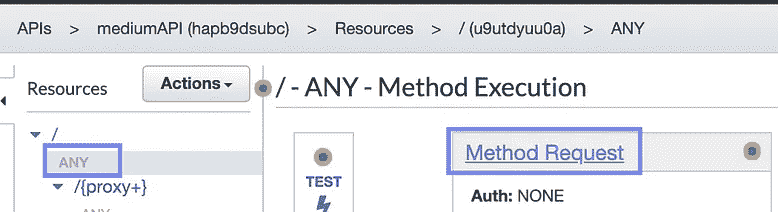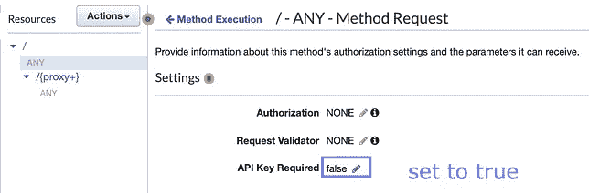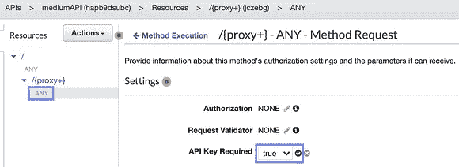

作者图片

## 创建 API 密钥

转到左侧导航面板中的“API 密钥”部分:

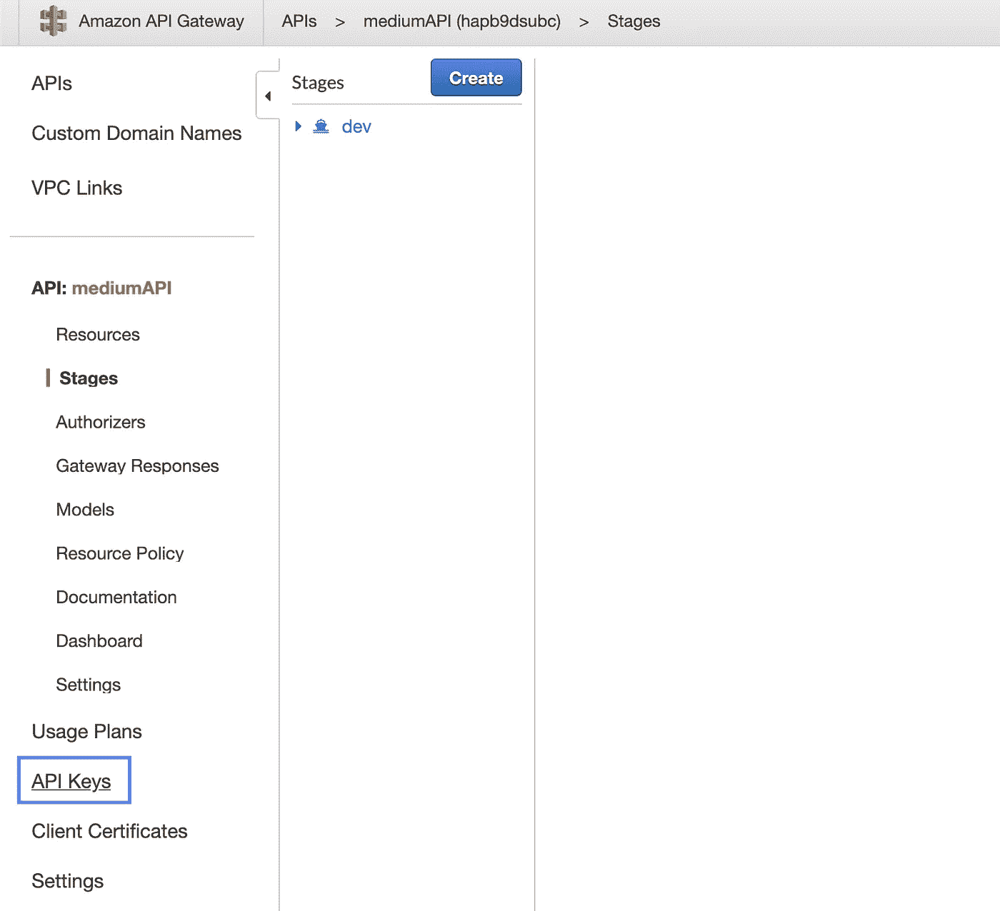

作者图片

现在我们可以创建一个 API 键:操作→创建 API 键→保存:

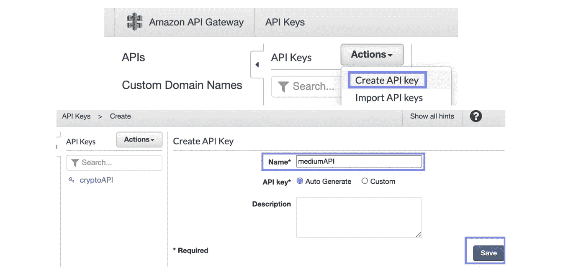

作者图片

## 创建使用计划

然后，让我们创建一个使用计划[1]:转到**使用计划**(API 键上方左侧导航栏中的*)→创建:*


创建使用计划—按作者分类的图像

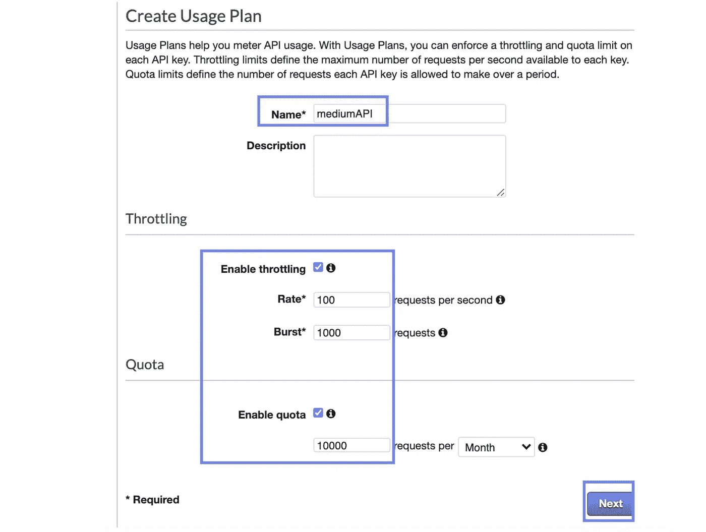

我输入的数字是任意的——可以根据您的需要随意调整。作者图片

一旦我们有了使用计划，我们可以**将它与部署到`dev`阶段的 API** 关联起来:

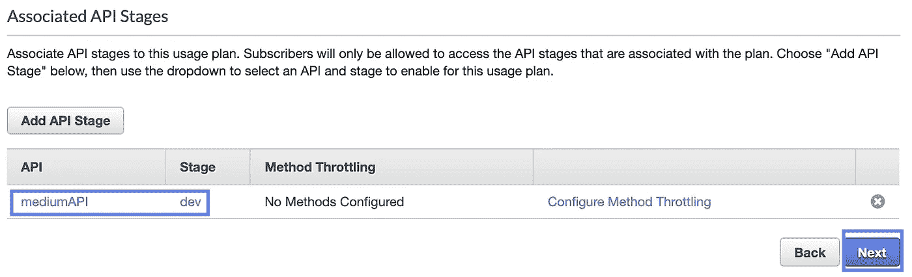

作者图片

让我们**将**之前创建的 **API 键与这个使用计划**相关联:

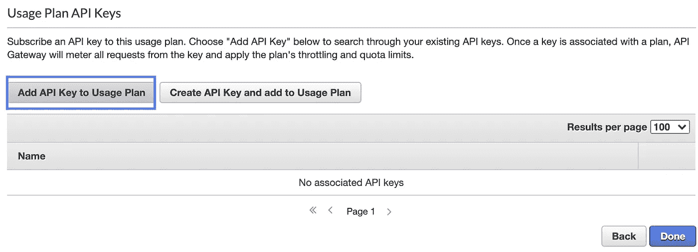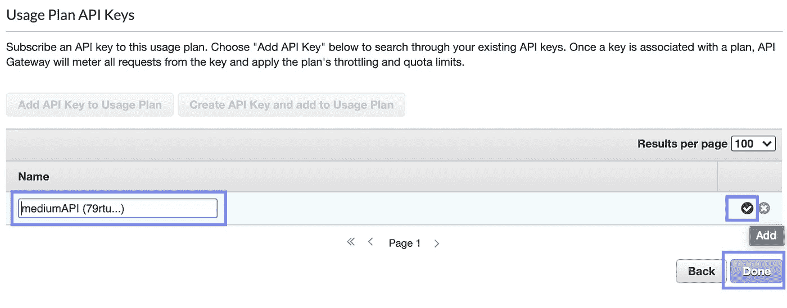

作者图片

现在最重要的部分是:要激活对 API 密匙的更改，我们需要**重新部署我们的** `**dev**` **API 阶段**:

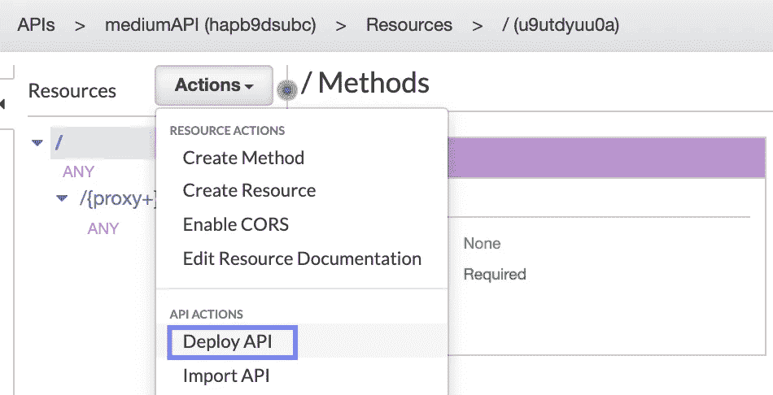

作者图片

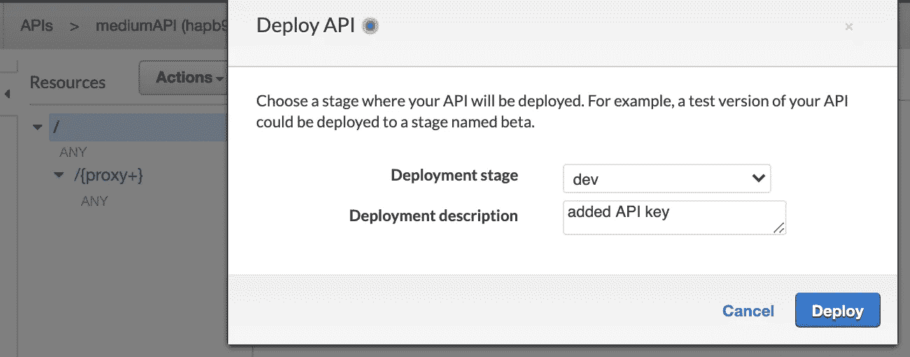

作者图片

# 2.测试 API 密钥

在我们的浏览器中，我们现在应该会看到一条消息“禁止”(*可能需要 1-2 分钟，更改才会生效*)。

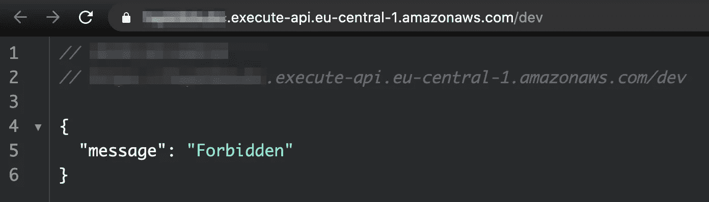

作者图片

我们可以通过 [Postman](https://www.postman.com/downloads/) 用我们的 API 密匙测试使用情况:

*   首先，在 API 键旁边，我们单击“Show ”,然后复制 API 键并将其粘贴到 Postman 中的**请求头**字段`Value`:

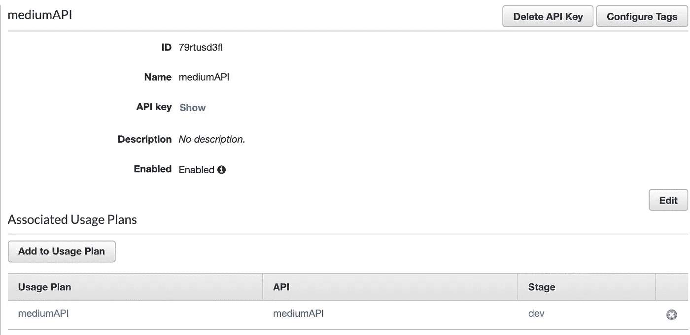

作者图片

*   `Key`必须设置为`x-api-key`，而`Value`是你从管理控制台复制的 API Key:

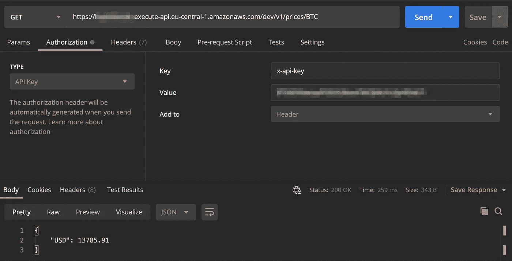

作者图片

单击“发送”后，您应该会看到正确的 API 响应。

# 3.对 API 进行更改和重新部署

您可以从 Github 库下载该项目的代码。

让我们对根路径的返回值做一个小小的改变:

为了对部署到 AWS 的 API 进行这些更改，我们重复打包代码的步骤，如本文第 1 部分所述:

[](/fastapi-aws-robust-api-part-1-f67ae47390f9) [## FastAPI + AWS =健壮的 API(第 1 部分)

### 让我们用 FastAPI、Amazon Lambda 和 API Gateway 构建一个可伸缩的基于 Python 的 REST API

towardsdatascience.com](/fastapi-aws-robust-api-part-1-f67ae47390f9) 

**我们需要:**

*   压缩代码及其所有依赖项
*   上传这个压缩文件到 S3
*   更新 Lambda 函数。

这一切都可以通过以下几行实现:

在执行命令:`bash package_and_update_lambda_code.bash`之后，我们应该能够看到 API 中反映的更改(*不需要重新部署 API stage，因为我们只对底层 Lambda 函数进行了更改，而没有对 API 网关资源进行更改*):

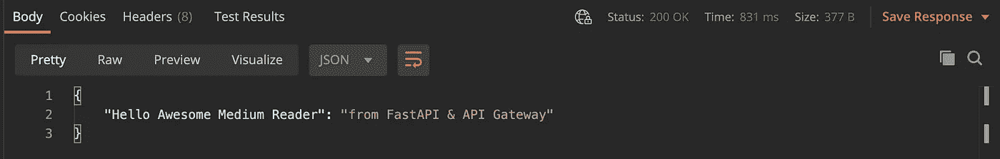

# 4.通过 X 射线启用 CloudWatch 日志和分布式跟踪

为了利用集中式日志记录，我们需要做的就是选中 CloudWatch Logs 旁边的复选框。就是这样！我们可以选择所需的日志级别以及是否**记录完整的请求/响应数据**。

最重要的是，我们可以启用**访问日志**，这有助于了解哪些用户或代理使用了特定的端点。这样的话，如果出了问题，我们就可以追踪访问记录。

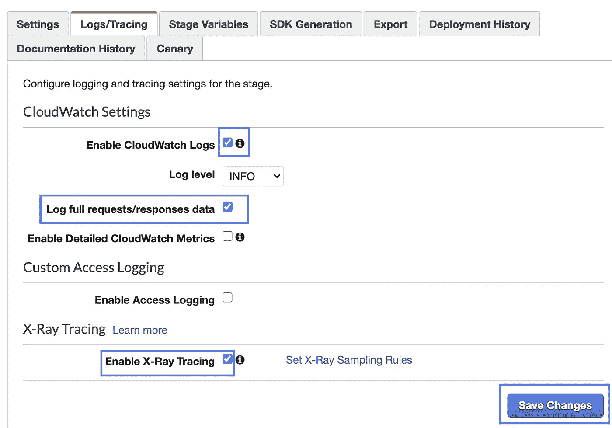

## x 射线:服务地图

在启用 X 射线跟踪并发出一些 API 请求后，我们应该能够看到收集到的跟踪和指标:

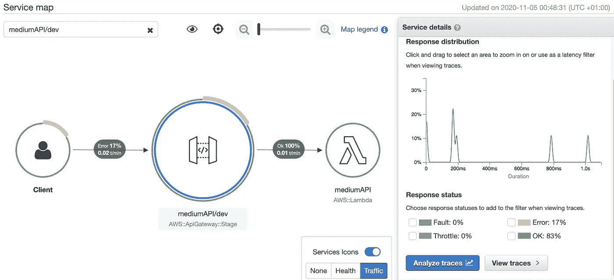

服务地图中可视化的 x 射线追踪-由作者提供的图像

上图中标记为黄色的错误是我试图在没有使用 API 密钥进行身份验证的情况下从浏览器访问 API 的结果。

## **跟踪 CloudWatch 中的 API 日志**

为了为您的 API 找到正确的日志组，请查找以 API ID 开头的日志组。然后，您可以找到所有 API 请求和响应的日志:

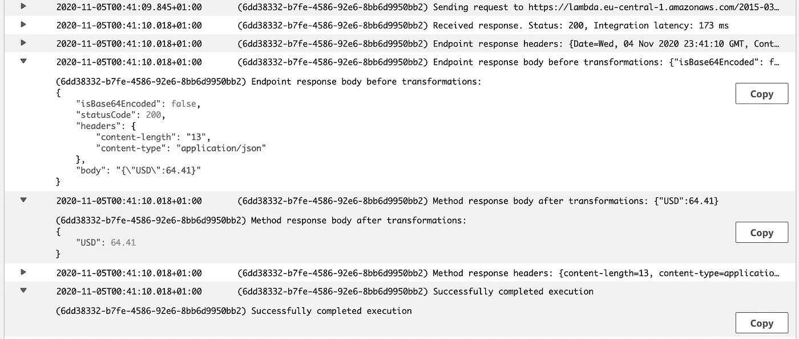

云观察日志-按作者分类的图片

# 5.深入探究这一切是如何协同工作的

让我们更深入地了解这些服务是如何工作的，以及如何有效地使用它们。

**1。什么是使用计划？**

API Gateway 允许我们构建可以作为产品[货币化](https://rapidapi.com/marketplace)的 API。使用计划以及相关的 API 密钥让我们能够以特定的请求率和速度向授权客户提供我们的 API:

> *“使用计划指定了* ***谁*** *可以访问一个或多个已部署的 API 阶段和方法，以及***和* ***他们可以多快*** *访问它们。”[4]**

*这意味着通过在特定的 API 阶段将 API 键分配给特定的使用计划。dev 或 prod ，我们可以对不同的 API 阶段实现不同级别的权限和不同的节流限制。我们可以为每个使用计划分配许多 API 键，这允许细粒度的访问控制。*

***2。我们如何使用 API 键？***

*API 密钥是简单的字符串( *30-128 个字符长*)，可以分配给使用计划或 Lambda 授权者。它们允许我们在 API 阶段和请求类型级别分配权限。*

*例如，我们可能希望在`dev`阶段有更多的开放访问，而在`prod`阶段有更多的限制访问。这意味着一个特权用户可以访问两个阶段`dev`和`prod`，而其他一些用户可以获得一个 API 密钥，该密钥只分配给与`dev` API 阶段相对应的使用计划。*

***3。我们如何区分 Lambda 执行和 API 网关请求的 CloudWatch 日志？***

*CloudWatch 将日志存储在与每个服务相对应的独立日志组中(例如 API 网关)和服务内资源(您的特定 API)。您可以通过查找 API ID 来识别与 API 网关日志相对应的日志组。您可以在 URL 端点或管理控制台中找到它:*

```
*https://<API-ID>.execute-api.<REGION>.amazonaws.com/<API_STAGE>*
```

*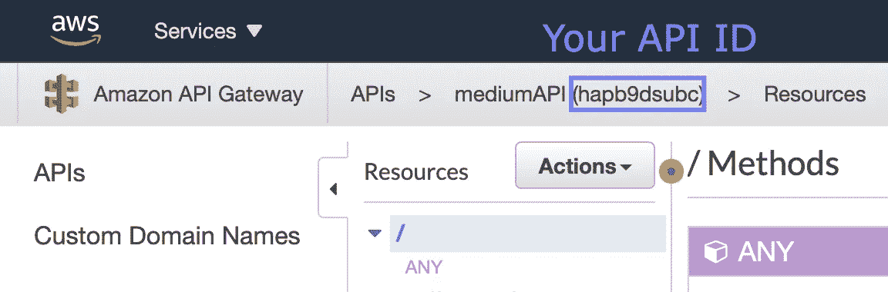*

*如何找到你的 API ID——图片作者*

*API Gateway 中对应于您的 API 的**日志组**将类似于:*

```
*API-Gateway-Execution-Logs_<YOUR_API_ID>/<YOUR_API_STAGE>*
```

*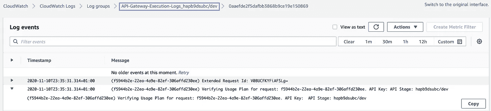*

*API 网关日志—按作者分类的图片*

***Amazon Lambda** 日志可以通过函数名来识别:*

```
*/aws/lambda/<YOUR_FUNCTION_NAME>*
```

*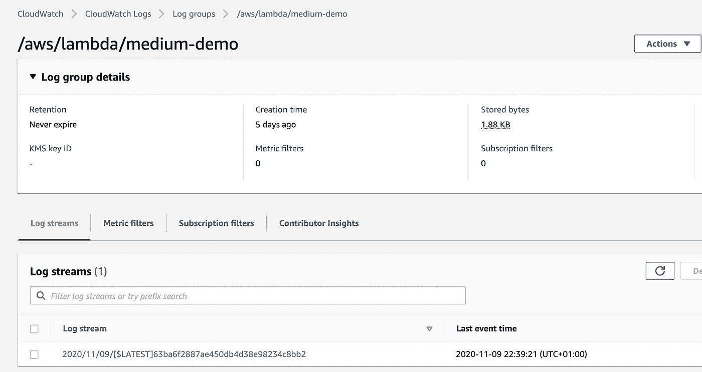*

*Lambda 日志—作者图片*

***4。X 射线是如何工作的？***

*x 射线是一种分布式跟踪服务。它跟踪诸如对我们的 API 的请求的延迟和成功率以及我们的服务中的不同组件如何相互依赖等指标。X-Ray 的主要好处是它生成了一个**服务图**，这让我们可以分析哪些请求被其他下游请求跟随，以及我们的 API 中有哪些潜在的瓶颈。*

*在内部，X-Ray 通过使用**段**生成跟踪，即执行 API 请求的计算资源，如 API Gateway 和 Amazon Lambda。这些片段可以被分解成**子片段**以进行更细粒度的跟踪——例如，我们可以在 FastAPI 代码中使用 X-Ray 的 [Python SDK](https://github.com/aws/aws-xray-sdk-python) 来添加新的子片段，进行注释，并整体上使我们的跟踪更细粒度。*

*单个**跟踪**收集由特定请求生成的所有段和子段。*

***5。X 射线会自动跟踪并记录每个请求吗？***

*简而言之:不。测量每一个请求将是昂贵的，并且很可能是不必要的(*如果前 50 个相同类型的请求每个花费 200 毫秒，那么接下来的 500 万个后续请求很可能也是如此*)。x 射线使用**代表样本**:默认情况下，它跟踪每秒的第一个请求，外加所有附加请求的 5%。这个采样规则可以根据您的特定请求的属性进行配置[2]。*

*还有两种不同类型的跟踪:**主动**和**被动**。两者具有相同的效果，因为它们导致 X 射线对请求进行采样并收集跟踪。*

*当我们在调用我们的 Lambda 函数的 API 网关中启用 X 射线时，这意味着在这个 Lambda 函数上启用了**被动跟踪**，因为上游服务(*即 API 网关*)负责添加跟踪头，告诉 Lambda 是否发送跟踪。相反，如果我们直接从 Lambda 配置而不是从 API Gateway 启用跟踪，这将是**主动跟踪**。*

*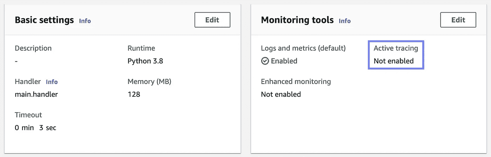*

*在 Lambda 配置中启用活动跟踪—按作者分类的图像*

*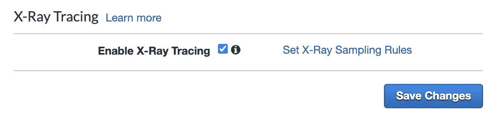*

*在 API 网关阶段配置中为 Lambda 启用被动跟踪—图片由作者提供*

***5。X 射线与 CloudWatch 和 CloudTrail 有什么不同？***

***X 射线**让我们收集关于特定 API 或微服务的指标。 **CloudTrail** 拥有更广泛的“受众”——因为 AWS 中的一切都是 API 调用，所以我们的 AWS 帐户中的每个操作都可以用 CloudTrail 跟踪。有可能**将 X 射线与 CloudTrail** 集成起来，以跟踪用户、IAM 角色或任何 AWS 服务所做的额外操作，并在 X 射线跟踪中分析它们[3]。*

*相比之下， **CloudWatch** 允许我们跟踪执行日志、访问日志，甚至完整的请求和响应数据，并直接在 CloudWatch 控制台中或在 Kibana 或 Grafana 等工具中分析它们。*

> *虽然 **CloudWatch** 为我们提供了**详细的日志**，但 X-Ray 只为我们提供了关于延迟和采样请求状态的指标。*

***6。这些服务的费用是多少？***

*价格根据您的 AWS 地区、API 类型( *REST、HTTP* )和您的请求数量(*批量折扣*)而有所不同。在撰写本报告时:*

*   *[API 网关](https://aws.amazon.com/api-gateway/pricing/)每 100 万次请求的成本在 1-4.25 美元之间。*
*   *AWS X 射线的价格大约是每一百万道 1 美元。*
*   *AWS Lambda 根据调用次数和代码运行时间收费，以毫秒为单位。*
*   *最后， [CloudWatch](https://aws.amazon.com/cloudwatch/pricing/) 日志的价格在每月收集的每 GB 日志 0.50-0.90 美元之间(*同样，价格因地区而异*)。*

*您可以使用 [AWS 定价计算器](https://calculator.aws/#/)来获得与您的用例相对应的更现实的估计。另外，请注意，使用免费层，您可以(*有限的*)免费访问 API Gateway、Amazon Lambda 和 CloudWatch 日志。*

# *6.结论*

*在本文中，我们研究了如何使我们的 API 安全且易于维护。我们讨论了如何分配使用计划和 API 键，以及如何通过启用分布式日志记录和跟踪来监控 API 的健康状况。最后，我们深入研究了这些服务是如何工作的，以及如何有效地使用它们。*

***如果这篇文章有帮助，** [**关注我**](https://medium.com/@anna.anisienia) **看我下一篇文章。***

***参考文献:***

*[1] [关于使用计划的 API 网关文档](https://docs.aws.amazon.com/apigateway/latest/developerguide/api-gateway-api-usage-plans.html)*

*[2] [AWS X 射线文件](https://docs.aws.amazon.com/xray/latest/devguide/xray-concepts.html)关于取样请求和追踪*

*[3] AWS Edx 课程[在 AWS 上构建现代 Python 应用](https://courses.edx.org/courses/course-v1:AWS+OTP-AWSD12+3T2020/course/)*