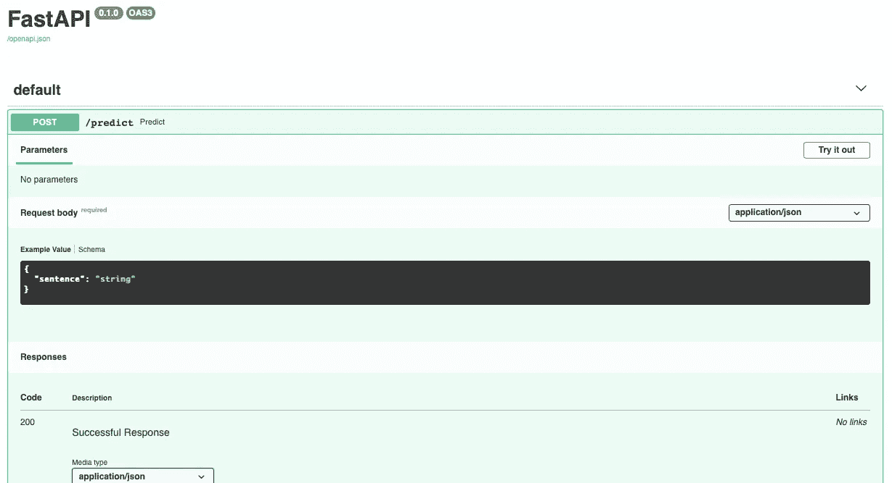
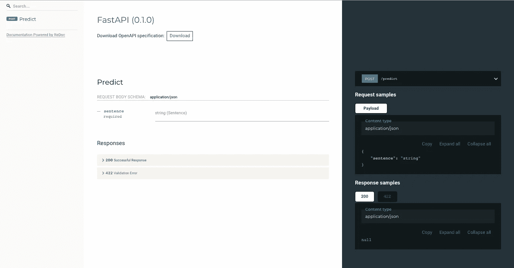
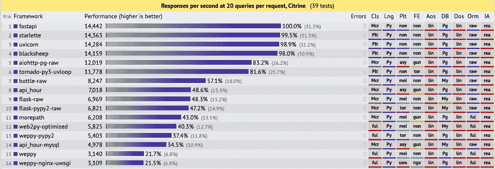

# FastAPI 永远毁了我的烧瓶

> 原文：<https://towardsdatascience.com/fastapi-has-ruined-flask-forever-for-me-73916127da?source=collection_archive---------4----------------------->

## 为什么我更喜欢使用 FastAPI 而不是 Flask

FastAPI 标志—[https://fastapi.tiangolo.com](https://fastapi.tiangolo.com)

作为一名数据科学家，你最喜欢的是什么？这肯定是为了获得最佳结果而进行的建模和微调。但是如果一个好的模型从来没有被使用或者从来没有被部署过，那么它又意味着什么呢？

要产生一个机器学习模型，典型的做法是把它包装在一个 REST API 中，作为一个微服务来使用。创建 API 最广泛使用的框架之一是 [**Flask**](https://flask.palletsprojects.com/) 。

Flask 被广泛使用的主要原因是它的简单性。一般情况下，我们只使用 API 对预测进行建模，所以不需要复杂的架构(例如: [**Django**](https://www.djangoproject.com/) )。另一个原因是 Flask 是用 Python 写的，Python 是一般用来做机器学习建模的语言，所以我们很熟悉。

然而，如果您想要创建一个带有清晰的、静态的、经过验证的输入的 REST API，那么您必须包含几个不同的包，这些包来自几个互不合作的第三方。而且你必须创建定制的代码来运行一切。

这促使我寻找满足需求的替代方案，最终我找到了一个名为 [**FastAPI**](https://fastapi.tiangolo.com) 的框架，它成为了我最喜欢的框架。以下是我喜欢使用 FastAPI 的原因。

## 证明文件

我从 FastAPI 注意到的第一件事是文档。FastAPI 有非常广泛的文档和丰富的例子，这使得事情变得更容易。如果你需要找一些关于 FastAPI 的东西，通常不需要去别的地方找。

此外，FastAPI 将从我们正在运行的程序中自动生成交互式 API 文档。这样我们就不需要编写自己创建的 API 文档了。众所周知，编写 API 文档是很烦人的，不仅因为有很多细节要处理，而且当最终用户在实现但没有匹配文档时，没有什么比这更令人沮丧的了。因此，自动生成 API 文档将非常有帮助

下面是 API 文档的显示示例(由 [Swagger UI](https://github.com/swagger-api/swagger-ui) 提供)

[http://127 . 0 . 0 . 1:8000/docs](http://127.0.0.1:8000/docs)

还提供了替代的自动文件(由 [ReDoc](https://github.com/Rebilly/ReDoc) 提供)

[http://127 . 0 . 0 . 1:8000/redoc](http://127.0.0.1:8000/redoc)

为了定义创建的模式，它使用了 **Pydantic** ，这是另一个很棒的 Python 库，用于数据验证。它的目的是验证进入 FastAPI 的输入。如果输入/请求不正确，则将返回相应的错误代码。

来源:[https://medium . com/@ tiangolo/introducing-fastapi-FDC 1206d 453 f](https://medium.com/@tiangolo/introducing-fastapi-fdc1206d453f)

## 表演

顾名思义，这确实是 FastAPI。根据来自 [techempower 基准](https://www.techempower.com/benchmarks/#section=test&runid=7464e520-0dc2-473d-bd34-dbdfd7e85911&hw=ph&test=query&l=zijzen-7)的数据，FastAPI 在性能方面胜过所有框架。像 Flask 和 Django 这样最常用的框架落后了。

框架性能— [techempower](https://www.techempower.com/benchmarks/#section=test&runid=7464e520-0dc2-473d-bd34-dbdfd7e85911&hw=ph&test=query&l=zijzen-7)

是啊，太快了。

## 异步的

Flask 的缺点之一是缺乏异步 I/O 支持。异步对于 HTTP 端点非常重要，因为 HTTP 端点往往需要等待大量的 I/O 和网络聊天，这使得它成为使用异步的并发性的一个很好的候选对象。

与 Flask 不同，FastAPI 使用`async` / `await` Python 关键字支持开箱即用的异步代码。FastAPI 默认支持异步，这意味着我们不需要使用第三方框架来做异步。

您所要做的就是用 async 关键字声明端点，如下所示:

异步代码

总之，FastAPI 是一个快速的 web 框架，支持异步代码。此外，它还配有非常完整的文档和集成的验证系统，使其更易于使用。

你对使用 FastAPI 感兴趣吗？如果你想开始使用 FastAPI，这里有一些很好的资源。这里有一些你可以探索。

 [## 第一步- FastAPI

### 最简单的 FastAPI 文件可能是这样的:将它复制到 main.py 文件中

fastapi.tiangolo.com](https://fastapi.tiangolo.com/tutorial/first-steps/)  [## FastAPI 简介

### FastAPI 是一个现代、快速(高性能)的 web 框架，用于基于标准 Python 使用 Python 3.6+构建 APIs

medium.com](https://medium.com/@tiangolo/introducing-fastapi-fdc1206d453f)