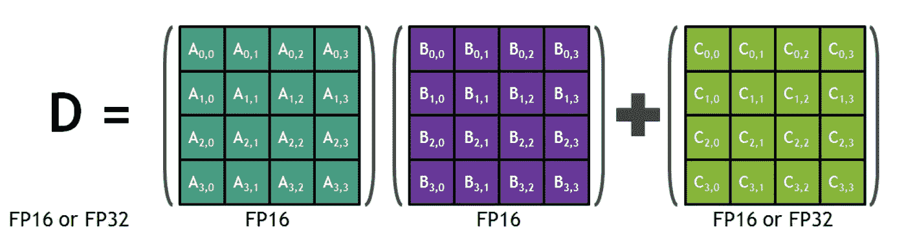
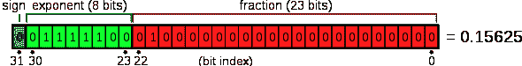
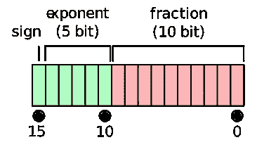
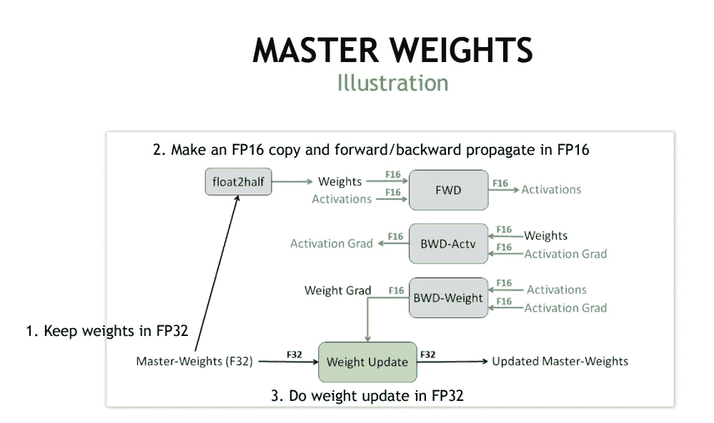
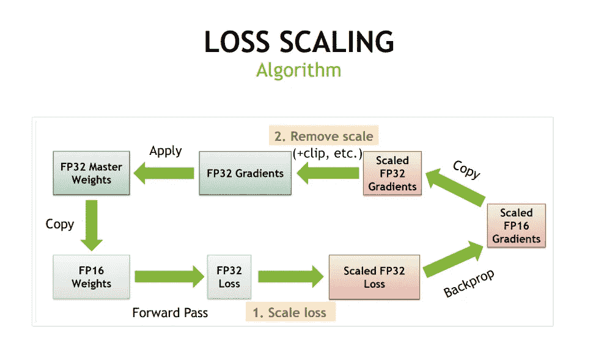
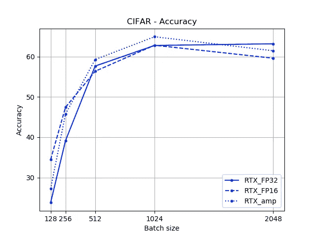
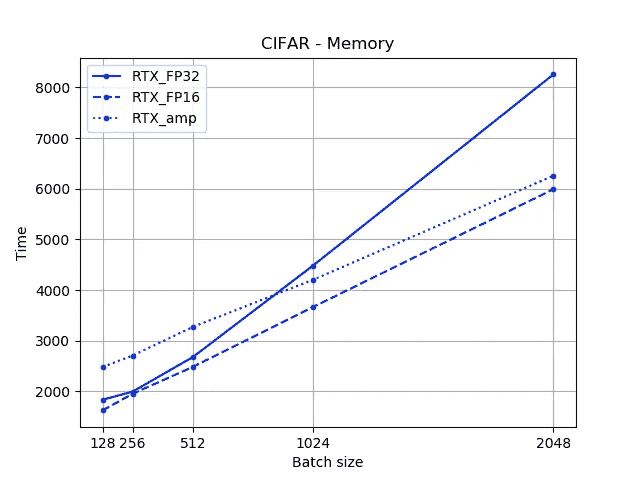
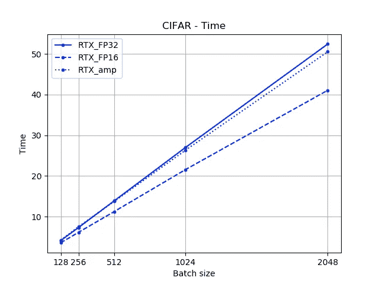
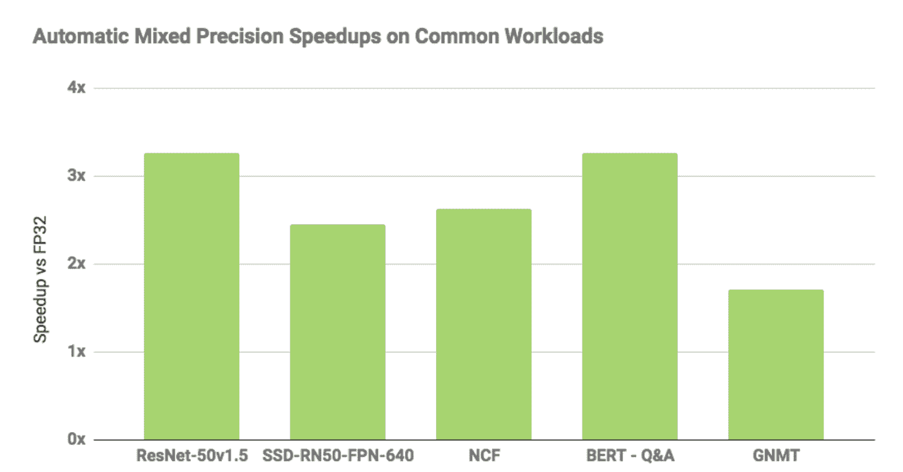

# 使用 AMP 和 Tensor 内核的速度更快、内存效率高的 PyTorch 模型

> 原文：<https://towardsdatascience.com/faster-and-memory-efficient-pytorch-models-using-amp-50fd3c8dd7fe?source=collection_archive---------14----------------------->


图片来自 [Pixabay](https://pixabay.com/?utm_source=link-attribution&utm_medium=referral&utm_campaign=image&utm_content=1283795) 的[像素](https://pixabay.com/users/Pexels-2286921/?utm_source=link-attribution&utm_medium=referral&utm_campaign=image&utm_content=1283795)

## 只需添加几行代码

你知道 1986 年 Geoffrey Hinton 在《自然》[杂志的论文](http://www.iro.umontreal.ca/~pift6266/A06/refs/backprop_old.pdf)中给出了反向传播算法吗？

此外，1998 年 Yann le cun 首次提出了用于数字分类的卷积网络，其中他使用了单个卷积层。直到 2012 年晚些时候，Alexnet 才通过使用多个卷积层在 imagenet 上实现最先进的水平，从而普及了 Convnets。

那么是什么让他们现在如此出名而不是以前呢？

只有在我们拥有大量计算资源的情况下，我们才能在最近的过去试验和利用深度学习的全部潜力。

但是，我们是否充分利用了我们的计算资源？我们能做得更好吗？

***这篇帖子是关于利用张量核和自动混合精度来更快地训练深度学习网络的。***

# 什么是张量核？

根据 [NVIDIA](https://www.nvidia.com/en-us/data-center/tensorcore/) 网站:

> NVIDIA Turing 和 Volta GPUs 由 Tensor Cores 提供支持，这是一项革命性的技术，可提供突破性的 AI 性能。张量核可以加速大型矩阵运算，这是人工智能的核心，并在单次运算中执行混合精度矩阵乘法和累加计算。随着数百个张量内核在一个 NVIDIA GPU 中并行运行，这使得吞吐量和效率大幅提高

简单来说；它们 ***是专门的内核，非常适合特定类型的矩阵运算*** 。



[来源](https://nvlabs.github.io/iccv2019-mixed-precision-tutorial/files/dusan_stosic_intro_to_mixed_precision_training.pdf)

我们可以将两个 FP16 矩阵相乘，并将其与 FP16/FP32 矩阵相加，从而得到一个 FP16/FP32 矩阵。张量核支持混合精度数学，即输入为半精度(FP16)，输出为全精度(FP32)。上述操作对于许多深度学习任务来说具有内在价值，张量核为这种操作提供了专门的硬件。

现在，使用 FP16 相对于 FP32 主要有两个好处。

1.  FP16 需要更少的内存，因此更容易训练和部署大型神经网络。它还涉及更少的数据移动。
2.  张量核在降低精度的情况下，数学运算运行得更快。NVIDIA 给出的 Volta GPU 的准确数字是:FP16 为 125 TFlops，FP32 为 15.7 TFlops 倍加速)

但是也有缺点。当我们从 FP32 转到 FP16 时，必然会降低精度。



[FP32](https://en.wikipedia.org/wiki/Single-precision_floating-point_format) vs [FP16](https://en.wikipedia.org/wiki/Bfloat16_floating-point_format) : FP32 有 8 个指数位和 23 个分数位，FP16 有 5 个指数位和 10 个分数位。

***但是需要 FP32 吗？***

FP16 实际上可以很好地表示大多数权重和梯度。因此，存储和使用 FP32 需要所有这些额外的位只是浪费。

# 那么，我们如何使用张量核呢？

我检查了我的泰坦 RTX GPU 有 576 个张量核心和 4608 个 NVIDIA CUDA 核心。但是我如何使用这些张量核呢？

老实说，NVIDIA 通过几行代码提供的自动混合精度使张量核的使用变得微不足道。我们需要在代码中做两件事:

1.  需要使用 FP32 进行的操作(如 Softmax)被分配到 FP32，而可以使用 FP16 完成的操作(如 Conv)被自动分配到 FP16。



[来源](https://nvlabs.github.io/iccv2019-mixed-precision-tutorial/files/dusan_stosic_intro_to_mixed_precision_training.pdf)

2. ***使用损失缩放*** 来保留小的渐变值。梯度值可能会超出 FP16 的范围。在这种情况下，梯度值会进行缩放，使其落在 FP16 范围内。



[来源](https://nvlabs.github.io/iccv2019-mixed-precision-tutorial/files/dusan_stosic_intro_to_mixed_precision_training.pdf)

***如果你还不了解背景细节也没关系。代码实现相对简单。***

# PyTorch 混合精确训练:

让我们从 PyTorch 中的一个基本网络开始。

```
N, D_in, D_out = 64, 1024, 512
x = torch.randn(N, D_in, device="cuda")
y = torch.randn(N, D_out, device="cuda")
model = torch.nn.Linear(D_in, D_out).cuda()
optimizer = torch.optim.SGD(model.parameters(), lr=1e-3)for to in range(500):
   y_pred = model(x)
   loss = torch.nn.functional.mse_loss(y_pred, y)
   optimizer.zero_grad()
   loss.backward()
   optimizer.step()
```

为了利用自动混合精度训练，我们首先需要安装 apex 库。只需在您的终端中运行以下命令。

```
$ git clone https://github.com/NVIDIA/apex
$ cd apex
$ pip install -v --no-cache-dir --global-option="--cpp_ext" --global-option="--cuda_ext" ./
```

然后，我们只需在神经网络代码中添加几行代码，就可以利用自动混合精度(AMP)的优势。我将下面添加的行加粗:

```
***from apex import amp***
N, D_in, D_out = 64, 1024, 512
x = torch.randn(N, D_in, device="cuda")
y = torch.randn(N, D_out, device="cuda")
model = torch.nn.Linear(D_in, D_out).cuda()
optimizer = torch.optim.SGD(model.parameters(), lr=1e-3)
**model, optimizer = amp.initialize(model, optimizer, opt_level="O1")**
for to in range(500):
   y_pred = model(x)
   loss = torch.nn.functional.mse_loss(y_pred, y)
   optimizer.zero_grad()
***with amp.scale_loss(loss, optimizer) as scaled_loss:
      scaled_loss.backward()***   optimizer.step()
```

在这里，您可以看到我们用`amp.`初始化了我们的模型，我们还使用`amp.scale_loss`指定了损耗比例

# 标杆管理

我们可以使用这个伟大的[存储库](https://github.com/znxlwm/pytorch-apex-experiment)对 amp 的性能进行基准测试，该存储库在 CIFAR 数据集上对 VGG16 模型进行基准测试。我只需要修改几行代码就可以让它为我们工作了。你可以在这里找到修改版的。要自己运行基准测试代码，您可能需要:

```
git clone [https://github.com/MLWhiz/data_science_blogs](https://github.com/MLWhiz/data_science_blogs)cd data_science_blogs/amp/pytorch-apex-experiment/python run_benchmark.pypython make_plot.py --GPU 'RTX' --method 'FP32' 'FP16' 'amp' --batch 128 256 512 1024 2048
```

这将在主目录中为您填充以下图形:



在这里，我使用不同的精度和批量设置训练了同一个模型的多个实例。我们可以看到，从 FP32 到 amp，存储器需求降低了，而精度基本保持不变。时间也会减少，但不会减少太多。这可能归因于简单的数据集或简单的模型。

***根据 NVIDIA 给出的基准测试，自动混合精度比标准 FP32 型号快 3 倍左右，如下图所示。***



[来源](https://medium.com/tensorflow/automatic-mixed-precision-in-tensorflow-for-faster-ai-training-on-nvidia-gpus-6033234b2540):加速比是单精度和自动混合精度下固定历元数的训练时间比。

# 继续学习

如果您想了解更多关于实用数据科学的知识，请查看 Coursera 课程的 [**“如何赢得数据科学竞赛”**](https://www.coursera.org/specializations/aml?siteID=lVarvwc5BD0-BShznKdc3CUauhfsM7_8xw&utm_content=2&utm_medium=partners&utm_source=linkshare&utm_campaign=lVarvwc5BD0) 。我从卡格勒教授的这门课程中学到了很多新东西。

谢谢你的阅读。将来我也会写更多初学者友好的帖子。在 [**媒体**](https://medium.com/@rahul_agarwal?source=post_page---------------------------) 关注我或者订阅我的 [**博客**](http://eepurl.com/dbQnuX?source=post_page---------------------------) 了解他们。一如既往，我欢迎反馈和建设性的批评，可以通过 Twitter [@mlwhiz](https://twitter.com/MLWhiz?source=post_page---------------------------) 联系到我。

此外，一个小小的免责声明——在这篇文章中可能会有一些相关资源的附属链接，因为分享知识从来都不是一个坏主意。