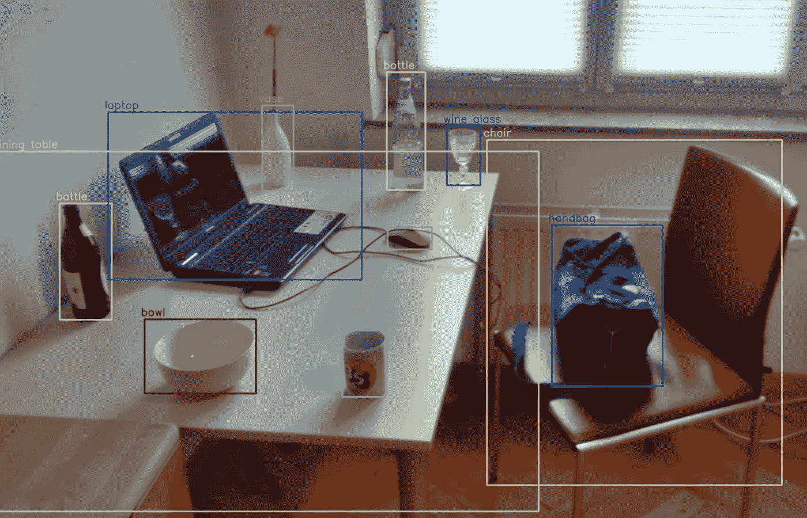
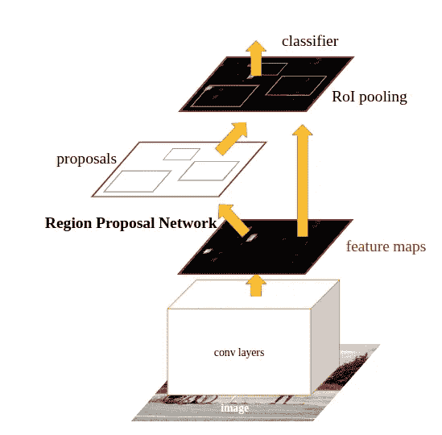
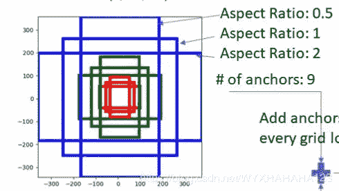
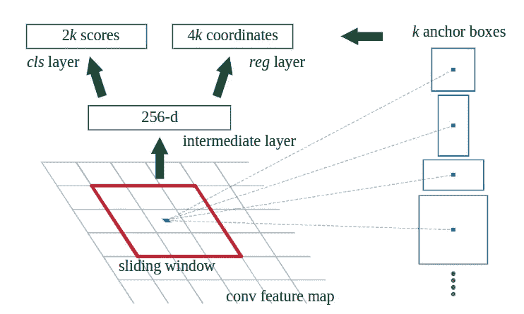
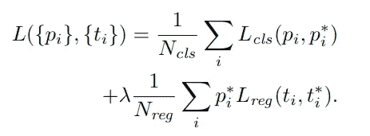

# 更快的 RCNN [1506.01497]

> 原文：<https://towardsdatascience.com/faster-rcnn-1506-01497-5c8991b0b6d3?source=collection_archive---------16----------------------->

## 面向实时对象检测

来源:[https://en.wikipedia.org/wiki/Object_detection](https://en.wikipedia.org/wiki/Object_detection)作者: [Mtheiler](https://commons.wikimedia.org/wiki/User:MTheiler)

我已经计划阅读主要的对象检测论文(虽然我已经浏览了大部分，但现在我将详细阅读它们，好到足以写一篇关于它们的博客)。这些论文与基于深度学习的对象检测相关。随时给建议或询问疑惑会尽我所能帮助大家。任何从这个领域开始的人都可以跳过许多这样的论文。当我看完所有的论文后，我也会写下它们的优先顺序/重要性。
我写这篇博客是考虑到和我相似并且仍在学习的读者。虽然我会通过从各种来源(包括博客、代码和视频)深入理解论文来尽力写出论文的关键，但如果您发现任何错误，请随时在博客上指出或添加评论。我已经提到了我将在博客末尾涉及的论文列表。

我们开始吧:)

老实说，我大约在两年前开始研究对象检测，并从更快的 RCNN、Yolo 和 SSD 等论文开始(我们将在接下来的博客中讨论这两篇论文)。这些题目让我很为难，很长一段时间都无法理解。我是深度学习的新手，没有耐心，也没有经验去研究完整的论文，也找不到任何博客能足够好地解释这些话题让我理解。在这篇博客中，我将尽可能地简化这篇文章，因此你可能会发现它有点大而且充满了理论。

快速 RCNN 和 RCNN 使用诸如选择性搜索的区域提议算法来提议图像中对象的估计位置。这些算法是当前目标检测系统的测试时间瓶颈。很直观，由 CNN 提取的特征最终用于分类并给出图像的包围盒。因此，这些提取的特征具有检测图像中的对象所需的信息。更快的 RCNN 架构基于这一观察。区域提议算法由区域提议网络代替，该网络给出具有对象的区域的估计。该区域提议网络基于 CNN，并从 CNN 提取的特征中给出区域提议。

因此，更快的 RCNN 架构是提出区域的 RPN 和使用这些提出的区域给出对象的最终边界框的快速 RCNN 检测器的组合。因为快速 RCNN 和 RPN 都需要基于 CNN 的特征提取器来执行几乎相似的任务(RPN 的最终任务是仅给出对象区域),所以我们可以使用单个特征提取器，而不是使用具有几乎相同权重的两个独立的模型。下图显示了 Fast RCNN 和 RPN 的统一结构。

快速 RCNN 网络(RPN+快速 RCNN)来源:[快速 RCNN 论文](https://arxiv.org/pdf/1506.01497.pdf)作者:任

## 什么是锚盒

锚盒是现代物体探测器的主要部分。虽然在本文后面会讨论，但我觉得你应该在进入 RPN 之前了解一下。在对象检测中，我们试图为图像中的每个对象获得一个矩形框，因此在每个图像中有多个不同形状和大小的框。

现在，忘记早期的架构如快速 RCNN、RCNN 如何解决这个问题，而是将其视为正常的深度学习问题，类似于图像分类，我们可以使用一个带有回归头的层来预测对象的边界框。在图像分类中，我们为每个图像输出一个标签，但是在对象检测中，我们可以在每个图像中有多个对象，因此每个图像需要多个输出。我们可以通过获得多个预测而不是一个来解决这个问题，但是模型如何知道哪个边界框是针对哪个对象的呢？

快速 RCNN 和 RCNN 通过使用区域提议方法(如前所述，其具有缺点)解决了这个问题。在更快的 RCNN 中，我们使用深度神经网络来获得这些建议，因此我们可以说在某种程度上我们正在尝试使用该网络来解决对象检测的问题。因此，上面讨论的问题现在就有了眉目。

锚箱是救世主。锚定框只不过是放置在图像中不同位置的一些参考框。在我们的特征图(CNN 的输出)中为每个像素生成 k 个锚框。因此，锚盒的总数是 h*w*k(h*w 是特征图的输出大小)。这里是一个超参数。这些 k 锚盒有不同的大小和长宽比，这有助于覆盖各种形状和大小的对象。锚框是特定于数据集和该数据集中的对象类型的超参数(例如，在一些医学数据中，如果对象只能是单一尺寸，我们将只需要 3 个不同纵横比的锚框)。我们可以在下面看到这些锚盒。

锚箱来源:[程序员搜索](http://www.programmersought.com/article/8369776535/)

不是获得一个对象的原始回归输出，而是作为锚框的偏移来计算(我们将在后面看到如何训练使用锚框的模型)。在大多数情况下，这种偏移是锚定框的轻微移动，因为这些锚定框被放置在整个图像上。检测到的对象将被多个锚定框重叠，而不仅仅是 1 个。这些冗余预测随后使用非最大抑制移除。我们的模型的输出是 4*k*h*w 维度(对于每个锚框有一个框预测，对于每个锚框也预测分类分数，给出它包含对象的概率)。这在理论上将 CNN 能够探测到的物体数量限制在 4*k*h*w，但实际上，这个数量已经足够大了。

锚盒可以通过使用不同大小的锚盒(上图中的红、绿、蓝盒子)来解决测试时使用多尺度的问题。

## RPN

区域提议网络以特征地图作为输入，并输出一组矩形对象提议，每个提议具有一个对象性分数。对象性测量对象和背景之间的分数(因此，背景的分数较低，具有对象的区域的分数较高)。选择性搜索的区域建议时间为每幅图像 2 秒，而 RPN 仅为 10ms。

更快的 RCNN 使用 3 种纵横比和 3 种比例的锚盒。因此，对于特征图中的每个像素，有 9 个锚框。

该架构是一个简单的卷积层，其内核大小为 3*3，后面是两个完全连接的层(一个用于客观评分(分类)，另一个用于建议的回归)。这个全连接层是使用 1*1 卷积层实现的。分类图层的输出大小应为 2*9(前景和背景)，回归图层的输出大小应为 4*9(此处 9 是每个像素的锚点数量)。预测的总数现在是直观的，并且将是(4+2)*9*(H*W)(对于特征图中的每个像素)。

来源:[快 RCNN 论文](https://arxiv.org/pdf/1506.01497.pdf)作者:任

## 损失函数

在快速 R-CNN 中使用的损失函数类似于快速 R-CNN，即多任务损失。

多任务损失函数求更快 R-CNN 来源:[更快 RCNN 论文](https://arxiv.org/pdf/1506.01497.pdf)作者:任

在这个等式中，pᵢ是预测概率(从 cls 输出)，pᵢ*是基本事实。类似地，tᵢ是预测边界框，tᵢ*是基本事实边界框。Lcₗs 是分类损失(对数损失)，Lreg 是平滑 L₁损失。

如前所述，回归偏移是从最近的锚盒计算的。为了与区域提议技术相关联，锚盒现在充当区域提议。一张 40*60 大小的特征地图，总共有 40*60*9 ~ 20000 个锚盒。所有锚箱在训练时都不会造成损失。IOU 与地面真实值最高的锚和 IOU 重叠高于 0.7 的锚被分配正标签。IOU 低于 0.3 的锚标为负。既不积极也不消极的锚对训练目标没有贡献。跨界锚点也将被忽略。

## 培养

快速 RCNN 架构是由 RPN 和快速 R-CNN 组成的统一网络，CNN 层由两种架构共享。我们不能单独训练 RPN 和快速 RCNN(它将给出不同的权重，因此我们需要为它们中的每一个通过 CNN 两次)。作者使用了下面讨论的 4 步训练算法(也讨论了其他一些算法，你可以在论文中看到):

1.  使用初始训练的 RPN 和来自图像网络的预训练权重。
2.  使用由步骤 1 RPN 生成的建议来训练快速 RCNN。(此时两个网络不共享卷积层)。
3.  使用来自步骤 2 的卷积层训练 RPN，并且仅更新 RPN 特有的层(卷积层的权重不更新)。
4.  保持这个卷积层，对快速 R-CNN 特有的层进行微调。

在训练时，作为 RPN 输出的 20000 个锚(建议)首先通过移除跨界锚(给出 6000 个锚)来减少。应用非最大抑制(NMS)来移除阈值为 0.7 的冗余预测(给出 2000 个锚)。在 NMS 之后，使用排名前 N 位(分类分数)的建议区域。

## 测试

更快的 RCNN 是一种完全基于深度学习的方法，具有统一的网络，不依赖于像选择性搜索提议这样的算法。因此，图像被直接传送到网络，作为输出给出预测。RPN(20k 建议)的输出使用上一节最后一段中讨论的类似步骤进行二次抽样。

这是最重要的文章之一，也是理解未来大部分文章所必需的。如果我有不清楚的地方，请在评论中提出来，我会更新的。

和平…

## 参考

1.  [https://arxiv.org/pdf/1506.01497.pdf](https://arxiv.org/pdf/1506.01497.pdf)
2.  [https://tryolabs . com/blog/2018/01/18/faster-r-CNN-down-the-rabbit-hole-of-modern-object-detection/](https://tryolabs.com/blog/2018/01/18/faster-r-cnn-down-the-rabbit-hole-of-modern-object-detection/)
3.  【https://d2l.ai/chapter_computer-vision/anchor.html 
4.  [http://machinethink.net/blog/object-detection/](http://machinethink.net/blog/object-detection/)
5.  [https://towards data science . com/faster-r-CNN-for-object-detection-a-technical-summary-474 C5 b 857 b 46](/faster-r-cnn-for-object-detection-a-technical-summary-474c5b857b46)

# 论文列表:

1.  [OverFeat:使用卷积网络的综合识别、定位和检测](https://arxiv.org/pdf/1312.6229.pdf)。[ [链接到博客](/overfeat-review-1312-6229-4fd925f3739f)
2.  [丰富的特征层次，用于精确的对象检测和语义分割(RCNN)。](https://arxiv.org/pdf/1311.2524.pdf) [ [链接到博客](https://medium.com/@sanchittanwar75/rcnn-review-1311-2524-898c3148789a)
3.  [用于视觉识别的深度卷积网络中的空间金字塔池(SPPNet)。](https://arxiv.org/pdf/1406.4729.pdf) [ [链接到博客](https://medium.com/@sanchittanwar75/review-spatial-pyramid-pooling-1406-4729-bfc142988dd2)
4.  [快速 R-CNN](https://arxiv.org/pdf/1504.08083.pdf)↓[[链接到博客](https://medium.com/@sanchittanwar75/fast-rcnn-1504-08083-d9a968a82a70) ]
5.  更快的 R-CNN:用区域提议网络实现实时目标检测。 ←你完成了这篇博客。
6.  [你只看一次:统一的，实时的物体检测。](https://arxiv.org/pdf/1506.02640.pdf)【博客链接】
7.  [SSD:单次多盒探测器](https://arxiv.org/pdf/1512.02325.pdf)。[博客链接]
8.  R-FCN:通过基于区域的完全卷积网络的目标检测。【博客链接】
9.  [用于目标检测的特征金字塔网络。](https://arxiv.org/pdf/1612.03144.pdf)【博客链接】
10.  [DSSD:解卷积单粒子探测器](https://arxiv.org/pdf/1701.06659.pdf)。[博客链接]
11.  [密集物体检测的焦点丢失(视网膜网)。](https://arxiv.org/pdf/1708.02002.pdf)【博客链接】
12.  [YOLOv3:增量改进](https://arxiv.org/pdf/1804.02767.pdf)。[博客链接]
13.  [狙击手:高效多尺度训练](https://arxiv.org/pdf/1805.09300v3.pdf)。[博客链接]
14.  [标注像素和区域的高分辨率表示。](https://arxiv.org/pdf/1904.04514.pdf)【博客链接】
15.  [FCOS:全卷积一级目标检测](https://arxiv.org/pdf/1904.01355v5.pdf)。[博客链接]
16.  [以物为点](https://arxiv.org/pdf/1904.07850.pdf)。[博客链接]
17.  CornerNet-Lite:高效的基于关键点的对象检测。【博客链接】
18.  [CenterNet:用于对象检测的关键点三元组](https://arxiv.org/pdf/1904.08189v3.pdf)。[博客链接]
19.  [用于实时对象检测的训练时间友好网络。](https://arxiv.org/pdf/1909.00700.pdf)【博客链接】
20.  [CBNet:一种用于目标检测的新型复合主干网络架构。](https://arxiv.org/pdf/1909.03625v1.pdf)【博客链接】
21.  [EfficientDet:可扩展且高效的对象检测](https://arxiv.org/pdf/1911.09070v2.pdf)。[博客链接]