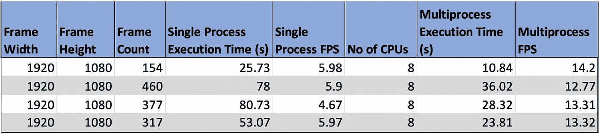

# 使用并行计算加快 Python 中的视频处理

> 原文：<https://towardsdatascience.com/faster-video-processing-in-python-using-parallel-computing-25da1ad4a01?source=collection_archive---------10----------------------->

## python 中的多重处理


服务器(照片由[伊恩·巴塔格利亚](https://unsplash.com/@ianjbattaglia?utm_source=unsplash&utm_medium=referral&utm_content=creditCopyText)在 [Unsplash](https://unsplash.com/?utm_source=unsplash&utm_medium=referral&utm_content=creditCopyText) 上拍摄)

如果要处理大量视频文件，可能需要几分钟到几小时，具体取决于视频的大小、帧数和帧尺寸。

> 怎样才能加快视频处理速度？
> 
> 并行处理就是答案！

如果您正在批量处理图像，您可以利用并行处理的强大功能来加速任务。

在这篇文章中，我们将看看如何使用 python 对视频进行并行处理。

我们将从磁盘读取视频，执行人脸检测，并将带有人脸检测输出(边界框)的视频写回磁盘。

让我们开始吧。

## 安装依赖项

我们将需要以下包:

**OpenCV:** 是一个常用的计算机视觉库。在本帖中，我们将使用 OpenCV 来读写视频文件。

要在您的设备上安装 OpenCV，您可以使用 *pip* 命令或 *apt-get* 命令。

```
pip3 install opencv-python
```

或者

```
sudo apt-get install -y python3-opencv
```

**FFmpeg:** 是一个跨平台的解决方案，用于录制、转换和流式传输音频和视频。在这篇文章中，我们将使用 FFmpeg 来连接多个视频文件。

要安装 ffmpeg，使用下面的 *apt-get* 命令:

```
sudo apt-get install -y ffmpeg
```

## 导入 python 库

让我们导入所需的 python 库。

所用库的详细信息:

[**cv2:**](https://opencv.org) OpenCV 库读写视频文件。

**时间:**获取计算代码执行时间的当前时间。

[**子进程**](https://docs.python.org/3/library/subprocess.html) **:** 启动新进程，连接到它们的输入/输出/错误管道，获取它们的返回代码。

[**多重处理**](https://docs.python.org/2/library/multiprocessing.html) **:** 跨多个输入值并行执行一个函数，将输入数据分布到多个进程中

[](https://sdk.xailient.com)****:**人脸检测库**

## **使用单个进程的视频处理流水线**

**我们将首先定义一种使用单个进程处理视频的方法。这就是我们通常读取视频文件、处理每一帧并将输出帧写回磁盘的方式。**

**让我们创建另一个调用视频处理器的函数，记录开始和结束时间，并计算执行管道所用的时间和每秒处理的帧数。**

## **使用多进程的视频处理流水线**

**现在，让我们定义另一个利用多重处理来处理视频的函数。**

**上述功能的工作原理是，通常使用一个进程完成的视频处理工作现在在执行设备上可用的处理器总数中平均分配。**

**如果有 4 个进程，并且要处理的视频中的总帧数是 1000，则每个进程得到 250 个要处理的帧，它们是并行执行的。这意味着每个过程将创建一个单独的输出文件，因此当视频处理完成时，有 4 个不同的输出视频。**

**为了组合这些输出视频，我们将使用 ffmpeg。**

**创建一个管道来运行视频的多重处理，并计算执行时间和每秒处理的帧数。**

## **结果**

**我在搭载 Ubuntu18.04 操作系统的联想 Yoga 920 上运行了这个实验。该设备上可用的逻辑处理器数量为 8。**

********

**从这个实验中，我们可以观察到，当使用所有内核处理视频时，每秒多处理 2 倍的帧。**

**发现这篇文章有用吗？ ***在下面留下你的想法作为评论。*****

**原载于*[](https://www.xailient.com/post/multiprocessing-video-in-python)**。*****

*******关于作者*******

*****Sabina Pokhrel 在 Xailient 工作，这是一家计算机视觉初创公司，已经建立了世界上最快的边缘优化物体探测器。*****