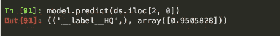
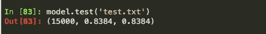

# 用于文本分类的快速文本

> 原文：<https://towardsdatascience.com/fasttext-for-text-classification-a4b38cbff27c?source=collection_archive---------2----------------------->

## 我探索了一种用于多类分类的快速文本分类器。

在我的上一篇文章中，我探索了两种不同的 NLP 模型来完成文本分类的任务。虽然我没有计划把它做成一个系列，但我在 NLP 领域偶然发现了一些更新的模型，并决定写下它们。

如果你愿意，可以查看 [**第一篇**](/a-guide-to-word-embeddings-8a23817ab60f) 出来，在这篇文章中，我重点训练了自己的单词嵌入，并将其与预先训练的手套单词嵌入模型进行比较。

我们将使用 fastText 分类器对堆栈溢出问题的质量进行分类。如果你跟随本教程，请从 [**这里**](https://www.kaggle.com/imoore/60k-stack-overflow-questions-with-quality-rate) 下载数据集。

# 什么是 fastText？

fastText 是一个开源库，由脸书人工智能研究实验室开发。它的主要重点是实现文本分类和表示任务的可扩展解决方案，同时快速准确地处理大型数据集。

Marc Sendra Martorell 在 [Unsplash](https://unsplash.com?utm_source=medium&utm_medium=referral) 上拍摄的照片

我强烈推荐阅读脸书自己的 [**博客文章**](https://fasttext.cc/blog/2016/08/18/blog-post.html) 和[**研究论文**](https://arxiv.org/pdf/1607.04606.pdf) 关于 fastText 背后的动机，并了解它是如何实现其开发目的的。

> 根据他们的研究，fastText 在准确性以及训练和测试时间方面都令人印象深刻，超过了以前发布的最先进的模型。

它通过采用两种方法来解决文本的分类和训练单词表示来实现这种计算效率和准确性。

# 1.分级 Softmax

在多类分类问题中，Softmax 函数通常用作激活函数来输出给定输入属于 *k* 类的概率。

当存在大量类别并且数据中存在类别不平衡时，分层 Softmax 被证明是非常有效的。在这里，类被安排在一个树形分布中，而不是一个平面的、类似列表的结构。

分层 softmax 层的构建基于霍夫曼编码树，该编码树使用较短的树来表示更频繁出现的类，而使用较长的树来表示更罕见、更不频繁出现的类。

一个给定的文本属于一个类的概率是通过沿着不同分支的节点的深度优先搜索来探索的。因此，具有低概率的分支*(或者等价地，类)*可以被丢弃掉。

对于存在大量类别的数据，这将导致复杂度的极大降低，从而与传统模型相比显著加快分类过程。

# 2.单词 n-grams

仅使用一个单词包来表示文本忽略了重要的连续信息。对于大型数据集来说，考虑词序最终会导致计算开销很大。

因此，作为一种令人愉快的媒介，fastText 结合了一包 n-grams 表示和单词向量，以保存每个单词附近出现的周围单词的一些信息。

这种表示对于分类应用非常有用，因为几个不同单词串在一起的上下文含义也会导致该段文本所呼应的特定情感。

现在我们已经了解了 fastText 的一些主要特性，让我们来看看如何实现 fastText 和实现分类任务。

# 装置

遵循这些来自博览会的 [**安装和设置说明**](https://fasttext.cc/docs/en/supervised-tutorial.html#installing-fasttext) 。我们将使用 Python 实现这个项目。

# 数据准备

为了训练和评估这个分类器，我们必须以 fastText 期望的格式准备数据。

> fastText 首先期望类别，在每个类别前加上前缀' __label__ '，然后是输入文本，像这样，

> __label__positive 我非常喜欢这家餐厅。很想再去看看。

当然，我们将应用一些 NLP 预处理技术来删除不需要的符号、标点符号并将文本转换为小写。

下面的代码负责将前缀“__label__”添加到 category 列中的每一行。我们将使用 gensim 的***simple _ preprocess***方法来标记我们的问题并移除符号。

# 培训和评估

将数据帧保存为文本文件后，下一步是训练和测试我们的模型。

为了提高我们模型的性能，将 ***字组*** 参数设置为 2。换句话说，该模型是在二元模型上训练的，而不是考虑单个单词。

有两种方法来测试我们的模型，这两种方法略有不同。

***预测*** 方法用于预测给定输入最可能的标签。在上面的代码中，我选择了一个属于类别“HQ”的观察，并针对它测试了模型。正如你在下面看到的，它正确地预测了“HQ”的类别，并且以 95%的概率做到了。

用一个句子来测试模型。

我使用 ***测试*** 方法在整个测试数据集(15000 个样本)上评估我的分类器，得到的精度值为 0.83，召回值为 0.83。

模型在测试集上的性能。

> 精度是分类器在所有标签中预测的正确标签的数量，召回是在真实标签中成功预测的标签的数量。
> 
> - [文本分类 fastText 博客](https://fasttext.cc/docs/en/supervised-tutorial.html#advanced-readers-precision-and-recall)

在我们的例子中，由于我没有指定参数 k 的值，默认情况下，模型将只预测它认为给定输入问题所属的 1 个类。

# 结论

与我以前训练自己的嵌入和使用预训练手套嵌入的模型相比，fastText 表现得更好。

fastText 比在多维单词向量上训练神经网络快得多，在测试集上也取得了良好的性能。

谢谢你过来看这篇文章。请关注本系列中的更多文章，因为我将发布更多的教程并学习更新的模型。

祝您愉快，在我的下一篇文章中再见！