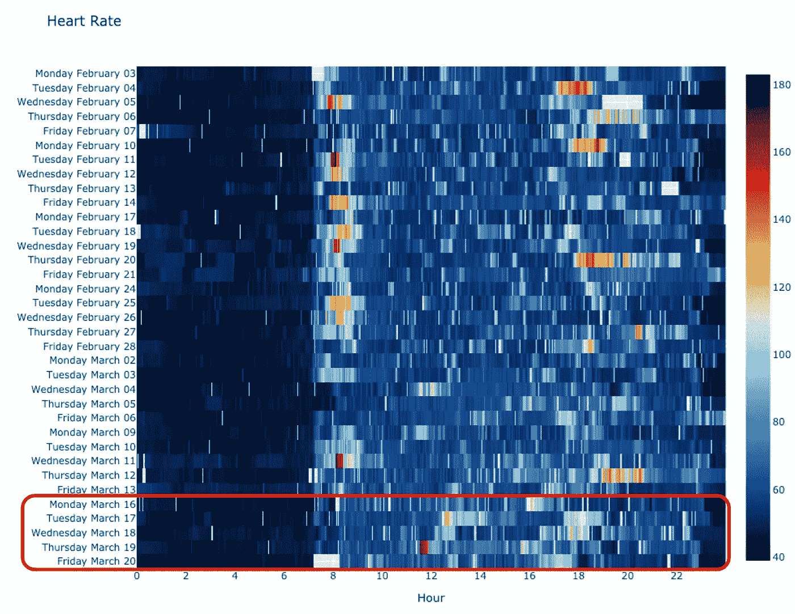
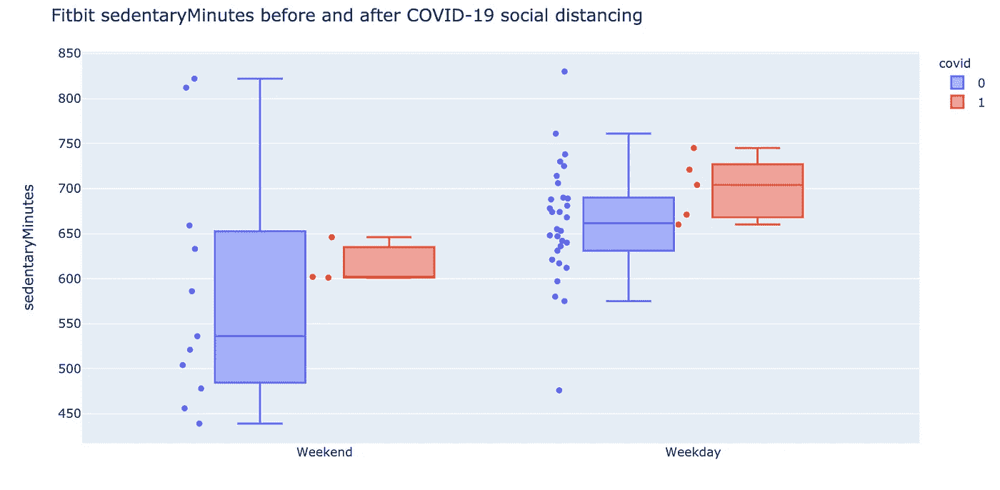
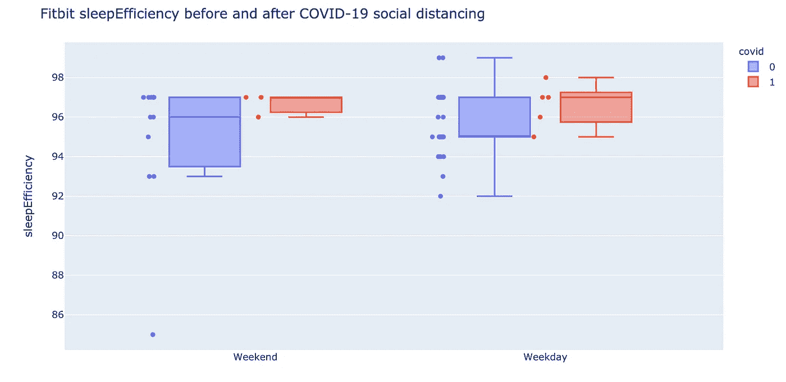
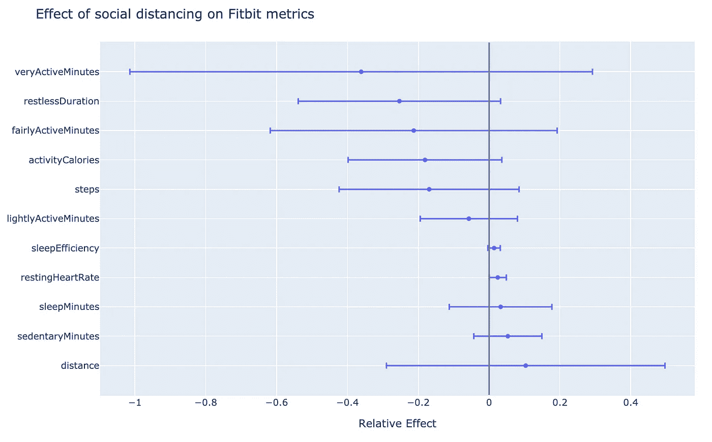

# 使曲线变长

> 原文：<https://towardsdatascience.com/fattening-the-curve-134eebc22b26?source=collection_archive---------42----------------------->

## 透过个人 Fitbit 数据的镜头看社交距离

Fitbit 心率数据——红框显示了我第一周的社交距离

面对前所未有的经济困难和对抗新冠肺炎疫情的社会距离措施，许多纸上谈兵的流行病学家正在分析社会如何“拉平曲线”。我不会在日益增长的喧嚣中加入我的声音，我会在个人旅程中利用我在健康指标和物联网方面的专业知识来评估社交距离行为是否可能“增肥我的曲线”。

## Fitbit 数据

下载您的数据并生成该分析的指令和代码位于[https://github.com/zwrankin/blog/tree/master/fitbit](https://github.com/zwrankin/blog/tree/master/fitbit)。你也可以参考 [Fitbit API 文档](https://dev.fitbit.com/build/reference/web-api/)或者其他关于[下载你的 Fitbit 数据](/collect-your-own-fitbit-data-with-python-ff145fa10873)的媒体文章。我下载了每日活动统计数据(如步数和睡眠时间)以及每分钟的心率数据。

## 日常活动分析

我从 Fitbit API 下载了最近两个月的数据，并认为 3 月 14 日是我社交孤立的开始。首先，我绘制了日常活动指标的分布，区分了工作日和周末的观察结果。下面是久坐时间和睡眠效率的曲线图。

接下来，我使用普通最小二乘线性回归估计了社交距离对各种指标的影响，这是一种适用于有限数据和高度可解释性的方法。由于这不是火箭科学(或疫苗开发)，我在分析中做了一些改动。首先，我没有确保我的数据的正态性(是的，步骤是计数数据，但由于高方差，它们不是泊松分布的)。第二，我很乐意“p-hacking ”,不去纠正多重比较。使用这个等式

*y = β₀ + β₁*weekend +β₂*covid*

我们将 *β₀* 解释为基线工作日度量， *β₂* 解释为 *covid* 社会隔离对度量 *y* 的绝对影响(以 *y* 为单位，如步数)，将 *β₂/β₀* 解释为社会隔离的相对影响(如-0.2 为工作日基线步数减少 20%)。计算相对效果有助于比较不同数量级的指标(如步数和静息心率)。

95%置信区间的相对效应。-0.2 表示因社交距离而减少 20%

鉴于我只有 7 天的社交隔离数据，并且这些指标具有很高的方差，因此许多数据没有达到统计学意义也就不足为奇了。然而，有一个强烈的信号表明，在社交隔离期间，我的身体活动减少了 20%，睡眠指标有所改善(坐立不安减少了 20%，睡眠效率提高了)。前面的分布图有助于说明回归结果。

## 心率模式可视化

最后，我研究了心率时间序列数据，以发现每日汇总统计数据没有捕捉到的活动模式的变化。

Fitbit 工作日心率数据——红框显示了我第一周的社交距离

一些明显的模式是缺乏早上的活动(由于没有早上的自行车通勤和健身课)。此外，很少有长时间的有氧运动——例如，三个周四晚上两个小时的心跳加速来自极限飞盘混战。周末数据(未显示)显示了类似的活动减少模式。

## 结论

尽管标题轻率，但我认为积极主动地解决我们的精神和身体健康问题对于抵御围绕这个疫情的焦虑至关重要。虽然我肯定怀疑我的身体活动减少了，但这种可见性重新激发了我的锻炼动机。我将继续慢跑，并增加对 [Down Dog 应用](https://www.downdogapp.com/)的使用，该应用在新冠肺炎期间免费提供所有优秀的有氧运动、力量和瑜伽课程。我希望将来写关于使用序列分析或神经网络的算法模式识别的文章。