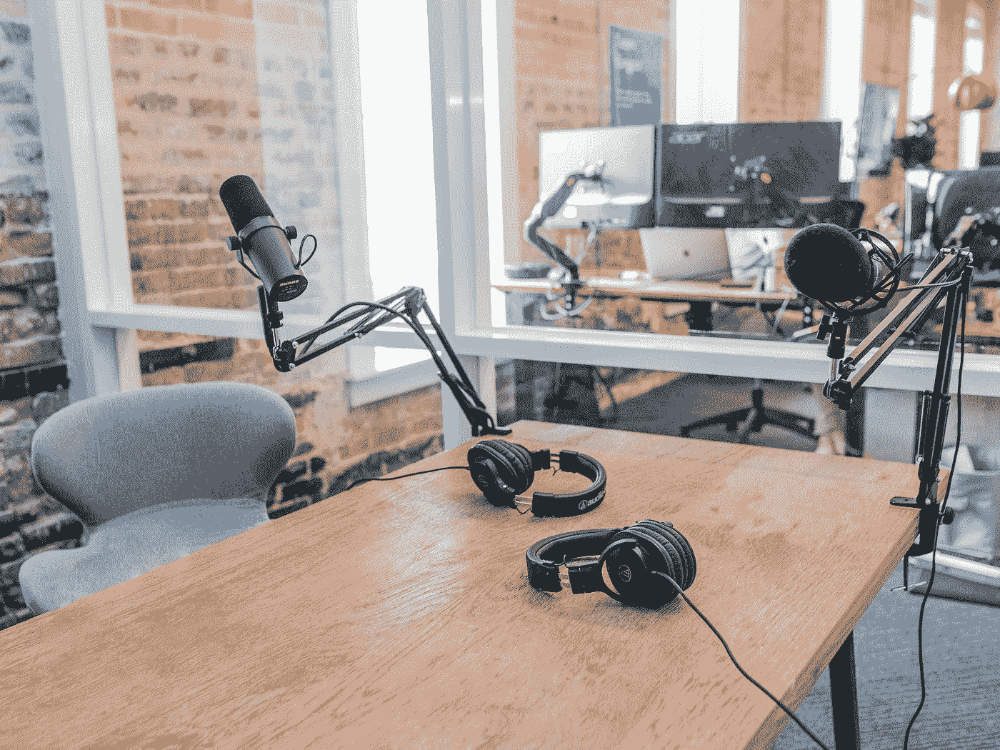

# 想要成为数据科学家的人最喜欢的播客

> 原文：<https://towardsdatascience.com/favorite-podcasts-for-a-wanna-be-data-scientist-1d39dd556af6?source=collection_archive---------55----------------------->

## 一直在学习

## 你应该听的数据科学和非数据科学播客

我每周听大约 30 个小时的播客(我以 1.4 倍的速度听)。播客是我除了孩子之外的头号娱乐来源，也是我工作中日常学习之外的教育来源。在过去的 10 年左右的时间里，我一直在听我的音乐列表(真的有那么久吗)？这是我最喜欢的播客列表。其中许多都是数据科学播客列表中的佼佼者，其他的你可能从未听说过。

在 [Unsplash](https://unsplash.com?utm_source=medium&utm_medium=referral) 上由 [Austin Distel](https://unsplash.com/@austindistel?utm_source=medium&utm_medium=referral) 拍摄的照片

## **数据科学**

[线性题外话](http://lineardigressions.com/)——这个节目由[本·贾菲](https://twitter.com/benjaffe)和[凯蒂·马龙](https://twitter.com/multiarmbandit)主持，本·贾菲是网飞的前端工程师，以前在脸书工作。每集都是 15-30 分钟的讨论，由 Katie 就与数据科学相关的单一主题向 Ben 授课。凯蒂会讲得很深入，但因为她是在向本解释，她通常会用很棒的类比来帮助本和观众理解。如果你想学习数据科学，这是为你准备的播客。

[对抗性学习](https://adversariallearning.com/)——乔尔·格鲁什和安德鲁·穆塞尔曼主持这个有趣的播客。他们的剧集充满了 Joel 和 Andrew(有时会有客人加入)来回讨论与数据科学和生活相关的不同主题。他们从不深入技术层面。如果你喜欢讽刺和幽默，你会发现这两个很搞笑。他们的起源故事很有趣。安德鲁和乔尔是在安德鲁写了一篇批评乔尔的《从零开始的数据科学》初稿的文章时认识的。乔尔认为安德鲁是个混蛋。他们不知不觉地在一次聚会上相遇，并意识到他们长期以来对彼此的仇恨(见讽刺)。

[Data Crunch](https://datacrunchcorp.com/podcast/page/2/) — Data Crunch 是一家营利性公司，培训组织如何有效地使用数据。他们有一个由吉乃特·梅索特和柯蒂斯·塞尔主持的月度播客。吉乃特和柯蒂斯带来了在工业中使用数据科学的客人。他们覆盖了医疗保健、物流、管理、公用事业等多种行业。从大技术之外的角度来看待数据科学令人耳目一新。

[数据怀疑论者](https://dataskeptic.com/)——这是我大约 6 年前开始听的第一批纯数据科学播客之一。我看到 Kyle Polich 在一次会议上发言，他在发言结束时说他有一个关于数据科学的播客。不久后我开始跟踪他。最初几年，凯尔向妻子解释各种统计、数学和机器学习主题。最近这种情况越来越少了。现在，他要么自己解释一个概念，进行采访，要么与两位共同主持人 Lan 和 George 一起评论一些期刊文章。

[不那么标准差](http://nssdeviations.com/)——如果你对围绕数据科学、统计学、R 编程和咖啡的*八卦*感兴趣，这个播客是为你准备的。Stitch Fix 的希拉里·帕克和约翰·霍普斯金彭博公共卫生学院的罗杰·彭关系非常融洽。当他们谈论 R 的政治，思考什么是数据分析，讨论 R 包，比较数据科学和设计时，他们的友谊被展示出来。

实用人工智能(Practical AI)——本榜单另一播客 Changelog 的分支，实用人工智能(Practical AI)带领嘉宾深入探讨人工智能在工业中的应用。从芯片设计，自然语言处理，军事应用，该节目涵盖了许多角度。共同主持人克里斯·本森和丹尼尔·怀特纳克对所有人工智能都有真正的好奇心。Chris，Lockheed Martin 和 Daniel，SIL International 有深厚的技术背景，但他们的播客方法适用于所有技能水平。

[TWIML AI 播客(之前是本周机器学习&人工智能)](https://twimlai.com/) — Sam Charrington 是该节目的主持人，在聚会、会议和其他教育内容中领导 TWIML 品牌。萨姆采访了广泛的研究人员和行业专家。TWIML 给这个列表带来了更多的前沿研究，并且比这个列表中的其他一些播客更倾向于采访学者。

[走向数据科学](https://towardsdatascience.com/podcast/home) —您知道最受欢迎的数据科学媒体出版物也有播客吗？如果你不知道，你现在知道了。该播客由 SharpestMinds 的联合创始人 Jeremie Harris 主持，讨论了许多关于数据科学入门的话题。Jeremie 和其他嘉宾一起探讨了什么是数据科学，如何找到一份数据科学家的工作，以及人们如何在工业中使用数据科学。Jeremie 对这些话题如此投入是有道理的，因为他的公司 sharpes minds 是一个导师项目，其模式是基于学员获得一份工作，sharpes minds 从第一年的工资中提成。

## **编程/数据工程**

[数据工程播客](https://www.dataengineeringpodcast.com/)——托拜厄斯·小萌每周带他的听众体验不同的数据工程技术。他带来了来自不同开源和专有技术的专家，并允许他们解释他们的产品。来宾展示用例、不同的实现、何时使用以及何时不使用他们的技术。

Google Cloud Podcast——五年来，GCP 播客有过几次不同的主持人，但内容一直保持不变。该播客解释了如何与谷歌开发人员、产品经理和客户最好地利用谷歌云产品(或谷歌云上的开源产品)。这几集相当快，涵盖了从登录、计费、机器学习到游戏开发的所有内容。

[Stack Overflow 播客](https://stackoverflow.blog/podcast/)——另一个播客，从 Stack Overflow 的创始人乔尔·斯波斯基( [Joel on Software](https://www.joelonsoftware.com/) ) &杰夫·阿特伍德([编码恐怖](https://blog.codinghorror.com/))开始就有各种各样的主持人。这个播客确实深深植根于一些运行时间最长的软件开发博客。播客过去是针对堆栈交换网络上发生的不同事情的，但后来专注于编程、构建软件和当前事件。有一点没有变，那就是他们的幽默感。这是我最喜欢的播客之一，因为它让我发笑。

这是我开始听的第一批节目播客之一。超过 400 集，10 年后，Adam Stacoviak 和 Jerod Santo 已经把他们的播客变成了一个网络。他们旗下还有另外 8 个播客(你之前读过《实用人工智能》)。Changelog 深入探讨了与软件开发领导者的对话。他们专门让开源创始人和贡献者来谈论他们的项目和旅程。如果你对项目(或项目背后的人)是如何产生的感兴趣，这是给你的播客。

## **软件行业**

[规模大师](https://mastersofscale.com/)——雷德·霍夫曼(LinkedIn、Paypal、Greylock 投资者)采访标志性公司的创始人和高管。节目一开始采访了硅谷的名人。在最初几集之后，里德扩大了他的嘉宾阵容，包括来自投资公司、音乐家、慈善机构、餐馆和制造业的高管。里德每周都教他的听众如何建立标志性的公司。

OpenView Build — OpenView 是一家专注于技术的标志性风险投资公司。他们的 Build 播客关注于如何*打造*一款人们喜爱的产品。每一季都有一个新的关注点，如定价、产品领先增长或持久打造。这是产品经理和产品营销人员必须要听的。

[生长 TL；博士](https://www.kieranflanagan.io/podcasts/)——本播客关注增长型营销。主持人基兰·弗拉纳根(Kieran Flanagan)和斯科特·图斯利(Scott Tousley)在 Hubspot 长大，向业内一些最优秀的人学习。我发现基兰和斯科特的戏谑娱乐。基兰是一个有趣的爱尔兰人，斯科特是一个在世界各地工作的流浪者。关注增长意味着他们的内容会频繁地进入数据分析领域。

官方 SaaStr 播客——我喜欢杰森·莱姆金。莱姆金是一名风投，前创始人，也是多产的[博主](https://www.saastr.com/author/jasonlkn/) /Quora 海报。他将自己对 SaaStr】的热情转化为一项名为 SaaStr 的业务。SaaStr 发布了大量的内容、课程、播客、博客、视频和会议。该播客由哈里·斯特宾斯主持，莱姆金偶尔也会出现。来自世界各地的科技高管和风投在播客中接受采访，向大众传授如何经营 SaaS 公司的智慧。

Ycombinator —我是 Ycombinator 的粉丝男孩。他们知道如何制造可扩展的业务。这个节目暂停了，因为它现在正处于主持人之间。之前的播客由克雷格·坎农主持。他从创业界引进了各种各样的人。他们讨论创业成功的要素。克雷格已经采取了周期性的分歧路径采访物理学家和其他播客主持人。克雷格在许多场合提到他对乔·罗根的播客的喜爱，我认为这是对他自己的播客《创业 JRE》的一个很好的比较。

创业学校(y combinator)——y combinator 创建了一个名为[创业学校](https://www.startupschool.org/)的新项目，这是一个免费的在线项目，专注于教创始人如何创办公司和发展公司。他们把讲座变成了播客，非常棒。这些讲座的精简版可在 Ycombinator 播客订阅上获得。

## **经济学**

[魔鬼经济学](https://freakonomics.com/archive/)——来自同名畅销书的合著者史蒂芬·都伯纳的播客让我迷上了播客。杜布纳涵盖了经济学，但不知何故，杜布纳和他的团队设法把每个话题都变成了经济学话题。当然，有非常传统的经济话题，如租金控制、小费和赌博，但它们也涉及缩短会议时间、如何改善教育、如何改变你的想法以及为什么有些人比其他人更成功(勇气)等话题。这个节目确实对所有这些话题采取了一种数据方法。作为一名数据专家，你可以学到很多关于如何思考数据的知识。

星球货币——来自 NPR，星球货币是魔鬼经济学简装版。它们涵盖了许多相同类型的主题。《星球货币》的长度只有《魔鬼经济学》播客的一半。如果你的通勤路程很短，这是一个简单、快捷的倾听方法。

## **商业**

[职业工具](https://www.manager-tools.com/all-podcasts?field_content_domain_tid=5)——我不知道 10 多年前我是如何偶然发现职业工具的，但它教会了我比职业生涯中任何事情都要多的职业知识。职业工具是这个列表中的下一项管理工具的姐妹播客。该节目由前高管、现管理顾问迈克尔·奥兹恩(Michael Auzenne)和马克·霍斯特曼(Mark Horstman)创作。他们创造了职业工具，其使命是让每个专业人士都富有成效。他们的剧集包括如何准备年度评估，如何与你的人际网络保持联系，如果你在工作中哭了该怎么办，如何问聪明的问题，等等。他们有一整套关于如何有效采访的播客。如果你想成为一名更好的专业人士，请收听本期播客。

[经理工具](https://www.manager-tools.com/all-podcasts?field_content_domain_tid=4) —如前所述，经理工具和职业工具是姐妹播客。都是由迈克尔·奥赞恩和马克·霍斯特曼创作的。职业工具致力于让每一个专业人员高效工作，而经理工具致力于让每一个经理高效工作。经理工具是一对一的巨大支持者，我肯定他们在每个播客上谈论他们。一对一是他们所谓的三位一体经理工具的一部分，一对一，反馈，辅导和授权。他们至少有一些关于三位一体主题的播客。像职业工具一样，经理工具有数百集，范围广泛，如如何进行面试，项目管理，设定目标，新员工入职，办公室政治，以及如何处理电子邮件。大多数经理都没学过如何管理。如果你想成为一名高效的经理，你需要开始自学。管理工具是很好的第一步。

[在](https://www.cbc.ca/radio/podcasts/arts-culture/under-the-influence/)的影响下——来自 CBC 播客，Terry O'Reilly 探讨了营销对我们生活的影响。奥赖利挖掘了疾病品牌、在线评论、以发明者命名的产品、漫画书、商业模仿等背后最有趣的真实生活故事。奥赖利是一个伟大的故事讲述者，这是一个信息丰富，简单的 20 分钟播客，你可以和全家一起听。

## **其他**

[修正主义历史](http://revisionisthistory.com/) —我不得不把我最喜欢的一个播客列入这个列表，即使它与成为一名数据科学家没有任何关系。著名作家马尔科姆·格拉德威尔用哲学的方法讲述故事。他从每个角色的角度出发，把他的每个故事分解成逻辑部分。为什么白人警察要射杀黑人小孩？马尔科姆擅长播客，擅长讲故事。

# **排名**

也许你没有时间听 20+的播客。使用下面的列表进行优先排序。

## **教我数据科学**

1.  [线性题外话](http://lineardigressions.com/)
2.  [走向数据科学](https://towardsdatascience.com/podcast/home)
3.  [TWIML AI 播客](https://twimlai.com/)
4.  [数据怀疑论者](https://dataskeptic.com/)
5.  [数据工程播客](https://www.dataengineeringpodcast.com/)

## **教我做生意**

1.  [创业学校(Ycombinator)](https://blog.ycombinator.com/startup-school-lectures-are-now-available-as-a-podcast/)
2.  官方 SaaStr 播客
3.  [音阶大师](https://mastersofscale.com/)
4.  [职业工具](https://www.manager-tools.com/all-podcasts?field_content_domain_tid=5)
5.  [生长 TL；博士](https://www.kieranflanagan.io/podcasts/)

## 让我思考

1.  [魔鬼经济学](https://freakonomics.com/archive/)
2.  [修正主义历史](http://revisionisthistory.com/)
3.  [y 合成器](https://blog.ycombinator.com/category/podcast/)

## **轻松聆听**

1.  [星球货币](https://www.npr.org/podcasts/510289/planet-money)
2.  [堆栈溢出播客](https://stackoverflow.blog/podcast/)
3.  [对抗性学习](https://adversariallearning.com/)
4.  [不那么标准差](http://nssdeviations.com/)