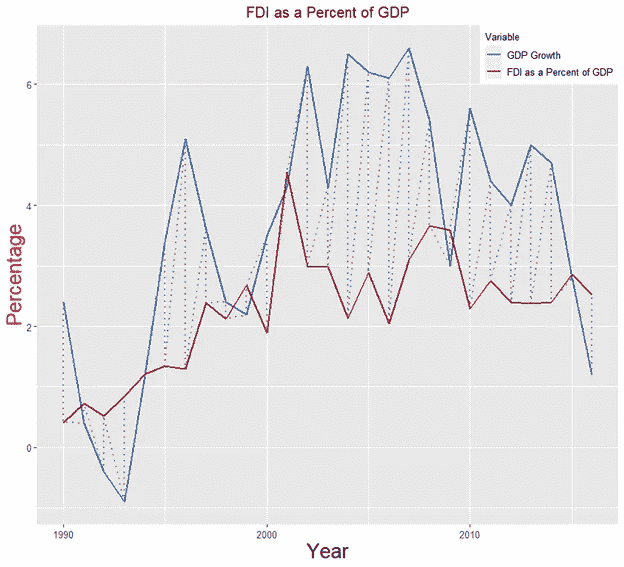

# 非洲的外国直接投资:数据告诉我们什么？

> 原文：<https://towardsdatascience.com/fdi-in-africa-what-does-the-data-tell-us-294ce97097f1?source=collection_archive---------62----------------------->

整个 20 世纪所设想和应用的外国援助，长期以来一直是提高当地人口生活水平的一种手段，并为国内无法提供资金的某些社会领域提供资源。在最好的情况下，外国援助的存在是为了避免排挤当地投资。最好的援助是那些可行性和前景在西方民主国家的智囊团和办公室里被长期研究和模拟的。外国援助在紧急救援、难民危机以及作为提高低收入和中低收入经济体生活质量的临时手段时发挥了重要作用。

为了有效，更重要的是为了可持续，援助就其本质而言，必须作为任何类型问题的短期和临时解决办法而存在；无论是自然灾害还是打击腐败，腐败往往与国民经济密不可分。美国国际开发署是世界上最重要的援助提供者之一，它以自己的名义声明,**是一个促进**国际**发展的机构，其目标是*发展*而不是*援助*。问责制和可核查性是援助运动或倡议中最令人痛苦的荆棘。2013 年，欧盟暂停了对乌干达的财政援助，因为几名部长承认挪用了价值超过 1300 万美元的援助。在有报道称阿富汗政府浪费了数千亿美元的重建资金后，正在进行的重建阿富汗的多国努力面临着毁灭性的批评。**

尽管外援容易被滥用，但不管统计数字继续显示什么，外援将始终在国际发展中发挥作用。当援助活动持续时间越来越长，范围越来越大时，滥用权力和腐败的倾向似乎也随之增长。也许有人会说，援助最好是作为对人道主义危机的反应或受益者经过严格审查的短期项目来设计和实施的。虽然援助有助于人民和社会，但它并没有增强他们的能力，也不是为了增强他们的能力。赋权的形式是提供获得自给自足的工具和手段。自给自足只有在年复一年地发展技能和改进工艺后才能实现。发展技能导致生产手段，生产手段导致工业的产生。

如果没有工业化的生产方式，没有几代人不断改进国际贸易流程，没有一个国家能够从中等收入发展到高收入。当经济体缺乏工业竞争力时，外国直接投资可以催化工业增长。利用世界银行和联合国贸易和发展政策会议的公开数据，我们将看看外国直接投资是如何影响撒哈拉以南非洲国家的。该地区的构成属于世界银行的低收入、中低收入和中高收入类别。

图 1

r Script->[https://github . com/stephenstirling/FDI-in-Africa-Blog-Post-8-/blob/master/GDP % 20 plot % 20WB。R](https://github.com/stephenstirling/FDI-in-Africa-Blog-Post-8-/blob/master/GDP%20Plot%20WB.R)

作为一个整体，撒哈拉以南非洲成员国的国内生产总值在 1990 年至 2016 年间出现波动。然而，在整个非洲大陆，外国直接投资流入占经济的比例一直在稳步上升。尽管如此，与世界其他地区相比，该地区吸引的外国直接投资水平相对较低。从 2010 年到 2016 年，非洲大陆仅吸引了全球外国直接投资的 [1.8%。非洲的外国直接投资似乎存在矛盾。非洲大陆的部分地区自然资源丰富，同时以全球标准衡量，提供了相对廉价的劳动力。非洲的投资回报率也高于世界大多数地区，T4 为 11%，而全球平均回报率为 7.1%。然而，一些瓶颈仍然存在，例如政治不稳定和对人力资本的担忧。](https://www.un.org/africarenewal/web-features/addressing-foreign-direct-investment-paradox-africa)

图 2

r script->[https://github . com/stephenstirling/FDI-in-Africa-Blog-Post-8-/blob/master/Inward % 20 FDI。R](https://github.com/stephenstirling/FDI-in-Africa-Blog-Post-8-/blob/master/Inward%20FDI.R)

然而，图 1 向我们表明，一些国家正在接受外国直接投资，因为它继续占其国内生产总值的较大部分。过去十年，随着中国成为基础设施项目的主要投资者，非洲的外国直接投资有所增加。在 2018 年中非合作论坛上，中国[宣布以 600 亿美元的信贷额度、赠款、无息贷款和投资融资的形式提供新的资金](https://www.brookings.edu/blog/africa-in-focus/2018/09/06/figures-of-the-week-chinese-investment-in-africa/)。新的资本使得货物以公路和铁路的形式更容易流动，增加了工业生产能力，随之而来的是一个新的中产阶级的崛起。

外国投资行为可能会因为是在利他主义精神下构思的而受到称赞，然而，这似乎是既定目标之外的副产品。外国直接投资的决策是精心规划和分析其投资回报率的可行性。当外国劳动力能够以相对较少的初始投资完成与国内劳动力相同的任务时，外国直接投资的前期费用往往变得具有成本效益。在整个 20 世纪，中国在很大程度上充当了世界工厂的角色，这主要是由于其廉价的劳动力和高效的生产方式。随着 20 世纪 80 年代开始大量工业化，中产阶级开始出现。虽然中国的工业转型没有被描述为一场*革命*，但它的转型扩大了其人力资本，并使数百万人摆脱了赤贫。新资本让中国有能力投资海外，过去 20 年，中国外包的一个重要来源是非洲。

外国直接投资最明显的受益者是受投资项目影响最大的行业。图 2 超越了明显的接受者，着眼于微观层面的利益可能与外国投资相关的国家。使用 2018 年的数据，从这 33 个撒哈拉以南国家的总数中出现了三个不同的集群，埃及似乎是一个值得注意的异常值。

蓝色集群代表 2018 年获得外国直接投资最多的国家，以及人均国内生产总值最高的国家。这个组织中的国家人口相对较少，每个成员的人口不到 300 万。虽然不是结论性的，但这三个因素表明，外国投资可能在一定程度上有助于大量民众的财务福祉。当人口较少时，投资项目的长期效应对居民的影响更大。在以商品为基础的经济体中，很大一部分人口可能参与工业领域，受外国直接投资的影响更大。

组成绿色集群的成员国在外国直接投资流入方面优于红色集群，但不一定在人均国内生产总值规模方面。虽然人口在外国直接投资渗透到人口各个部分的方式中起着相当大的作用，但还有许多其他因素在起作用。X 轴和 Y 轴的交叉点附近会出现一个红色的国家子聚类。这组国家的经济对外国投资者的吸引力较低。这可能是由于几个因素，如专制政府，缺乏自然资源，或缺乏投资回报率。

随着非洲政府在某些情况下与腐败、通货膨胀和内战作斗争，那些拥有自然资源和职能政府的政府将开始扩大经济差距。聚集在该图最底部附近的国家可能会继续接受外国实体的援助，但是，在对海外投资者具有吸引力之前，可能需要进行改革或革命。任何有意义的改变都需要来自国内。一旦发生这种情况，它们的外国直接投资规模将大幅上升。虽然外国直接投资不会解决所有问题，但它具有潜力，正如我们所看到的那样，可以催化生产方式并带来经济扩张。