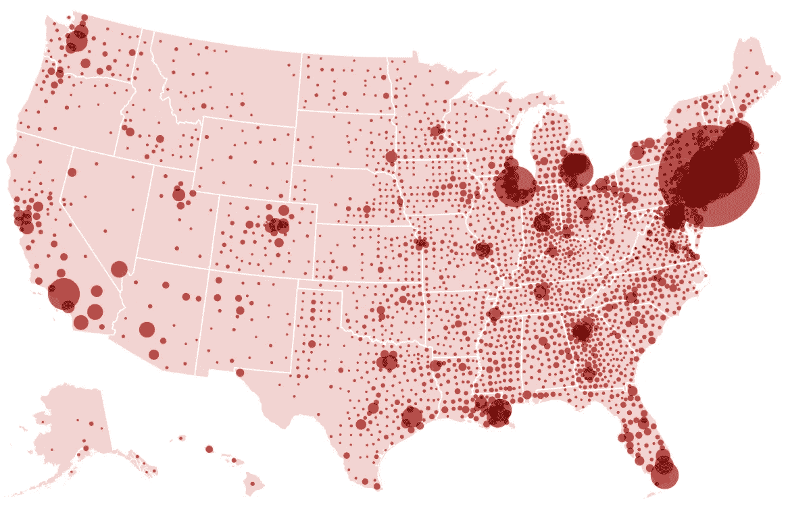
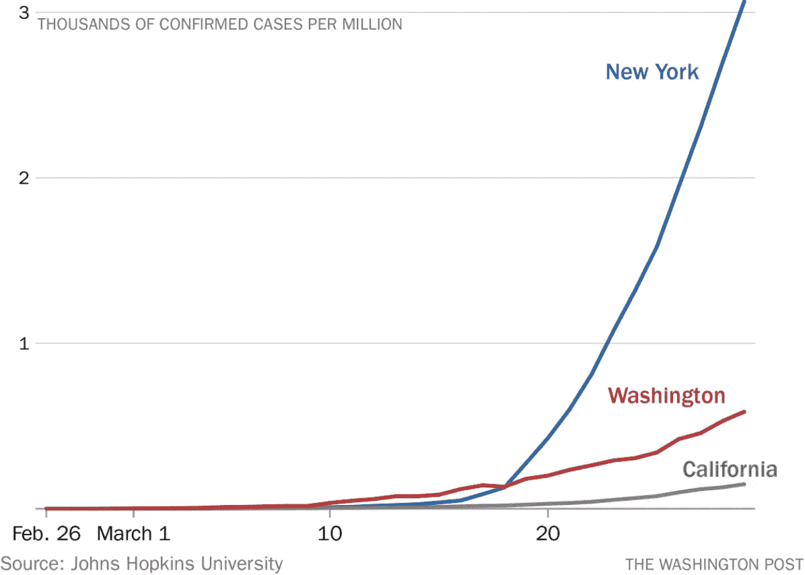
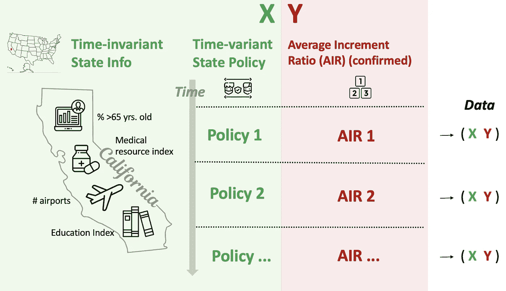
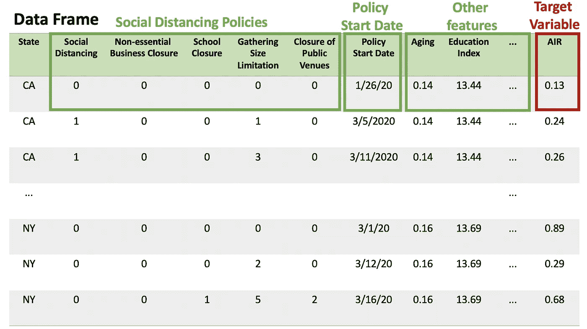

# 新冠肺炎面板数据的特征工程和集成

> 原文：<https://towardsdatascience.com/feature-engineering-and-integration-of-covid-19-panel-data-f97aaabc8017?source=collection_archive---------30----------------------->

## 社会经济因素如何影响新冠肺炎在美国的传播？

随着新冠肺炎席卷全球，我们密切关注着新病例数量的攀升及其对个人、家庭和国家的影响。有大量关于新冠肺炎的信息涌入，并有大量的分析工作来理解这些数据。目前，Kaggle 社区有两个[新冠肺炎竞赛](https://www.kaggle.com/covid19):流行病学数据的预测分析和科学文献中关键问题的 NLP 研究。这两种方法都利用来自单个域的数据。

我认为，要深入了解新冠肺炎的情况，我们还需要研究来自多个领域的数据之间的相互作用。特别是，我想回答以下问题:

> 影响疫情传播的因素很多。他们哪个重要？
> 
> 如何整合不同领域的 COVID19 相关数据？

我们的团队(、 [Mandy Gu](https://www.linkedin.com/in/mandygu/en) 、[、](https://www.linkedin.com/in/shuhan-lu/%7Bcountry%3Dus%2C+language%3Den%7D?trk=people-guest_profile-result-card_result-card_full-click)、 [Iris Wan](https://www.linkedin.com/in/jiaxuewan) )在[新冠肺炎挑战赛](https://gsm.ucdavis.edu/blog/msba-and-mba-students-tackle-pandemic-data-covid-19-challenge)在[加州大学戴维斯分校](https://gsm.ucdavis.edu/msba-masters-science-business-analytics)进行拍摄。我们一起整合了美国的流行病学和社会经济数据，并执行特征工程。然后，我们进行了线性回归，以调查哪些因素对新冠肺炎的传播有影响。

# 背景

我们重点关注美国的情况，因为它是世界上确诊病例最多的国家，而且传播势头没有减弱。到目前为止，新冠肺炎已经横扫了美国所有的州，对纽约州的打击最大。

美国东部时间 4 月 20 日凌晨 2:25 最后更新资料来源:约翰霍普金斯 CSSE *注:CSSE 声称其数据依赖于多个来源的公开数据。

从上面的图像中，我们还观察到疫情在不同州的不同分布。具体来说，让我们放大纽约、华盛顿和加州之间的利差比较。

纽约和加州每百万人中有数千例确诊病例

我们看到病毒在纽约的传播速度大大超过了华盛顿和加利福尼亚。造成这种差异的因素很多。我们首先想到的是社会距离政策，这在中国非常有效。这三种状态有非常不同的实施社会距离的时间表。虽然加州在 3 月初先发制人地推出了社交距离政策，但纽约直到 3 月中旬确诊病例激增时才实行社交距离。除了社会距离，我们还考虑了其他因素，如各州的医疗资源、人口老龄化和旅行活动，这些因素都可能在新冠肺炎在不同州的不同传播中发挥作用。

# 问题定义

我们提出一个框架，将相关因素与新冠肺炎的传播联系起来。

将社会经济因素与新冠肺炎传播联系起来的框架

在我们的分析范围内，我们包括以下因素:社会距离、人口统计、医疗资源、交通和教育。我们使用新冠肺炎确诊病例的每日增量比率来定义疫情的传播。作为概念证明，我们执行线性回归，将因子(X 特征)映射到增量比(Y)。

# 数据源

我们从广泛的来源收集数据。以下是我们使用的州级数据的完整列表:

> 新冠肺炎确诊病例数:[约翰霍普金斯 CSSE 日报](https://github.com/CSSEGISandData/COVID-19/tree/master/csse_covid_19_data/csse_covid_19_daily_reports)
> 
> 社会距离政策指数:[khakie economics](https://github.com/khakieconomics/covid_data)
> 
> 人口老龄化:【census.gov 
> 
> 人口密度:[维基百科](https://simple.wikipedia.org/wiki/List_of_U.S._states_by_population_density)
> 
> 平均医疗主体成本:[数据。医疗保险-链接 2](https://data.cms.gov/mapping-medicare-disparities)
> 
> 手术质量:[数据。医疗保险-链接 1](https://data.medicare.gov/Hospital-Compare/Ambulatory-Surgical-Center-Quality-Measures-State/axe7-s95e/data)
> 
> 机场数量:[环球航空](https://www.globalair.com/airport/state.aspx)
> 
> 教育指数:[USA.com](http://www.usa.com/rank/us--average-education-index--state-rank.htm)

# 特征工程

现在，让我们深入研究一下如何将原始数据转换成 X 和 Y 值。我们首先将我们的 X 特征分成美国不同州内的时不变信息和时变信息。

以加利福尼亚州为例，时间不变要素包括加利福尼亚州 65 岁以上人口比例、人口密度、医疗资源、机场密度和教育指数。

我们如何将原始数据转换成 X 和 Y 值

我们使用给定状态的状态式社会距离政策作为时变特征。重要的是，我们根据给定州的政策来划分时间线。在每个分段的时间间隔中，社交距离政策(例如，禁止聚集、关闭公共场所)保持不变。然后，对于每个时间间隔，我们计算确诊病例的每日增量比率并取平均值，得到平均增量比率(AIR)，我们的 Y 变量。

通过这个过程，我们得到了关于状态信息和策略配置的模型特征，以及我们的模型目标变量 AIR。在开始建模之前，我们先来看看最终的数据框是什么样的:

在我们的数据框架中，我们包括了 14 个拥有社会距离数据的州。这些州包括新冠肺炎影响最大的纽约州、新泽西州、加利福尼亚州和华盛顿州。对于每一行，我们有各州的社会距离政策，这些政策的开始日期，其他州的信息，以及平均增长率。

对于每个策略配置，我们记录其开始日期。CA 的数据可以追溯到 1 月份，并在 3 月 5 日推出了第一个社交距离政策。

请注意，收集大小限制是一个序号变量，范围从 1 到 7。每个级别描述了策略的严格程度。0 表示没有聚集大小限制。1 表示最不严格的限制(禁止大于 1000 的聚集)。7 表示最严格的限制(禁止大于 10 的聚集)。

最后，我们有 AIR(平均增量比率)，它是使用从同一行中的策略开始日期到下一行中的策略结束日期的数据计算的。

# 建模和见解

有了 X 和 Y，我们进行线性回归。我们回归了所有特征的平均增长率。在此过程中，我们还根据变量多重共线性和模型性能进行变量选择。我们移除 VIF(方差膨胀因子)大于 10 的变量，然后逐步向前回归。最终模型报告调整后的 R 平方为 0.26。可变系数图如下:

可变系数图

红色列是具有正系数的要素，因此值越大，空气越高。绿色列是具有负系数的要素，值越高，空气越低。老化有一个正系数，所以它恶化了空气。另一方面，教育指数、学校关闭和集会禁令减少了空气。从统计意义上来说，老龄化、人口密度、教育指数都有 p 值< 0.07 and thus are statistically significant.

Summing up both the coefficient value and p-value of the features, aging and education index have a statistically significant impact on the spread of COVID-19\. Moreover, population aging has the strongest influence.

While we are not surprised by our findings on population aging, since we know for a fact that seniors and people with preconditions are more susceptible to the virus, we are interested in seeing that the education index plays a significant role. It means that areas with better education tend to see a slower spread of the virus. It could be that educated people are more conscientious in following government policies and good practices such as wearing face coverings. In this light, the government, in fighting the pandemic, should also pay attention to areas with lower education index.

# Project Value and Next Steps

As proof of concept, the linear regression model shows that our combined dataset is able to reveal insights about the spread of COVID-19\. Our findings show that, among all considered factors, population aging and education index has a stronger influence on the pandemic spread.

Moving forward, we may also add more state-wise data into the model, using our data processing pipeline. More elaborate machine learning methods, such as PCA and clustering can also be applied to the dataset to gain deeper insights.

Please refer to our [GitHub](https://github.com/tingli-ucd/COVID-19-Analysis) 页面如果有兴趣可以随意接触！