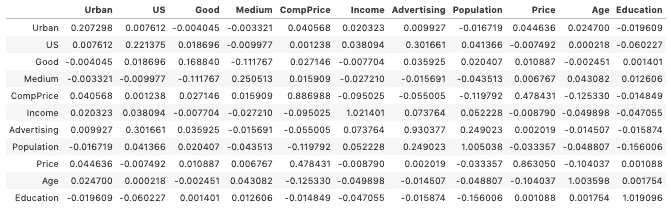
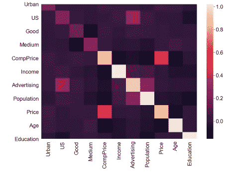
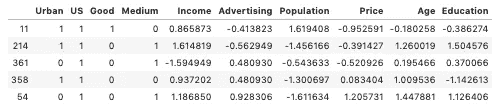

# 特征工程

> 原文：<https://towardsdatascience.com/feature-engineering-combination-polynomial-features-3caa4c77a755?source=collection_archive---------15----------------------->

## 改进线性回归

上周，我发表了一篇博客,详细介绍了线性回归建模过程的所有步骤。在这篇文章中，我们将稍微处理一下数据，以减少我们的模型结果指标。然后我们将走过任何线性回归中最关键的一步:特征工程**。**所有代码都可以在这个[笔记本](https://github.com/andrewcole33/carseat_sales_linreg)里找到。这篇博客从笔记本的“特征工程”标题开始。


马库斯·温克勒在 [Unsplash](https://unsplash.com?utm_source=medium&utm_medium=referral) 上拍摄的照片

**特征工程**是从我们的数据集中提取某些变量(特征)并将其转化为预测模型的过程。本质上，我们将试图操纵单个变量和变量的组合，以便*设计*新功能。通过创建这些新特征，我们增加了一个新变量比原始的、未转换的变量对我们的结果变量具有更大预测能力的可能性。

# 原始模型概述

总的来说，我们的目标是在给定生成的数据的情况下，尝试预测汽车座椅的销售。我们对数据进行预处理，以考虑名义数据和分类数据，对数据进行缩放和标准化，移除异常值，构建模型，并验证我们的线性回归假设。我们的特征是这样的:

*   **销售额(目标):每个地点的单位销售额**
*   CompPrice:在每个地点最接近的竞争对手收取的价格
*   收入:社区收入水平
*   广告:公司在各地的本地广告预算
*   人口:该地区的人口规模(以千计)
*   价格:每个站点汽车座位的收费价格
*   搁置位置:现场搁置位置的质量(好|差|中)
*   年龄:当地人口的平均年龄
*   教育:每个地点的教育水平
*   城市:商店位于城市还是农村
*   美国:无论商店是否在美国

我们采用的方法允许我们拼凑一个性能良好的模型，该模型返回的 r 平方度量为 0.88，均方根误差为 0.96。这两个指标都表明了一个非常强大的模型，但是我们必须记住，这些数据仅仅是出于练习的目的而生成的，并不是真实的数据。这很好，可以省去很多麻烦，但是现实世界的数据很少会在模型的第一次迭代后产生如此强的结果。

# 后退一小步

在我们进入我们的特征工程之前，让我们先来看看我们以前的回归数据。因为我们有如此强大的表现回归，为了这个博客的目的，我们想删除对我们的目标变量影响最大的变量。**协方差**测量两个变量如何相对于彼此变化(scale = [0，1])。如果变量 X 和变量 Y 之间的协方差很高，那就意味着这两个变量之间有很强的相互影响。下面的代码块将向我们展示如何查看模型训练集中所有变量之间的协方差:

```
X_train_prep.cov()
```



这个简单的方法将输出上面的数据帧，这是非常丰富的信息，但也有很多需要消化。我们读取 y 轴上的变量，并在每个 x 轴变量下找到相应的协方差分数。我们试图确定的是哪个变量对其他变量的影响最大，这样我们就可以将它们从模型中移除。**再次重申，我们只是为了特征工程而识别和移除显著变量以降低我们的模型性能。在现实世界的模型中，如果没有领域知识的支持，这绝对是荒谬的。**

我们可以通过在 seaborn 热图中可视化来使协方差输出更容易理解。

```
sns.heatmap(X_train_prep.cov())
```



热图只是通过颜色强度显示了我们的协方差程度。颜色越浅，两个变量的协方差越高(根据地图右侧的比例)。我们看到“CompPrice”对自身和“Price”都有很大的影响。这从本质上讲是有道理的，竞争对手价格的变化会影响原始业务的变化，改变其价格来反映。同样，这也是领域知识如此重要的地方。因为我们在“CompPrice”和“Price”中有两个非常相似的预测变量，并且“CompPrice”不是销售汽车座椅的企业固有的变量，所以我们将删除“CompPrice”以恶化我们的模型。

```
X_train_prep.drop('CompPrice', axis = 1, inplace = True)
lr2 = LinearRegression()
lr2.fit(X_train_prep, y_train)
y_hat_train = lr2.predict(X_train_prep)
r2_score(y_train, y_hat_train)
```

*   r 平方得分= 0.7343

我们看到，简单地移除一个强预测因子会将我们的 R 平方值降低到 0.73，这是一个非常糟糕的值。在现实世界中，在模型的初始迭代之后，这实际上是一个有希望的分数。然而，我们不会满足于此，然后会转向特征工程来尝试和改进我们的模型。

# 特征工程—二元组合

现在，我们已经从数据框架中删除了“CompPrice ”,它看起来像这样(数据已经过缩放和标准化):



在特征工程中，我们希望在多个变量之间创建各种各样的交互，以便创建新的变量。例如，将价格乘以收入，或者按城市特定人群做广告。通过一起操作它们，我们创造了拥有新的和有影响力的特征的机会，这些特征可能潜在地影响我们的目标变量，从而*设计我们的特征*。对于这个论点，我们将使用 *itertools* 库中的“组合”方法创建尽可能多的预测变量的二元组合。

```
from itertools import combinationscolumns_list = X_train_prep.columns
interactions = list(combinations(column_list, 2))
```

现在，我们只需要操作列标题来生成所有可能的组合。我们的结果是我们的特征的 45 个可能的二元组合的列表。


虽然我们有自己的组合，但在回归中单独测试每一个组合将是令人难以置信的乏味和耗时。相反，我们会将每个组合添加到一个字典中，然后在迭代线性回归中将相应的字典项作为参数进行索引:

```
interaction_dict = {}
for interaction in interactions:
   X_train_int = X_train_prep
   X_train_int['int'] = X_train_int[interaction[0]] * X_train_int[interaction[1]]
   lr3 = LinearRegression()
   lr3.fit(X_train_int, y_train)
   interaction_dict[lr3.score(X_train_int, y_train)] = interaction
```

在上面的代码块中，我们将 X_train 设置为一个新的副本变量，通过将两个特征相乘来建立一个新的特征*‘int’*，然后使用包含新组合特征的新数据帧作为我们新的 LinearRegression 的唯一参数(因此排除了已经在我们的数据帧中的原始特征)。

由于迭代，我们现在实际上已经完成了所有新的回归，但是我们看不到它们，因为它们都存储在“interaction_dict”中。让我们对字典进行排序，以返回五个表现最好的(r 平方得分)组合。

```
top_5 = sorted(interaction_dict.keys(), reverse = True)[:5]
for interaction in top_5:
   print(interaction_dict[interaction])
```

我们表现最佳的组合是:

*   广告 x 教育
*   广告 x 美国
*   美国 x 广告公司
*   价格 x 年龄
*   好 x 时代

在这一点上，领域知识把它踢到了一个更高的档位。这里返回的变量应该开始在你的大脑中移动一些曲柄和齿轮，为什么某些变量更有影响力。发挥创造力吧，毕竟我们是工程师。为了这个博客，假设我们的领域知识已经假设任何分类变量都是不相关的，因为位置并不重要。我们将只关注“广告 x 教育”和“价格 x 年龄”。让我们运行一个新的回归，包括**和**这些组合。首先，我们将特征添加到包含单变量数据的原始数据帧中。

```
X_train_int = X_train_prep
X_train_int['ad_ed'] = X_train_int['Advertising'] * X_train_int['Age']
```


注意最右边的两个特征

现在，我们用数据框中的新特性运行另一次回归。

```
lr4 = LinearRegression()
lr4.fit(X_train_int, y_train)
lr4.score(X_train_int, y_train)
```

*   r 平方得分= .74

我们可以看到，我们的线性回归得分从 0.73 增加到 0.74。这显然是一个很小的增加，也不是非常显著，但尽管如此，我们可以看到创建新的双变量特征项如何在改进我们的模型中发挥重要作用。

# 特征工程—多项式

同样，没有明确的准则来测试所有可能的变量操作。我们刚刚看到了如何使两个变量相互作用，但是我们可以设计新功能的另一种方法是什么？多项式！对于新特性，一个非常强有力的(通常)选择是增加单个变量的能力。出于我们的目的，我们将尝试看看是否所有现有的变量，包括我们的双变量组合，都可以通过增加功效来改善我们的回归。

为此，我们将使用 sklearn.preprocessing 库中的“PolynomialFeatures”对象。我们创建一个新的空字典来存储我们的新功能可能性(与双变量相同)。然后，我们将遍历我们的 *X_train_int* 特征集，并为每个相应的特征创建一个新的特征，通过五次方进行平方。然后，我们将对每个新的单个特征进行线性回归拟合，并选择性能最佳的特征用于最终回归。

```
from sklearn.preprocessing import PolynomialFeaturespoly_dict = {}
for feature in X_train_int.columns:
   for p in range(2, 5):
      X_train_poly = X_train_int
      X_train_poly['sq'] = X_train_poly[feature] ** p
      lr = LinearRegression()
      lr.fit(X_train_poly, y_train)
      poly_dict[lr.score(X_train_poly, y_train) = [feature, p]poly_dict[max(poly_dict.keys())]
```

*   r 平方得分= 0.743

再一次，我们看到我们的 R 平方指标有微小但仍为正值的增长。有许多方法可以设计新的可能性并改进您的回归，但是这些对于任何新的数据科学家来说都是一个很好的起点！