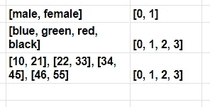

# 特征工程——深入研究编码和宁滨技术

> 原文：<https://towardsdatascience.com/feature-engineering-deep-dive-into-encoding-and-binning-techniques-5618d55a6b38?source=collection_archive---------7----------------------->

## 特征编码和特征宁滨技术的说明


作者图片

F特征工程是数据科学模型开发最重要的方面。原始数据集中有多种类别的要素。特征可以是文本、日期/时间、分类和连续变量。对于机器学习模型，数据集需要以数字向量的形式进行处理，以使用 ML 算法对其进行训练。

这篇文章的目的是演示特征工程技术，将分类特征转换成连续特征，反之亦然。

*   **功能宁滨:**连续变量到分类变量的转换。
*   **特征编码:**分类变量到数字特征的转换。

# 特色宁滨:

**宁滨或离散化**用于将连续或数值变量转换成分类特征。连续变量的宁滨引入了非线性，并倾向于改善模型的性能。它还可用于识别缺失值或异常值。

宁滨有两种类型:

*   **无监督宁滨:**等宽宁滨，等频宁滨
*   **监督宁滨:**基于熵的宁滨

## 无人监管的宁滨:

无监督宁滨是一种宁滨，它将数值或连续变量转换成分类箱**，而不考虑目标类别标签**。无监督宁滨分为两类:

## 1.等宽宁滨:

该算法将连续变量分成几个类别，这些类别具有**相同宽度**的仓或范围。


```
Notations,
x = number of categories
w = width of a category
max, min = Maximum and Minimun of the list
```


(作者图片)，使用等宽宁滨算法对连续特征“年龄”进行分类

## 2.等频宁滨:

该算法将数据分成具有大致相同数量的值的不同类别。数据的值被平均分配到形成的类别中。


```
Notations,
x = number of categories
freq = frequency of a category
n = number of values in data
```


(图片由作者提供)，使用等频宁滨算法对连续特征“年龄”进行分类

(作者代码)，实现等宽宁滨，等频宁滨


(图片由作者提供)，等宽等频宁滨条形图

## 监督宁滨:

监督宁滨是一种宁滨，它将数值或连续变量转换为分类变量，同时考虑目标类别标注。选择离散化切割点时，它指的是目标类标签。基于熵的宁滨是一种监督宁滨。

## 1.基于熵的宁滨；

基于熵的宁滨算法对连续或数值变量进行分类，一个容器或类别中的大多数值属于同一类标签。它计算目标类别标签的熵，并基于最大信息增益对分裂进行分类。

[](https://github.com/paulbrodersen/entropy_based_binning) [## 保罗·布罗德森/基于熵的宁滨

### 这个模块实现了穷举搜索一个序列的最高熵宁滨的功能

github.com](https://github.com/paulbrodersen/entropy_based_binning) 

# 特征编码:

**特征编码**用于将分类特征转换成数字变量。大多数 ML 算法不能处理分类变量，因此进行特征编码是很重要的。有许多用于特征工程的编码技术:

## 1.标签编码:

**标签编码**是一种编码技术，通过给每个类别分配一个数值，将类别变量转换成数值变量。**标签编码可用于序数变量**。



(图片由作者提供)，标签编码

## 2.序数编码:

顺序编码是一种编码技术，通过**将原始分类变量转换为数字变量，确保变量的顺序性质得以保持。**


(图片由作者提供)，序数编码

## 3.频率编码:

频率编码是一种通过考虑数据的频率分布将原始分类变量转换为数值变量的编码技术。这对于名义特征很有用。


(图片由作者提供)，频率编码

## 4.二进制编码:

二进制编码是一种编码技术，通过将类别编码为整数，然后转换为二进制代码，将原始分类变量转换为数字变量。对于具有大量类别的变量，这种方法更可取。

对于 100 个类别变量，标签编码创建 100 个标签，每个标签对应一个类别，而二进制编码仅创建 7 个类别。


(图片由作者提供)，二进制编码

## 5.一个热门编码:

一种热门的编码技术是将每个类别分成一列。它为一个类别创建 k 个不同的列，并用 1 替换一列，其余的列为 0。


(图片由作者提供)，一个热编码

## 6.目标均值编码:

**均值编码**是将分类变量转换为数值变量的最佳技术之一，因为它考虑了目标类别标签。基本思想是用相应目标变量的平均值代替分类变量。

这里需要编码的分类变量是自变量(IV ),目标类别标签是因变量(DV)。

**均值编码步骤:**

*   选择一个类别
*   按类别分组并获得总和(= a)
*   按类别分组并获得合计总数(= b)
*   该类别的数值= a/b


(图片由作者提供)，目标意味着编码

## 实施:

(作者代码)，编码器的 Python 实现

# 结论:

特征工程是一个循环过程，没有人能断定这种特征工程技术是最好的。在数据处理过程中，没有选择特定特征工程(编码或宁滨技术)的经验法则。因此，一个人需要尝试根据业务需求专注于特性工程，对每个过程进行多次尝试，并从中挑选出最好的。

> 感谢您的阅读