# 特征工程和特征选择

> 原文：<https://towardsdatascience.com/feature-engineering-feature-selection-8c1d57af18d2?source=collection_archive---------18----------------------->

## 📈Python for finance 系列

## 如何将现代机器学习应用于体积扩散分析(VSA)


[农旺](https://unsplash.com/@californong?utm_source=unsplash&utm_medium=referral&utm_content=creditCopyText)在 [Unsplash](https://unsplash.com/?utm_source=unsplash&utm_medium=referral&utm_content=creditCopyText) 上的照片

**警告** : *这里没有神奇的公式或圣杯，尽管一个新的世界可能会为你打开大门。*

## 📈Python For Finance 系列

1.  [识别异常值](https://medium.com/python-in-plain-english/identifying-outliers-part-one-c0a31d9faefa)
2.  [识别异常值—第二部分](https://medium.com/better-programming/identifying-outliers-part-two-4c00b2523362)
3.  [识别异常值—第三部分](https://medium.com/swlh/identifying-outliers-part-three-257b09f5940b)
4.  [程式化的事实](/data-whispering-eebb77a422da)
5.  [特征工程&特征选择](https://medium.com/@kegui/feature-engineering-feature-selection-8c1d57af18d2)
6.  [数据转换](/data-transformation-e7b3b4268151)
7.  [细微差别特征](https://medium.com/swlh/fractionally-differentiated-features-9c1947ed2b55)
8.  [数据标签](/the-triple-barrier-method-251268419dcd)
9.  [元标签和堆叠](/meta-labeling-and-stacking-f17a7f9804ec)

在这些系列的前几篇文章的基础上，这一次我们将探索金融市场中真正的技术分析。很长一段时间里，我一直着迷于 TA 的内在逻辑，叫做量差分析(VSA)。我没有发现任何关于在这个时候应用现代机器学习来证明持久技术的文章。在这里，我试图抛出一条小鱼去抓一条鲸鱼。如果我能在这个领域引起一些注意，我在这篇文章上花费的时间是值得的。

特别是，在我读了大卫·h·韦斯的《即将发生的交易》之后，他在书中描述道:

> “你应该能够倾听任何市场对自身的看法，而不是分析一系列指标或算法。”

密切倾听市场，正如下面这句话所说的，正如我们不可能预测未来一样，我们也很难忽视即将发生的事情。关键是捕捉即将发生的事情，并跟随潮流。

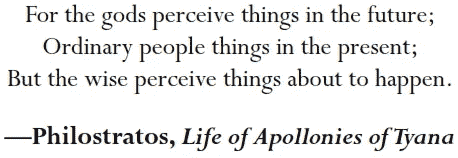

但是如何看待即将发生的事情，理查德·威科夫很久以前发表的一篇声明给出了一些线索:

> “成功的读磁带[读图表]是对力的研究。它需要判断哪一方有最大的吸引力的能力，一个人必须有勇气去支持那一方。就像在企业或个人的生活中一样，每一次摇摆都会出现临界点。在这些关键时刻，似乎任何一边羽毛的重量都会决定当前的趋势。任何一个能发现这些点的人都会赢得很多，失去很少。”

但是如何解释市场行为呢？理查德·威科夫[对市场力量的一个雄辩的描述很有启发性:](https://en.wikipedia.org/wiki/Richard_Wyckoff)

> “市场就像一个缓慢旋转的轮子:轮子是会继续朝同一个方向旋转，静止不动还是倒转，完全取决于与它的轮毂和踏板接触的力量。即使当接触被打破，没有什么影响它的过程，车轮保留一定的冲力来自最近的主导力量，并旋转，直到它停下来或受到其他影响。”

David H. Weis 给出了一个极好的例子，说明了如何解读棒线，并将其与市场行为联系起来。通过他对一个假设的酒吧行为的构建，每一个酒吧都变得活跃起来，争相向你讲述他们的故事。

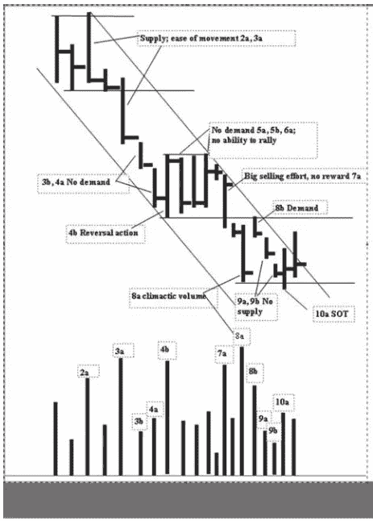

假设的行为

有关分析的所有细节，请参考大卫的书。

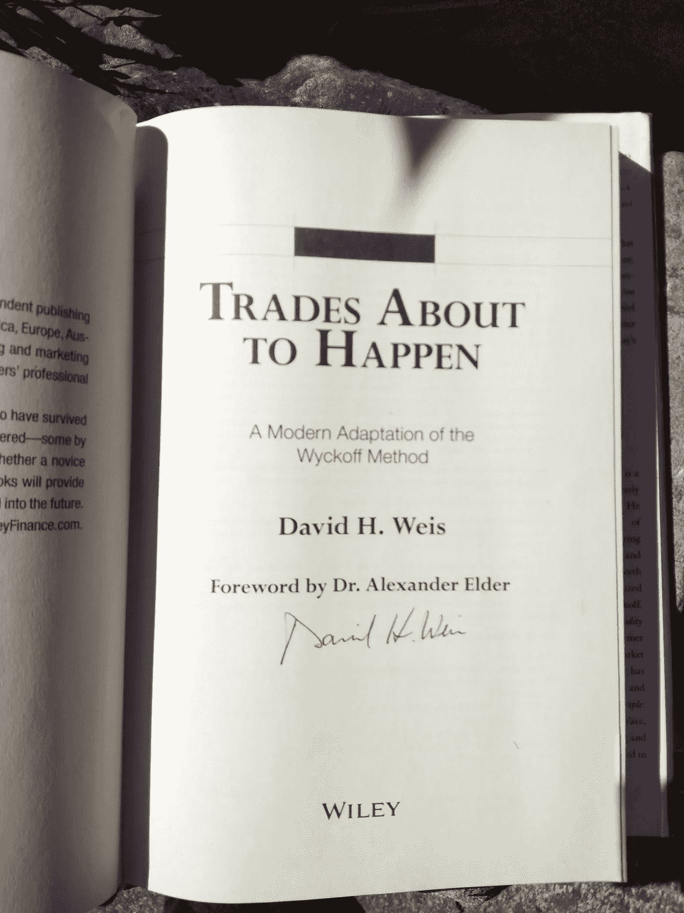

在这本书正式发行之前购买了它，并得到了大卫的签名。

在我们深入研究代码之前，最好给出一些关于体积扩散分析(VSA)的背景知识。VSA 是通过跟踪专业交易者，即所谓的做市商，研究量价关系来预测市场走向。对市场行为的所有解释都遵循 3 条基本法则:

*   供求法则
*   努力与结果的法则
*   因果定律

在 VSA 的发展史上，还有三位大名鼎鼎的人物。

*   杰西·利弗莫尔
*   理查德·威科夫
*   汤姆·威廉姆斯

大量的学习资料可以在网上找到。对于初学者，我推荐以下两本书。

1.  [掌握市场](https://www.amazon.com/Master-Markets-Tom-Williams/dp/B001GF0LAM)汤姆·威廉姆斯著
2.  即将发生的交易

另外，如果你只想快速浏览一下这个话题，这里有一篇来自[的关于 VSA 的好文章](https://school.stockcharts.com/doku.php?id=market_analysis:the_wyckoff_method)。

机器学习/深度学习的一大优势在于不需要特征工程。VSA 的基本如其名所言，成交量、价差的幅度、位置的变化与股价的变化密切相关。

这些特征可以定义为:

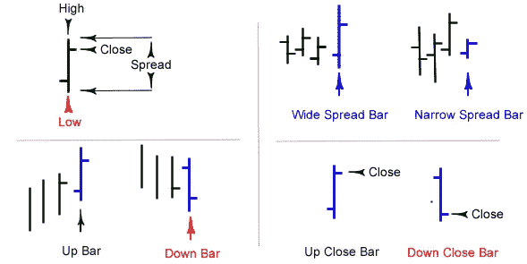

酒吧的定义

*   音量:非常直接
*   范围/价差:最高价和收盘价之间的差异
*   收盘价相对于区间:收盘价是接近价格柱的顶部还是底部？
*   股票价格的变化:非常直接

网上有很多关于 VSA 的资料。我发现这 7 个现场交易系列视频相当不错。

还有这个。

更多内容可以在 YouTube 上找到。

理查德·威科夫创造了许多“T4”术语，如“力量的象征”(SOS)、“软弱的象征”(SOW)等..然而，这些术语中的大多数纯粹是这 4 个基本特征的组合。我不认为，在深度学习的情况下，过度设计功能是一件明智的事情。考虑到深度学习的优势之一是它完全自动化了机器学习工作流程中过去最关键的步骤:特征工程。我们需要做的事情是告诉算法看哪里，而不是一步一步地照看他们。事不宜迟，让我们深入研究代码。

# 1.数据准备

为了一致性，在所有的[📈Python for finance 系列](https://medium.com/swlh/identifying-outliers-part-three-257b09f5940b)，我会尽量重用相同的数据。关于数据准备的更多细节可以在[这里](https://medium.com/python-in-plain-english/identifying-outliers-part-one-c0a31d9faefa)，在[这里](https://medium.com/@kegui/identifying-outliers-part-two-4c00b2523362)和[这里](https://medium.com/swlh/identifying-outliers-part-three-257b09f5940b)找到。

```
*#import all the libraries*
import pandas as pd
import numpy as np
import seaborn as sns 
import yfinance as yf  *#the stock data from Yahoo Finance*import matplotlib.pyplot as plt #set the parameters for plotting
plt.style.use('seaborn')
plt.rcParams['figure.dpi'] = 300#define a function to get data
def get_data(symbols, begin_date=None,end_date=None):
    df = yf.download('AAPL', start = '2000-01-01',
                     auto_adjust=True,#only download adjusted data
                     end= '2010-12-31') 
    #my convention: always lowercase
    df.columns = ['open','high','low',
                  'close','volume'] 

    return df
prices = get_data('AAPL', '2000-01-01', '2010-12-31')   
prices.head()
```

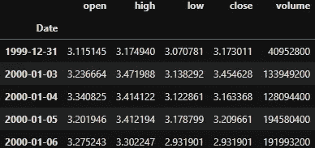

## ✍Tip！

*我们这次下载的数据是通过设置* `*auto_adjust=True*` *调整* `*yfinance*` *的数据。如果你能得到分笔成交点的数据，尽一切办法。如果有马科斯·普拉多*的 [金融机器学习进展](https://www.amazon.com/Advances-Financial-Machine-Learning-Marcos/dp/1119482089) *中阐述的分笔成交点数据就更好了。反正 10 年调整后的数据只给出 2766 个条目，离“大数据”还差得远。*

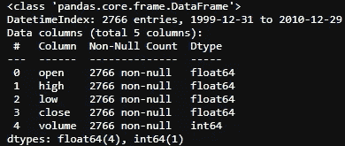

# 2.特征工程

将 VSA 与现代数据科学相结合的关键是，通过阅读和解释棒线自身的行为，人们(希望是算法)可以构建一个市场行为的故事。这个故事可能不容易被人类理解，但却以一种复杂的方式运作。

成交量结合价格区间和收盘位置很容易用代码来表示。

*   音量:非常直接
*   范围/价差:最高价和收盘价之间的差异

```
def price_spread(df):
    return (df.high - df.low)
```

*   收盘价相对于区间:收盘价是接近价格柱的顶部还是底部？

```
def close_location(df):
    return (df.high - df.close) / (df.high - df.low)#o indicates the close is the high of the day, and 1 means close
#is the low of the day and the smaller the value, the closer the #close price to the high.
```

*   股票价格的变化:非常直接

现在到了棘手的部分，

> "从更大的角度来看，一些价格条有了新的含义."

这意味着要看到完整的图片，我们需要在不同的时间尺度下观察这 4 个基本特征。

要做到这一点，我们需要在不同的时间跨度重建一个高(H)，低(L)，收盘(C)和体积(V)酒吧。

```
def create_HLCV(i): 
'''
#i: days
#as we don't care about open that much, that leaves volume, 
#high,low and close
'''     df = pd.DataFrame(index=prices.index) df[f'high_{i}D'] = prices.high.rolling(i).max()
    df[f'low_{i}D'] = prices.low.rolling(i).min()
    df[f'close_{i}D'] = prices.close.rolling(i).\
                        apply(lambda x:x[-1]) 
    # close_2D = close as rolling backwards means today is 
    #literally, the last day of the rolling window.
    df[f'volume_{i}D'] = prices.volume.rolling(i).sum()

    return df
```

下一步，根据不同的时间尺度创建这 4 个基本特征。

```
def create_features(i):
    df = create_HLCV(i)
    high = df[f'high_{i}D']
    low = df[f'low_{i}D']
    close = df[f'close_{i}D']
    volume = df[f'volume_{i}D']

    features = pd.DataFrame(index=prices.index)
    features[f'volume_{i}D'] = volume
    features[f'price_spread_{i}D'] = high - low
    features[f'close_loc_{i}D'] = (high - close) / (high - low)
    features[f'close_change_{i}D'] = close.diff()

    return features
```

我想探索的时间跨度是 1、2、3 天和 1 周、1 个月、2 个月、3 个月，大致是[1、2、3、5、20、40、60]天。现在，我们可以创造一大堆功能，

```
def create_bunch_of_features():
    days = [1,2,3,5,20,40,60]
    bunch_of_features = pd.DataFrame(index=prices.index)
    for day in days:
        f = create_features(day)
        bunch_of_features = bunch_of_features.join(f)

    return bunch_of_featuresbunch_of_features = create_bunch_of_features()
bunch_of_features.info()
```

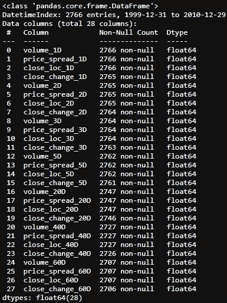

为了让事情容易理解，我们的目标结果将只是第二天的回报。

```
# next day's returns as outcomes
outcomes = pd.DataFrame(index=prices.index)
outcomes['close_1'] = prices.close.pct_change(-1)
```

# 3.特征选择

让我们来看看这些特征是如何与结果，即第二天的回报相关联的。

```
corr = bunch_of_features.corrwith(outcomes.close_1)
corr.sort_values(ascending=False).plot.barh(title = 'Strength of Correlation');
```

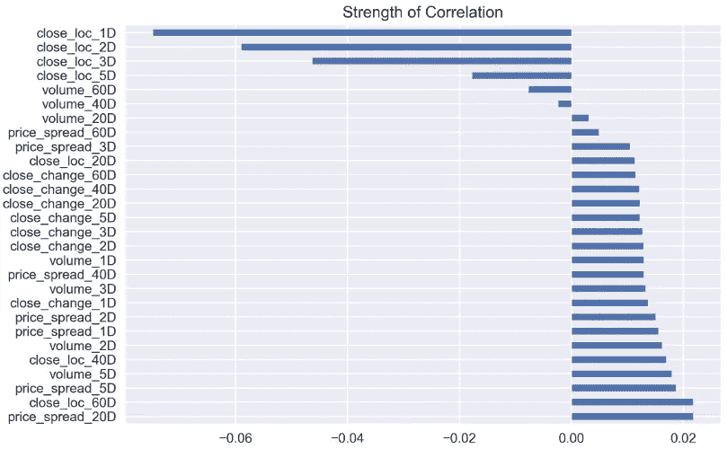

很难说有什么关联，因为所有的数字都远低于 0.8。

```
corr.sort_values(ascending=False)
```

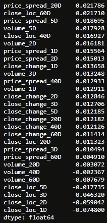

接下来，让我们看看这些特性是如何相互关联的。

```
corr_matrix = bunch_of_features.corr()
```

我没有制作热图，而是尝试使用 Seaborn 的 Clustermap 按行或列进行聚类，看看是否有任何模式出现。Seaborn 的 Clustermap 功能非常适合制作简单的热图以及在行和/或列上都有树状图的分层聚类热图。这将重新组织行和列的数据，并显示彼此相邻的类似内容，以便更深入地理解数据。一个很好的关于聚类图的教程可以在[这里](https://blog.tdwi.eu/hierarchical-clustering-in-python/)找到。要获得一个聚类图，实际上只需要一行代码。

```
sns.clustermap(corr_matrix)
```

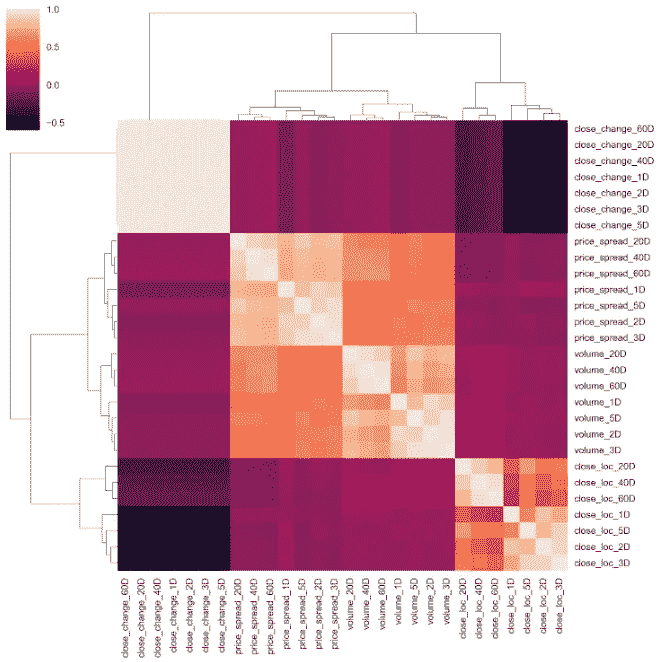

如果你仔细观察图表，可以得出一些结论:

1.  价格差价与交易量密切相关，这一点在图表的中心可以清楚地看到。
2.  和在不同时间跨度上彼此相关的接近的位置，如右下角所示。
3.  从左上角的淡颜色来看，密切的价格变化确实与它本身成对，这非常有意义。然而，它有点随机，因为在不同的时间尺度上没有聚类模式。我希望 2 天的变化应该与 3 天的变化配对。

接近的价格差异的随机性可以归因于股票价格本身的特征。简单的百分比回报可能是一个更好的选择。这可以通过将关闭 `diff()`修改为关闭`pct_change()`来实现。

```
def create_features_v1(i):
    df = create_HLCV(i)
    high = df[f'high_{i}D']
    low = df[f'low_{i}D']
    close = df[f'close_{i}D']
    volume = df[f'volume_{i}D']

    features = pd.DataFrame(index=prices.index)
    features[f'volume_{i}D'] = volume
    features[f'price_spread_{i}D'] = high - low
    features[f'close_loc_{i}D'] = (high - close) / (high - low)
    #only change here
    features[f'close_change_{i}D'] = close.pct_change()

    return features
```

再做一遍。

```
def create_bunch_of_features_v1():
    days = [1,2,3,5,20,40,60]
    bunch_of_features = pd.DataFrame(index=prices.index)
    for day in days:
        f = create_features_v1(day)#here is the only difference
        bunch_of_features = bunch_of_features.join(f)

    return bunch_of_featuresbunch_of_features_v1 = create_bunch_of_features_v1()#check the correlation
corr_v1 = bunch_of_features_v1.corrwith(outcomes.close_1)
corr_v1.sort_values(ascending=False).plot.barh( title = 'Strength of Correlation')
```

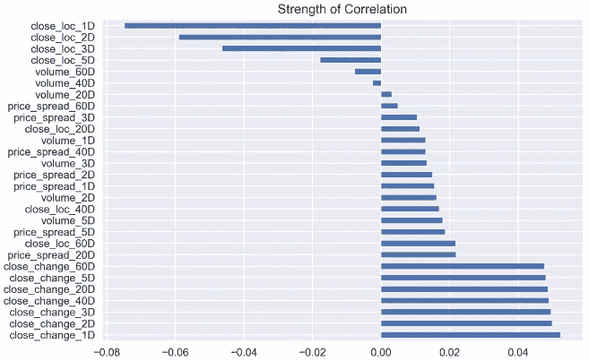

有点不同，但不多！

```
corr_v1.sort_values(ascending=False)
```

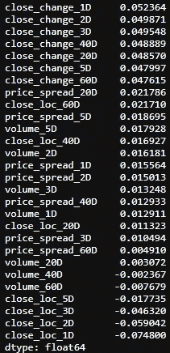

特征之间的相关性会怎样？

```
corr_matrix_v1 = bunch_of_features_v1.corr()
sns.clustermap(corr_matrix_v1, cmap='coolwarm', linewidth=1)
```

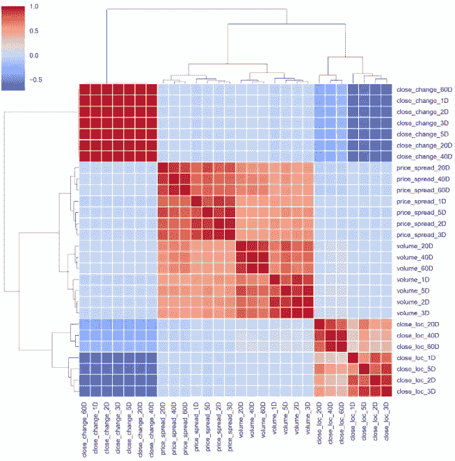

嗯，模式保持不变。让我们将默认方法从“平均”改为“病房”。这两种方法类似，但“ward”更像 K-MEANs 聚类。关于这个话题的很好的教程可以在[这里](https://blog.tdwi.eu/hierarchical-clustering-in-python/)找到。

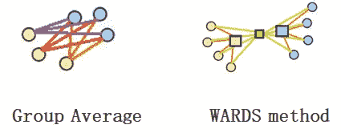

```
sns.clustermap(corr_matrix_v1, cmap='coolwarm', linewidth=1,
                         method='ward')
```

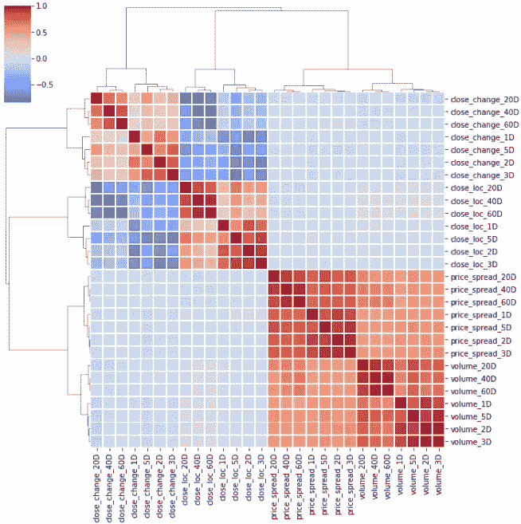

为了选择特性，我们希望挑选那些与目标结果有最强、最持久关系的特性。同时，尽量减少所选要素中的重叠或共线性，以避免噪音和计算机能力的浪费。对于那些在聚类中配对在一起的特征，我只挑选与结果有更强相关性的特征。通过查看聚类图，可以挑选出一些特征。

```
deselected_features_v1 = ['close_loc_3D','close_loc_60D',
                       'volume_3D', 'volume_60D',
                       'price_spread_3D','price_spread_60D',
                       'close_change_3D','close_change_60D']selected_features_v1 = bunch_of_features.drop \
(labels=deselected_features_v1, axis=1)
```

接下来，我们将看一看配对图，一个[配对图](https://seaborn.pydata.org/generated/seaborn.pairplot.html)是一个很好的方法来识别后续分析的趋势，允许我们看到单个变量的分布和多个变量之间的关系。同样，我们需要的只是一行代码。

```
sns.pairplot(selected_features_v1)
```

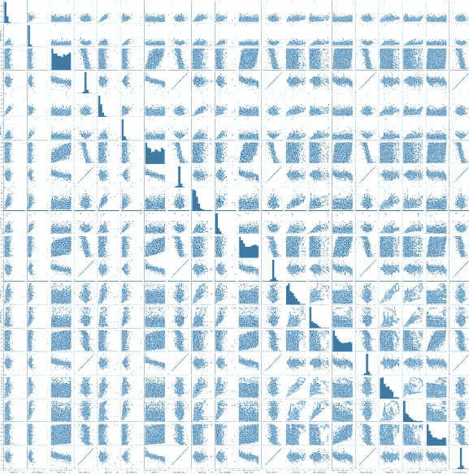

图表铺天盖地，很难看清。我们以一个小群体为例。

```
selected_features_1D_list = ['volume_1D', 'price_spread_1D',\         'close_loc_1D', 'close_change_1D']selected_features_1D = selected_features_v1\
                       [selected_features_1D_list]sns.pairplot(selected_features_1D)
```

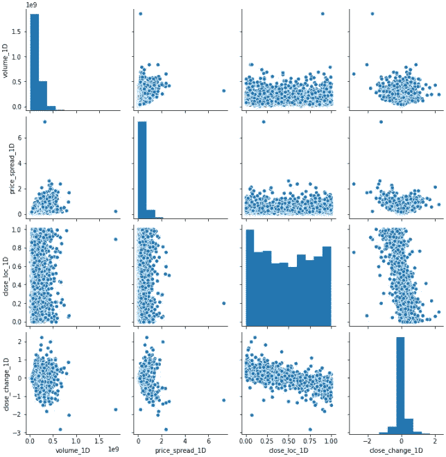

我立即注意到两件事，一是有异常值，另一个是分布不接近正常。

现在让我们来处理离群值。为了一气呵成，我会将结果与特征结合起来，并一起删除异常值。

```
features_outcomes = selected_features_v1.join(outcomes)
features_outcomes.info()
```

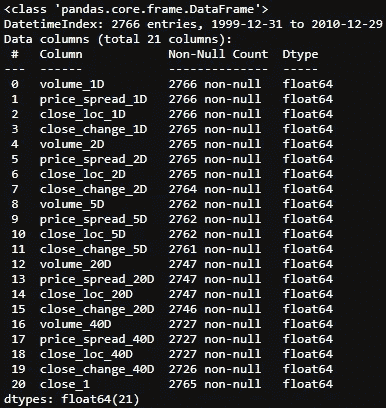

我将使用与这里描述的、这里描述的和这里描述的相同的方法来移除异常值。

```
stats = features_outcomes.describe()
def get_outliers(df, i=4): 
    #i is number of sigma, which define the boundary along mean
    outliers = pd.DataFrame()

    for col in df.columns:
        mu = stats.loc['mean', col]
        sigma = stats.loc['std', col]
        condition = (df[col] > mu + sigma * i) | (df[col] < mu - sigma * i) 
        outliers[f'{col}_outliers'] = df[col][condition]

    return outliersoutliers = get_outliers(features_outcomes, i=1)
outliers.info()
```

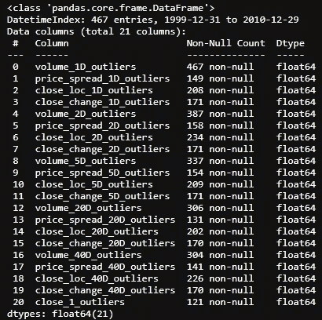

我设置 1 个标准差作为边界，把大部分的离群值挖出来。然后移除所有异常值和 NaN 值。

```
features_outcomes_rmv_outliers = features_outcomes.drop(index = outliers.index).dropna()
features_outcomes_rmv_outliers.info()
```

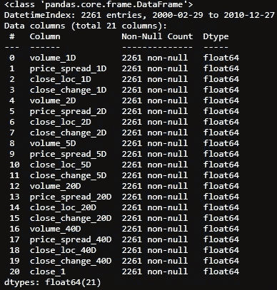

剔除异常值后，我们可以再次绘制配对图。

```
sns.pairplot(features_outcomes_rmv_outliers, vars=selected_features_1D_list);
```

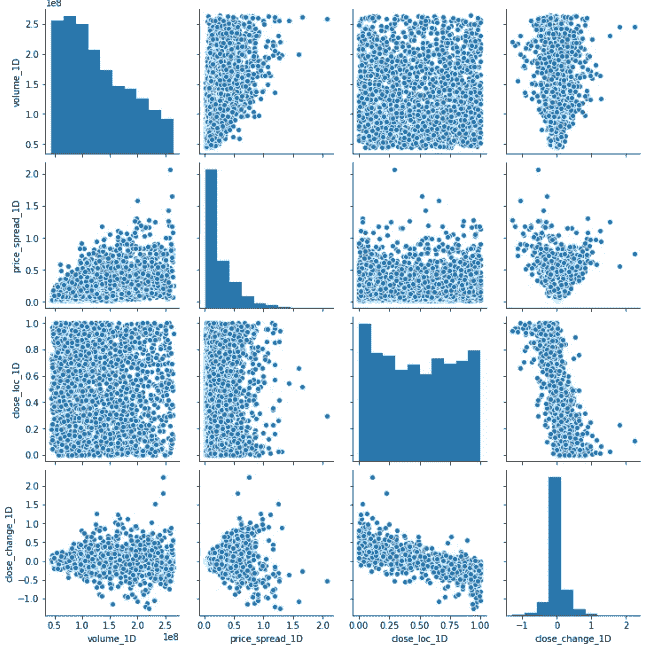

现在，情况看起来好了很多，但几乎无法得出任何有用的结论。这将是很好的，看看哪些景点是向下移动，哪些是向上移动与这些功能相结合。我可以提取股票价格变化的信号，并在图上增加一个额外的维度。

```
features_outcomes_rmv_outliers['sign_of_close'] = features_outcomes_rmv_outliers['close_1'].apply(np.sign)
```

现在，让我们重新绘制`pairplot()`,稍微调整一下，使图形更加漂亮。

```
sns.pairplot(features_outcomes_rmv_outliers, 
             vars=selected_features_1D_list,
             diag_kind='kde',
             palette='husl', hue='sign_of_close',
             markers = ['*', '<', '+'], 
             plot_kws={'alpha':0.3});#transparence:0.3
```

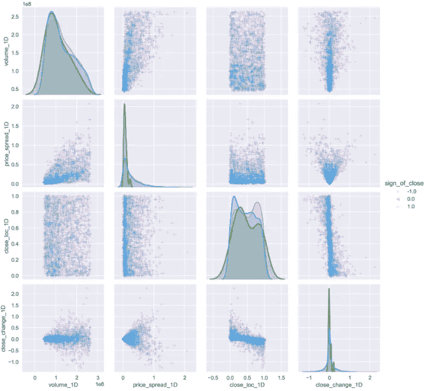

现在，看起来好多了。显然，当价格上涨时，它们(蓝点)密度更大，聚集在某个位置。而在情绪低落的时候，它们会四处蔓延。

***如果你能给这对搭档的情节提供一些线索，并在下面留下你的评论，我将不胜感激，谢谢。***

以下是本文中使用的所有代码的摘要:

```
*#import all the libraries*
import pandas as pd
import numpy as np
import seaborn as sns 
import yfinance as yf  *#the stock data from Yahoo Finance*import matplotlib.pyplot as plt #set the parameters for plotting
plt.style.use('seaborn')
plt.rcParams['figure.dpi'] = 300#define a function to get data
def get_data(symbols, begin_date=None,end_date=None):
    df = yf.download('AAPL', start = '2000-01-01',
                     auto_adjust=True,#only download adjusted data
                     end= '2010-12-31') 
    #my convention: always lowercase
    df.columns = ['open','high','low',
                  'close','volume'] 

    return dfprices = get_data('AAPL', '2000-01-01', '2010-12-31')#create some features
def create_HLCV(i):#as we don't care open that much, that leaves volume, 
#high,low and closedf = pd.DataFrame(index=prices.index)
    df[f'high_{i}D'] = prices.high.rolling(i).max()
    df[f'low_{i}D'] = prices.low.rolling(i).min()
    df[f'close_{i}D'] = prices.close.rolling(i).\
                        apply(lambda x:x[-1]) 
    # close_2D = close as rolling backwards means today is 
    # literly the last day of the rolling window.
    df[f'volume_{i}D'] = prices.volume.rolling(i).sum()

    return dfdef create_features_v1(i):
    df = create_HLCV(i)
    high = df[f'high_{i}D']
    low = df[f'low_{i}D']
    close = df[f'close_{i}D']
    volume = df[f'volume_{i}D']

    features = pd.DataFrame(index=prices.index)
    features[f'volume_{i}D'] = volume
    features[f'price_spread_{i}D'] = high - low
    features[f'close_loc_{i}D'] = (high - close) / (high - low)
    features[f'close_change_{i}D'] = close.pct_change()

    return featuresdef create_bunch_of_features_v1():
'''
the timespan that i would like to explore 
are 1, 2, 3 days and 1 week, 1 month, 2 month, 3 month
which roughly are [1,2,3,5,20,40,60]
'''
    days = [1,2,3,5,20,40,60]
    bunch_of_features = pd.DataFrame(index=prices.index)
    for day in days:
        f = create_features_v1(day)
        bunch_of_features = bunch_of_features.join(f)

    return bunch_of_featuresbunch_of_features_v1 = create_bunch_of_features_v1()#define the outcome target
#here， to make thing easy to understand, i will only try to predict #the next days's return
outcomes = pd.DataFrame(index=prices.index)# next day's returns
outcomes['close_1'] = prices.close.pct_change(-1)#decide which features are abundant from cluster map
deselected_features_v1 = ['close_loc_3D','close_loc_60D',
                       'volume_3D', 'volume_60D',
                       'price_spread_3D','price_spread_60D',
                       'close_change_3D','close_change_60D']
selected_features_v1 = bunch_of_features_v1.drop(labels=deselected_features_v1, axis=1)#join the features and outcome together to remove the outliers
features_outcomes = selected_features_v1.join(outcomes)
stats = features_outcomes.describe()#define the method to identify outliers
def get_outliers(df, i=4): 
    #i is number of sigma, which define the boundary along mean
    outliers = pd.DataFrame()

    for col in df.columns:
        mu = stats.loc['mean', col]
        sigma = stats.loc['std', col]
        condition = (df[col] > mu + sigma * i) | (df[col] < mu -   sigma * i) 
        outliers[f'{col}_outliers'] = df[col][condition]

    return outliersoutliers = get_outliers(features_outcomes, i=1)#remove all the outliers and Nan value
features_outcomes_rmv_outliers = features_outcomes.drop(index = outliers.index).dropna()
```

我知道这篇文章太长了，我最好把它留在这里。在下一篇文章中，我将进行数据转换，看看我是否有办法解决分布问题。敬请期待！

# 参考

1.  即将发生的交易
2.  罗洛磁带[pseud。]，磁带阅读的研究(伯灵顿，佛蒙特州:弗雷泽，1910)，95。