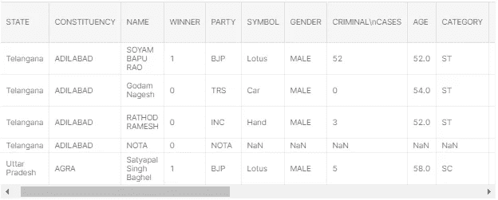

# 选举结果预测的特征工程(Python 语言)

> 原文：<https://towardsdatascience.com/feature-engineering-for-election-result-prediction-python-943589d89414?source=collection_archive---------22----------------------->


詹姆斯·哈里逊在 [Unsplash](https://unsplash.com?utm_source=medium&utm_medium=referral) 上拍摄的照片

我最近参加了一个 Kaggle 比赛，我们必须使用机器学习来预测选举结果。该数据集来自 2019 年印度大选([见此](https://www.kaggle.com/prakrutchauhan/indian-candidates-for-general-election-2019))。本文介绍了如何清理和准备数据集，从现有要素中创建新要素，然后使用流行的机器学习算法预测结果。大多数基本的预处理、数据可视化和机器学习步骤在这里还没有解释清楚；相反，我关注的是特征工程以及它如何影响模型的性能。如果你对什么是特征工程没有清晰的认识，请参考我之前的文章《[基础特征工程达到更高效的机器学习](/basic-feature-engineering-to-reach-more-efficient-machine-learning-6294022e17a5)》。

首先，我们应该将数据集加载到笔记本中。大多数 ML 工程师和专家更喜欢在初始阶段使用笔记本进行机器学习和数据工程任务，因为用笔记本进行数据可视化和所有其他步骤真的很容易。我更喜欢使用 pandas 库来加载数据集，因为它使所有的数据处理步骤变得非常容易，不需要太多的努力。下面是我在笔记本中使用的 python 库。

```
import numpy as np
import pandas as pd
import os
import matplotlib.pyplot as plt
import seaborn as sns

from sklearn.preprocessing import LabelEncoder
from sklearn.preprocessing import MinMaxScaler
from sklearn.model_selection import train_test_split
from sklearn.neighbors import KNeighborsClassifier
from sklearn.feature_selection import SelectKBest, chi2
```

首先，让我们运行下面的命令，对数据集和原始数据有一个基本的了解。

```
dataset = pd.read_csv('/kaggle/input/indian-candidates-for-general-election-2019/LS_2.0.csv')
dataset.head()
```



```
dataset.info()<class 'pandas.core.frame.DataFrame'>
RangeIndex: 2263 entries, 0 to 2262
Data columns (total 19 columns):
STATE                                       2263 non-null object
CONSTITUENCY                                2263 non-null object
NAME                                        2263 non-null object
WINNER                                      2263 non-null int64
PARTY                                       2263 non-null object
SYMBOL                                      2018 non-null object
GENDER                                      2018 non-null object
CRIMINAL
CASES                              2018 non-null object
AGE                                         2018 non-null float64
CATEGORY                                    2018 non-null object
EDUCATION                                   2018 non-null object
ASSETS                                      2018 non-null object
LIABILITIES                                 2018 non-null object
GENERAL
VOTES                               2263 non-null int64
POSTAL
VOTES                                2263 non-null int64
TOTAL
VOTES                                 2263 non-null int64
OVER TOTAL ELECTORS 
IN CONSTITUENCY        2263 non-null float64
OVER TOTAL VOTES POLLED 
IN CONSTITUENCY    2263 non-null float64
TOTAL ELECTORS                              2263 non-null int64
dtypes: float64(3), int64(5), object(11)
memory usage: 336.0+ KB
```

从上面的分析中我们可以看出，数据集包含很少的数字列，大多数列都是非数字的。WINNER 列包含表明候选人赢得或输掉选举的标签。另外，请注意，数据集包含一些“NaN”值，这些值基本上是缺失值。有些列名包含' \n '字符，这很烦人。此外，资产和负债列值也包含' \n '字符。

仅考虑可用数据，我们可以将州、选区、政党、性别、类别和教育视为分类特征。此外，您可以运行 dataset.describe()命令来对数字列进行一些统计汇总。

接下来，我们应该清理数据集，修复列名并处理丢失的值。首先，我修复了不正确的列名，并用下划线(' _ ')替换了列名中的所有空格。这不是一个强制的步骤，但是不正确的列名让我很烦。

```
*# rename invalid column names*
dataset = dataset.rename(columns={'CRIMINAL**\n**CASES': 'CRIMINAL_CASES', 'GENERAL**\n**VOTES': 'GENERAL_VOTES', 'POSTAL**\n**VOTES': 'POSTAL_VOTES', 'TOTAL**\n**VOTES': 'TOTAL_VOTES', 'OVER TOTAL ELECTORS **\n**IN CONSTITUENCY': 'OVER_TOTAL_ELECTORS_IN_CONSTITUENCY', 'OVER TOTAL VOTES POLLED **\n**IN CONSTITUENCY': 'OVER_TOTAL_VOTES_POLLED_IN_CONSTITUENCY', 'TOTAL ELECTORS': 'TOTAL_ELECTORS'})
```

然后让我们搜索每一列中缺少的值。

```
dataset.isna().sum()STATE                                        0
CONSTITUENCY                                 0
NAME                                         0
WINNER                                       0
PARTY                                        0
SYMBOL                                     245
GENDER                                     245
CRIMINAL_CASES                             245
AGE                                        245
CATEGORY                                   245
EDUCATION                                  245
ASSETS                                     245
LIABILITIES                                245
GENERAL_VOTES                                0
POSTAL_VOTES                                 0
TOTAL_VOTES                                  0
OVER_TOTAL_ELECTORS_IN_CONSTITUENCY          0
OVER_TOTAL_VOTES_POLLED_IN_CONSTITUENCY      0
TOTAL_ELECTORS                               0
dtype: int64
```

您可以看到 10%的行值丢失了。处理缺失值有多种方法，如删除、使用后填或前填、常量值插补、均值/中值或众数插补等。但是，为了简单起见，我在这里删除了这些行(只丢失了 10%)，但是请始终记住，删除值会使预测模型不太准确。你应该尽可能多地估算缺失值。

```
*# drop rows with NA values*
dataset = dataset[dataset['GENDER'].notna()]
```

让我们将资产、负债和 CRIMINAL_CASES 列转换为数字，因为它们代表金钱和计数，并且数字对模型有意义。为此，我们必须删除每个值字段中的“Rs”符号、“\n”字符和逗号。而且这些列包含“无”和“不可用”作为值。因此，在将它们变成数值之前，我们必须用一些有意义的值来替换它们(目前我用 0 来替换它们)。

```
*# replace Nil values with 0*
dataset['ASSETS'] = dataset['ASSETS'].replace(['Nil', '`', 'Not Available'], '0')
dataset['LIABILITIES'] = dataset['LIABILITIES'].replace(['NIL', '`', 'Not Available'], '0')
dataset['CRIMINAL_CASES'] = dataset['CRIMINAL_CASES'].replace(['Not Available'], '0')

*# clean ASSETS and LIABILITIES column values*
dataset['ASSETS'] = dataset['ASSETS'].map(lambda x: x.lstrip('Rs ').split('**\n**')[0].replace(',', ''))
dataset['LIABILITIES'] = dataset['LIABILITIES'].map(lambda x: x.lstrip('Rs ').split('**\n**')[0].replace(',', ''))

*# convert ASSETS, LIABILITIES and CRIMINAL_CASES column values into numeric*
dataset['ASSETS'] = dataset['ASSETS'].astype(str).astype(float)
dataset['LIABILITIES'] = dataset['LIABILITIES'].astype(str).astype(float)
dataset['CRIMINAL_CASES'] = dataset['CRIMINAL_CASES'].astype(str).astype(int)
```

现在让我们将非数字列改为数字列，以获得更好的性能。请注意，某些模型类型不能处理非数字数据。在这里，我将重点放在分类算法上，它当然不能在非数字数据上进行训练。所以我使用 sklearn LabelEncoder 对这些非数字列进行了标签编码。

```
*# label encode categorical columns*

lblEncoder_state = LabelEncoder()
lblEncoder_state.fit(dataset['STATE'])
dataset['STATE'] = lblEncoder_state.transform(dataset['STATE'])

lblEncoder_cons = LabelEncoder()
lblEncoder_cons.fit(dataset['CONSTITUENCY'])
dataset['CONSTITUENCY'] = lblEncoder_cons.transform(dataset['CONSTITUENCY'])

lblEncoder_name = LabelEncoder()
lblEncoder_name.fit(dataset['NAME'])
dataset['NAME'] = lblEncoder_name.transform(dataset['NAME'])

lblEncoder_party = LabelEncoder()
lblEncoder_party.fit(dataset['PARTY'])
dataset['PARTY'] = lblEncoder_party.transform(dataset['PARTY'])

lblEncoder_symbol = LabelEncoder()
lblEncoder_symbol.fit(dataset['SYMBOL'])
dataset['SYMBOL'] = lblEncoder_symbol.transform(dataset['SYMBOL'])

lblEncoder_gender = LabelEncoder()
lblEncoder_gender.fit(dataset['GENDER'])
dataset['GENDER'] = lblEncoder_gender.transform(dataset['GENDER'])

lblEncoder_category = LabelEncoder()
lblEncoder_category.fit(dataset['CATEGORY'])
dataset['CATEGORY'] = lblEncoder_category.transform(dataset['CATEGORY'])

lblEncoder_edu = LabelEncoder()
lblEncoder_edu.fit(dataset['EDUCATION'])
dataset['EDUCATION'] = lblEncoder_edu.transform(dataset['EDUCATION'])
```

现在，让我们训练一个 K-最近邻模型，并查看其准确性。KNN 是一个有监督的机器学习模型，根据分类算法进行分类。该算法通过获取一个数据点并找出 k 个最接近的数据点来工作。

```
*# separate train features and label*
y = dataset["WINNER"]
X = dataset.drop(labels=["WINNER"], axis=1)*# split dataset into train and test data*
X_train, X_test, y_train, y_test = train_test_split(X, y, test_size=0.2, random_state=1, stratify=y)# train and test knn model
knn = KNeighborsClassifier()
knn.fit(X_train, y_train)knn.predict(X_test)
print("Testing Accuracy is: ", knn.score(X_test, y_test)*100, "%")**Testing Accuracy is:  70.79207920792079 %**
```

该模型在没有太大影响的情况下实现了 70%的准确率。让我们归一化数据集，看看精度如何提高。我使用 scikit-learn 库中的 MinMaxScaler 将所有值缩小到 0-1 的范围内。

```
# scaling values into 0-1 rangescaler = MinMaxScaler(feature_range=(0, 1))
features = [
    'STATE', 'CONSTITUENCY', 'NAME', 'PARTY', 'SYMBOL', 'GENDER', 'CRIMINAL_CASES', 'AGE', 'CATEGORY', 'EDUCATION', 'ASSETS', 'LIABILITIES', 'GENERAL_VOTES', 'POSTAL_VOTES', 'TOTAL_VOTES', 'OVER_TOTAL_ELECTORS_IN_CONSTITUENCY', 'OVER_TOTAL_VOTES_POLLED_IN_CONSTITUENCY', 'TOTAL_ELECTORS']dataset[features] = scaler.fit_transform(dataset[features])
```

正如您在下面看到的，通过规范化列值，准确性得到了很大的提高。然而，我们可以通过应用一些其他的特征工程技术来进一步提高精度。

```
**Testing Accuracy is:  90.5940594059406 %**
```

# **对现有特征进行更有意义的编码**

如果我们考虑教育列，它包含特定候选人可以拥有的 11 个分类值。

> 文盲、识字、第 5 次通过、第 8 次通过、第 10 次通过、第 12 次通过、毕业生、研究生、专业毕业生、博士学位、其他

如果我们仔细想想，这些价值观中的每一个都代表了一种特定的教育水平。通过标签编码，我们只是为这些值中的每一个分配一些随机整数，而不考虑它们的层次级别。然而，如果我们根据教育资格有意义地分配该整数，则该模型有望表现得更好。注意，有一个名为“其他”的字段值，我们不知道它的层次位置。我只是给它分配了一个中间值。

```
dataset['EDUCATION'].value_counts()Post Graduate            502
Graduate                 441
Graduate Professional    336
12th Pass                256
10th Pass                196
8th Pass                  78
Doctorate                 73
Others                    50
Literate                  30
5th Pass                  28
Not Available             22
Illiterate                 5
Post Graduate\n            1
Name: EDUCATION, dtype: int64 # encode education column
encoded_edu = []# iterate through each row in the dataset
for row in dataset.itertuples():
    education = row.EDUCATIONif education == "Illiterate":
        encoded_edu.append(0)
    elif education == "Literate":
        encoded_edu.append(1)
    elif education == "5th Pass":
        encoded_edu.append(2)
    elif education == "8th Pass":
        encoded_edu.append(3)
    elif education == "10th Pass":
        encoded_edu.append(4)
    elif education == "12th Pass":
        encoded_edu.append(7)
    elif education == "Graduate":
        encoded_edu.append(8)
    elif education == "Post Graduate":
        encoded_edu.append(9)
    elif education == "Graduate Professional":
        encoded_edu.append(10)
    elif education == "Doctorate":
        encoded_edu.append(11)
    else:
        encoded_edu.append(5)dataset['EDUCATION'] = encoded_edu
```

让我们来分析一下党的专栏。如果我们在每个政党前面列出候选人的人数，我们可以看到只有几个政党的候选人人数很多。将政党列包括在内的全部目的是让候选人的政党对赢得选举产生影响。如果该党没有大量的候选人，该党对候选人获胜的影响就很低。因此，我们可以将它们全部编码到一个通用类别中(我将它们编码为“其他”)。

```
dataset['PARTY'].value_counts()BJP       420
INC       413
IND       201
BSP       163
CPI(M)    100
         ... 
AINRC       1
SKM         1
ANC         1
YKP         1
AJSUP       1
Name: PARTY, Length: 132, dtype: int64 # change party of the less frequent parties as Other
# 'BJP','INC','IND','BSP', 'CPI(M)', 'AITC', 'MNM': high frequent
# 'TDP', 'VSRCP', 'SP', 'DMK', 'BJD': medium frequentdataset.loc[~dataset["PARTY"].isin(['BJP','INC','IND','BSP', 'CPI(M)', 'AITC', 'MNM', 'TDP', 'VSRCP', 'SP', 'DMK', 'BJD']), "PARTY"] = "Other"
dataset['PARTY'].value_counts()
```

这两个步骤都应该在标记编码列之前执行。让我们再次训练我们的模型，看看准确性。

```
**Testing Accuracy is:  92.07920792079209 %**
```

你可以看到精确度提高了一点点。到目前为止，我们只考虑了现有的功能。然而，我们可以从现有的特性中创造出新的特性。

# **制作新功能**

为了创建新的特性，我们应该对可用的原始特性以及它们如何影响给定场景有一个大致的了解。此外，还需要对问题领域有很好的理解。所以在这里，我们应该思考一下，在一次选举中，影响候选人获胜的因素是什么，我们投票给一个候选人或一个政党的考虑是什么。对于给定的场景，我不知道他们在投票给候选人之前考虑的国家因素(哪些特定国家的因素影响候选人获胜)。例如，我不知道类别如何影响选举结果。但是，通过假设一般的用例，我提出了以下特性。

数据集包含大量原始特征，这些特征将直接影响候选人的获胜机会(例如，州、选区、政党、犯罪记录、教育资格、资产等)。然而，特定的候选人也可能赢得选举，这取决于被提名政党的地位。以下是一些可以代表政党对候选人获胜概率的重要性的特征。

**1。该党赢得的席位总数**

在投票之前，我们可能会考虑候选人的党派。如果一个政党有很高的胜算，那么这个政党的候选人也有同样的胜算(并不总是如此)。我们可以通过制作一个表示政党赢得的席位数的特征来突出显示该场景(获胜概率将通过计数来突出显示)。

**2。政党在选区赢得的席位数**

有些政党总是会赢得某个特定的州或选区。我在这里考虑了选区，因为这是可用的最小区域。

**3。针对当事人的刑事案件**

在投票之前，我们通常会考虑针对一个政党的犯罪记录数量。如果一个政党有更多的刑事案件(更多的腐败政客)，该党赢得选举的机会可能会更小(反之亦然；-) ).我们可以通过制作一个表示某一方犯罪记录数量的特征来突出这种情况。

**4。每个选区政党的刑事案件数量**

我们还可以通过考虑每个选区的犯罪记录，将上述场景划分为子案例。这可能很好地代表了上述特征。

**5。党内候选人的教育水平**

在投票之前，我们还会考虑该党候选人的教育背景。如果一个政党提名更多受过教育的候选人，该政党可能会赢得选举(更高的概率)。在更早的步骤中，我们已经对教育资格进行了有意义的编码。所以如果我们统计一个政党中每个候选人的数量，这个特征将代表这个政党的教育水平。

**6。各选区党内候选人的教育水平**

正如我们对刑事案件所做的那样，我们也可以考虑每个选区政党的教育水平。

**7。按党派划分的选区候选人人数**

正如我已经提到的，一个特定的政党可能有更高的胜算，这取决于选区。如果一个政党为一个选区提名更多的候选人，选票将在候选人之间分配，每个候选人的百分比将减少。那会直接影响中奖概率。

下面是我创建的一些可能影响候选人获胜概率的更多功能。

1.每个州的选民总数

2.每个选区的选民总数

3.每个州的选区总数

因此，我在现有功能的基础上总共创建了 10 个新功能。其中一些功能可能不会影响模型的性能。

```
**# Preparing feature values**cons_per_state = {}
voters_per_state = {}
party_winningSeats = {}
party_criminal = {}
party_education = {}
party_totalCandidates_per_cons = {}
party_winningSeats_per_cons = {}
party_criminal_per_cons = {}
party_education_per_cons = {}
voters_per_cons = {}# group by state
subset = dataset[['STATE', 'CONSTITUENCY', 'TOTAL_ELECTORS']]
gk = subset.groupby('STATE')# for each state
for name,group in gk:
    # total constituencies per state
    cons_per_state[name] = len(group)

    # total voters per state
    voters_per_state[name] = group['TOTAL_ELECTORS'].sum()# group by party
subset = dataset[['PARTY', 'CONSTITUENCY', 'CRIMINAL_CASES', 'EDUCATION', 'WINNER']]
gk = subset.groupby('PARTY')# for each party
for name,group in gk:
    # winning seats by party
    party_winningSeats[name] = group[group['WINNER'] == 1.0].shape[0]

    # criminal cases by party
    party_criminal[name] = group['CRIMINAL_CASES'].sum()

    # education qualification by party (sum of candidates)
    party_education[name] = group['EDUCATION'].sum()

    # group by constituency
    gk2 = group.groupby('CONSTITUENCY')

    # for each constituency
    for name2, group2 in gk2:
        key = name2 + '_' + name    # cons_party

        # total candidates by party in constituency
        party_totalCandidates_per_cons[key] = len(group2)

        # party winning seats in the constituency
        party_winningSeats_per_cons[key] = group2[group2['WINNER'] == 1.0].shape[0]

        # criminal cases by party in the constituency
        party_criminal_per_cons[key] = group2['CRIMINAL_CASES'].sum()# education qualification by party in constituency (sum of candidates)
        party_education_per_cons[key] = group2['EDUCATION'].sum()# Total voters per constituency
subset = dataset[['CONSTITUENCY', 'TOTAL_ELECTORS']]
gk = subset.groupby('CONSTITUENCY')# for each constituency
for name,group in gk:
    voters_per_cons[name] = len(group) **# Applying feature values**# new feature columns
total_cons_per_state = []
total_voters_per_state = []
total_voters_per_cons = []winning_seats_by_party = []
criminal_by_party = []
education_by_party = []total_candidates_by_party_per_cons = []
winning_seats_by_party_per_cons = []
criminal_by_party_per_cons = []
education_by_party_per_cons = []# iterate through each row in the dataset
for row in dataset.itertuples():
    subkey = row.CONSTITUENCY + '_' + row.PARTYtotal_cons_per_state.append(cons_per_state.get(row.STATE))
    total_voters_per_state.append(voters_per_state.get(row.STATE))
    total_voters_per_cons.append(voters_per_cons.get(row.CONSTITUENCY))
    winning_seats_by_party.append(party_winningSeats.get(row.PARTY))
    criminal_by_party.append(party_criminal.get(row.PARTY))
    education_by_party.append(party_education.get(row.PARTY))
    total_candidates_by_party_per_cons.append(party_totalCandidates_per_cons.get(subkey))
    winning_seats_by_party_per_cons.append(party_winningSeats_per_cons.get(subkey))
    criminal_by_party_per_cons.append(party_criminal_per_cons.get(subkey))
    education_by_party_per_cons.append(party_education_per_cons.get(subkey))# append columns to dataset
dataset['total_cons_per_state'] = total_cons_per_state
dataset['total_voters_per_state'] = total_voters_per_state
dataset['total_voters_per_cons'] = total_voters_per_cons
dataset['winning_seats_by_party'] = winning_seats_by_party
dataset['criminal_by_party'] = criminal_by_party
dataset['education_by_party'] = education_by_party
dataset['total_candidates_by_party_per_cons'] = total_candidates_by_party_per_cons
dataset['winning_seats_by_party_per_cons'] = winning_seats_by_party_per_cons
dataset['criminal_by_party_per_cons'] = criminal_by_party_per_cons
dataset['education_by_party_per_cons'] = education_by_party_per_cons
```

让我们再次训练我们的模型，看看准确性如何提高。无需对任何已创建的要素进行标注编码，因为它们都是数字。然而，在训练模型之前，我将它们标准化为 0-1 范围。

```
**Testing Accuracy is:  96.78217821782178 %**
```

# **功能重要性**

移除不相关的特征或不太重要的特征将提高模型的准确性。到目前为止，我们已经在 28 个特性上训练了我们的最新模型，包括新创建的 10 个。然而，这些特征中的一些可能对基于训练数据得出结论没有太大贡献。移除那些特征不会降低模型的准确性，希望会提高它，因为不相关的特征可能为模型得出无效的推论。

首先，我们可以通过分析它们的贡献来删除一些特征。NAME 列不会对模型做出任何有用的推断，因为理想情况下，名称应该是惟一的。然而，在某些情况下，姓氏可能很重要，因为一些姓氏可能会对赢得选举产生影响。此外，PARTY 和 SYMBOL 这两个变量将表示相同的特征，我们将能够在不影响准确性的情况下移除它们中的一个。TOTAL_VOTES 列包含 GENERAL_VOTES 列和 POSTAL_VOTES 列的总和。所以我们也可以去掉这两个。如果我们绘制代表相关矩阵的热图，我们将看到这 3 个特征高度相关。

```
# remove unnecessary columnsX.drop(labels=["NAME"], axis=1, inplace=True)
X.drop(labels=["SYMBOL"], axis=1, inplace=True)
X.drop(labels=["POSTAL_VOTES"], axis=1, inplace=True)
X.drop(labels=["GENERAL_VOTES"], axis=1, inplace=True)
```

有一些技术可以根据重要性来选择特性。我将使用单变量选择方法来识别最重要的特征，并删除其他特征。我将使用 Scikit learn 库中的 SelectKBest 和卡方检验来评估特性的重要性。

```
# apply SelectKBest class to extract top most features
bestfeatures = SelectKBest(score_func=chi2, k=10)
fit = bestfeatures.fit(X, y)
dfscores = pd.DataFrame(fit.scores_)
dfcolumns = pd.DataFrame(X.columns)# concat two dataframes for better visualization 
featureScores = pd.concat([dfcolumns, dfscores], axis=1)
featureScores.columns = ['Specs', 'Score']
print(featureScores.nlargest(30, 'Score'))
 Specs       Score
25          winning_seats_by_party_per_cons  486.207788
16  OVER_TOTAL_VOTES_POLLED_IN_CONSTITUENCY  285.347141
15      OVER_TOTAL_ELECTORS_IN_CONSTITUENCY  262.177373
14                              TOTAL_VOTES  216.937788
12                            GENERAL_VOTES  216.138799
21                   winning_seats_by_party  199.662525
13                             POSTAL_VOTES   65.126864
22                        criminal_by_party   36.519437
3                                     PARTY   35.416433
23                       education_by_party    6.576548
11                              LIABILITIES    6.330339
24       total_candidates_by_party_per_cons    5.755538
20                    total_voters_per_cons    5.302656
4                                    SYMBOL    4.128283
8                                  CATEGORY    4.047031
10                                   ASSETS    3.755575
7                                       AGE    2.077768
9                                 EDUCATION    0.888330
27              education_by_party_per_cons    0.840185
18                     total_cons_per_state    0.481673
6                            CRIMINAL_CASES    0.436667
19                   total_voters_per_state    0.292948
26               criminal_by_party_per_cons    0.178720
5                                    GENDER    0.145870
1                              CONSTITUENCY    0.143250
0                                     STATE    0.076833
17                           TOTAL_ELECTORS    0.054486
2                                      NAME    0.003039
```

让我们去掉所有分数小于 3 的列。请注意，我之前创建的一些特性对于 KNN 模型也不重要。

```
X.drop(labels=["TOTAL_ELECTORS"], axis=1, inplace=True)
X.drop(labels=["STATE"], axis=1, inplace=True)
X.drop(labels=["CONSTITUENCY"], axis=1, inplace=True)
X.drop(labels=["GENDER"], axis=1, inplace=True)
X.drop(labels=["criminal_by_party_per_cons"], axis=1, inplace=True)
X.drop(labels=["total_voters_per_state"], axis=1, inplace=True)
X.drop(labels=["CRIMINAL_CASES"], axis=1, inplace=True)
X.drop(labels=["total_cons_per_state"], axis=1, inplace=True)
X.drop(labels=["EDUCATION"], axis=1, inplace=True)
X.drop(labels=["education_by_party_per_cons"], axis=1, inplace=True)
X.drop(labels=["AGE"], axis=1, inplace=True)
```

现在让我们用最重要的特征再次训练我们的模型，并评估准确性。

```
**Testing Accuracy is:  99.5049504950495 %**
```

# **结论**

从上面的结果可以看出，特征工程步骤极大地提高了模型的性能。从 0.7 的初始精度开始，我们已经达到了 0.99 的精度。首先，我们清理数据集并将所有值转换成数字格式。然后，我们使用现有的功能创建一些新功能，并删除所有不太重要的功能。最后，我们将这些值缩小到 0–1 的范围，并训练一个 K-最近邻模型。请注意，我们可以通过应用交叉验证来进一步提高准确性。作为结论，我想把每个主要步骤后的准确性总结如下。

```
**Feature Engineering Step                   Testing Accuracy**Initially without any data processing                0.7079
Scale down values into 0-1 range                     0.9059
Basic encoding of two columns                        0.9208
Creating new features                                0.9678
Removing unnecessary features                        0.9950
```